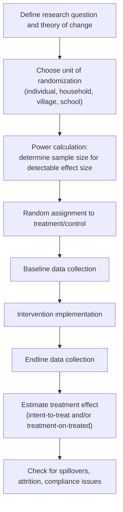

## Field Experiments in Developing Economies

### Definitions and Scope

**Field experiments**: research designs in which treatments are randomly or quasi-randomly assigned in a naturally occurring economic environment, as distinct from laboratory experiments (controlled artificial settings) and observational studies (no researcher-controlled assignment). In development economics, field experiments — most prominently **randomized controlled trials (RCTs)** — became the dominant empirical methodology from the early 2000s onward, credited substantially to the work recognized by the 2019 Nobel Memorial Prize in Economic Sciences (Banerjee, Duflo, Kremer).

This topic covers the methodological infrastructure underlying essentially all the empirical evidence cited elsewhere in this chapter (deworming take-up, commitment savings, CLTS, immunization incentives), making it foundational rather than a standalone application.

### Taxonomy of Field Experiment Types

**Key Points**

- **Randomized Controlled Trials (RCTs)**: researcher directly randomizes treatment assignment across individuals, households, villages, schools, or other units, ex ante.
- **Natural experiments**: exploit naturally occurring, as-if-random variation (policy discontinuities, lottery assignment, administrative cutoffs) without researcher-controlled randomization.
- **Regression discontinuity designs (RDD)**: exploit a sharp threshold rule (e.g., an eligibility cutoff score) where units just above and just below the threshold are treated as comparable, isolating a local causal effect at the cutoff.
- **Difference-in-differences (DiD)**: compares changes over time between a treated and untreated group, relying on a parallel-trends assumption absent treatment.
- **Lab-in-the-field experiments**: structured, incentivized games (public goods games, trust games, time-preference elicitation tasks) conducted with real-world subject populations (farmers, microfinance clients) rather than university students, bridging internal validity of the lab with external relevance of the field population.

### Core Methodological Framework: The Potential Outcomes Model

The standard causal inference framework (Rubin Causal Model) defines, for each unit $i$, two potential outcomes:

$$Y_i(1) = \text{outcome if treated}, \quad Y_i(0) = \text{outcome if untreated}$$

The individual treatment effect is $Y_i(1) - Y_i(0)$, which is never jointly observable for any single unit (the "fundamental problem of causal inference"). Random assignment ensures:

$$E[Y_i(0) \mid D_i = 1] = E[Y_i(0) \mid D_i = 0]$$

i.e., the untreated group's expected outcome is a valid counterfactual for the treated group, allowing the **Average Treatment Effect (ATE)** to be estimated as a simple difference in group means:

$$\hat{\tau}_{ATE} = \bar{Y}_{\text{treatment}} - \bar{Y}_{\text{control}}$$

### Experimental Design Workflow

### Key Design Considerations Specific to Development Field Experiments

**Randomization level and spillovers**: choosing the unit of randomization (individual vs. cluster/village) involves a tradeoff. Individual-level randomization within a village risks **spillover effects** — e.g., a dewormed child reduces disease transmission to untreated classmates, biasing a naive individual-level estimate. Cluster (village-level) randomization avoids within-cluster spillover contamination of the control group but requires larger total sample sizes to achieve equivalent statistical power, since the effective unit of independent variation shrinks to the cluster level.

**Intent-to-treat (ITT) vs. Treatment-on-the-Treated (TOT)**:

- **ITT** estimates the effect of being *assigned* to treatment, regardless of actual compliance/take-up — policy-relevant because real-world programs cannot force compliance.
- **TOT / Local Average Treatment Effect (LATE)**, typically estimated via instrumental variables using assignment as an instrument for actual take-up, recovers the effect *among compliers* who took up treatment because they were assigned to it.

$$\hat{\tau}_{LATE} = \frac{\hat{\tau}_{ITT}}{\text{compliance rate}}$$

**Attrition**: differential dropout between treatment and control arms threatens internal validity if attrition correlates with the outcome or treatment response; standard practice requires reporting attrition rates by arm and testing for differential attrition, with bounding approaches (e.g., Lee bounds) used when attrition is nontrivial.

**Hawthorne and John Henry effects**: behavior change induced merely by awareness of being observed/measured (Hawthorne), or compensatory extra effort by control-group members aware they are the comparison group (John Henry effect), both threaten the interpretation of the estimated effect as reflecting the intervention itself rather than the experimental context.

### External Validity: The Central Critique

**Example**

A widely cited methodological critique (Deaton, 2010; Pritchett & Sandefur, 2015; and broader debates following the 2019 Nobel Prize) raises the following concerns:

- **Site-specific effect heterogeneity**: an RCT result from one district in Kenya may not generalize to a different district, country, or implementation context if underlying moderating conditions (institutional quality, baseline infrastructure, cultural context) differ — a concern sometimes summarized as limited **external validity**.
- **Publication and researcher-degrees-of-freedom concerns**: as with other empirical social sciences, results with statistically significant, novel findings may be more likely to be published and cited, raising concerns about the credibility of effect-size magnitudes reported across the literature as a whole. [Inference: the extent of this bias in the development RCT literature specifically, versus economics research generally, is debated and not precisely quantified.]
- **"Randomistas" vs. structural/theory-driven critique**: some economists argue RCTs answer narrow "what works here" questions well but are poorly suited to answering "why" questions or informing predictions in genuinely novel contexts without an underlying structural or theoretical model — a debate sometimes framed as reduced-form/experimentalist versus structural approaches to development economics.
- **Response from RCT proponents**: proponents (Banerjee, Duflo, Karlan and others) argue that accumulating many RCTs across varied contexts, combined with attention to underlying mechanisms rather than only headline effect sizes, allows meaningful generalization — and that the relevant comparison is not RCTs versus a perfect alternative, but RCTs versus the historically weaker observational and anecdote-based evidence base that preceded them.

This remains an active, unresolved methodological debate rather than a settled matter, and instructors should present both sides rather than treating either position as fully authoritative.

### Ethical Considerations

- **Informed consent** in low-literacy or vulnerable populations requires careful design (oral consent protocols, community-level consultation alongside individual consent) beyond standard institutional review board templates designed for higher-income, higher-literacy contexts.
- **Withholding beneficial treatment from control groups** raises ethical tension, typically addressed via phase-in designs (control group receives the intervention after the study period, an "encouragement design," or a wait-list randomization) so that no eligible population is permanently denied a plausibly beneficial program.
- **Equipoise**: genuine uncertainty about whether the intervention is beneficial is the standard ethical justification for randomization; RCTs of interventions with strong prior evidence of harm or of benefit are generally considered ethically inappropriate to run.

### Prominent Institutional Infrastructure

- **J-PAL (Abdul Latif Jameel Poverty Action Lab)**: MIT-affiliated network coordinating and cataloguing development RCTs globally.
- **IPA (Innovations for Poverty Action)**: implements and manages field research partnerships between researchers and implementing organizations.
- **AEA RCT Registry**: pre-registration repository intended to reduce publication bias and researcher degrees of freedom by requiring pre-specification of hypotheses and analysis plans before data collection.

### Related Topics

- Poverty Traps and Present Bias (empirical evidence largely sourced from field experiments)
- Behavioral Barriers to Savings and Credit Access (commitment savings RCT evidence)
- Behavioral Explanations for Underinvestment in Health and Education (deworming, immunization RCT evidence)
- Instrumental variables and Local Average Treatment Effect (LATE) estimation
- Regression discontinuity design: applications in development economics
- Pre-analysis plans and the AEA RCT Registry
- External validity and generalizability debates in empirical economics
- Ethics of experimentation in development research