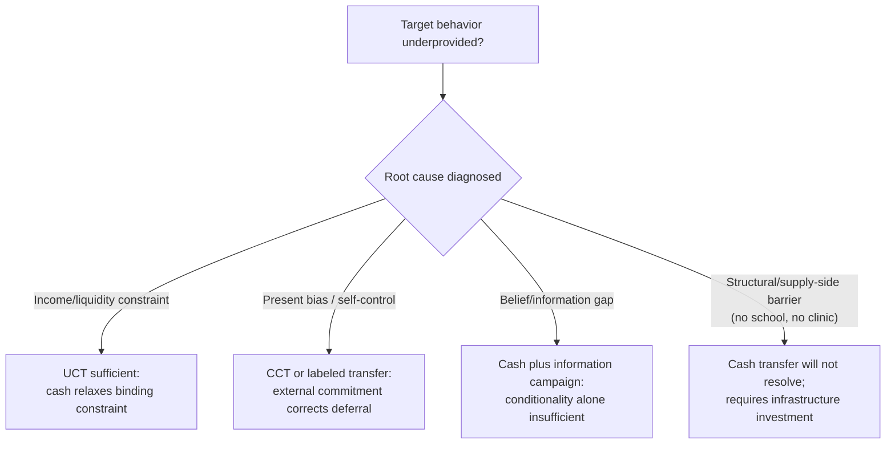

## Behavioral Design of Cash Transfer and Aid Programs

### Definitions and Scope

This topic examines how insights from behavioral economics — present bias, mental accounting, framing, social signaling, loss aversion — are applied to the *design parameters* of cash transfer and aid programs (transfer size, timing, conditionality, labeling, delivery mechanism), as distinct from the question of whether such programs work at all. The starting empirical premise is that two cash transfer programs with identical total budget and target population can produce meaningfully different behavioral and welfare outcomes purely due to design choices — making design itself an object of economic analysis rather than an implementation detail.

### Taxonomy of Cash Transfer Design Dimensions

**Key Points**

- **Conditionality**: Conditional Cash Transfers (CCTs) require verified behavior (school attendance, health check-ups) as a disbursement condition; Unconditional Cash Transfers (UCTs) impose no behavioral requirement. The behavioral rationale for conditionality is that it functions as an external commitment device correcting for present-biased or belief-driven underinvestment in the mandated behavior (see companion topic on health/education underinvestment).
- **Timing and frequency**: lump-sum vs. periodic (monthly/weekly) disbursement; timing relative to seasonal income shocks (e.g., transfers during the agricultural "hunger season" pre-harvest).
- **Labeling**: earmarking a transfer for a specific purpose (e.g., "child benefit," "education grant") even absent enforced conditionality, exploiting mental-accounting effects to influence how funds are spent.
- **Recipient targeting within household**: transfers made to mothers versus fathers have been associated with differential downstream spending patterns in several studies, attributed to differences in bargaining power and preferences across household members rather than pure income effects.
- **Delivery mechanism**: cash-in-hand, mobile money, or in-kind vouchers each carry different transaction costs, leakage risk, and behavioral salience.
- **Graduation and cash-plus design**: pairing a cash transfer with complementary non-cash components (savings facilitation, life-skills training, an asset transfer) to address multiple simultaneous behavioral and structural barriers rather than relying on cash alone to relax every binding constraint.

### Formal Framework: Labeling as a Soft Commitment Device

Building on the mental-accounting framework from the companion savings-barriers topic, a labeled transfer $T_{\text{label}}$ can be modeled as raising the psychological cost of diversion to non-labeled consumption:

$$U_i = u(c_{\text{label}}, c_{\text{other}}) - \lambda \cdot \mathbb{1}[c_{\text{label}} < T_{\text{label}}]$$

where $\lambda$ represents a psychological/social cost of underspending relative to the labeled purpose (e.g., guilt, or anticipated social sanction if diversion becomes known). Even without contractual enforcement, positive $\lambda$ shifts the marginal propensity to consume out of the labeled portion toward the intended category — an effect impossible to generate in a standard fungible-money model where $\lambda = 0$ by assumption.

### Conditionality Design Decision Diagram

### Empirical Evidence on Design Variants

**Example**

Selected comparative findings from cash transfer field experiments:

- **CCT vs. UCT comparisons (Malawi, Baird, McIntosh & Özler, 2011)**: a study comparing conditional and unconditional cash transfers to adolescent girls' households found that the conditional arm produced larger gains in school enrollment/attendance, while the unconditional arm produced comparatively larger reductions in early marriage and pregnancy among girls who had already dropped out — indicating that conditionality's behavioral leverage is concentrated on the specific conditioned behavior, with different (sometimes offsetting) effects on unconditioned margins.
- **Transfer timing and seasonal design (Burkina Faso, Ghana, and related agricultural settings)**: providing transfers timed to precede the agricultural planting season rather than at arbitrary calendar dates has been associated with higher productive investment (fertilizer, seed) take-up relative to identically-sized transfers disbursed off-cycle, consistent with a present-bias/liquidity-timing account rather than pure income effects.
- **Lump-sum vs. periodic transfers (multiple graduation-model evaluations)**: lump-sum transfers sized to enable a discrete productive asset purchase (livestock, a small trading stock) have in several evaluations shown larger effects on sustained income growth than an equivalent total value disbursed in small periodic installments, consistent with the S-shaped/threshold-crossing logic from poverty-trap models — a small periodic stream may never accumulate past a nonconvex investment threshold if continuously subject to competing consumption claims.
- **Mobile money delivery and the social-tax channel**: transfers delivered via mobile money rather than cash-in-hand have in some studies shown reduced diversion to kinship claims, consistent with the social-tax mechanism discussed in the savings-barriers topic — a formal/traceable delivery channel can provide recipients (especially women) a legitimate excuse to resist informal claims on the transfer.
- **Graduation model bundling (BRAC-inspired multi-country evaluations, Banerjee et al., 2015, *Science*)**: a bundled "graduation" intervention combining an asset transfer, consumption support, savings facilitation, and coaching produced sustained increases in consumption and assets across multiple country contexts (Ethiopia, Ghana, Honduras, India, Pakistan, Peru) up to several years after the program ended, suggesting complementarities between cash and behavioral/skills components exceed the sum of either delivered alone. [Inference: the degree of complementarity — i.e., how much of the effect requires all components jointly versus a subset — varies by evaluation and is not fully decomposed in the original study design.]

### Framing and Behavioral Communication in Aid Delivery

- **Loss-framed vs. gain-framed messaging**: describing a conditional transfer's condition in loss-averse terms (e.g., "you will lose part of this benefit if attendance drops below X" versus "you will gain a bonus for attendance above X") can differentially affect compliance even holding the effective payment schedule constant, consistent with prospect-theoretic reference dependence. [Unverified as a general claim: framing-effect magnitudes in cash-transfer compliance specifically are less extensively documented than in other behavioral domains, and results should be treated as suggestive rather than established at scale.]
- **Recipient dignity and stigma considerations**: aid delivery mechanisms that are highly visible or require public queuing/verification can impose a social cost (stigma) that reduces take-up among eligible populations, a concern documented across several safety-net programs and increasingly addressed via private, digital, or self-targeted delivery mechanisms.

### Design Implications Summary

**Next Steps** (for program design)

- Diagnose the **specific behavioral or structural barrier** (present bias, belief gap, liquidity constraint, structural absence of the service) before selecting conditionality — conditionality is a targeted remedy for self-control/deferral problems, not a general-purpose enhancement.
- Consider **timing transfers to precede, not follow, the relevant investment window** (planting season, school enrollment period) to reduce the risk of present-biased diversion before the investment opportunity arrives.
- Use **labeling as a low-cost complement or substitute** for costly-to-monitor conditionality when the goal is to nudge spending composition without full enforcement infrastructure.
- Evaluate **delivery mechanism effects on intra-household bargaining and social-tax exposure**, particularly recipient sex and payment channel (cash vs. mobile money).
- Where evidence suggests multiple simultaneous binding constraints, consider **bundled "cash-plus" designs** rather than assuming a single-component transfer will resolve a multi-causal poverty trap.

### Related Topics

- Poverty Traps and Present Bias (S-shaped dynamics motivating lump-sum vs. periodic transfer design)
- Behavioral Barriers to Savings and Credit Access (mental accounting, social tax mechanisms)
- Behavioral Explanations for Underinvestment in Health and Education (conditionality as corrective commitment device)
- Field Experiments in Developing Economies (methodological basis for the cited evidence)
- Intra-household bargaining models and targeted transfer recipient design
- Graduation model / "cash-plus" program evaluation (BRAC ultra-poor programming)
- Prospect theory and framing effects in policy communication
- Universal Basic Income pilots and unconditional transfer design debates