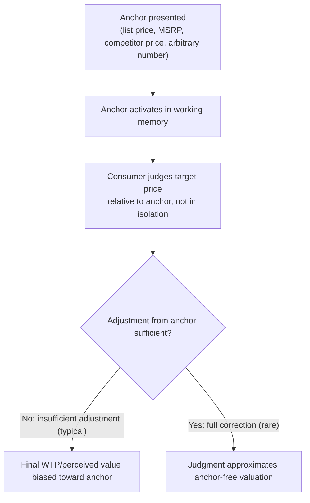

## Pricing Psychology and Anchored Price Perception

### Definitions and Scope

**Anchoring**: a cognitive bias whereby an initial reference value (the "anchor") disproportionately influences a subsequent numerical judgment, even when the anchor is arbitrary, irrelevant, or explicitly known to be uninformative (Tversky & Kahneman, 1974). In pricing contexts, anchoring explains why consumers' willingness-to-pay (WTP) and perceived fairness of a price are not fixed valuations of the good itself but are constructed relative to salient reference points presented at or before the point of purchase.

**Price perception**: the broader set of psychological processes — reference dependence, framing, numerical cognition — that determine how a stated price is subjectively evaluated, as distinct from the objective monetary magnitude. This topic sits within behavioral industrial organization because firms can strategically manipulate anchors and reference points to shift demand at a given objective price, a channel absent from standard IO models where demand depends only on price, income, and preferences.

### Formal Framework: Reference-Dependent Valuation

Building on Prospect Theory (Kahneman & Tversky, 1979) and Transaction Utility Theory (Thaler, 1985), total utility from a purchase decomposes into two components:

$$U_{\text{total}} = U_{\text{acquisition}}(v, p) + U_{\text{transaction}}(p, p^*)$$

where:

- $U_{\text{acquisition}}$ is standard consumer-surplus-like utility from the good's use value $v$ relative to price $p$
- $U_{\text{transaction}}$ is utility derived purely from the perceived quality of the *deal*, i.e., $p$ relative to a reference price $p^*$ (an anchor — a "regular price," a competitor's price, or an arbitrarily suggested price)

Critically, $U_{\text{transaction}} > 0$ whenever $p < p^*$, **independent of $v$** — meaning a consumer can derive positive utility from a "good deal" on an item they would not otherwise value highly, and firms can generate this utility component purely by manipulating the anchor $p^*$ rather than lowering true acquisition cost.

### The Anchoring-and-Adjustment Mechanism

The classic anchoring-and-adjustment heuristic proceeds in two biased steps:

1. An initial anchor value is activated (presented, recalled, or even arbitrarily generated, e.g., via a spun wheel in the original Tversky-Kahneman demonstration).
2. Subsequent numerical estimates are adjusted *from* that anchor, but adjustment is systematically insufficient, leaving the final judgment biased toward the anchor.

This mechanism operates even when the anchor is transparently uninformative (e.g., the last two digits of one's phone number), which is the empirical signature distinguishing true anchoring from rational Bayesian updating on informative reference prices.

### Anchoring Mechanism Diagram

### Common Anchoring Techniques in Pricing Practice

**Key Points**

- **Manufacturer's Suggested Retail Price (MSRP) / "was" pricing**: displaying a crossed-out higher "original" price alongside a lower "sale" price anchors perceived value at the higher figure, inflating perceived savings independent of whether the item was ever genuinely sold at the anchor price.
- **Decoy pricing / asymmetric dominance effect**: introducing a third option that is strictly dominated by one target option (but not by the other) shifts choice share toward the dominating option, because the decoy serves as a comparative anchor that makes the target look favorable by contrast (classic *Economist* magazine subscription study: adding a print-only decoy priced equal to a print-plus-web option shifted majority choice toward the bundle).
- **Price tiering / "good-better-best" menus**: a deliberately unattractive premium tier can anchor perceived value upward for the mid-tier option, which becomes the modal choice — a strategic application of the compromise effect (Simonson, 1989), where middle options in a choice set gain relative attractiveness partly through contrast with the tier extremes.
- **9-ending / left-digit bias pricing**: prices ending in .99 are processed as closer to the next-lowest whole number than true magnitude implies ($3.99 anchors toward $3, not $4), because consumers disproportionately weight the leftmost digit in quick numerical processing — an effect documented in scanner-data studies of retail demand elasticity around price-ending thresholds.
- **Bundling and per-unit price obfuscation**: presenting a bundle price without an easily computed per-unit reference removes a natural anchor a consumer might otherwise use for comparison shopping, a technique studied under the broader heading of "shrouded attributes" in behavioral IO (Gabaix & Laibson, 2006).
- **Anchoring via unit framing**: reframing a price in smaller time units (e.g., "$1 a day" for an annual subscription of $365) anchors the salient number at a psychologically small figure, exploiting the fact that the anchor consumers retain and compare against future decisions is the framed unit, not the aggregate cost.

### Empirical Evidence

**Example**

- **Tversky & Kahneman (1974) wheel-of-fortune experiment**: participants who spun a rigged wheel landing on either 10 or 65 were subsequently asked to estimate the percentage of African countries in the UN; median estimates were substantially higher for the group anchored at 65 than at 10, despite the wheel being visibly random and unrelated to the question — establishing anchoring as operative even absent any informational content in the anchor.
- **Ariely, Loewenstein & Prelec (2003), "coherent arbitrary" pricing**: participants asked to write down the last two digits of their Social Security number before bidding on ordinary consumer goods (wine, chocolate, keyboards) showed bids strongly correlated with that arbitrary anchor, and — notably — subsequent relative valuations across goods within-subject remained internally consistent (coherent), demonstrating that anchoring affects the absolute price level accepted while preferences over relative rankings can remain rational.
- **Field evidence on "was/now" reference pricing**: studies of retail scanner data and regulatory investigations into reference-price advertising (relevant to FTC guidance in the US and equivalent consumer-protection regulation elsewhere) find that inflated or rarely-charged "regular" prices used as sale-price anchors can materially raise perceived discount magnitude and purchase likelihood, which is the empirical basis for regulatory scrutiny of reference-price claims in several jurisdictions. [Inference: the precise elasticity of demand with respect to anchor manipulation, as opposed to true price, varies substantially by product category and is not a single universal parameter.]
- **Left-digit bias in retail demand (scanner-data studies)**: research using large retail price-change datasets finds discontinuous jumps in demand response at whole-dollar price thresholds (e.g., moving from $2.00 to $1.99) larger than the linear extrapolation from nearby price changes would predict, consistent with left-digit-biased processing rather than smooth marginal-utility-based demand.

### Firm Strategy and Regulatory Considerations

| Technique | Mechanism | Regulatory/Ethical Consideration |
| --- | --- | --- |
| Inflated "was" price | Reference-price anchor inflation | Regulated in several jurisdictions (e.g., requiring genuine prior sale history) |
| Decoy/asymmetric dominance | Comparative anchor shifts share to target option | Generally unregulated; considered a standard choice-architecture practice |
| 9-ending pricing | Left-digit bias | Not typically regulated; ubiquitous industry practice |
| Drip pricing / shrouded fees | Anchor set on a partial price, true total revealed later | Increasingly subject to "all-in pricing" disclosure requirements in some jurisdictions |
| Unit-price reframing ($/day) | Small-number anchor substitution for aggregate cost | Generally unregulated; disclosure of true aggregate cost typically still required |

[Unverified] The overall welfare effect of anchoring-based pricing strategies — whether net consumer harm exceeds any informational or matching benefit of price differentiation — is contested in the behavioral IO literature and depends on market-specific competitive conditions; no single consensus verdict applies across all contexts.

### Distinguishing Anchoring from Rational Reference-Price Use

| Feature | Rational Bayesian Use of Reference Price | Behavioral Anchoring |
| --- | --- | --- |
| Informativeness of anchor | Anchor carries genuine information about market price distribution | Anchor influences judgment even when known to be arbitrary/uninformative |
| Adjustment | Full Bayesian updating given prior and signal | Systematically insufficient adjustment from the anchor |
| Persistence under disclosure | Effect should vanish if anchor is revealed as manipulated | Effect frequently persists even when consumers are warned the anchor is arbitrary |

### Related Topics

- Prospect Theory and reference-dependent preferences (Kahneman & Tversky, 1979)
- Transaction utility and mental accounting in purchase decisions (Thaler)
- Decoy effects and the compromise effect in choice architecture
- Shrouded attributes and drip pricing (Gabaix & Laibson framework)
- Left-digit bias and numerical cognition in retail demand
- Dynamic pricing and personalized anchor manipulation in e-commerce
- Consumer protection regulation of reference-price advertising
- Choice architecture and nudge design in retail environments