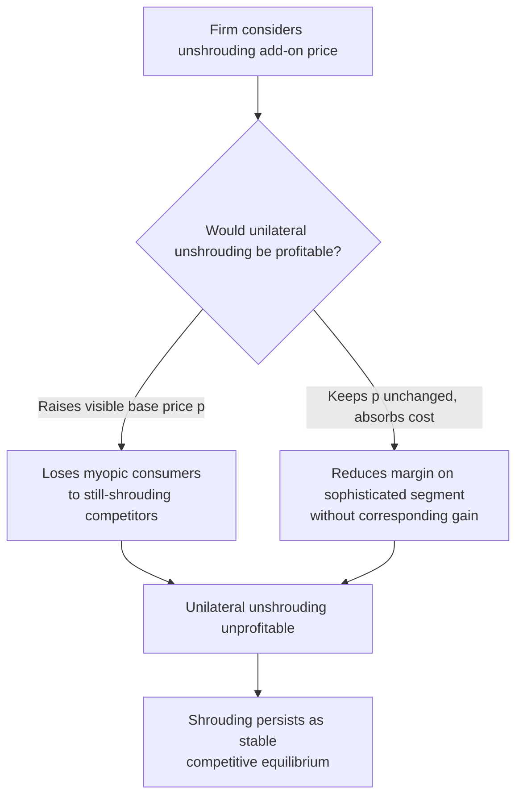

## Shrouded Attributes and Add-On Pricing

### Definitions and Scope

**Shrouded attributes**: price-relevant product features — fees, surcharges, contingent costs, add-on prices — that firms deliberately make less salient or harder to compute at the point of the primary purchase decision, even though the information is technically disclosed somewhere. The foundational formalization is Gabaix & Laibson (2006), "Shrouded Attributes, Consumer Myopia, and Information Suppression in Competitive Markets," which showed that shrouding can persist as a stable market equilibrium even under full firm competition and free entry — a striking departure from standard IO intuition that competition drives prices toward marginal cost and eliminates exploitative pricing.

**Add-on pricing**: the specific commercial pattern of advertising a low "base" price for a core good while charging separately, and often less saliently, for complementary items or services the consumer discovers are needed only after committing to the base purchase (classic examples: printer plus ink cartridges, hotel room plus resort fees, airline base fare plus baggage/seat-selection fees, banking base account plus overdraft fees).

### The Gabaix-Laibson Model: Why Shrouding Survives Competition

**Key Points**

- The model divides consumers into two types: **sophisticated** consumers who correctly anticipate the shrouded add-on cost and factor it into their purchase decision, and **myopic (naive)** consumers who attend only to the salient base price and are surprised by the add-on cost later.
- In a competitive equilibrium with both consumer types present, firms cannot profitably "unshroud" (transparently disclose and fold the add-on into the base price) unilaterally: doing so would raise their advertised base price relative to shrouding competitors, causing them to lose price-sensitive myopic consumers to those competitors — even though sophisticated consumers would benefit from the disclosure.
- The result is a **prisoner's-dilemma-like market failure**: every firm would prefer an industry-wide move to transparent pricing, but no individual firm can profitably deviate first, so shrouding persists as a stable Nash equilibrium despite full competition and free entry driving *total* profit toward zero (unshrouding, if achieved, would reduce total revenue extracted from myopic consumers without corresponding cost savings).
- **Cross-subsidization result**: sophisticated consumers who exploit the low base price and avoid the add-on (e.g., by not buying ink from the printer manufacturer, or not incurring the overdraft fee) can end up implicitly subsidized by myopic consumers who pay the shrouded charge — a redistribution from naive to sophisticated consumers that occurs purely as a byproduct of the equilibrium pricing structure, not through any explicit firm intention to discriminate between them.

### Formal Sketch of the Equilibrium Condition

Let $p$ be the salient base price and $a$ be the shrouded add-on price, with marginal cost $c = c_p + c_a$. A firm's profit per naive (myopic) consumer is:

$$\pi_{\text{naive}} = (p - c_p) + (a - c_a)$$

while a firm's profit per sophisticated consumer, who avoids the add-on entirely by substituting to an outside option for that component, is:

$$\pi_{\text{sophisticated}} = (p - c_p) - c_a^{\text{avoided}}$$

Under free entry, competition drives $p$ down toward a level such that *total* expected profit across the consumer mix is zero, but $p$ itself can be driven **below marginal cost of the base good** ($p < c_p$) — firms effectively use the base good as a loss leader, recouping margin entirely through $a$ — a pattern impossible to rationalize in a model without shrouding, since no firm would sell below cost in a fully transparent, single-price competitive market absent this cross-subsidization mechanism.

### Market Equilibrium Diagram

### Common Real-World Manifestations

**Example**

- **Printer/ink model**: low advertised printer price, high-margin proprietary ink cartridges disclosed but rarely salient at time of printer purchase.
- **Hotel resort fees**: a mandatory fee added at checkout, separate from the advertised nightly rate, historically often disclosed only in fine print or at a late stage of the booking flow — subject to increasing regulatory scrutiny (e.g., US FTC rulemaking on "junk fees" and similar consumer-protection actions in other jurisdictions).
- **Airline ancillary fees**: baggage, seat selection, and change fees unbundled from a low headline fare, allowing the advertised (and search-engine-comparable) price to understate the total cost most travelers ultimately pay.
- **Banking overdraft and late fees**: base account services advertised as free or low-cost, with revenue substantially generated through contingent penalty fees triggered by a subset of (often financially vulnerable) customers.
- **Rental car and insurance add-ons**: low base rental rate with high-margin insurance, fuel, and toll-processing add-ons presented at the counter after the initial booking commitment is sunk.
- **Subscription "negative option" billing**: low or free introductory pricing with an automatic rollover to a full recurring charge unless the consumer takes an affirmative action to cancel — shrouding via inattention/present bias rather than pure information suppression, closely related to but formally distinct from the Gabaix-Laibson framework.

### Empirical Evidence

- **Printer/ink and razor/blade pricing patterns**: documented across multiple product categories as a stable, long-running commercial practice consistent with the shrouded-attribute equilibrium; the durability of the pattern across decades and firms is often cited as indirect evidence against the alternative hypothesis that shrouding is a transient, easily-arbitraged market inefficiency.
- **Hotel resort fee disclosure studies**: research and regulatory investigations examining the effect of resort-fee transparency on consumer search and booking behavior have found that obscuring total price via a separate mandatory fee is associated with reduced consumers' ability to accurately compare total cost across properties at the search stage. [Inference: precise demand-elasticity estimates for resort-fee disclosure specifically vary by study and dataset; the qualitative direction of the effect is more robustly established than any single quantitative magnitude.]
- **Add-on fee experiments (banking overdraft, general fee-salience studies)**: several studies manipulating the salience of add-on/penalty fee disclosure at account opening find reduced downstream fee incidence among consumers who received more salient upfront disclosure, consistent with a myopia/inattention channel rather than consumers being fully informed but simply willing to pay.
- **All-in pricing regulation natural experiments**: jurisdictions and platforms that have mandated all-in (tax- and fee-inclusive) price display for certain categories (e.g., airline fare display rules in some countries) provide natural-experiment evidence on shrouding; regulatory mandates for all-in pricing are among the primary policy interventions motivated directly by the Gabaix-Laibson model. [Unverified as a precise quantitative claim: effect sizes of specific all-in pricing mandates on consumer welfare are jurisdiction- and market-specific and are not captured by a single universal estimate.]

### Distinguishing Shrouding from Legitimate Price Discrimination or Cost-Based Unbundling

| Pattern | Distinguishing Feature | Welfare Implication |
| --- | --- | --- |
| Legitimate unbundling | Add-on reflects a genuinely optional, cost-based service that not all consumers want | Can improve efficiency by letting consumers pay only for services used |
| Shrouded add-on | Add-on cost is salience-suppressed and disproportionately incurred by inattentive/myopic consumers rather than reflecting genuine optionality | Redistributive from naive to sophisticated consumers; may not improve, and can reduce, aggregate welfare |
| Price discrimination via menu design | Different bundles targeted at different willingness-to-pay segments, disclosed transparently | Can be efficiency-enhancing (serves more of the market) if fully disclosed |

### Policy and Regulatory Responses

**Next Steps** (regulatory/consumer-protection considerations)

- **All-in pricing mandates**: requiring the advertised price to include all mandatory fees, directly targeting the base mechanism identified in the Gabaix-Laibson model.
- **"Junk fee" rulemaking**: recent regulatory initiatives (e.g., US FTC's junk fees rule and parallel efforts by other consumer-protection authorities) specifically target hidden mandatory fees in hospitality, live-event ticketing, and short-term lending.
- **Standardized disclosure timing requirements**: mandating that add-on costs be disclosed at the same funnel stage as the base price, rather than after a behavioral/financial commitment has already been made (e.g., after a non-refundable booking).
- **Default-option regulation for negative-option billing**: requiring affirmative consumer action for subscription renewal or add-on purchase, rather than automatic opt-in by default, directly targeting the myopia/inattention channel.

[Inference: the effectiveness of any single regulatory instrument in fully eliminating shrouding-driven welfare loss is contested, since firms can often shift shrouding to a different, not-yet-regulated margin — a "whack-a-mole" dynamic noted in some of the regulatory-economics literature, though the extent of this displacement is not precisely quantified across markets.]

### Related Topics

- Pricing Psychology and Anchored Price Perception (companion mechanism: salient base price as an anchor)
- Present bias and myopic consumer decision-making (Poverty Traps and Present Bias, companion chapter)
- Behavioral Barriers to Savings and Credit Access (overdraft fee incidence as a parallel mechanism)
- Negative-option billing and subscription "cancellation friction" design
- Consumer protection regulation: FTC junk fees rule and comparable frameworks
- Price discrimination and menu design in competitive markets
- Search costs and imperfect price comparison in online markets
- Behavioral welfare economics: measuring consumer surplus under biased beliefs