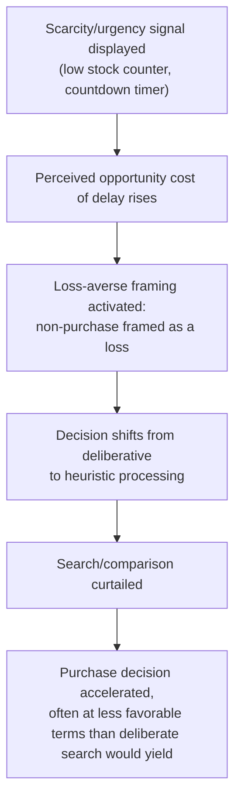

## Scarcity and Urgency Tactics in Marketing

### Definitions and Scope

**Scarcity tactics**: marketing techniques that signal (genuinely or artificially) limited quantity of a good ("only 3 left in stock," limited-edition releases), designed to shift perceived value and accelerate purchase decisions independent of the good's underlying use value.

**Urgency tactics**: marketing techniques that signal limited *time* to act (countdown timers, "sale ends tonight," flash sales), designed to compress the consumer's decision window and curtail deliberation or comparison shopping.

Both operate on overlapping but distinct psychological mechanisms and are grouped together in behavioral IO because they share a common strategic function: manipulating the perceived opportunity cost of *not* purchasing immediately, thereby shifting demand at a given price without any change in the good's objective attributes.

### Psychological Mechanisms

**Key Points**

- **Loss aversion applied to forgone opportunities**: framing non-purchase as a potential *loss* ("don't miss out") rather than framing purchase as a *gain* exploits the well-documented asymmetry in prospect theory whereby losses are weighted roughly 1.5–2.5x more heavily than equivalent gains (Kahneman & Tversky, 1979), making threatened loss of an opportunity a more motivating frame than an equivalent-value gain framing.
- **Reactance and the scarcity heuristic**: psychological reactance theory (Brehm, 1966) posits that perceived threats to freedom of choice (an option becoming unavailable) increase the desirability of that option — commercial scarcity messaging directly activates this mechanism by threatening the consumer's future ability to choose the item.
- **Scarcity as a quality inference heuristic**: in the absence of complete information about a product's quality, consumers may use apparent popularity/scarcity ("selling fast," low remaining stock) as an inferential proxy for quality or value, a heuristic that is rational under genuine informational scarcity signals but exploitable when the signal is manufactured.
- **Time pressure and reduced deliberation**: urgency framing operates via a dual-process mechanism — compressing the decision window shifts processing from deliberative (System 2) evaluation toward faster, heuristic-based (System 1) judgment, reducing the likelihood of comparison shopping or reconsideration.
- **Present bias interaction**: urgency tactics interact with present bias by making the *cost of delay* artificially salient and immediate, while the true cost of a hasty, potentially suboptimal purchase is deferred and diffuse — the same intertemporal asymmetry that governs underinvestment problems elsewhere in behavioral economics, but redirected here to accelerate rather than defer a decision.

### Formal Framework: Urgency as an Artificial Deadline in a Search Model

In a standard sequential search model, a consumer facing price $p_1$ from the first seller compares it to the expected value of continued search:

$$\text{Accept } p_1 \iff v - p_1 > E[\text{continued search value}] - c_{\text{search}}$$

Artificial urgency (a countdown timer, "only available today") functions as an injected increase in the effective cost of search $c_{\text{search}}$, or equivalently forces $E[\text{continued search value}]$ toward zero by falsely signaling that the option itself will vanish — inducing acceptance of $p_1$ at a rate exceeding what genuine search costs alone would justify. Because the deadline is frequently not genuine (the "sale" recurs, the countdown resets), this represents a manufactured, rather than a cost-reflective, search friction.

### Scarcity/Urgency Decision-Compression Diagram

### Common Tactical Implementations

**Example**

- **Countdown timers on e-commerce checkout pages**: often not tied to any genuine inventory or pricing event, but calibrated purely to induce urgency; some jurisdictions' consumer-protection regulators have taken enforcement action against persistently-resetting or fabricated countdown timers as deceptive practices.
- **"Only X left in stock" indicators**: can reflect genuine real-time inventory (an informative signal) or can be algorithmically generated/exaggerated independent of true stock levels — the same visual cue can be either a rational information source or a manipulative one depending on backend implementation, making this a case where the *mechanism* (a low-stock display) is not inherently deceptive but is deceptive when decoupled from ground truth.
- **Limited-time flash sales and "deal of the day" formats**: commonly used on e-commerce and daily-deal platforms; the artificial time compression is the core mechanism, distinct from genuine seasonal or clearance discounting where the deadline reflects a real business constraint (e.g., perishable inventory, end-of-season clearance).
- **Limited-edition and drop-based release strategies**: used extensively in sneaker, streetwear, and collectibles marketing, where genuine production-run scarcity (a real supply constraint) blends with promotional amplification of that scarcity to generate demand beyond what the item's intrinsic use value would predict, sometimes generating secondary/resale markets as an observable proof of the scarcity premium's economic reality.
- **Social proof compounding**: pairing scarcity/urgency messaging with social-proof cues ("12 people are viewing this," "8 sold in the last hour") combines the scarcity heuristic with a separate conformity-based mechanism, amplifying the perceived urgency signal.

### Empirical Evidence

- **Classic scarcity experiments (Worchel, Lee & Adewole, 1975)**: participants rated identical cookies as more desirable and higher-quality when presented in a jar containing few cookies (scarce) versus many cookies (abundant), and ratings increased further when the scarcity was framed as resulting from high demand rather than an arbitrary allocation — demonstrating that the *inferred cause* of scarcity, not merely the scarcity itself, modulates the size of the effect.
- **E-commerce field studies on countdown timers and inventory displays**: several studies of online retail conversion data find measurably higher purchase-conversion rates when scarcity or urgency messaging is present relative to matched control conditions without such messaging, though the extent to which observed field effects reflect genuine versus fabricated scarcity signals is often not separable within a single retailer's proprietary dataset. [Inference: publicly available effect-size estimates for urgency tactics specifically are drawn largely from industry-reported conversion-rate-optimization case studies rather than peer-reviewed randomized experiments, warranting caution in treating specific magnitudes as generalizable.]
- **Regulatory findings on dark-pattern countdown timers**: consumer-protection investigations (e.g., UK Competition and Markets Authority reviews of online choice architecture, and comparable investigations by other national regulators) have documented cases of countdown timers that reset upon page reload or did not correspond to any actual time-limited offer, and have characterized such practices as a form of deceptive "dark pattern" design warranting regulatory intervention.

### Distinguishing Genuine from Manufactured Scarcity/Urgency

| Signal | Genuine Basis | Manufactured/Deceptive Basis |
| --- | --- | --- |
| Low stock counter | Reflects real-time inventory system, accurate | Static or randomized number decoupled from actual stock |
| Countdown timer | Tied to an actual, non-renewing promotional window or perishable inventory deadline | Resets on page reload or recurs identically across sessions |
| Limited edition | Genuine fixed production run with no planned restock | Restocked repeatedly under new "limited" framing |
| "X people viewing/bought this" | Reflects actual real-time user activity data | Fabricated or artificially inflated activity counter |

[Unverified] The precise proportion of urgency/scarcity signals in commercial use that are genuine versus manufactured is not systematically measured across markets; available evidence is drawn from targeted regulatory investigations and case studies rather than a comprehensive audit.

### Regulatory and Ethical Considerations

**Next Steps** (policy/regulatory relevance)

- Multiple consumer-protection regimes now explicitly classify fabricated urgency/scarcity indicators (fake countdowns, false low-stock claims) as **dark patterns** subject to enforcement under general deceptive-practices or, in some jurisdictions, dedicated digital-consumer-protection statutes.
- The key regulatory distinguishing test applied across most frameworks is **truthfulness of the underlying claim** — genuine scarcity or time-limited offers are generally permissible marketing; the fabrication or exaggeration of the underlying fact is the regulated harm, not the persuasive technique itself.
- Firms seeking to use scarcity/urgency tactics within a compliant framework are generally advised to ensure the displayed signal is dynamically and accurately tied to genuine backend data (true inventory levels, true promotional end dates) rather than static or fabricated values. [Inference: this is a normative/compliance recommendation, not an empirical claim.]

### Related Topics

- Prospect Theory and loss aversion (Kahneman & Tversky, 1979)
- Pricing Psychology and Anchored Price Perception (companion mechanism in the same chapter)
- Shrouded Attributes and Add-On Pricing (companion mechanism: manipulating salience rather than urgency)
- Dark patterns in digital choice architecture and UX design
- Social proof and conformity effects in consumer decision-making
- Consumer protection regulation of deceptive online marketing practices
- Sequential search theory and consumer shopping behavior
- Present bias and time-pressured decision-making