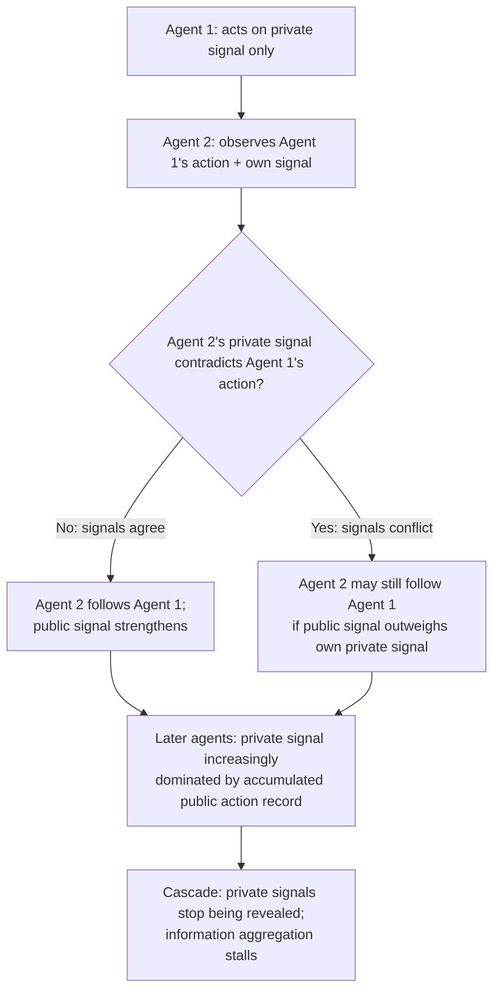

## Social Proof and Word-of-Mouth Effects

### Definitions and Scope

**Social proof**: a psychological and economic mechanism whereby individuals infer the correct or appropriate action (product choice, purchase decision) from observing the behavior of others, particularly under uncertainty about a product's quality or fit. First articulated as a persuasion principle by Cialdini (1984) and formalized economically through **social/observational learning** and **information cascade** models (Bikhchandani, Hirshleifer & Welch, 1992; Banerjee, 1992).

**Word-of-mouth (WOM) effects**: the transmission of product information, opinions, and recommendations through interpersonal networks (offline conversation, online reviews, social media), distinguished from firm-generated advertising by its (often) higher perceived credibility, since the communicator is presumed to lack the firm's direct financial incentive to misrepresent quality.

This topic sits within behavioral IO because both mechanisms allow firm-relevant demand shifts to propagate through channels outside standard price-and-advertising competition, and because both are subject to strategic manipulation (fake reviews, seeded WOM, influencer marketing) that raises distinct welfare and regulatory questions.

### Formal Framework: Information Cascades

The canonical herding model (Bikhchandani, Hirshleifer & Welch, 1992) considers sequential decision-makers, each observing a private noisy signal $s_i$ about an underlying quality state $\theta \in \{Good, Bad\}$, and also observing all prior decision-makers' *actions* (not their private signals). Bayesian-rational updating on both sources of information can lead to a state where:

$$P(\theta = Good \mid s_i, a_1, \ldots, a_{i-1})$$

is dominated by the accumulated weight of prior public actions $a_1, \ldots, a_{i-1}$ to the point that an individual's optimal action *ignores their own private signal* entirely — rationally choosing to follow the herd even when their private information would otherwise suggest a different choice. Once enough agents have taken the same action, later agents' private signals become uninformative to the public record, and the **cascade** becomes self-perpetuating and, importantly, **fragile**: it can be based on very little actual aggregated private information and can be reversed by a single sufficiently strong new public signal.

This is the key theoretical result distinguishing information cascades from a stable, efficient aggregation of dispersed information (as in the Condorcet Jury Theorem or well-functioning prediction markets) — cascades can lock in an inefficient or incorrect collective outcome despite individually rational behavior at each step.

### Cascade Formation Diagram

### Distinguishing Social Learning from Payoff Externalities

**Key Points**

- **Observational/informational social learning**: others' choices are informative about product quality because those individuals presumably had relevant private information (their own experience, expertise) — a genuine informational externality.
- **Network/payoff externalities**: a product becomes more valuable to *you* specifically *because* others use it (e.g., communication platforms, standards-dependent goods) — a real change in use value, not merely an inference about quality, and governed by separate network-effects economic models (not covered in depth here).
- **Conformity/normative social proof**: choosing what others choose partly for social approval or fitting-in reasons, independent of quality inference — closer to the norm-compliance mechanisms discussed in the companion "Social Norms and Collective Action" topic, applied here to consumption rather than civic behavior.
- These three mechanisms are frequently entangled in real consumer behavior and are not always empirically separable from observational data alone, which complicates clean identification of "true" social-proof effects in field settings. [Inference]

### Word-of-Mouth: Credibility and Network Structure

- **Source credibility asymmetry**: WOM is typically modeled as carrying higher perceived credibility than firm-generated advertising because the communicator (a peer) is assumed to lack the firm's incentive to misrepresent — though this assumption breaks down under incentivized or covert WOM (see manipulation section below).
- **Network structure and diffusion speed**: the rate and reach of WOM propagation depends on network topology — highly connected "hub" individuals (influencers, in modern terminology) can disproportionately accelerate diffusion, a finding central to both classical diffusion-of-innovations research (Rogers, 1962) and contemporary digital marketing strategy.
- **Negative WOM asymmetry**: multiple studies find negative reviews/word-of-mouth are weighted more heavily in aggregate demand response than positive reviews of equivalent magnitude, consistent with the general loss-aversion asymmetry documented in prospect theory being reflected in how third-party information is processed, not only how one's own outcomes are evaluated.

### Empirical Evidence

**Example**

- **Online review score effects on demand (multiple platform studies)**: research using restaurant, hotel, and e-commerce review data consistently finds a positive relationship between average review rating (and review volume) and subsequent sales/booking volume, with several studies finding the sales elasticity with respect to review score notably larger than the elasticity with respect to comparable price changes — suggesting social-proof signals can dominate price as a demand driver in some settings. [Inference: precise elasticity magnitudes are highly platform- and category-specific and should not be treated as a single universal parameter across all online markets.]
- **Anderson & Simester (2014) and related fake-review detection studies**: research analyzing patterns consistent with manipulated or incentivized reviews finds that detectable anomalies in review timing, rating distribution, and reviewer history correlate with subsequent platform enforcement actions, providing indirect evidence of the scale of strategic review manipulation across major e-commerce platforms.
- **Field experiments on WOM seeding**: marketing field experiments providing free products to selected network-central individuals (referral and seeding programs) have found measurable downstream sales increases attributable to the seeded individuals' subsequent word-of-mouth, with effect size sensitive to the seeded individual's network centrality — consistent with the diffusion-of-innovations prediction that hub placement matters more than simple random seeding of equal total reach.
- **Herding/cascade evidence in real markets**: studies of sequential purchasing data (e.g., early online sales rank effects, IPO subscription patterns, restaurant queue-length effects on subsequent patronage) find behavior broadly consistent with cascade-model predictions — visible early adoption disproportionately shapes subsequent adoption relative to what independent private-signal aggregation would predict — though cleanly distinguishing a true information cascade from a network/payoff externality in field data remains methodologically difficult in most of these settings. [Unverified as a general claim across all cited study types: the strength of evidence for "true" cascades versus alternative explanations varies by study design.]

### Strategic Manipulation and Regulatory Response

| Manipulation Tactic | Mechanism | Regulatory/Platform Response |
| --- | --- | --- |
| Fake/incentivized reviews | Fabricates or purchases social-proof signal without genuine product experience | FTC and equivalent consumer-protection enforcement; platform detection algorithms and review-verification systems |
| Undisclosed influencer sponsorship | Presents paid promotion as organic WOM, exploiting the credibility asymmetry that assumes no financial incentive | Mandatory sponsorship disclosure rules (e.g., FTC endorsement guidelines and equivalent regimes) |
| Astroturfing (fabricated grassroots activity) | Manufactures appearance of independent, widespread organic enthusiasm | Platform policy enforcement; reputational and, in some cases, legal liability for firms found engaging in the practice |
| Review-gating / selective solicitation | Solicits reviews disproportionately from satisfied customers, biasing the visible sample | Some platforms prohibit selective solicitation in their terms of service |

[Unverified] The aggregate welfare impact of review-manipulation regulation and detection systems — net effect on overall market information quality after accounting for detection costs and residual undetected manipulation — is not established by a single consensus estimate and likely varies by platform and enforcement intensity.

### Distinguishing Efficient Information Aggregation from Herding Failure

| Feature | Efficient Aggregation | Cascade/Herding Failure |
| --- | --- | --- |
| Private information use | Each agent's private signal is revealed through action and contributes to public information | Private signals stop being revealed once public signal dominates |
| Fragility | Robust; aggregate outcome reflects the true weight of dispersed private information | Fragile; can be reversed by one strong new public signal despite large apparent consensus |
| Convergence to truth | Converges toward correct state as sample size grows (under standard conditions) | Can converge to an incorrect state and remain stuck there |

### Related Topics

- Pricing Psychology and Anchored Price Perception (companion behavioral IO mechanism)
- Scarcity and Urgency Tactics in Marketing (companion mechanism, often combined with social proof)
- Social Norms and Collective Action in Development (parallel belief-based coordination mechanism, applied to civic rather than consumption behavior)
- Information cascades and herding models (Bikhchandani, Hirshleifer & Welch, 1992)
- Network effects and diffusion of innovations (Rogers, 1962)
- Online review manipulation detection and platform trust and safety
- Influencer marketing and endorsement disclosure regulation
- Prospect theory and asymmetric weighting of negative information