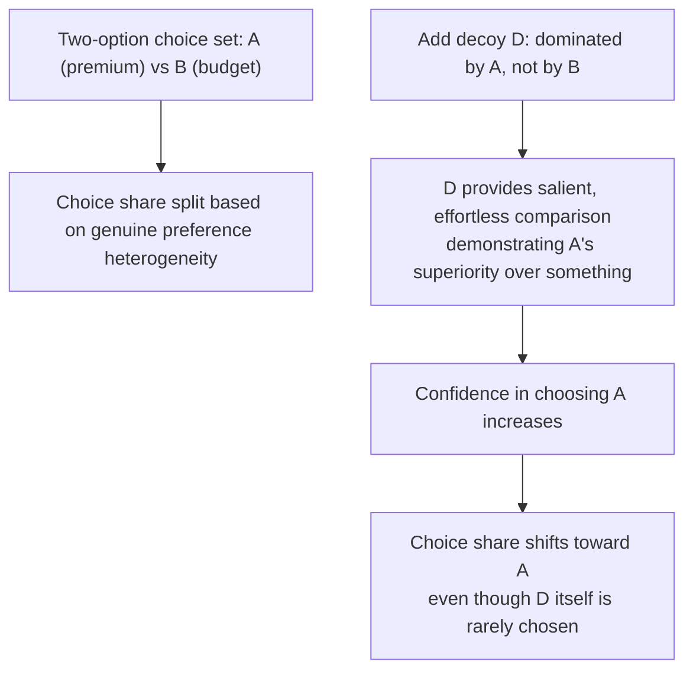

## Product Bundling and the Decoy Effect

### Definitions and Scope

**Product bundling**: the practice of selling two or more distinct goods or services as a single package, often at a price differing from the sum of individual component prices. Standard IO treats bundling primarily through cost-based (economies of scope) and price-discrimination lenses (Stigler, 1963; Adams & Yellen, 1976); behavioral IO adds a distinct layer examining how bundle framing and composition exploit decision-making frictions beyond what a rational, fully-informed WTP-maximizing consumer model would predict.

**Decoy effect (asymmetric dominance effect)**: a choice-architecture phenomenon in which adding a third option to a two-option choice set — an option that is strictly dominated by one existing option (the "target") but not clearly dominated by the other (the "competitor") — increases the choice share of the dominating target option, even though the decoy itself is rarely or never chosen (Huber, Payne & Puto, 1982). This directly violates the standard rational-choice **independence of irrelevant alternatives (IIA)** axiom, since a rational chooser's relative preference between two existing options should not be affected by the addition of a third, unchosen option.

### Formal Framework: Violation of IIA

Under standard rational choice, if $A \succ B$ in a two-option set $\{A, B\}$, adding an irrelevant option $C$ should not reverse this ranking:

$$P(A \mid \{A, B\}) \approx P(A \mid \{A, B, C\}) \text{ scaled proportionally, if } C \text{ is truly irrelevant}$$

The decoy effect demonstrates a systematic violation: when $C$ is constructed to be **asymmetrically dominated** — dominated by $A$ on all attributes, but not dominated by $B$ (superior to $B$ on at least one attribute) — empirical choice share shifts such that:

$$P(A \mid \{A, B, C\}) > P(A \mid \{A, B\})$$

The mechanism is generally attributed to the decoy providing an easy, salient comparison anchor that makes $A$'s dominance over *something* concrete and effortless to verify, increasing confidence in and preference for $A$ specifically, rather than reflecting any change in the true underlying utility of $A$ relative to $B$.

### The Classic Decoy Demonstration

**Example**

The most widely cited illustration (Ariely, drawing on Huber, Payne & Puto's original paradigm, popularized via *The Economist* magazine subscription case):

| Option | Web-only | Print-only | Print + Web |
| --- | --- | --- | --- |
| Price | $59 | $125 | $125 |

In the two-option set (Web-only vs. Print+Web), a meaningful share chooses Web-only for its lower price. Adding the Print-only option at the *same price* as Print+Web — a decoy strictly dominated by Print+Web (identical price, strictly fewer benefits) but not dominated by Web-only (Print-only has different, not strictly inferior, attributes relative to Web-only) — shifts a majority of choices toward Print+Web, since Print+Web now looks like an unambiguously superior "free upgrade" relative to the decoy, an anchor comparison unavailable in the two-option set.

### Decoy Placement Diagram

### Bundling Strategies and Behavioral Mechanisms

**Key Points**

- **Pure bundling**: only the bundle is offered, no standalone components — removes price comparison entirely, preventing consumers from evaluating component-level value or opportunity cost of unused components (relevant to the shrouded-attributes framework in the companion topic, since bundle pricing can obscure a poor per-component deal).
- **Mixed bundling with a deliberately unattractive middle/decoy tier**: as in the "good-better-best" tiering strategy, a firm may include a tier priced and specified specifically to make a target tier look like the obviously superior choice by contrast, rather than because the decoy tier is expected to sell meaningfully.
- **Bundling as a debiasing-resistant tactic**: even consumers aware of the decoy-effect literature in the abstract frequently remain susceptible to the manipulation in a concrete purchase context, distinguishing decoy effects from biases that are more readily self-corrected once named — a persistence pattern documented across repeated-exposure experimental designs. [Inference: persistence-under-awareness findings come from a limited set of experimental paradigms and may not generalize to all decoy applications or consumer populations equally.]
- **Bundling and mental-accounting interaction**: bundle framing can also suppress attention to a specific high-margin or low-value component by folding it into an aggregate bundle price, functioning similarly to the shrouding mechanism discussed in the companion topic but through bundling rather than fee separation.
- **Compromise effect (related but distinct mechanism)**: middle options in a three-tier choice set can gain relative attractiveness partly because extreme options carry perceived risk (of being either wastefully expensive or embarrassingly cheap/low-quality), a related but conceptually separate phenomenon from strict asymmetric dominance (Simonson, 1989) — the compromise effect does not require one option to literally dominate another, only that middle options minimize the risk of choosing an extreme.

### Empirical Evidence

- **Huber, Payne & Puto (1982), original demonstration**: laboratory choice experiments across multiple product categories (beer quality/price tradeoffs, automobile attribute tradeoffs) found the addition of an asymmetrically dominated decoy consistently shifted choice share toward the dominating target option, establishing the phenomenon across varied stimulus domains rather than a single product category artifact.
- **Ariely & Wallsten and related replications of the Economist subscription paradigm**: multiple classroom and online replications of the three-tier subscription framing have reproduced the qualitative choice-share shift, though exact magnitudes vary by sample and specific price points used. [Unverified as a precise quantitative claim: replication effect sizes are not uniform across all reported studies, and some replication attempts in different consumer populations have found smaller effects than the original demonstration.]
- **Field pricing-tier evidence (SaaS and subscription industries)**: the "good-better-best" three-tier structure is near-ubiquitous in software-as-a-service and subscription pricing pages, a revealed-preference pattern widely interpreted by marketing practitioners as consistent with decoy/compromise-effect exploitation, though rigorous causal field evidence isolating the decoy mechanism specifically (as opposed to general price discrimination via menu design) is less extensively documented in peer-reviewed literature than the laboratory paradigm. [Inference: near-universal industry adoption of three-tier pricing is suggestive but not itself definitive causal evidence that decoy/compromise mechanisms, rather than pure price-discrimination logic, are the dominant driver.]

### Bundling, Decoys, and Price Discrimination: A Comparison

| Mechanism | Rational IO Basis | Behavioral Addition |
| --- | --- | --- |
| Pure price discrimination via menu (no decoy) | Screens consumers by genuine heterogeneous WTP, can be efficiency-enhancing | Minimal — largely explicable by standard mechanism-design theory alone |
| Mixed bundling with genuine cost-based component pricing | Reflects component-level marginal cost differences | Minimal, if pricing tracks true cost structure |
| Decoy-inclusive tiering | Superficially resembles standard price discrimination | Decoy tier's function is comparison manipulation, not genuine market segmentation — decoy is not intended to be a meaningful revenue source |
| Pure bundling that obscures per-component value | Can reflect genuine economies of scope in joint provision | Can also function as a shrouding mechanism, suppressing attention to a specific overpriced or low-value component |

### Distinguishing Legitimate Tiering from Decoy Manipulation

The key diagnostic question is whether a given tier is priced/specified to be a **plausible independent seller** (some meaningful share of consumers would rationally choose it as their preferred option) or whether it exists **purely as a comparison anchor** with negligible expected independent uptake. Firms rarely disclose which case applies, making this distinction primarily inferential from pricing patterns (e.g., a tier priced identically to a strictly superior tier is a strong signal of decoy intent) rather than directly observable. [Inference]

### Related Topics

- Pricing Psychology and Anchored Price Perception (decoy effect as an anchoring-adjacent mechanism)
- Shrouded Attributes and Add-On Pricing (bundling as an attention-suppression tool)
- Compromise effect and extremeness aversion in multi-attribute choice (Simonson, 1989)
- Independence of irrelevant alternatives (IIA) and rational choice axioms
- Price discrimination and menu design in industrial organization
- Choice architecture and nudge design in retail environments
- Behavioral welfare economics: measuring consumer surplus under choice-set-dependent preferences