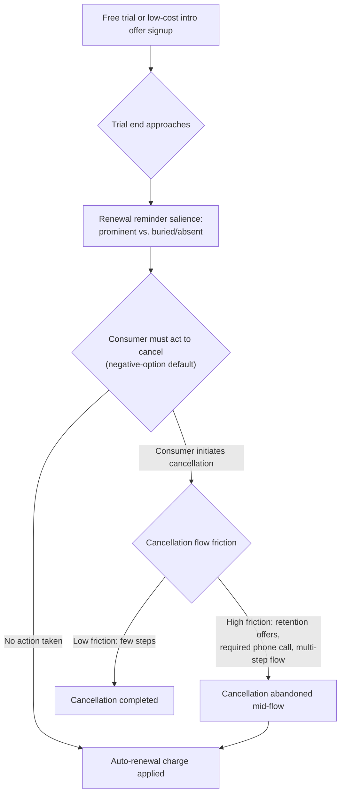

## Subscription Design and Automatic Renewal

### Definitions and Scope

**Subscription design**: the set of contractual and interface choices governing recurring-payment products — trial length, renewal default, cancellation friction, billing cycle salience — that determine retention and churn independent of the underlying product's quality or use value. **Automatic renewal (negative-option billing)**: a contract structure in which continuation of paid service is the *default* outcome absent affirmative consumer action to cancel, as distinct from a positive-option structure requiring affirmative action to *continue*. This topic extends the shrouded-attributes and present-bias frameworks from earlier topics to the specific commercial pattern of recurring billing, which has become economically central to software, media, and direct-to-consumer retail business models.

### Formal Framework: Default Effects and Status Quo Bias

The foundational behavioral mechanism is the **default effect** (Johnson & Goldstein, 2003; Thaler & Sunstein, 2008): when an option is set as the default, a disproportionate share of decision-makers retain it, even when switching costs are trivial. This is formally distinct from a rational transaction-cost account (where defaults matter only because switching is costly) because default effects persist even in settings where switching is nearly costless, implicating psychological rather than purely economic frictions:

$$P(\text{retain default}) \gg P(\text{would have actively chosen this option if forced to choose})$$

Contributing sub-mechanisms include:

- **Status quo bias**: loss-averse framing of any change from the current state, even a beneficial one, as entailing a "loss" of the status quo.
- **Implied endorsement**: consumers may interpret a firm- or platform-set default as an implicit recommendation of the "normal" or advisable choice.
- **Effort/attention cost of the cancellation task**, compounded by present bias: canceling requires an immediate, salient action (navigating a cancellation flow) to avoid a *future*, less salient cost (the next billing cycle charge) — precisely the intertemporal asymmetry present bias predicts will be undervalued relative to its true cost.

### Subscription Funnel and Friction Points

### Key Design Levers

**Key Points**

- **Trial-to-paid conversion default**: structuring a free or discounted trial to auto-convert to full price absent cancellation (versus requiring active opt-in to continue) substantially raises paid conversion, independent of any change in perceived product value during the trial period.
- **Renewal reminder salience and timing**: firms vary widely in how prominently and how far in advance they notify consumers of an impending renewal charge; less salient or later-timed reminders reduce the window and cognitive cue for present-biased/inattentive consumers to act before the charge posts.
- **Cancellation friction ("roach motel" pattern)**: asymmetry between easy sign-up (often single-click, online) and difficult cancellation (requiring a phone call, multi-step confirmation flows, retention-offer interstitials, or account deletion delays) — a specific, extensively documented **dark pattern** category.
- **Retention offers presented during cancellation**: last-moment discount or pause offers presented specifically at the point of cancellation intent can convert some genuine cancellation attempts into continued subscriptions, which is efficiency-enhancing if it corrects a mistaken cancellation but can also function as an additional friction/delay tactic when the offer's primary function is to interrupt rather than genuinely re-persuade.
- **Billing cycle obfuscation**: annual billing framed and charged as a small monthly-equivalent price at signup, with the actual lump-sum annual charge occurring later and less saliently, combines default-effect and shrouded-attribute mechanisms.
- **Multi-subscription forgetting**: even absent any single firm's dark-pattern design, the sheer number of concurrent subscriptions an average consumer maintains raises the baseline probability that any single subscription's renewal goes unnoticed, a portfolio-level attention constraint distinct from any individual firm's specific design choices.

### Empirical Evidence

**Example**

- **Default-effect literature applied to subscriptions**: the broader default-effects literature (most robustly established in retirement-savings auto-enrollment contexts, e.g., Madrian & Shea, 2001, finding dramatically higher 401(k) participation under auto-enrollment versus opt-in) provides the foundational empirical basis subscription-design research draws on, though direct replication specifically within consumer subscription billing (as opposed to retirement savings) is a comparatively newer and less voluminous empirical literature. [Inference: the size of the default effect specifically in subscription billing contexts, versus the well-established retirement-savings context, has not been estimated with the same depth or consistency across studies.]
- **Regulatory investigations into cancellation friction**: multiple consumer-protection actions (e.g., U.S. FTC enforcement actions against specific subscription-based firms, and the FTC's "click-to-cancel" rulemaking effort requiring cancellation to be no more difficult than sign-up) have documented specific instances of multi-step, phone-call-required, or retention-gauntlet cancellation flows, and such asymmetric friction is the central regulatory target of recent negative-option billing rules. [Note: as of this material's knowledge cutoff, the FTC's click-to-cancel rule has faced legal challenges and implementation delays; the precise current regulatory status should be verified against current sources given the fast-moving nature of this specific rulemaking.]
- **Streaming and media subscription churn studies**: industry and academic analyses of subscription churn in media/software markets consistently identify renewal-reminder salience and cancellation-flow friction as measurable churn-rate determinants, holding underlying content/product satisfaction constant, though publicly available quantitative effect sizes are more often reported in industry analytics contexts than in peer-reviewed studies specifically isolating the design-lever channel. [Unverified as a precise quantitative claim]

### Regulatory Landscape

| Jurisdiction/Framework | Key Requirement | Target Mechanism |
| --- | --- | --- |
| US FTC Negative Option Rule / "click-to-cancel" effort | Cancellation must be at least as easy as sign-up | Cancellation friction asymmetry |
| EU Consumer Rights Directive and related member-state rules | Explicit consumer consent and clear pre-contractual information for recurring charges | Default-effect exploitation, disclosure salience |
| California Automatic Renewal Law (ARL) and similar US state statutes | Clear and conspicuous disclosure of auto-renewal terms; simple cancellation mechanism (e.g., online cancellation if signup was online) | Disclosure salience, cancellation friction |
| UK CMA guidance on subscription traps | Guidance targeting inadequate reminder notices and excessive cancellation barriers | Renewal reminder salience, cancellation friction |

[Unverified] The precise current enforcement status and finalized scope of several of these rules (particularly newer US federal rulemaking) may have changed since this material's reference point; readers should verify current regulatory status for time-sensitive compliance purposes.

### Distinguishing Legitimate Recurring Billing from Exploitative Design

| Feature | Legitimate/Consumer-Neutral Design | Exploitative Design |
| --- | --- | --- |
| Sign-up vs. cancellation effort | Roughly symmetric number of steps | Cancellation requires substantially more steps, channels, or delay than sign-up |
| Renewal reminder | Sent with reasonable advance notice, prominent placement | Absent, buried, or sent with insufficient time to act |
| Trial conversion | Clear disclosure of conversion date and price at signup | Conversion terms present but minimized/de-emphasized relative to trial framing |
| Retention offers | Presented once, cancellation still straightforward to complete | Multiple sequential offers/interstitials functioning as delay tactics |

### Design and Policy Implications

**Next Steps**

- From a firm-strategy perspective (positive/descriptive, not a recommendation to exploit): auto-renewal defaults, reminder timing, and cancellation friction are all independently manipulable levers with documented retention effects, meaning subscription "stickiness" metrics can reflect design choices rather than pure product satisfaction — a distinction relevant to interpreting retention KPIs as a genuine quality signal versus a friction-driven artifact.
- From a regulatory/consumer-protection perspective, the dominant global policy trend is convergence toward **symmetry requirements** (cancellation no harder than signup) and **enhanced disclosure timing requirements**, rather than banning auto-renewal outright, reflecting a judgment that negative-option billing itself is not inherently harmful when paired with low-friction, well-disclosed exit.
- From a research design perspective, isolating the causal contribution of each individual lever (default, reminder salience, cancellation friction) requires factorial experimental variation, since most real-world subscription products vary multiple levers simultaneously, making single-lever attribution from observational churn data methodologically difficult. [Inference]

### Related Topics

- Shrouded Attributes and Add-On Pricing (companion mechanism: billing cycle obfuscation)
- Present bias and time-inconsistent preferences (Poverty Traps and Present Bias, companion chapter)
- Default effects and choice architecture (Thaler & Sunstein, *Nudge*)
- Dark patterns in digital user interface and UX design
- Behavioral Barriers to Savings and Credit Access (parallel inattention/reminder mechanisms)
- Consumer protection regulation: FTC click-to-cancel rule and state automatic renewal laws
- Status quo bias and loss aversion in default retention
- Churn analysis and customer lifetime value modeling in subscription businesses