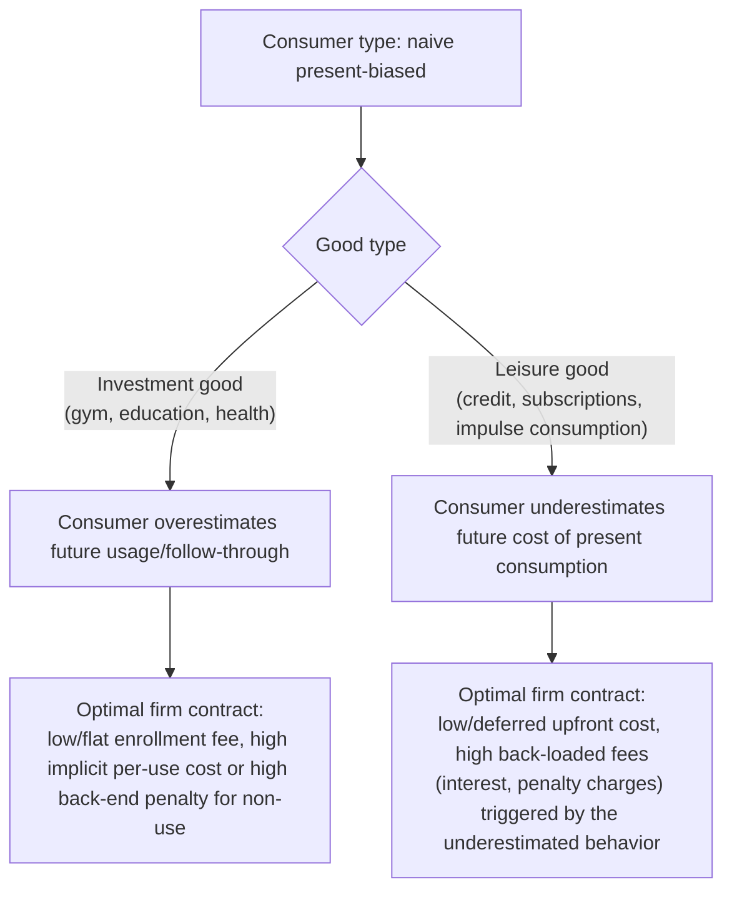

## Contract Design and the Exploitation of Present-Biased Consumers

### Definitions and Scope

This topic examines the theoretical and empirical literature on how firms design contract *structure* — not merely price level — to extract surplus specifically from consumers exhibiting present bias or naive beliefs about their own future self-control, as distinct from standard price discrimination based on heterogeneous valuations. The seminal formalization is DellaVigna & Malmendier (2004), "Contract Design and Self-Control: Theory and Evidence," which models profit-maximizing firms selling to a population containing both time-consistent and present-biased (naive and/or sophisticated) consumers, showing that optimal contract design differs systematically depending on whether the good is an "investment good" or a "leisure good."

### Formal Framework: Investment Goods vs. Leisure Goods

The DellaVigna-Malmendier framework classifies goods by the temporal structure of costs and benefits:

- **Investment goods**: immediate cost, delayed benefit (e.g., gym membership — pay now, health benefit accrues over time with effort).
- **Leisure goods**: immediate benefit, delayed cost (e.g., credit card borrowing — consumption benefit now, repayment cost later).

For **naive present-biased consumers**, the model predicts opposite contract distortions depending on good type:

$$\text{Investment goods: firms overprice the marginal unit, underprice (or subsidize) enrollment}$$

$$\text{Leisure goods: firms underprice the marginal unit, overprice/backload total cost}$$

The intuition: a naive consumer overestimates their own future usage of an investment good (believing their future self will follow through on exercise, reading, etc.) and underestimates their own future consumption of a leisure good's *cost side* (believing their future self will repay debt promptly or use a service in true moderation). Firms exploit each miscalibration in the direction that maximizes profit extraction from the naive consumer's mistaken self-forecast.

### Contract Distortion Diagram

### The Classic Empirical Case: Health Club Contract Choice

**Example**

DellaVigna & Malmendier (2004, 2006) analyze health club membership contract data and document a puzzle inconsistent with rational, time-consistent usage forecasting:

- Members who chose a **flat monthly fee** contract, when their actual attendance was tracked, on average paid a substantially higher **implied per-visit cost** than the pay-per-visit price the same club also offered — meaning many monthly-fee members would have saved money simply by paying per visit, given their realized (low) attendance.
- This pattern is inconsistent with a rational, correctly-forecasting time-consistent consumer, who would select the cheaper contract given accurate anticipation of their own usage, but is consistent with a **naive present-biased consumer** who, at the time of contract choice, overestimates how often their future self will actually attend — precisely the "overestimate future investment-good usage" prediction of the model.
- A further documented pattern: attrition/cancellation of monthly contracts frequently occurred with a substantial delay after the member had effectively stopped attending, consistent with present-biased procrastination in canceling (a "leisure-good"-like cost of the cancellation task itself layered atop the primary investment-good contract) rather than prompt rational contract termination upon realizing low usage value.

### Contract Design Patterns Consistent With the Framework

**Key Points**

- **Backloaded penalty fees on credit products**: late fees, over-limit fees, and penalty interest rates concentrated on the "leisure good" side (immediate borrowing/spending gratification, delayed and often underestimated repayment cost) are consistent with the model's prediction of low apparent upfront cost (attractive low advertised APR or fee) combined with high contingent back-end charges triggered specifically by the behavior naive consumers underestimate they will exhibit (carrying a balance, missing a payment date).
- **Teaser rates and rate resets**: introductory low interest rates that later reset to a substantially higher rate exploit both present bias (the immediate low cost is salient at signup) and naive underestimation of the consumer's own future propensity to still be paying down the balance when the reset occurs.
- **Flat-fee "all-you-can-use" contracts for investment goods**: beyond gym memberships, subscription services for education platforms, unused software licenses, and similar "improve yourself" services show analogous patterns in some studies — consumers systematically overestimating future engagement at the point of purchase.
- **Sophisticated consumers and commitment demand**: the model also predicts that *sophisticated* present-biased consumers, who correctly anticipate their own limited follow-through, may **rationally choose** a flat-fee investment-good contract specifically *as a commitment device* — accepting a higher expected total cost in exchange for the fee functioning as an incentive to actually attend (a "sunk cost" motivational effect) — meaning not all instances of the "expensive flat-fee choice" pattern are necessarily evidence of naivety; some may reflect rational self-aware commitment demand. Distinguishing these two consumer types empirically requires additional identifying variation beyond contract choice alone. [Inference]

### Welfare Implications and the Naive/Sophisticated Distinction

The welfare analysis differs sharply depending on which consumer type is exploited:

| Consumer Type | Contract Response | Welfare Effect of Firm's Optimal Contract Design |
| --- | --- | --- |
| Time-consistent, fully rational | Selects contract matching true expected usage | Standard competitive outcome; no exploitation channel |
| Sophisticated present-biased | Rationally selects contract as self-aware commitment device | Contract can be welfare-improving relative to no-commitment alternative, despite higher expected monetary cost |
| Naive present-biased | Systematically mis-forecasts own future behavior; selects contract based on incorrect self-prediction | Contract design that exploits this misprediction is generally welfare-reducing for this consumer type, even though voluntarily chosen |

This three-way distinction is central to the policy debate around such contracts: a contract structure that is efficient and welfare-improving for sophisticated self-aware consumers can be simultaneously exploitative and welfare-reducing for naive consumers *purchasing the identical contract*, meaning uniform regulatory bans risk removing a genuinely valuable commitment tool for one population to protect another. [Inference: the relative population share of naive versus sophisticated present-biased consumers in any specific market is generally not directly observable and is a key unresolved empirical input for calibrating optimal policy in this literature.]

### Empirical Evidence Beyond the Gym Membership Study

- **Credit card contract studies**: research examining credit card take-up and usage patterns has found consumer responsiveness to salient short-run introductory terms (teaser rates, low minimum payments) disproportionate to the long-run effective cost implied by contract fine print, consistent with the present-bias/naivety-exploitation framework applied to a leisure-good-type product.
- **Cell phone and service-plan contract studies**: analyses of mobile-phone plan choice have documented patterns where a meaningful share of consumers select plans with monthly allowances exceeding their realized usage, again consistent with a usage-overestimation account structurally similar to the gym-membership pattern, though applied to a good with more mixed investment/leisure characteristics. [Unverified as a fully generalizable claim: the specific magnitude and consistency of this finding across different telecom markets and time periods is not established by a single definitive study.]
- **Payday lending and small-dollar credit studies**: the broader payday-lending literature (not exclusively part of the DellaVigna-Malmendier framework but closely related) documents repeat-borrowing and rollover patterns consistent with underestimated future repayment difficulty, a leisure-good-side exploitation pattern with substantial associated regulatory attention (state-level rate caps, cooling-off period requirements) in several jurisdictions.

### Policy and Regulatory Implications

**Next Steps**

- **Disclosure-based remedies** (mandatory clear disclosure of total effective cost, e.g., APR disclosure requirements, "cost per actual use" projections) target the naive-consumer misprediction channel directly without banning the underlying contract structure, preserving the commitment-device value for sophisticated consumers who might rationally choose the same structure.
- **Cooling-off periods and default-based interventions**: mandatory waiting periods or opt-in (rather than opt-out) requirements for high-risk contract features (e.g., overdraft "protection" enrollment) can reduce naive-consumer exploitation while imposing minimal cost on already-sophisticated consumers who can still actively choose the feature if genuinely wanted.
- **Usage-based nudges**: some firms and regulators have explored providing consumers with periodic usage-versus-cost feedback (e.g., "you used this membership X times this month, costing you $Y per visit") as a lower-paternalism alternative to contract-structure regulation, directly correcting the misprediction rather than restricting contract choice. [Inference: the comparative effectiveness of usage-feedback nudges relative to structural contract regulation is an active area of ongoing research rather than a settled empirical conclusion.]
- Any policy intervention in this space faces the core tension identified above: interventions strong enough to protect naive consumers from exploitative contract structures may simultaneously restrict a valuable, welfare-improving commitment mechanism for sophisticated consumers in the same market.

### Related Topics

- Poverty Traps and Present Bias (formal β-δ modeling; naive vs. sophisticated distinction)
- Shrouded Attributes and Add-On Pricing (companion mechanism: backloaded/contingent fee structures)
- Subscription Design and Automatic Renewal (companion contract-structure mechanism)
- Commitment devices and self-control demand (Ashraf, Karlan & Yin savings evidence, companion chapter)
- DellaVigna & Malmendier (2004, 2006): theory and health club evidence
- Payday lending regulation and small-dollar credit market design
- Behavioral welfare economics: measuring consumer surplus under naive versus sophisticated beliefs
- Credit card and consumer debt contract design regulation