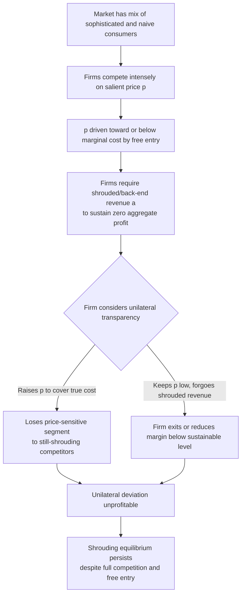

## Firm Competition and Consumer Biases in Equilibrium

### Definitions and Scope

This topic synthesizes the equilibrium-theoretic question running beneath every mechanism covered elsewhere in this chapter: **does competition among firms eliminate the exploitation of consumer biases, or can biased-consumer-exploiting practices survive, and even be required for survival, in a fully competitive, free-entry market?** Standard IO intuition holds that competition drives price toward marginal cost and competes away any pricing structure harmful to consumers, since a firm offering a fairer deal should attract the exploited consumers and gain share. The behavioral IO literature shows this intuition frequently fails once consumer heterogeneity in sophistication is introduced, and characterizes the specific conditions under which biased-consumer exploitation is, or is not, competed away.

### Formal Framework: The General Structure of Behavioral IO Equilibrium Models

Most models in this literature (building on Gabaix & Laibson, 2006, covered in the shrouded-attributes topic, and generalized in surveys such as Heidhues & Kőszegi, 2018, and Grubb, 2015) share a common structure:

1. A market with **heterogeneous consumer sophistication** — a mix of fully rational/sophisticated consumers and biased/naive consumers (present-biased, inattentive, or holding incorrect beliefs about their own future behavior).
2. **Free entry and price competition** among firms, driving *aggregate* expected profit to zero.
3. A firm-level pricing/contract-design instrument (a shrouded fee, a teaser rate, a backloaded penalty) that extracts disproportionate surplus from naive consumers specifically.

The central theoretical result across this model family: **zero aggregate profit under free entry does not imply zero exploitation of naive consumers** — it implies only that competition for the *marginal, price-sensitive* consumer (often the sophisticated type, or the type most attentive to the salient headline price) drives the *salient* price down, potentially below cost, financed by cross-subsidization from the *non-salient* charges paid disproportionately by naive consumers.

$$\pi_{\text{total}} = \underbrace{(p - c_p)}_{\text{salient margin, driven toward/below zero by competition}} + \underbrace{\phi \cdot (a - c_a)}_{\text{shrouded margin, } \phi = \text{share paying } a} = 0 \text{ (free entry)}$$

Competition equalizes $\pi_{\text{total}}$ across firms to zero, but this constraint is satisfied by firms competing intensely on $p$ while leaving $a$ largely uncompeted — because unshrouding $a$ to compete on it would require simultaneously raising the salient $p$, which loses the price-sensitive segment (see the unshrouding-unprofitability argument in the companion shrouded-attributes topic).

### Why Unilateral "Fair Dealing" Fails to Break the Equilibrium

**Key Points**

- **Adverse selection into the "fair" firm**: a firm that unilaterally commits to transparent, no-shrouded-fee pricing disproportionately attracts *sophisticated* consumers who were already avoiding the shrouded fee at competitor firms — meaning the fair firm gains little net-new naive-consumer revenue while losing the cross-subsidization structure that let it compete on the salient price, typically forcing it to raise the salient price above shrouding competitors and lose share among price-sensitive (often naive) consumers.
- **Naive consumers do not select firms based on unshrouded information**: since naive consumers by construction under-attend to or misforecast the shrouded attribute, providing full transparency does not by itself redirect their demand toward the fair firm — the informational intervention that would make competition work (full attention/correct forecasting) is precisely the trait the naive consumer lacks, so the "competitive discipline" mechanism that ordinarily punishes bad deals is disabled specifically for this consumer segment.
- **Static, cross-sectional competition intensity does not guarantee "de-biasing"**: entry of additional competing firms in these models generally drives the salient price further toward or below cost, which can, perversely, *increase* reliance on shrouded/back-end revenue to remain viable — meaning more competition can, in some model specifications, worsen rather than improve the naive-consumer outcome. [Inference: this comparative-static result is a feature of specific model specifications and does not universally hold across all parameterizations or all real-world markets; it should be read as an important theoretical possibility rather than a universal empirical law.]

### Equilibrium Persistence Diagram

### Conditions Under Which Competition DOES Erode Bias Exploitation

The literature also identifies boundary conditions under which the pessimistic result above breaks down, which are important for a balanced treatment:

- **Sufficiently high share of sophisticated consumers**: if sophisticated consumers make up a large enough share of demand, some model specifications show firms are better off competing on full transparency to capture that majority segment, reversing the equilibrium toward disclosure. The threshold share required is model-specific and not a single universal constant. [Inference]
- **Effective third-party information intermediaries**: comparison-shopping platforms, financial advisors, or consumer-advocacy ratings that aggregate and salience-correct the shrouded attribute on behalf of naive consumers can functionally convert them into "sophisticated" decision-makers for the purposes of the model, restoring competitive discipline — this is a primary theoretical justification for policies supporting price-comparison infrastructure and mandatory standardized disclosure formats (e.g., standardized APR disclosure enabling third-party comparison).
- **Regulatory mandates removing the shrouding instrument entirely**: if regulation mandates all-in pricing or caps the shrouded fee directly (rather than merely requiring disclosure), the shrouding margin is mechanically eliminated regardless of consumer sophistication mix, shifting competition entirely onto the now-unshroudable total price. This is a blunter instrument than disclosure-based remedies but sidesteps the naive-consumer-inattention problem that limits disclosure's effectiveness.
- **Reputation and repeated interaction**: in markets with strong repeat-purchase dynamics and low search costs for switching, even naive consumers may eventually learn from realized bad outcomes (a burned-once effect) and exit the shrouding firm, though this learning-based correction is generally slower and less complete than a fully rational ex ante avoidance would be, and does not help first-time or infrequent purchasers. [Inference: the speed and completeness of experience-based learning varies substantially by product purchase frequency and salience of the realized cost, and is not uniformly established across product categories.]

### Empirical Evidence on Competition and Bias Exploitation

**Example**

- **Credit card market studies**: research examining the credit card industry — a market with intense marketing competition on headline terms (rewards, introductory 0% APR) alongside persistent penalty-fee and interest-rate revenue — has been widely cited as consistent with the theoretical prediction that even highly competitive, low-concentration markets can sustain naive-consumer-exploiting contract structures indefinitely, rather than competition eroding them over time.
- **Mortgage market shrouded-fee studies**: studies of mortgage broker fee structures (a market with documented significant fee variation for otherwise identical loan products) have found fee dispersion correlated with borrower sophistication/search intensity proxies, consistent with a shrouded-margin cross-subsidization pattern rather than fees reflecting genuine cost differences.
- **Effect of disclosure/comparison-tool interventions**: studies evaluating the introduction of standardized comparison tools or simplified disclosure formats (e.g., in retail banking fee disclosure, energy-tariff comparison sites in several countries) have generally found measurable but partial improvements in consumer switching and reduced average fee payment following the intervention — consistent with the "sophistication-restoring" role of information intermediaries, though rarely finding complete elimination of the underlying fee dispersion. [Unverified as a precise quantitative claim across all cited contexts: effect magnitudes are intervention- and market-specific.]

### Distinguishing Market Structures by Bias-Exploitation Persistence

| Market Feature | Effect on Bias-Exploitation Persistence |
| --- | --- |
| High naive-consumer share | Persists strongly; little competitive pressure toward transparency |
| Effective comparison-shopping intermediaries present | Erodes toward transparency; intermediaries functionally "sophisticate" naive consumers |
| Direct regulatory price/fee caps on the shrouded margin | Eliminated mechanically, independent of consumer sophistication mix |
| High firm concentration / limited entry | Ambiguous in theory; concentrated markets can sustain exploitation via market power directly, independent of the shrouding mechanism, complicating attribution to shrouding specifically |
| High-frequency repeat purchase with salient realized cost | Partial erosion via consumer learning, but typically slower/less complete than full ex ante avoidance |

### Broader Theoretical and Policy Significance

**Next Steps**

- This equilibrium result is the theoretical backbone justifying **behaviorally-informed regulation as a complement to, rather than a substitute for, competition policy**: standard antitrust/competition-promotion tools (increasing firm count, lowering entry barriers) do not reliably resolve bias-exploitation problems of this type, and in some model specifications can worsen them — implying disclosure mandates, information-intermediary support, and direct fee regulation occupy a distinct and non-redundant policy role alongside conventional competition enforcement.
- A key open research and policy question is empirically **measuring the naive/sophisticated consumer share** in specific real-world markets, since this parameter is the primary determinant of whether competition alone will erode a given exploitative practice or whether direct intervention is required — and it is generally not directly observable, requiring indirect inference from behavioral/choice data. [Inference]
- This topic functions as the theoretical capstone connecting the anchoring, shrouding, scarcity, social-proof, decoy, subscription, and present-bias-contract mechanisms covered elsewhere in the chapter: each is a specific instantiation of a firm-level instrument that can, under the conditions outlined here, survive — or even be sustained *by* — vigorous price competition rather than being eliminated by it.

### Related Topics

- Shrouded Attributes and Add-On Pricing (foundational Gabaix-Laibson model underlying this topic)
- Contract Design and the Exploitation of Present-Biased Consumers (firm-level instrument analyzed here at the market-equilibrium level)
- Pricing Psychology and Anchored Price Perception (salient-price competition mechanism)
- Subscription Design and Automatic Renewal (applied instance of shrouded/back-loaded margin competition)
- Search costs and price dispersion in industrial organization
- Information intermediaries and comparison-shopping platform design
- Behavioral welfare economics: aggregate welfare measurement under mixed consumer sophistication
- Consumer protection regulation as a complement to competition policy