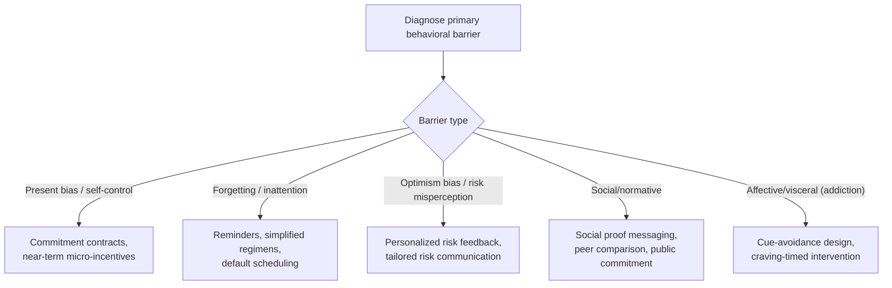

## Behavioral Interventions in Health Behavior Change

### Definitions and Scope

This topic examines the design and evidence base for interventions applying behavioral economics principles — present bias, defaults, framing, social proof, commitment — to shift health-relevant behaviors (medication adherence, vaccination, physical activity, smoking cessation, diet) at the individual level. It differs from the earlier development-economics health topic (underinvestment in health/education in low-income settings) in emphasis: this material centers on the broader intervention toolkit and evidence base applicable across income settings, including high-income health systems, rather than specifically on poverty-context underinvestment mechanisms.

### Core Behavioral Mechanisms Underlying Health Behavior Gaps

**Key Points**

- **Present bias**: health behaviors overwhelmingly have the "investment good" temporal structure (immediate cost/effort, delayed and probabilistic benefit) — exercise, medication adherence, and preventive screening all impose a salient near-term cost for a diffuse, uncertain, future-dated benefit, making this the single most cited mechanism in the health-behavior-change literature.
- **Projection bias**: patients in a currently asymptomatic or pain-free state systematically underestimate their likelihood of future symptom recurrence or complication, reducing adherence to preventive regimens (e.g., discontinuing medication once symptoms resolve, despite medical guidance to complete a full course).
- **Optimism bias**: a well-documented tendency for individuals to rate their own personal risk of negative health events (heart disease, addiction-related harms) as below the population average, undermining the perceived personal relevance of preventive messaging even when population-level risk information is accurately communicated.
- **Limited attention and forgetting**: many adherence failures (missed medication doses, missed follow-up appointments) reflect simple inattention/forgetting rather than a deliberate cost-benefit tradeoff, making reminder-based interventions a distinct and often more cost-effective remedy than incentive-based ones for this specific failure mode.
- **Affective/visceral factors**: cravings, pain, and acute affective states (central to models of addiction such as Loewenstein's visceral-factors framework and Bernheim & Rangel's cue-triggered mistake model) can cause behavior sharply inconsistent with an individual's own stated long-run preferences, a mechanism distinct from pure exponential or hyperbolic discounting.

### Formal Framework: Health Investment Under Present Bias

Extending the quasi-hyperbolic framework from the poverty-traps topic to a health-specific investment decision, let $e_t$ be health-protective effort (adherence, exercise) with immediate cost $c(e_t)$ and delayed health stock benefit $h_{t+k}$:

$$U_t = -c(e_t) + \beta\delta \cdot E[h_{t+1}(e_t)] + \beta\delta^2 \cdot E[h_{t+2}(e_t)] + \ldots$$

Because $\beta < 1$ discounts *all* future health returns relative to the immediate cost $c(e_t)$, present-biased individuals systematically underinvest in $e_t$ relative to their own long-run-preferred (i.e., $\beta=1$-evaluated) level — and, critically, a **naive** present-biased patient will repeatedly form an intention to "start tomorrow" without ever revising their belief that future adherence will be high, generating a documented gap between stated intention and realized behavior that is a primary diagnostic signature used to identify this mechanism in survey and field data.

### Intervention-to-Mechanism Mapping Diagram

### Major Intervention Categories with Evidence

**Example**

- **Commitment contracts for weight loss and smoking cessation**: field studies (e.g., Gine, Karlan & Zinman, 2010, on smoking cessation commitment savings accounts in the Philippines, "CARES") find that offering a voluntary commitment device — a savings account forfeited to charity or lost entirely upon failing a biochemically verified smoking-cessation test — produced quit rates meaningfully higher than a control group offered no such device, with take-up concentrated among individuals plausibly self-aware of their own self-control limitations (consistent with the sophisticated-naive distinction from the contract-design topic).
- **Micro-incentives for medication adherence and preventive screening**: small, near-term financial or non-financial incentives (lottery-based incentives, small guaranteed payments) tied to a specific adherence behavior (directly observed therapy for tuberculosis, HIV medication adherence, vaccination) have shown positive effects on completion rates in multiple RCTs, consistent with a present-bias-correcting mechanism — a small *immediate* reward counteracts the temporal asymmetry between the salient immediate cost and the diffuse future health benefit.
- **Reminder systems (SMS, app-based, pillbox alarms)**: numerous RCTs of SMS medication reminders across chronic disease contexts (HIV antiretroviral therapy, hypertension medication) find modest but consistently positive adherence effects, with effect sizes generally smaller than incentive-based interventions but at substantially lower marginal cost, making reminders a frequently favored first-line, scalable intervention. [Inference: relative cost-effectiveness rankings across specific reminder versus incentive interventions vary by disease context, population, and baseline adherence rate, and are not captured by a single universal ranking.]
- **Default-based interventions in clinical settings**: changing a default order (e.g., defaulting generic drug prescription, defaulting influenza vaccination scheduling into a routine visit rather than requiring separate scheduling) has shown substantial effects on uptake in health-system-level studies, consistent with the broader default-effect literature applied to a clinical workflow context rather than a direct patient-facing choice.
- **Loss-framed versus gain-framed health messaging**: some studies find loss-framed messaging (emphasizing what one stands to lose by not engaging in a health behavior) more effective for detection-oriented behaviors (screening, testing) while gain-framed messaging performs comparably or better for prevention-oriented behaviors (sunscreen use, vaccination) — a framing-by-behavior-type interaction sometimes referred to via prospect-theory-informed health communication models (Rothman & Salovey, 1997). [Unverified as a fully general claim: subsequent replications of the specific detection/prevention framing interaction have produced mixed results, and the effect should be treated as an area of ongoing empirical refinement rather than a settled rule.]

### The MINDSPACE / Behavioral Insights Framework Applied to Health

A widely used applied checklist in public-health behavioral-insights practice (Dolan et al., 2010, developed for UK government policy application) organizes intervention levers as:

| Lever | Health Application Example |
| --- | --- |
| **M**essenger | Health information delivered by a trusted local figure (community health worker) rather than an anonymous authority |
| **I**ncentives | Micro-incentives for screening/vaccination completion |
| **N**orms | "Most people in your area have had this vaccine" messaging |
| **D**efaults | Default scheduling of follow-up appointments; default opt-out organ donation registration |
| **S**alience | Making the specific, personalized risk figure salient rather than an abstract population statistic |
| **P**riming | Environmental cues (e.g., placement of healthy food options) shaping subconscious behavior |
| **A**ffect | Emotionally resonant messaging calibrated to the target behavior (fear appeals for detection, hope-based appeals for prevention) |
| **C**ommitments | Public or financial commitment devices for behavior-change goals |
| **E**go | Framing consistent with the individual's self-image ("people like you take care of their health") |

### Empirical Evidence: Organ Donation Defaults

One of the most frequently cited default-effect case studies in health policy: cross-country comparisons of **opt-in versus opt-out (presumed consent)** organ donation registration systems find substantially higher registered-donor rates in opt-out countries relative to otherwise-comparable opt-in countries, a pattern widely interpreted as a canonical default-effect demonstration in the health domain. [Inference: the extent to which observed cross-country differences reflect the default mechanism specifically, versus other confounding institutional and cultural factors correlated with opt-out policy adoption, has been debated in subsequent methodological critiques, and within-country policy-change studies (rather than only cross-country comparisons) provide comparatively stronger causal identification.]

### Limitations and Critiques

- **Effect persistence and habituation**: many behavioral health interventions, particularly incentive-based ones, show effect sizes that diminish substantially or vanish after the incentive is withdrawn, raising questions about whether such interventions build durable habit change or merely purchase temporary compliance — a concern sometimes framed via crowding-out theories of motivation (extrinsic incentives displacing intrinsic motivation), though the empirical support for motivational crowd-out specifically in health-adherence contexts is mixed across studies. [Unverified as a general claim]
- **Heterogeneous treatment effects**: interventions effective on average frequently show substantial heterogeneity by baseline characteristics (health literacy, socioeconomic status, existing habit strength), meaning a scaled population-level rollout of an intervention validated in a specific trial population may not replicate the same average effect size in a different population. [Inference]
- **Ethical considerations in nudge-based health policy**: debates persist regarding the appropriate boundary between legitimate choice-architecture assistance and paternalistic manipulation in health contexts, particularly for default-based interventions affecting consequential decisions (organ donation, end-of-life care preferences) where the "correct" default is itself contested rather than a neutral technical choice.

### Related Topics

- Poverty Traps and Present Bias (foundational β-δ framework applied here to health-specific investment)
- Behavioral Explanations for Underinvestment in Health and Education (parallel mechanisms in development-economics context)
- Contract Design and the Exploitation of Present-Biased Consumers (commitment-device theory applied here to health behavior rather than firm profit extraction)
- MINDSPACE framework and applied behavioral insights in public policy
- Default effects and organ donation policy design
- Motivational crowding-out theory and intrinsic versus extrinsic incentives
- Addiction models: visceral factors and cue-triggered decision-making (Loewenstein; Bernheim & Rangel)
- Field Experiments in Developing Economies (methodological basis for much cited RCT evidence)