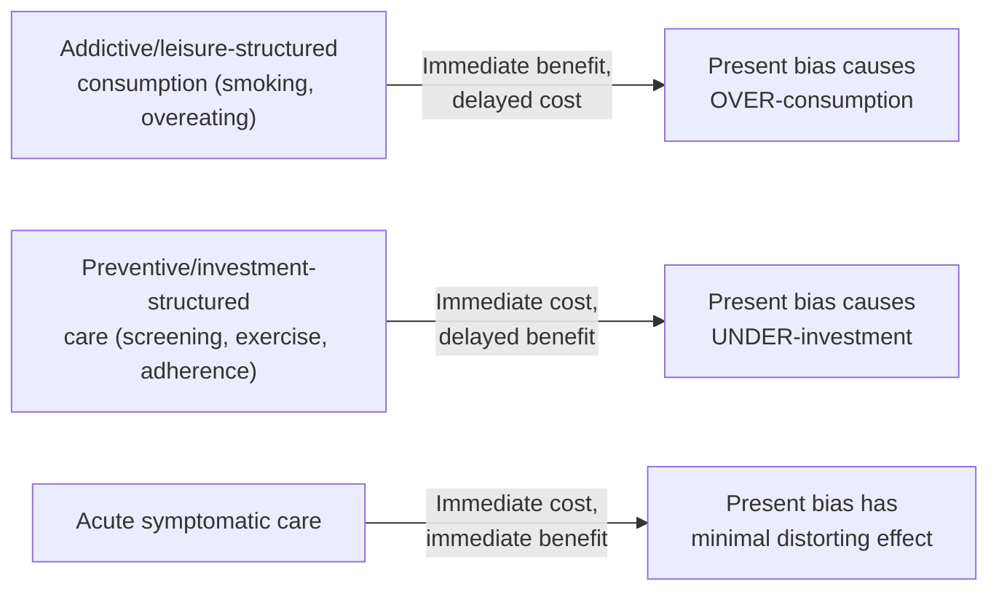

## Present Bias and Health Decision-Making

### Definitions and Scope

This topic provides the focused theoretical deep-dive on present bias as it specifically applies to health decisions, distinguished from the companion "Behavioral Interventions in Health Behavior Change" topic by emphasis: that topic surveys the broad intervention toolkit and applied evidence base across many mechanisms, while this topic concentrates on the formal decision-theoretic structure of present-biased health choice itself — modeling health as a depreciating capital stock, characterizing the specific health domains most vulnerable to temporal discounting distortions, and examining the clinical and welfare implications of naive versus sophisticated present bias in medical decision-making specifically.

### The Health Capital Framework Under Present Bias

Building on Grossman's (1972) health capital model — health as a durable capital stock that depreciates over time and can be augmented through investment (medical care, exercise, diet) — introducing quasi-hyperbolic discounting yields:

$$H_{t+1} = (1-\delta_H) H_t + I(e_t)$$

$$U_t = u(c_t, H_t) + \beta \sum_{k=1}^{\infty} \delta^k \left[u(c_{t+k}, H_{t+k})\right]$$

where $H_t$ is the health stock, $\delta_H$ is the biological depreciation rate, and $I(e_t)$ is health investment as a function of health-protective effort $e_t$. Because the health-investment cost $c(e_t)$ is borne in period $t$ (undiscounted) while the marginal health-stock benefit accrues across all future periods $t+1, t+2, \ldots$ (each discounted by the extra factor $\beta$), the wedge between the present-biased and time-consistent optimal investment level is:

$$e_t^{\beta<1} < e_t^{\beta=1} \quad \text{for any investment good structure}$$

This formalizes why health economists treat present bias as a distinct, quantifiable wedge from the "correct" (long-run-self-endorsed) investment level, rather than merely a qualitative tendency — the $\beta$ parameter can, in principle, be structurally estimated from choice data and used to calculate the monetized welfare loss from underinvestment.

### Domain-Specific Vulnerability to Present Bias

**Key Points**

- **Acute, symptomatic conditions**: present bias plays a comparatively minor role in decision distortion, because the cost (symptom relief) and benefit (symptom relief) are both immediate and salient — the good does not have the deferred-benefit structure present bias penalizes.
- **Preventive and asymptomatic-phase care** (vaccination, cancer screening, blood pressure medication when asymptomatic, dental checkups): maximal vulnerability, since cost is immediate/salient (time, discomfort, co-pay) and benefit is probabilistic, diffuse, and realized — if at all — only in a possibly distant future state.
- **Chronic disease management requiring sustained daily effort** (diabetes self-management, long-term medication adherence): particularly vulnerable to a compounding present-bias problem, since *each day's* adherence decision independently faces the same immediate-cost/deferred-benefit structure, meaning a single moment of present-biased "just this once" reasoning, repeated daily, can produce large cumulative health stock depreciation despite the patient's stated long-run intention to adhere fully.
- **End-of-life and long-horizon planning decisions** (advance directives, retirement healthcare planning): present bias here often manifests as pure *procrastination* — deferring a low-frequency, high-cognitive-effort decision indefinitely — a related but distinct manifestation from the recurring daily-adherence problem above, closer to the general procrastination literature (Akerlof, 1991; O'Donoghue & Rabin, 1999) than to the repeated-investment framing.
- **Addictive consumption** (smoking, substance use, unhealthy dietary patterns with compulsive features): here present bias combines with the "leisure good" structure (immediate consumption benefit, delayed and probabilistic health cost) rather than the investment-good structure governing prevention, meaning the *same* present-bias parameter $\beta$ produces *opposite* behavioral distortions — over-consumption of harmful leisure-structured goods and under-consumption of beneficial investment-structured goods — a distinction directly parallel to the DellaVigna-Malmendier investment/leisure good framework covered in the companion contract-design topic.

### Present Bias Across the Health Decision Spectrum

### Naive vs. Sophisticated Present Bias in Clinical Decision-Making

**Example**

The naive/sophisticated distinction (from the foundational β-δ framework) has specific clinical manifestations:

- **Naive patients**: repeatedly form and report genuine intention to adhere/quit/exercise starting "tomorrow" or "after this event," without revising their self-forecast despite a documented personal history of similar unfulfilled intentions — a pattern that has motivated some clinicians and behavioral-health researchers to treat *stated future intention* as an unreliable predictor of realized future behavior for present-biased patients, and to favor structuring care around immediate, low-friction defaults rather than relying on patient willpower alone.
- **Sophisticated patients**: correctly anticipate their own future self-control limitations and proactively request commitment mechanisms — e.g., requesting a clinician-imposed structured tapering schedule for medication discontinuation rather than trusting themselves to self-discontinue gradually, or voluntarily enrolling in automatic prescription refill/reminder systems specifically because they distrust their own future follow-through.
- **Clinical implication**: this distinction argues for **default-based and automated adherence infrastructure** (auto-refill, integrated reminder systems, pre-scheduled follow-up appointments set at the point of the initial visit rather than requiring active future patient-initiated scheduling) as a robust intervention strategy that helps both naive patients (who would not otherwise self-correct) and sophisticated patients (who actively want such structure), without requiring the clinician to first correctly diagnose which type a given patient is. [Inference: this design principle is a reasonable implication of the theoretical framework rather than itself a directly and separately validated empirical claim distinct from the broader default-effects evidence already covered in the companion topic.]

### Quantifying the Welfare Cost of Present-Biased Health Decisions

A structural approach to measuring the health-specific welfare loss from present bias involves comparing realized behavior against the counterfactual behavior implied by the same individual's **long-run ($\beta=1$) preferences**, typically inferred from either (a) the individual's own stated values when explicitly asked to evaluate the tradeoff from a "long-run self" perspective, or (b) the revealed behavior of otherwise-similar individuals who have structurally committed (e.g., via a binding advance directive or commitment contract) to a specific health trajectory. The welfare loss is then:

$$WL = \delta \cdot \left[u(c^{*}, H^{*}) - u(c^{\beta}, H^{\beta})\right]$$

where $c^*, H^*$ reflect the time-consistent optimal path and $c^\beta, H^\beta$ reflect the realized present-biased path. [Unverified as a precisely estimated empirical quantity: structural estimation of $\beta$ and the associated welfare loss for specific health behaviors varies substantially across studies in both methodology and resulting magnitude, and no single canonical estimate applies across all health domains; treat cited $\beta$ estimates in the applied literature as context-specific rather than universal parameters.]

### Distinguishing Present Bias from Alternative Explanations of Poor Health Decisions

| Alternative Explanation | Distinguishing Feature from Present Bias |
| --- | --- |
| Rational risk aversion given genuine uncertainty | Behavior should be consistent with a fixed, time-consistent discount rate applied evenly to near and distant tradeoffs |
| Credit/liquidity constraints (cannot afford care) | Removing the price barrier alone should fully resolve underinvestment; present bias predicts persistent underinvestment even at zero price |
| Correct information but genuinely low perceived benefit | Providing accurate risk/benefit information alone should resolve the gap; present bias predicts persistent gap even after correct information is provided |
| True present bias | Diagnostic signature: repeated stated intention to change behavior "starting soon" without revision despite repeated past non-fulfillment; responsiveness to small immediate incentives disproportionate to their monetized value; demand for self-imposed commitment devices among a subset of the same population |

### Clinical and Policy Design Implications

**Next Steps**

- **Timing of intervention delivery matters as much as content**: present-bias theory implies that delivering a preventive-care recommendation or decision point at a moment when the required action can be completed *immediately* (same-visit vaccination rather than a referral requiring a separate future visit) should outperform an identical recommendation requiring a future separate action, independent of any change in the information content of the recommendation itself.
- **Default scheduling over active scheduling** for any recurring or follow-up care, minimizing the number of discrete future decision points at which present bias can cause deferral or abandonment.
- **Caution in relying on patient self-report of future intention** as a proxy for likely future behavior, particularly for naive present-biased patients, suggesting greater clinical and research value in behavioral/revealed-preference measures (e.g., actual past adherence patterns, responsiveness to small immediate incentives) over stated-intention measures alone. [Inference: this is a reasonable implication drawn from the naive-present-bias framework rather than a directly and separately validated clinical practice guideline.]

### Related Topics

- Poverty Traps and Present Bias (foundational β-δ model and sophistication/naivety framework)
- Behavioral Interventions in Health Behavior Change (companion topic: applied intervention toolkit and broader evidence base)
- Contract Design and the Exploitation of Present-Biased Consumers (parallel investment-good/leisure-good framework)
- Grossman health capital model and health as a depreciating asset
- Addiction models: visceral factors and cue-triggered decision-making (Loewenstein; Bernheim & Rangel)
- Procrastination models in economics (Akerlof, 1991; O'Donoghue & Rabin, 1999)
- Structural estimation of time-preference parameters from field and experimental data
- Advance directives and long-horizon health planning under present bias