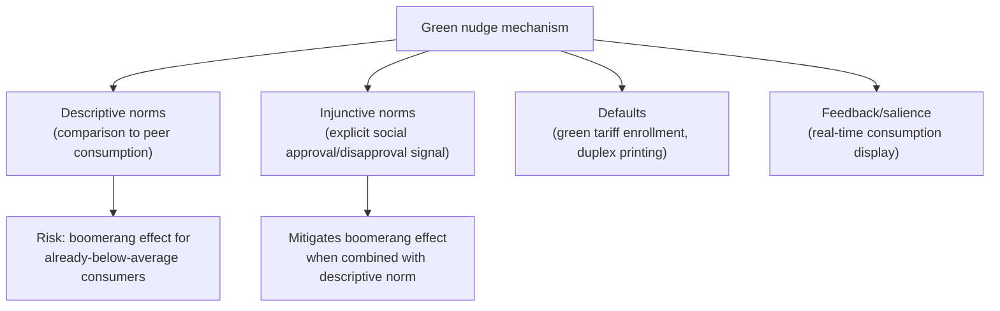

## Green Nudges and Pro-Environmental Behavior

### Definitions and Scope

**Green nudges**: choice-architecture interventions — defaults, framing, social comparison, feedback — applied to shift environmentally-relevant behavior (energy consumption, recycling, sustainable transportation, water use) toward lower-impact outcomes, without restricting the underlying choice set or altering economic incentives (Thaler & Sunstein's "libertarian paternalism" applied to the environmental domain). This is distinguished from traditional environmental economic policy tools (Pigouvian carbon taxes, cap-and-trade, command-and-control regulation) by operating through psychological rather than price or quantity mechanisms, and is often proposed as either a complement to or a lower-cost substitute for those traditional instruments.

### Theoretical Rationale: Why Environmental Behavior Is Especially Nudge-Susceptible

**Key Points**

- **Public goods/externality structure compounds present bias**: environmental behavior change imposes a private cost (effort, convenience loss, sometimes money) for a benefit that is both temporally distant *and* diffused across a global or intergenerational public good, meaning the private returns to individual pro-environmental effort are vanishingly small relative to the collective benefit — an intertemporal-plus-collective-action double bind not present in most other nudge domains covered elsewhere in this material.
- **Low salience of energy/resource consumption**: unlike a purchase price, ongoing utility consumption (electricity, water, gas) is rarely observed in real time by the consumer at the moment of use, making consumption feedback interventions unusually high-value relative to their low cost, since they address a pure information/salience gap rather than requiring any change in underlying preferences.
- **Strong susceptibility to social-norm mechanisms**: environmental behavior is heavily socially observable or sanctionable in many communities (visible recycling bins, visible solar panels, visible lawn-watering), making the conditional-cooperation and descriptive-norm mechanisms covered in the companion "Social Norms and Collective Action" topic unusually powerful and well-documented specifically in this domain.
- **Default-heavy institutional structure**: many environmentally-relevant decisions (utility provider selection, printer settings, employer retirement-fund environmental screening options) already involve an institutionally-set default, making default-switching an unusually low-cost, high-leverage intervention relative to domains where no natural default exists to modify.

### The Canonical Case: OPOWER Home Energy Reports

**Example**

The most extensively studied and widely cited green nudge in the empirical literature is the **home energy report (HER)** intervention pioneered commercially by OPOWER (and studied extensively by Hunt Allcott and coauthors):

- **Mechanism**: households receive a periodic report comparing their own energy consumption to that of similar, anonymized neighboring households (a social-comparison/descriptive-norm nudge), often paired with a simple visual indicator (smiley/frowning face icons denoting above- or below-average consumption) and general conservation tips.
- **Allcott (2011) and related large-scale field evaluations**: analysis of home energy report rollouts across multiple U.S. utilities found consistent, statistically robust reductions in household electricity consumption in treatment groups relative to matched controls, with effect sizes on the order of a low-single-digit percentage reduction in typical studies — a modest per-household effect, but one achieved at very low marginal cost per household and scaled across millions of households by multiple utilities, making the *aggregate* and *cost-effectiveness* magnitude a key part of the intervention's policy significance.
- **The "boomerang effect" and message design refinement**: initial simple descriptive-norm comparisons were found in some studies to risk a **boomerang effect** — below-average consumers, upon learning they were already better than the norm, sometimes *increased* consumption toward the norm rather than continuing to reduce it. Subsequent redesigns pairing the descriptive-norm comparison with an **injunctive-norm signal** (the smiley-face approval/disapproval icon, explicitly signaling social approval for low consumption rather than merely reporting the norm) were found to mitigate this boomerang effect, illustrating the importance of combining descriptive and injunctive norm components — a design refinement directly informed by the Cialdini "focus theory of normative conduct" framework distinguishing these two norm types.
- **Allcott & Rogers (2014), persistence and "action and backsliding" dynamics**: longer-panel analysis of home energy report recipients found that treatment effects, while persisting for a meaningful duration after report delivery ceased in some specifications, showed a pattern of gradual decay ("backsliding") following discontinuation, raising durability questions analogous to the habituation concerns noted in the companion health-behavior-change topic; sustained delivery of the reports was needed to sustain the majority of the estimated effect. [Inference: the precise decay rate and the share of the initial effect attributable to habit formation versus continued informational reinforcement is estimated differently across studies and settings.]

### Green Default Interventions

- **Green electricity default enrollment**: field and quasi-experimental studies of utility programs that switch the *default* electricity plan to a renewable/green tariff (with an opt-out to conventional, typically cheaper, tariffs) find default enrollment substantially raises green-tariff retention relative to otherwise-identical opt-in green tariff offerings — a direct application of the default-effects mechanism to the environmental domain, with one frequently cited quasi-natural-experiment example being municipal utility green-default program comparisons in Germany. [Inference: the magnitude of the default effect in green-tariff studies specifically is drawn from a smaller number of studies than the broader default-effects literature and should be treated as an illustrative, not universally precise, estimate.]
- **Double-sided printing and other institutional defaults**: workplace and university studies of default duplex (double-sided) printing settings have found substantial reductions in paper consumption following a default switch, a low-cost/high-leverage example given the trivial cost of changing an institutional default setting relative to the cumulative resource savings.
- **Thermostat and appliance defaults**: pre-set energy-efficient default settings on smart thermostats and appliances (rather than requiring active user configuration for efficiency mode) have been studied as a scalable mechanism operating through the same default-effect channel.

### Social Comparison and Norm-Based Interventions Beyond Energy

**Key Points**

- **Hotel towel reuse studies (Goldstein, Cialdini & Griskevicius, 2008)**: a frequently cited field experiment found that hotel room cards stating "75% of guests in this room reused their towels" produced higher towel-reuse compliance than a generic environmental-appeal message, and a version citing the *specific room's own* historical reuse rate performed even better than the hotel-wide statistic — demonstrating that the specificity/relevance of the social-comparison reference group meaningfully moderates the norm-message's effectiveness, not merely its presence.
- **Water conservation social comparison programs**: several municipal water utilities have implemented home water reports structurally analogous to OPOWER's electricity model, with generally similar (modest but positive and cost-effective) findings in the evaluated pilots, though the water-conservation literature is comparatively smaller than the electricity-report literature. [Unverified as a fully established general claim: the water-domain evidence base, while directionally consistent with the electricity findings, involves fewer large-scale studies and should not be assumed to generalize with identical effect sizes.]
- **Recycling and waste-sorting nudges**: bin placement, labeling clarity, and default recycling-bin provision (versus requiring active opt-in request for a recycling bin) have shown measurable effects on sorting compliance and contamination rates in institutional (campus, workplace) field studies.

### Green Nudge Mechanism Taxonomy

### Limitations, Critiques, and Equity Considerations

- **Modest per-unit effect sizes relative to policy ambition**: critics note that typical green-nudge effect sizes (low single-digit percentage consumption reductions) are generally small relative to the scale of reduction needed to meet stated climate-policy targets, positioning nudges as a plausible complement to, rather than substitute for, price-based instruments like carbon pricing. [Inference: this is a widely expressed view in the policy literature rather than a strictly quantified consensus finding, and reasonable analysts differ on the appropriate relative policy weight to place on nudges versus pricing instruments.]
- **Equity and regressivity concerns of green defaults**: green-tariff defaults that carry a price premium over conventional energy can impose a disproportionate cost burden on lower-income households who face higher effective switching frictions to opt out, raising a distributional concern distinct from the aggregate-efficiency case for the nudge — this parallels the naive/sophisticated consumer welfare-distribution tension discussed in the companion contract-design topic, here mapped onto income rather than time-preference sophistication.
- **Persistence and habituation**: as with health-behavior nudges, questions remain regarding whether observed effects reflect durable preference or habit change versus a temporary response to novel feedback that decays once the intervention becomes routine or ceases.
- **Boomerang and spillover risks require careful message design**: as the OPOWER case demonstrates, a naively designed descriptive-norm-only intervention can produce a partially self-defeating effect for compliant sub-populations, underscoring that "nudge" interventions require the same rigorous piloting and evaluation as any other policy instrument rather than being assumed effective by default.

### Related Topics

- Social Norms and Collective Action in Development (foundational conditional-cooperation and norm framework, applied here to a different domain)
- Default effects and choice architecture (Thaler & Sunstein, *Nudge*)
- Social Proof and Word-of-Mouth Effects (companion mechanism, consumer-market context)
- Behavioral Interventions in Health Behavior Change (parallel intervention toolkit applied to a different domain)
- Carbon pricing, Pigouvian taxation, and market-based environmental policy instruments
- Focus theory of normative conduct: descriptive versus injunctive norms (Cialdini)
- Motivational crowding-out and durability of nudge-induced behavior change
- Distributional and equity analysis of behaviorally-informed environmental policy