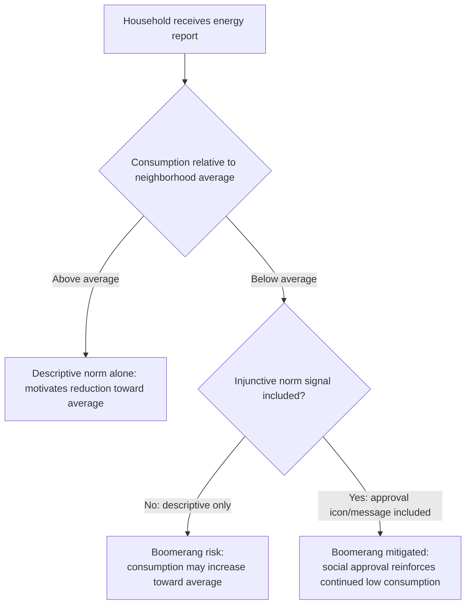

## Social Comparison Feedback in Energy Consumption

### Definitions and Scope

This topic provides the focused technical deep-dive on **social comparison feedback** as a specific behavioral mechanism within energy conservation, distinguished from the companion "Green Nudges and Pro-Environmental Behavior" topic by scope: that topic surveys the full range of green-nudge mechanisms (defaults, framing, feedback broadly) across multiple environmental domains, while this topic concentrates specifically on the theoretical mechanics, message-design parameters, and econometric evidence base for **peer/neighbor consumption comparison** as an energy-conservation intervention — the single most extensively empirically studied green nudge mechanism, warranting dedicated technical treatment.

### Theoretical Foundation: Focus Theory of Normative Conduct

Cialdini's focus theory of normative conduct (Cialdini, Reno & Kallgren, 1990) distinguishes two conceptually and empirically separable norm types, both directly relevant to energy feedback design:

- **Descriptive norms**: perceptions of what most people *actually do* (e.g., "the average household in your area uses X kWh/month"). These operate through an informational/inferential channel — in the absence of complete information about the socially appropriate consumption level, observing others' behavior serves as a low-cost heuristic for inferring an appropriate reference level.
- **Injunctive norms**: perceptions of what most people *approve or disapprove of* (e.g., a smiley-face icon signaling social approval for below-average consumption). These operate through a motivational/social-sanction channel, independent of any informational content about typical behavior.

The theory's key testable prediction — validated extensively in the energy-feedback literature — is that **descriptive-norm information alone can produce a boomerang effect**, while **combining descriptive and injunctive norm signals mitigates it**, because the injunctive component provides an anchor against which even below-average performers understand further improvement (not regression toward the mean) is the socially endorsed direction.

### Formal Mechanism: The Boomerang Effect

Let $c_i$ be household $i$'s consumption and $\bar{c}$ the descriptive-norm reference (neighborhood average). A purely descriptive-norm message updates household $i$'s belief about the socially "normal" consumption level toward $\bar{c}$:

$$c_i^{t+1} = c_i^t + \gamma (\bar{c} - c_i^t)$$

For $c_i^t < \bar{c}$ (already below-average consumers), this predicts $c_i^{t+1} > c_i^t$ — a perverse *increase* in consumption, as the household adjusts toward, rather than continuing to move away from, the revealed norm. Adding an injunctive-norm signal $\iota_i \in \{\text{approve}, \text{disapprove}\}$ modifies the adjustment:

$$c_i^{t+1} = c_i^t + \gamma(\bar{c} - c_i^t) - \eta \cdot \mathbb{1}[\iota_i = \text{approve}]$$

where the injunctive term $\eta$ counteracts the boomerang pull specifically for households receiving social approval, preventing the reversion-to-mean dynamic implied by the descriptive term alone.

### Message Design and Boomerang Mitigation Diagram

### The OPOWER Home Energy Report: Design Architecture

**Example**

The dominant real-world implementation studied in this literature (OPOWER, now part of Oracle Utilities, deployed across numerous U.S. and international utilities) combines several design elements into a single periodic mailed or digital report:

1. **Neighbor comparison bar chart**: household's own consumption plotted against an anonymized "similar homes" average (typically matched on home size and sometimes heating fuel type) and, in many versions, an "efficient neighbors" (top-quintile) comparison bar — providing two distinct descriptive-norm reference points rather than a single average.
2. **Injunctive icon system**: smiley-face icons (commonly one to two faces) indicating relative standing, functioning as the injunctive-norm signal layered atop the descriptive comparison.
3. **Historical self-comparison**: the household's own consumption trend over recent months/years, providing an additional non-social reference point (individual rather than peer-based) that helps separate genuine behavior change from a household's own seasonal variation.
4. **Actionable conservation tips**: general and sometimes personalized efficiency recommendations, providing a concrete behavioral pathway rather than comparison information alone.

### Econometric Evidence Base

**Key Points**

- **Allcott (2011), large-scale multi-utility analysis**: pooled analysis across multiple utility rollouts of OPOWER-style reports found statistically robust, consistently signed (negative) treatment effects on household electricity consumption, with per-household effect sizes described as modest in percentage terms but economically significant in aggregate given the large number of households reached and the low per-household program cost — a result frequently cited in comparing the cost-effectiveness of behavioral interventions to conventional demand-side energy-efficiency programs (e.g., appliance rebate programs) on a cost-per-kWh-saved basis.
- **Effect heterogeneity by baseline consumption**: consistent with the theoretical prediction, most large-scale evaluations find larger absolute conservation responses among *high* baseline consumers (above-average households, for whom the descriptive comparison alone provides a clear directional signal without boomerang risk) than among low baseline consumers, supporting the mechanism-level theoretical prediction rather than a uniform treatment effect across the consumption distribution.
- **Allcott & Rogers (2014), dynamics of treatment effect persistence**: analysis of longer panels of home energy report recipients characterizes the treatment-effect trajectory as showing a repeated pattern of an "action and backsliding" cycle around each report delivery, with effects that persist at a meaningfully reduced but non-zero level for a period after report delivery ceases entirely — informing debates about whether the intervention produces habit formation or merely a repeated, decaying informational nudge requiring sustained delivery to maintain most of its effect. [Inference: the precise share of the persistent post-cessation effect attributable to genuine habit formation, as opposed to residual behavioral or capital-stock changes made during the treatment period (e.g., a purchased efficient appliance), is not fully separable in most study designs and is treated differently across analyses.]
- **Cost-effectiveness comparisons**: several evaluations situate the per-kWh cost of home energy report programs favorably relative to some traditional utility demand-side-management program costs, a comparison that has been influential in utility regulatory proceedings considering behavioral programs as an eligible energy-efficiency resource, though the precise comparative ranking depends on the specific traditional program and utility context used as the comparison baseline. [Unverified as a fully general ranking: cost-effectiveness comparisons are context- and program-specific rather than reflecting a single universal ordering.]

### Design Parameters That Moderate Effectiveness

| Design Parameter | Effect on Intervention Performance |
| --- | --- |
| Reference group specificity (neighborhood vs. broad regional average) | More specific/proximate reference groups generally produce stronger perceived relevance and response, consistent with the Goldstein-Cialdini-Griskevicius hotel-towel finding on reference-group specificity |
| Presence of injunctive (approval/disapproval) signal | Mitigates boomerang effect for below-average consumers; theoretically and empirically supported as a near-necessary complement to pure descriptive comparison |
| Frequency of report delivery | Higher-frequency delivery associated with more sustained effect, at higher program cost; optimal frequency involves a documented cost-effectiveness tradeoff rather than a single dominant answer |
| Digital/real-time vs. periodic mailed feedback | Real-time or high-frequency digital feedback (in-home displays, smart-meter apps) theoretically should reduce the salience gap further than periodic mailed reports, though the comparative evidence base for real-time digital feedback specifically is smaller and less uniformly consistent than the mailed-report literature. [Unverified] |

### Distinguishing Genuine Behavior Change from Measurement and Selection Artifacts

**Next Steps** (methodological considerations for evaluating this literature)

- **Randomization at the household level** (rather than opt-in self-selection into receiving reports) is essential to isolate the causal comparison-feedback effect from selection bias, since households that would opt into receiving such reports may differ systematically in underlying conservation motivation from those who would not — most of the credible literature in this space, including the Allcott studies, relies on utility-level randomized or quasi-randomized rollout designs specifically to address this concern.
- **Weather and seasonal normalization** is required to separate genuine behavioral response from confounding weather-driven consumption variation, since energy consumption is highly weather-sensitive independent of any behavioral intervention.
- **Attribution of savings to comparison feedback specifically, versus the bundled tips/historical-trend components** of a typical multi-element report, requires factorial experimental variation isolating each component — most large-scale field deployments test the bundled intervention as delivered commercially, meaning some published effect sizes reflect the joint effect of multiple design elements rather than the comparison-feedback mechanism in isolation. [Inference]

### Related Topics

- Green Nudges and Pro-Environmental Behavior (parent topic: broader green-nudge mechanism taxonomy)
- Social Norms and Collective Action in Development (foundational descriptive/normative expectation framework, applied here to energy)
- Social Proof and Word-of-Mouth Effects (companion mechanism, consumer-market context)
- Focus theory of normative conduct: descriptive versus injunctive norms (Cialdini, Reno & Kallgren, 1990)
- Field Experiments in Developing Economies (methodological basis for randomized rollout evaluation design)
- Motivational crowding-out and durability of nudge-induced behavior change
- Smart meter technology and real-time energy feedback design
- Utility regulatory treatment of behavioral programs as demand-side-management resources