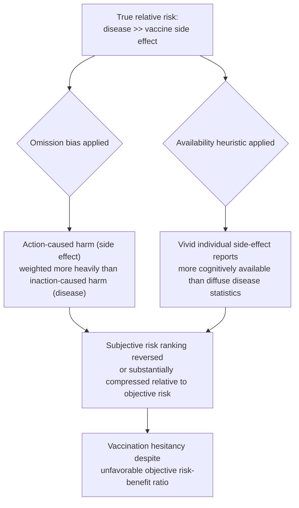

## Vaccination, Public Health Messaging, and Compliance

### Definitions and Scope

This topic examines behavioral-economic mechanisms specific to vaccination decisions and public health messaging design, extending the general health-behavior-change framework to the domain's distinctive features: vaccination is unusual among health investments in combining a **collective-action/externality structure** (herd immunity is a public good) with the standard **investment-good intertemporal structure** (immediate cost, delayed and probabilistic benefit) and a documented, historically significant vulnerability to **risk-perception distortion** (vaccine hesitancy driven partly by miscalibrated relative risk assessment between vaccination and disease).

### The Free-Rider Structure of Vaccination Demand

**Key Points**

- **Herd immunity as a public good**: once a sufficient population vaccination threshold is reached, unvaccinated individuals receive substantial indirect protection without bearing the vaccination cost — creating a textbook free-rider incentive structure formally analogous to the collective-action problems covered in the companion "Social Norms and Collective Action" topic, but here the "contribution" is a health/bodily cost rather than a resource contribution.
- **The epidemiological externality wedge**: an individual's private optimal vaccination decision, based only on personal risk-benefit calculation, is generically below the socially optimal vaccination rate, because private calculation ignores the transmission-reduction benefit conferred on others — a divergence formally identical in structure to any standard positive-externality underprovision result in public economics, independent of any behavioral bias.
- **Behavioral amplification of the free-rider gap**: present bias (immediate cost/inconvenience of vaccination versus delayed, probabilistic protective benefit) and risk-perception distortions (below) compound the purely rational free-rider gap, meaning observed under-vaccination in many contexts reflects the *sum* of a rational externality-driven component and a behavioral-bias-driven component — a decomposition important for correctly calibrating whether a given policy remedy (a subsidy targeting the externality, or a nudge targeting the behavioral component) is well-matched to the underlying cause.

### Risk Perception and the Vaccination Paradox

Vaccine hesitancy research has identified a specific, well-documented risk-perception asymmetry:

$$\text{Perceived risk of vaccine side effect (rare, salient, agentive)} \gtrless \text{Perceived risk of disease (larger, but diffuse, non-agentive)}$$

Two compounding mechanisms drive this frequently observed miscalibration:

- **Omission bias**: a documented tendency to judge harm resulting from an *action* (choosing to vaccinate, and experiencing a rare adverse event) as morally and psychologically worse than equivalent or greater harm resulting from *inaction* (choosing not to vaccinate, and contracting the disease), even when the expected harm from inaction is substantially larger in expectation — a well-established finding in the judgment-and-decision-making literature applied specifically to vaccination contexts (Ritov & Baron, 1990, and substantial subsequent replication).
- **Availability heuristic asymmetry**: vivid, specific, individually-attributable adverse-event reports (a named case of a rare vaccine reaction) are cognitively more available and emotionally salient than statistically larger but diffuse and non-individuated disease-burden statistics, biasing subjective risk assessment toward overweighting the rare, salient outcome.

### Vaccination Decision Distortion Diagram

### Behavioral Interventions Specific to Vaccination

**Example**

- **Default appointment scheduling ("active choice" and opt-out defaults)**: Studies embedding a pre-scheduled vaccination appointment (e.g., a specific date/time automatically assigned, requiring active cancellation rather than active scheduling) into routine primary-care or workplace contexts have found substantially higher completion rates relative to an otherwise-identical opt-in scheduling process — directly analogous to the default-effect mechanism covered in the companion health-behavior-change topic, applied to overcoming the "separate future action" friction specifically.
- **Same-visit vaccination bundling**: offering vaccination at the point of an already-scheduled unrelated visit (a same-day flu shot during a routine physical) removes the discrete future decision point at which present bias or simple forgetting can cause deferral or abandonment, consistent with the general present-bias timing principle from the companion "Present Bias and Health Decision-Making" topic.
- **Reminder and recall systems**: SMS/postcard reminder-and-recall systems for multi-dose vaccination schedules (e.g., childhood immunization series, HPV vaccine multi-dose completion) have shown consistent positive effects on series-completion rates across multiple systematic reviews, addressing the forgetting/inattention channel distinct from the risk-perception channel.
- **Messenger and trusted-source effects**: public health communication research finds vaccination recommendation delivery by a trusted, socially proximate messenger (a personal physician, a community or religious leader, in some contexts a peer) generally outperforms equivalent content delivered by a more socially distant or purely institutional source, consistent with the "Messenger" component of the MINDSPACE framework introduced in the companion health-behavior-change topic.
- **Social norm messaging for vaccination**: descriptive-norm messaging ("most parents in your community vaccinate their children on schedule") has been studied as a vaccination-uptake intervention with some positive findings, though the vaccination-specific social-norm evidence base shows more mixed and context-dependent results than the (unrelated-domain) energy-consumption social-comparison literature, and in some studies has shown limited or null effects, particularly among populations with strong pre-existing hesitancy beliefs. [Unverified as a general claim: effect sizes and even effect direction for descriptive-norm vaccination messaging vary substantially by population and baseline hesitancy level across the literature, and should not be assumed uniformly positive.]

### Messaging Design and Framing Considerations

- **Risk-comparison framing**: presenting vaccine side-effect risk in direct numerical or visual comparison to disease risk (rather than presenting each in isolation) has been studied as a method for counteracting the omission-bias/availability-heuristic distortion described above, with some evidence that concrete comparative framing (e.g., visual risk-ladder or icon-array displays) improves relative risk comprehension relative to verbal-only risk communication, consistent with broader risk-communication research outside the vaccination-specific literature. [Inference: transfer of general risk-communication findings to vaccination-specific contexts, while theoretically well-motivated, is supported by a smaller vaccination-specific evidence base than the general risk-communication literature itself.]
- **Correcting versus avoiding myth engagement**: public health communication research on debunking vaccine misinformation has identified a documented risk of the "backfire effect" (direct myth repetition, even when immediately corrected, can inadvertently reinforce the myth's cognitive availability) in some studies, though subsequent replication attempts of the backfire effect specifically have produced mixed results, and current public health communication guidance generally favors fact-first, myth-second correction structures as a risk-mitigating approach rather than avoiding myth engagement altogether. [Unverified as a settled empirical matter: the backfire effect's robustness and prevalence has been actively contested and partially failed to replicate in the broader misinformation-correction literature, and vaccination-specific findings should be read in light of this broader methodological debate.]
- **Fear appeals and efficacy messaging**: public health messaging research generally finds fear-based appeals are effective only when paired with a clear, actionable efficacy message (a specific, low-friction path to reducing the feared risk); fear appeals presented without a paired efficacy message risk defensive avoidance or message rejection rather than the intended behavior change, a finding consistent with the Extended Parallel Process Model in health communication research (Witte, 1992).

### Distinguishing Rational Free-Riding from Behavioral Hesitancy

| Feature | Rational Free-Riding | Behavioral Hesitancy |
| --- | --- | --- |
| Core driver | Correct perception of low personal marginal benefit once herd immunity is high | Distorted perception of relative risk (vaccine vs. disease), independent of true herd-immunity level |
| Responsive to | Subsidies/mandates correcting the externality wedge | Risk-communication redesign, trusted messenger delivery, default/friction-reduction interventions |
| Persists even with corrected information? | No — a rational free-rider updates appropriately if herd-immunity levels or personal risk changes | Often yes — hesitancy grounded in omission bias/availability heuristic can persist despite accurate comparative risk information, particularly if trust in the information source itself is the underlying issue |

### Policy and Design Implications

**Next Steps**

- Because vaccination underprovision reflects a **mixture** of rational externality-driven free-riding and behaviorally-distorted risk perception, effective policy design typically requires **layering** interventions matched to each component — subsidies or mandates addressing the externality wedge, combined with default/friction-reduction and trusted-messenger risk communication addressing the behavioral component — rather than assuming a single intervention type will resolve both simultaneously.
- **Trust in the information source** appears to function as a precondition for the effectiveness of comparative risk-framing and myth-correction messaging; messaging-design interventions studied in high-trust contexts may not generalize with equivalent effectiveness to populations with low baseline trust in the messenger or institution, a caveat with substantial practical significance for real-world public health campaign design. [Inference]
- Default-based and friction-reduction interventions (same-visit bundling, default scheduling, reminder-recall systems) appear to have a comparatively more robust and consistent evidence base across the reviewed literature than norm-based or fear-appeal messaging interventions specifically for vaccination, suggesting a reasonable prioritization for resource-constrained public health program design, though this is a synthesis judgment rather than a finding from any single definitive comparative study. [Inference]

### Related Topics

- Behavioral Interventions in Health Behavior Change (parent framework: MINDSPACE and general health-nudge toolkit)
- Present Bias and Health Decision-Making (investment-good temporal structure applied here to vaccination timing)
- Social Norms and Collective Action in Development (foundational free-rider and public-goods framework)
- Social Comparison Feedback in Energy Consumption (companion descriptive/injunctive norm mechanism, different domain)
- Omission bias and action/inaction asymmetry in risk judgment (Ritov & Baron, 1990)
- Extended Parallel Process Model and fear-appeal efficacy messaging (Witte, 1992)
- Misinformation correction and the contested "backfire effect" literature
- Herd immunity thresholds and epidemiological externality modeling