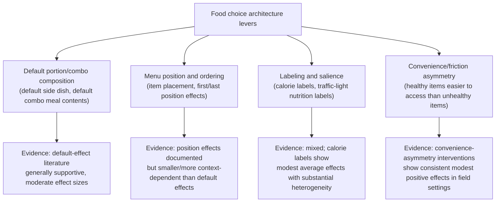

## Food Choice Architecture and Nutrition

### Definitions and Scope

**Food choice architecture**: the deliberate design of the physical, digital, or informational environment in which food decisions are made — placement, portion default, menu ordering, labeling — to influence dietary choices without restricting the underlying option set (a direct application of libertarian paternalism to nutrition). This topic covers both the *descriptive* reality that food environments are never neutral (every cafeteria layout, every menu order already constitutes some choice architecture) and the *prescriptive* literature on redesigning that architecture to support stated health goals, alongside the behavioral mechanisms — visceral/affective response, present bias, decision fatigue — that make food choice unusually susceptible to environmental manipulation relative to many other consumption domains.

### Why Food Choice Is Distinctively Susceptible to Choice Architecture

**Key Points**

- **High decision frequency**: food choices recur many times daily, producing cumulative decision fatigue that increases reliance on default options, salience, and heuristic processing rather than deliberative evaluation for any single choice — a volume of repeated decision-making with few parallels in other consumption domains.
- **Visceral/affective override**: food consumption decisions, particularly around palatable, calorie-dense foods, are strongly influenced by visceral factors (hunger state, immediate sensory cues) that can produce systematic, state-dependent departures from an individual's own stated "cold state" dietary intentions (Loewenstein, 1996) — a mechanism distinct from, though often compounding, present bias.
- **Present bias in the classic investment/leisure structure**: healthy eating has the investment-good temporal profile (immediate effort/sacrifice, delayed health benefit), while unhealthy/palatable food consumption has the leisure-good profile (immediate gratification, delayed health cost) — directly mirroring the DellaVigna-Malmendier investment/leisure framework from the companion contract-design topic, here applied to a single recurring daily choice rather than a discrete contract decision.
- **Extremely low search/switching cost for the default option**: unlike major purchases, the "default" food choice in a given physical environment (what's placed at eye level, what's pre-portioned, what's first on a menu) requires essentially zero deliberate search cost to simply accept, making default and placement effects unusually potent relative to domains with higher inherent friction.

### The Cornell Food and Brand Lab Tradition: Physical Environment Interventions

**Example**

Brian Wansink and colleagues' body of work (subject to notable later replication and research-integrity controversies, addressed below) established several widely cited physical-environment manipulation findings that shaped the subsequent choice-architecture literature:

- **Plate size and portion perception**: studies reported that larger plate/bowl diameters were associated with self-served portion sizes and consumption, attributed to a size-contrast/perceptual-anchoring effect (the same absolute food quantity appears smaller, and less "sufficient," on a larger plate) — a finding that motivated subsequent smaller-plate default interventions in institutional food-service settings.
- **Placement and visibility (cafeteria redesign / "Smarter Lunchrooms" movement)**: repositioning healthier options to more visible/accessible placement (eye-level, front-of-line placement) and less healthy options to less convenient placement, without removing any option from availability, was studied as a method for shifting selection toward healthier items in school cafeteria contexts.
- **Important caveat on this literature's reliability**: a substantial portion of the original Cornell Food and Brand Lab publication record, including some of the specific studies underlying the plate-size and related claims, has been subject to documented data-integrity concerns, institutional investigation, and a significant number of subsequent retractions following scrutiny beginning around 2017. This material notes the historical influence of this research program on the field's development, but readers should treat the *specific quantitative findings* from the retracted or contested studies with substantial caution, and should consult subsequent independent replication attempts (which have shown more mixed and generally smaller effect sizes for plate-size manipulations specifically) rather than the original claims as the more reliable evidence source for magnitude estimates. [Unverified: due to this integrity controversy, this material deliberately avoids citing specific effect-size figures from the original contested studies.]

### Choice Architecture Intervention Categories (Post-Controversy Evidence Base)

Independent of the contested Cornell-specific findings, a broader and more robustly replicated literature on food choice architecture includes:

### Default Meal Composition and Combo Defaults

- **Default side-dish studies**: field experiments varying the default side item in a fixed-price combo meal (e.g., defaulting to a fruit or vegetable side, with a French fry substitution available on request, versus the reverse default) have found the default option retains a substantially higher selection share than an otherwise-identical opt-in structure — a directly analogous application of the general default-effects literature (Johnson & Goldstein) to a food-specific choice, with a comparatively cleaner and more consistently replicated evidence base than the plate-size literature discussed above.
- **Children's menu default studies**: several randomized field studies in restaurant chains found that defaulting children's combo meals to healthier side/beverage options (with substitution still available) increased healthier item consumption without measurable revenue loss or customer complaint in the reporting evaluations, providing an applied business-relevant evidence base beyond laboratory or single-cafeteria settings. [Inference: business-outcome findings (revenue neutrality) are drawn from a smaller number of industry-partnered studies and may not generalize uniformly across all restaurant contexts or price-sensitivity segments.]

### Nutrition Labeling as Choice Architecture

**Key Points**

- **Calorie labeling mandates (menu-board calorie disclosure)**: evaluations of mandatory calorie labeling on chain restaurant menus (implemented in various forms across U.S. jurisdictions and other countries) generally find modest average reductions in calories ordered, with substantial heterogeneity by consumer segment — some studies find larger effects among consumers already motivated toward healthier choices, and comparatively smaller or null effects among consumer segments with the highest baseline caloric intake, an equity-relevant heterogeneity pattern that has drawn academic and policy attention. [Inference: the precise degree and consistency of this heterogeneity pattern varies across the studies estimating it, and should be read as a documented concern in the literature rather than a single precisely quantified effect.]
- **Front-of-package "traffic light" and interpretive labeling systems**: comparative studies of simplified color-coded (red/amber/green) nutrition labeling systems, used in several countries as an alternative or complement to detailed nutrition-facts panels, generally find such interpretive systems produce measurably faster and more accurate consumer nutritional-quality judgments relative to standard detailed nutrition-facts panels, consistent with a cognitive-load/salience-reduction mechanism rather than providing meaningfully different underlying information content.
- **Labeling versus architecture as complements, not substitutes**: the broader literature synthesis generally concludes that labeling interventions alone tend to produce smaller behavioral effects than combined labeling-plus-default/placement interventions, suggesting the mechanisms are complementary — labeling primarily addresses an information/salience gap, while default and placement architecture addresses the separate friction/convenience-asymmetry gap, and combined interventions can address both simultaneously.

### Institutional Applications: School Lunch and Public Procurement

**Next Steps** (applied institutional design considerations)

- The "Smarter Lunchrooms" approach and related school-food-environment redesign frameworks apply the convenience-asymmetry and placement principles described above at the institutional-procurement level, an application area where a public institution (a school district) has direct control over the full choice architecture, distinguishing it from settings where a choice-architecture intervention must be voluntarily adopted by an independent commercial actor (a private restaurant chain).
- Given the documented data-integrity concerns affecting a portion of the original evidence base motivating some of these institutional redesign programs, program evaluators and researchers are increasingly emphasizing independent, pre-registered replication of specific claimed intervention effects before scaling institutional redesign recommendations, a methodological caution with broader relevance to the credibility standards this material applies across all cited findings. [Inference: this is a reasonable and increasingly common methodological stance in the field rather than a single settled institutional consensus statement.]

### Distinguishing Robust from Contested Findings in This Literature

| Finding Category | Evidentiary Status |
| --- | --- |
| Default combo/side-dish selection effects | Comparatively robust; multiple independent field replications, consistent direction |
| Menu-board calorie labeling average effects | Established but modest and heterogeneous; effect concentrated among already health-motivated consumers in several studies |
| Interpretive front-of-package labeling comprehension effects | Comparatively robust; consistent finding of improved speed/accuracy of nutritional judgment |
| Original Cornell Food and Brand Lab plate-size/portion-perception findings | Contested; substantial retractions and data-integrity concerns; treat specific original effect-size claims with caution pending independent replication |

### Related Topics

- Behavioral Interventions in Health Behavior Change (parent framework: MINDSPACE and general health-nudge toolkit)
- Present Bias and Health Decision-Making (investment/leisure-good temporal structure applied here to daily food choice)
- Contract Design and the Exploitation of Present-Biased Consumers (parallel investment/leisure-good framework)
- Default effects and choice architecture (Thaler & Sunstein, *Nudge*)
- Visceral factors and state-dependent preference reversals (Loewenstein, 1996)
- Research replication and data-integrity standards in behavioral science
- Nutrition labeling policy design and menu-board calorie disclosure regulation
- School nutrition policy and the "Smarter Lunchrooms" institutional redesign framework