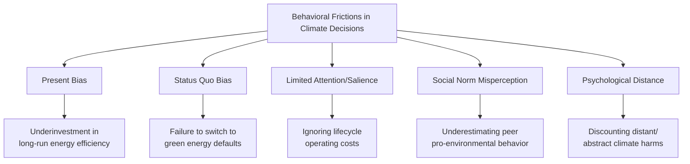
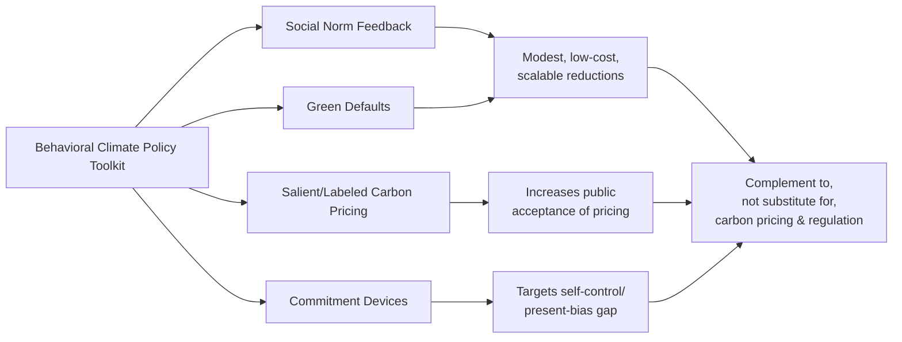

## Behavioral Approaches to Climate Policy

### Overview

Behavioral approaches to climate policy apply insights from behavioral economics and psychology to the design of interventions aimed at reducing greenhouse gas emissions, encouraging pro-environmental behavior, and improving the effectiveness of climate regulation. This domain sits at the intersection of environmental economics, choice architecture, and public policy, and responds to a persistent empirical gap: standard price-based interventions (carbon taxes, cap-and-trade) often produce smaller-than-predicted behavioral responses, motivating complementary or alternative behavioral tools.

### Why Standard Rational-Actor Models Underperform in Climate Contexts

**Key Points**

- Climate change presents an unusually difficult behavioral profile: costs are borne immediately and individually, while benefits are diffuse, delayed, probabilistic, and collective — a structure highly susceptible to present bias and free-riding
- Energy and emissions decisions are frequently embedded in low-salience, infrequent choices (appliance purchases, insulation, commuting mode) where consumers exhibit **bounded rationality** and limited attention to long-run operating costs
- The **energy efficiency gap** — the empirical finding that consumers underinvest in cost-effective energy-saving technologies relative to what pure net-present-value calculations predict — is a canonical anomaly motivating behavioral intervention (Allcott & Greenstone, 2012)

### Psychological Distance

**Key Points**

- Formalized via **Construal Level Theory** (Trope & Liberman, 2003), applied to climate communication by researchers including Spence, Poortinga & Pidgeon (2012)
- Climate change is perceived along four distance dimensions: temporal (future-oriented), spatial (geographically distant impacts), social (affecting other groups), and hypothetical (uncertain, probabilistic)
- Greater perceived distance is associated with more abstract mental construal and reduced motivation for immediate behavioral or political action

[Inference] The empirical relationship between psychological distance and pro-environmental behavior is well replicated in survey and experimental work, but the causal strength and generalizability of distance-reduction interventions (e.g., localizing climate messaging) across different populations remains an active area of research rather than a fully settled finding.

### Social Norms Interventions

**Landmark Contribution: OPOWER Home Energy Reports**

The most widely cited applied behavioral climate intervention is the OPOWER program (studied extensively by Hunt Allcott, 2011), which mails households comparative energy-use reports showing their consumption relative to similar neighboring households, accompanied by social approval/disapproval indicators (e.g., smiley faces for below-average usage).

**Key Points**

- Based on Cialdini's social norms research (Cialdini, Reno & Kallgren, 1990; Schultz et al., 2007), specifically distinguishing **descriptive norms** (what others actually do) from **injunctive norms** (what is socially approved)
- Produces measurable, though modest, average reductions in household energy consumption (typically cited in the range of 1–2% of usage), delivered at very low marginal cost per household compared to price-based subsidy programs
- Demonstrated a **boomerang effect** risk: below-average users sometimes increase consumption after learning they use less than their neighbors, absent an injunctive (approval) signal — corrected by pairing descriptive norm information with an emoji/injunctive cue

$$\Delta E_i = f(\bar{E}_{neighbors} - E_i, \text{injunctive signal})$$

where $\Delta E_i$ is the household's change in energy consumption, moderated by both the descriptive comparison gap and the presence of a normative (approval/disapproval) cue.

### Default and Choice Architecture Applications

**Key Points**

- **Green energy defaults**: experiments (Pichert & Katsikopoulos, 2008; Ebeling & Lotz, 2015) show that switching the default electricity tariff from conventional to renewable substantially increases green energy retention rates relative to opt-in green tariffs, consistent with the general default-effect literature
- **Green default in procurement and corporate settings**: default double-sided printing, default meat-free menu options, and default eco-friendly travel booking options each show measurable behavior shifts at negligible cost
- **Carbon footprint labeling**: analogous to nutrition labeling, intended to reduce the cognitive/search cost of identifying lower-carbon products at point of purchase

**Example**

A utility company that changes its standard electricity plan from a conventional-default/green-opt-in structure to a green-default/conventional-opt-out structure can retain a large majority of customers on the green tariff, despite the *same* customers historically opting into green tariffs at much lower rates under the opt-in framing — illustrating the default effect operating specifically within an environmental policy context.

### Carbon Tax Framing and Salience

**Key Points**

- Standard economic theory predicts consumers respond identically to equivalent price changes regardless of framing (tax vs. rebate, upfront vs. embedded), but behavioral evidence shows **salience** strongly moderates responsiveness (Chetty, Looney & Kroft, 2009, applied to sales tax; extended to carbon pricing contexts)
- **Revenue recycling and labeling** — explicitly earmarking carbon tax revenue for visible public benefits (dividends, infrastructure) — increases public acceptance relative to revenue-neutral but opaque tax structures, even when the net financial effect on households is identical (Carattini, Baranzini & Roca, 2015; Douenne & Fabre, 2020)
- The **"tax" vs. "offset"/"fee"** framing of an identical price instrument measurably affects public support, independent of the underlying economic mechanism

[Inference] The magnitude of framing effects on carbon tax acceptance varies considerably across countries and survey methodologies; the qualitative direction of the effect (that framing and revenue transparency influence acceptance holding the economic substance constant) is well supported, but specific percentage-point estimates are context-dependent and should not be treated as universal constants.

### Commitment Devices and Pledges

**Key Points**

- Public and private commitment devices (pledge campaigns, calendar-based reminders, social accountability structures) leverage present-bias-aware "sophisticated agent" behavior, paralleling their use in the intertemporal-choice literature
- Applied examples include household energy-reduction pledges, corporate net-zero commitments with public disclosure requirements, and behaviorally-informed "green nudges" embedded in smart thermostat and app-based feedback systems

### Critiques and Limitations of Behavioral Climate Policy

**Key Points**

- **Scale limitation**: nudge-based interventions (norms messaging, defaults) typically produce single-digit percentage reductions in targeted behaviors, which critics argue are insufficient in magnitude relative to the emissions reductions required to meet stated climate targets, implying behavioral tools are best positioned as complements to, not substitutes for, carbon pricing and regulatory mandates
- **Rebound and spillover effects**: some evidence suggests that behavioral nudges toward one pro-environmental action can produce compensatory behavior elsewhere (moral licensing), partially offsetting net environmental gains — though the size and consistency of this effect across studies is contested
- **Distributional concerns**: default and framing interventions, because they operate on the same underlying price structure, do not resolve equity concerns associated with carbon pricing borne disproportionately by lower-income households, and are sometimes criticized as attention-diverting from more consequential structural or price-based reform
- **External validity**: many landmark studies (e.g., OPOWER) originate in specific national/utility contexts (predominantly the United States), and effect sizes do not automatically generalize across different energy markets, cultural contexts, or baseline consumption norms

### Comparative Summary

| Intervention | Mechanism | Typical Effect Size | Cost | Primary Limitation |
| --- | --- | --- | --- | --- |
| Social norm reports (OPOWER-style) | Descriptive + injunctive norms | ~1–2% consumption reduction | Very low | Small absolute magnitude |
| Green energy defaults | Status quo bias | High opt-in/retention relative to opt-in framing | Low | Requires utility-level policy change |
| Carbon tax salience/labeling | Attention/transparency | Increases responsiveness and acceptance | Low–Moderate | Political and design complexity |
| Revenue recycling/dividends | Trust and fairness perception | Increases public support | Moderate (administrative) | Does not change net price signal |
| Commitment devices/pledges | Self-control, sophistication | Context-dependent, often modest | Low | Limited by naive present bias among non-adopters |

### Conclusion

Behavioral approaches to climate policy do not replace core price- and regulation-based instruments such as carbon taxation and emissions caps, but they materially improve the effectiveness, political feasibility, and cost-efficiency of climate interventions at the margin. The strongest evidence base exists for social norm feedback and default-option redesign, both of which produce reliable, low-cost, at-scale behavioral shifts. The central open challenge in the field is combining these behavioral tools with sufficiently ambitious structural price and regulatory policy to close the gap between individually achievable behavior change and the aggregate emissions reductions required by climate targets.

**Next Steps**

- The Energy Efficiency Gap: Empirical Evidence and Competing Explanations
- Social Norms Theory: Descriptive vs. Injunctive Norms in Applied Nudge Design
- Carbon Tax Design: Salience, Revenue Recycling, and Public Acceptance
- Moral Licensing and Behavioral Spillover in Environmental Decision-Making
- Construal Level Theory and Psychological Distance in Risk Communication
- Green Nudges vs. Green Taxes: A Policy Effectiveness Comparison
- Behavioral Insights Units in Government: Case Studies (UK Behavioural Insights Team, US OES)