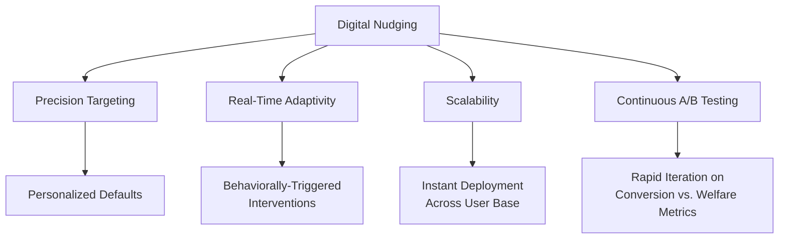
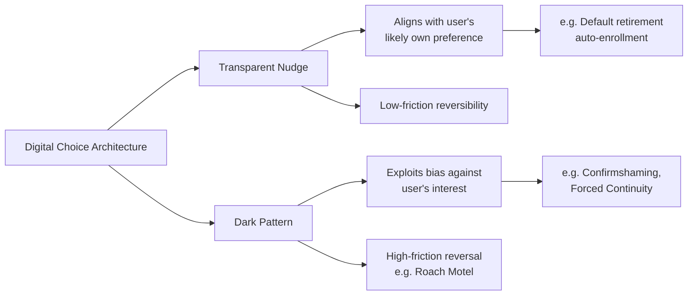

## Digital Nudging and Interface Design

### Overview

Digital nudging refers to the application of choice-architecture principles from behavioral economics within user interfaces, digital platforms, and software systems to influence user behavior in predictable ways. It extends Thaler and Sunstein's nudge framework into the specific technical constraints and affordances of screens, algorithms, and interaction design, and is central to fields including UX design, e-commerce, fintech, and platform governance. The domain was formally named and structured by Weinmann, Schneider & vom Brocke (2016) in "Digital Nudging," which established a design-element taxonomy for the field.

### Distinguishing Digital Nudging from Physical Nudging

**Key Points**

- Digital environments allow far greater **precision, personalization, and scale** than physical choice architecture — a single interface change can be deployed instantly to millions of users and continuously A/B tested
- Digital nudges can be **dynamic and adaptive**, responding to real-time user behavior, unlike static physical defaults (e.g., a cafeteria layout)
- Digital environments introduce a distinct set of manipulation risks, since the choice architect (platform designer) typically has commercial interests that may diverge from user welfare — this tension underlies the "dark patterns" critique discussed later in this document

### Weinmann, Schneider & vom Brocke Taxonomy (2016)

The foundational digital nudging framework classifies nudges along two dimensions: the **decision-making process stage** affected (Type 1: information presentation vs. Type 2: decision structuring) and the specific **design technique** employed.

**Key Points**

- **Default settings**: pre-selected options requiring no user action (e.g., pre-checked "remember me," auto-renewal subscriptions, default privacy settings)
- **Structuring the choice set**: ordering, categorization, or limiting of the options shown (e.g., ranked search results, "recommended" tags, curated shortlists)
- **Framing effects**: presenting identical information in gain- versus loss-framed language (e.g., "95% satisfaction" vs. "5% dissatisfaction")
- **Social norm cues**: displaying peer behavior data (e.g., "12 people are viewing this," "bestseller," "87% of users chose this plan")
- **Feedback and reminders**: real-time progress indicators, notifications, and prompts designed to close an intention-action gap (e.g., cart abandonment reminders, streak counters)
- **Decoy effects and anchoring**: introducing a strategically dominated pricing tier to make a target tier appear more attractive (asymmetric dominance)

### Common Interface Patterns

**Example — Progress Indicators and Completion Bars**

A profile-completion progress bar (e.g., "Your profile is 80% complete") leverages the **Zeigarnik effect** (the tendency to feel discomfort at incomplete tasks) and **goal-gradient effect** (increasing motivation as a goal nears completion), both established in psychology and applied extensively in onboarding flow design (Kivetz, Urminsky & Zheng, 2006, on goal-gradient effects in loyalty programs).

**Example — Scarcity and Urgency Cues**

Countdown timers, "only 2 left in stock," and limited-time offer banners exploit **loss aversion** and heightened perceived scarcity to accelerate decision timelines and reduce deliberation, drawing on the broader scarcity heuristic literature (Cialdini, 1984; Lynn, 1991).

**Example — Default Bundling and Pre-Selected Add-Ons**

Checkout flows that pre-select travel insurance, warranty extensions, or premium tiers apply the default-effect mechanism directly, with switching (deselecting) requiring active user effort — structurally identical to opt-out retirement enrollment but deployed in a commercial UI context.

**Example — Social Proof Widgets**

"X people bought this in the last 24 hours" and star-rating aggregation displays operationalize descriptive social norms (Cialdini, Reno & Kallgren, 1990) within a compressed, glanceable UI element.

### Formal Representation of Interface-Level Choice Architecture

The influence of a digital nudge on conversion probability can be represented analogously to the physical default-effect model, incorporating an interface-design parameter $\psi$:

$$P(\text{action} \mid \text{design}) = P^*(\text{action}) + \psi(\text{design element}, \text{salience}, \text{friction})$$

where $\psi$ captures the combined effect of visual salience, positional prominence, and interaction friction (number of clicks, form fields, or cognitive steps) required to deviate from the nudged path.

[Inference] This formalization is an expository simplification for structuring analysis; in applied UX research, effect sizes are typically estimated empirically via randomized A/B or multivariate testing rather than derived analytically from a closed-form $\psi$ function.

### Dark Patterns: The Manipulation Boundary

**Key Points**

- **Dark patterns** are digital nudges specifically designed to benefit the choice architect at the user's expense, often by exploiting cognitive biases adversarially rather than accommodating them transparently (Brignull, 2010, who coined the term; formalized taxonomically by Mathur et al., 2019 and Gray et al., 2018)
- Common dark pattern categories include: **confirmshaming** (guilt-inducing opt-out labels, e.g., "No thanks, I don't want to save money"), **roach motel** patterns (easy signup, deliberately difficult cancellation), **sneak-into-basket** (pre-added items at checkout), **forced continuity** (silent auto-renewal after a free trial), and **privacy zuckering** (defaults that maximize data sharing through confusing settings)
- Regulatory responses have emerged specifically targeting dark patterns, including provisions within the EU's Digital Services Act and GDPR consent requirements, and FTC enforcement actions in the United States (e.g., against negative-option billing practices)

**Key Distinction**

[Inference] The line between a legitimate nudge and a dark pattern is a matter of ongoing scholarly and regulatory debate rather than a single bright-line rule; the most commonly cited distinguishing criteria in the literature are (1) whether the design aligns with a plausible informed preference of the user, and (2) whether reversing the default action requires disproportionate friction relative to adopting it — but the application of these criteria to specific interface designs is frequently contested in practice.

### Algorithmic and Personalized Nudging (AI-Driven Choice Architecture)

**Key Points**

- Machine learning enables **individually targeted nudges** — dynamically selecting which framing, timing, or default is most likely to produce a target behavior for a specific user, based on behavioral and demographic data
- This is sometimes termed **hypernudging** (Yeung, 2017), reflecting concerns that algorithmically optimized, continuously updated, and largely invisible choice architecture magnifies both the effectiveness and the opacity of behavioral influence relative to static physical or simple digital nudges
- Recommendation systems (content feeds, product recommendations, "next episode" autoplay) function as a form of default-setting at scale, since the algorithmically selected next item becomes the frictionless default action (continued engagement) versus the higher-friction alternative (deliberate navigation away)

[Speculation] The long-run societal effects of algorithmically personalized, continuously A/B-tested choice architecture — particularly regarding cumulative attention capture and autonomy erosion — are the subject of active academic and regulatory debate; robust, generalizable causal estimates of these long-run effects are not yet well established in the empirical literature as of the current knowledge base, and claims in this area should be treated as contested rather than settled.

### Design and Governance Framework for Ethical Digital Nudging

| Design Consideration | Ethical Nudge | Dark Pattern Risk |
| --- | --- | --- |
| Transparency of mechanism | Disclosed or easily discoverable | Obscured or actively hidden |
| Symmetry of friction | Equal effort to opt in/out | Asymmetric friction favoring architect |
| Alignment with user goals | Supports user's stated or likely preference | Serves platform metric at user's expense |
| Reversibility | Low-cost, clearly signposted reversal | High-cost, deliberately obscured reversal |
| Data use disclosure | Clear purpose limitation | Broad, default-maximized data collection |

### Applications by Domain

**Key Points**

- **Fintech/Savings apps**: micro-savings round-ups, automated goal-based saving nudges (e.g., apps modeled on Save More Tomorrow principles), spending alerts framed as loss-avoidance
- **E-commerce**: cart-abandonment recovery flows, dynamic scarcity signaling, personalized discount timing
- **Health and fitness apps**: streak mechanics, social accountability feeds, goal-gradient progress visualization
- **Public sector digital services**: simplified form design, pre-filled fields using existing government data, plain-language rewrites to reduce administrative burden ("sludge" reduction, per Sunstein's later work on the opposite of nudges)
- **Privacy and consent interfaces**: cookie consent banners are a widely studied test case for both ethical nudge design and dark pattern critique, given documented prevalence of pre-checked consent boxes and asymmetric accept/reject button styling (Utz et al., 2019)

### Sludge: The Inverse Concept

**Key Points**

- **Sludge**, formalized by Sunstein (2019, "Sludge and Ordeals"), refers to excessive friction deliberately or negligently introduced into a process, functioning as the mirror image of a nudge
- Digital sludge examples include deliberately multi-step cancellation flows, confusing unsubscribe processes, and excessive form fields in benefit-application interfaces
- Sludge audits are increasingly recommended as a complementary practice to nudge design, since reducing harmful friction can be as behaviorally consequential as adding beneficial defaults

### Conclusion

Digital nudging translates the core mechanisms of choice architecture — defaults, framing, social proof, and friction management — into interfaces capable of algorithmic personalization and near-instantaneous scale, substantially amplifying both the potential benefits and the potential for manipulation relative to physical nudging contexts. The central design and regulatory challenge in this domain is distinguishing transparent, welfare-aligned nudges from dark patterns that exploit the same cognitive mechanisms adversarially, a distinction increasingly codified in emerging digital regulation (DSA, GDPR, FTC enforcement) but still actively contested in both interface design practice and academic literature.

**Related Topics**

- Dark Patterns Taxonomy: Mathur et al. and Gray et al. Classification Systems
- Hypernudging and Algorithmic Personalization (Yeung, 2017)
- Sludge and Administrative Burden (Sunstein, 2019)
- Cookie Consent Design and GDPR Compliance Case Studies
- Goal-Gradient Effect and Gamification in App Design
- A/B Testing Methodology for Behavioral Interface Interventions
- Regulatory Responses to Dark Patterns: EU Digital Services Act and FTC Enforcement