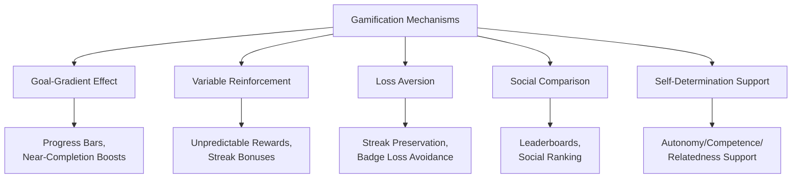
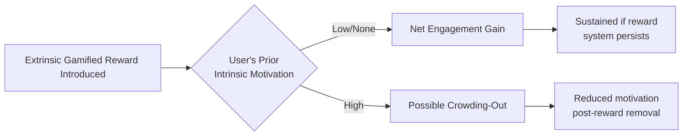

## Gamification and Technology-Driven Behavior Change

### Overview

Gamification is the application of game-design elements — points, badges, leaderboards, levels, streaks, and narrative progression — to non-game contexts in order to influence motivation and behavior. Within behavioral economics, gamification is analyzed as a structured intervention that operationalizes multiple behavioral mechanisms simultaneously (goal-gradient effects, social comparison, loss aversion, variable reinforcement) rather than as a single unified psychological theory. The term was popularized commercially around 2010, with foundational academic framing provided by Deterding, Dixon, Khaled & Nacke (2011), who defined gamification as "the use of game design elements in non-game contexts."

### Theoretical Foundations

**Key Points**

- Gamification draws on **Self-Determination Theory** (Deci & Ryan, 1985, 2000), which identifies autonomy, competence, and relatedness as core drivers of intrinsic motivation — well-designed gamification systems aim to support these needs rather than substitute extrinsic rewards for them
- Draws on the **goal-gradient hypothesis** (Hull, 1932; empirically extended to consumer behavior by Kivetz, Urminsky & Zheng, 2006), which predicts that effort and motivation increase as a goal is perceived to be nearer completion
- Incorporates **variable ratio reinforcement schedules** from operant conditioning (Skinner, 1953), which produce more persistent behavior than fixed reinforcement schedules — the mechanism underlying unpredictable reward mechanics (e.g., loot boxes, random bonus points)
- Leverages **loss aversion** and **social comparison** (per Prospect Theory and Festinger's Social Comparison Theory, 1954) through streak mechanics and leaderboards, respectively

### Core Game-Design Elements and Their Behavioral Function

| Element | Behavioral Mechanism | Example Application |
| --- | --- | --- |
| Points | Quantified feedback, competence signaling | Fitness app calorie/activity points |
| Badges/Achievements | Milestone marking, social signaling | Duolingo streak badges, LinkedIn skill badges |
| Leaderboards | Social comparison, competitive motivation | Peloton leaderboard, Strava segment rankings |
| Progress bars | Goal-gradient effect, Zeigarnik effect | LinkedIn "profile strength" meter |
| Streaks | Loss aversion (streak-breaking framed as loss) | Duolingo daily streak, Snapchat Snapstreaks |
| Levels/Tiers | Structured goal escalation, competence progression | Video game XP systems, airline status tiers |
| Variable rewards | Operant variable-ratio reinforcement | Mobile game loot mechanics, surprise bonuses |
| Narrative/avatars | Relatedness, identity investment | Habitica's RPG-framed task management |

### Landmark Applications

**Example — Duolingo Streak Mechanic**

Duolingo's daily streak counter is among the most cited applied gamification cases in behavioral literature discussions, combining the goal-gradient effect (visible accumulating count), loss aversion (the threat of "losing" an accumulated streak), and variable reward notifications to sustain daily engagement with a low-stakes learning task. [Inference] Publicly reported engagement statistics from Duolingo are self-disclosed by the company; independent, peer-reviewed causal estimates isolating the streak mechanic's specific contribution to retention (separate from other app features) are more limited in the academic literature than the popularity of the example might suggest.

**Example — Fitness and Activity Tracking (Strava, Fitbit)**

Activity-tracking platforms combine points/badges, segment leaderboards, and social sharing to convert exercise — a behavior with delayed, abstract health benefits — into an activity with immediate, socially visible feedback, directly addressing the present-bias problem characteristic of health behavior change.

**Example — Behavior Change in Personal Finance**

Gamified savings apps apply goal-visualization progress bars and milestone badges to savings targets, structurally mirroring the "Save More Tomorrow" behavioral commitment logic but delivered through consumer-facing app design rather than employer-administered defaults.

**Example — Corporate Wellness and Workplace Gamification**

Employer wellness programs frequently use step-count leaderboards and team-based challenges to increase physical activity, drawing on social comparison and relatedness (team affiliation) mechanisms simultaneously.

### Formal Framing: Gamification as Multi-Mechanism Choice Architecture

Unlike a single-lever nudge (e.g., a default), gamification systems typically layer multiple behavioral mechanisms concurrently. The net behavioral effect can be conceptually decomposed as:

$$\Delta B = f(\text{goal-gradient}, \text{loss aversion}, \text{social comparison}, \text{variable reward}, \text{intrinsic motivation support})$$

where the interaction effects between mechanisms (e.g., whether variable rewards undermine or complement intrinsic motivation) are empirically significant and not merely additive.

[Inference] This decomposition is a conceptual organizing framework rather than an empirically estimated structural model; interaction effects between simultaneously deployed game mechanics are studied case-by-case in the applied gamification literature rather than through a single validated additive formula.

### The Motivation Crowding-Out Critique

**Key Points**

- A significant critique, grounded in **motivation crowding theory** (Deci, Koestner & Ryan, 1999; Frey & Jegen, 2001), holds that extrinsic gamified rewards can *undermine* pre-existing intrinsic motivation for a task, producing worse long-run engagement once the extrinsic reward system is removed or once novelty wears off
- This connects to the broader behavioral economics literature on **motivation crowding-out** originally documented in non-gaming contexts (e.g., Gneezy & Rustichini's 2000 daycare late-pickup fine study, where introducing a fine *increased* late pickups by reframing a social norm as a priced transaction)
- Empirical support for crowding-out specifically within gamification contexts is mixed: some studies find sustained engagement gains, others find novelty-driven initial spikes followed by decay once game elements become routine or are perceived as manipulative

### Design Risks and Ethical Considerations

**Key Points**

- **Manipulation and dark game patterns**: gamification mechanics designed primarily to maximize platform engagement metrics (time-on-app, ad exposure) rather than genuine user welfare overlap substantially with the dark-patterns critique applied to digital nudging generally, particularly in mobile gaming monetization (loot boxes, engagement-maximizing notification timing)
- **Addiction and compulsive use concerns**: variable-ratio reinforcement schedules are the same mechanism implicated in slot-machine and gambling addiction research, raising ethical concerns when applied to attention-capture in social media and mobile gaming contexts, particularly among younger users
- **Equity and accessibility**: leaderboard-based social comparison mechanics can demotivate lower-performing users (a documented risk in workplace and fitness gamification), suggesting relative-ranking mechanics require careful segmentation (e.g., cohort-based rather than global leaderboards) to avoid discouraging the users most in need of behavior change
- **Regulatory attention**: loot box mechanics in video games have drawn specific regulatory scrutiny in several jurisdictions due to their structural similarity to gambling mechanics, independent of general gamification design in non-monetized contexts

[Inference] Regulatory treatment of loot boxes and gamified monetization mechanics varies substantially by jurisdiction and continues to evolve; specific current legal status should be verified against up-to-date regulatory sources for any applied compliance context.

### Effective Design Principles (Synthesized Best Practice)

**Key Points**

- Align game mechanics with the user's own underlying goal rather than solely with platform engagement metrics, mirroring the same welfare-alignment criterion used to distinguish ethical nudges from dark patterns
- Favor cohort-relative or self-referential progress comparisons over unsegmented global leaderboards to mitigate demotivation among lower-performing users
- Combine extrinsic game mechanics with support for autonomy and competence (per Self-Determination Theory) rather than relying on extrinsic rewards alone, to reduce crowding-out risk
- Build in graceful degradation for streak mechanics (e.g., "streak freeze" features) to reduce anxiety-driven compulsive engagement while preserving the loss-aversion motivational benefit
- Test for novelty decay explicitly — measure engagement at multiple time horizons, not only short-run adoption metrics, given the well-documented risk of initial-spike-then-decay patterns

### Conclusion

Gamification operationalizes several distinct behavioral economics mechanisms — goal-gradient effects, loss aversion, variable reinforcement, and social comparison — into a composite intervention capable of producing strong short-run engagement effects across health, finance, education, and workplace domains. Its central theoretical tension lies in the motivation crowding-out literature: extrinsically gamified systems risk undermining the intrinsic motivation they are intended to support, particularly once novelty fades or reward removal occurs. Effective and ethical implementation requires deliberate alignment with user welfare, Self-Determination Theory-informed design, and empirical validation across time horizons rather than reliance on short-run engagement metrics alone.

**Related Topics**

- Self-Determination Theory: Autonomy, Competence, and Relatedness in Behavior Design
- Motivation Crowding-Out: Gneezy and Rustichini's Daycare Fine Study
- Variable Ratio Reinforcement and Behavioral Addiction Mechanisms
- Loot Boxes and Gambling-Adjacent Regulation in Digital Games
- Goal-Gradient Hypothesis: From Hull (1932) to Consumer Loyalty Programs
- Digital Nudging and Interface Design (cross-reference)
- Social Comparison Theory and Leaderboard Design Segmentation