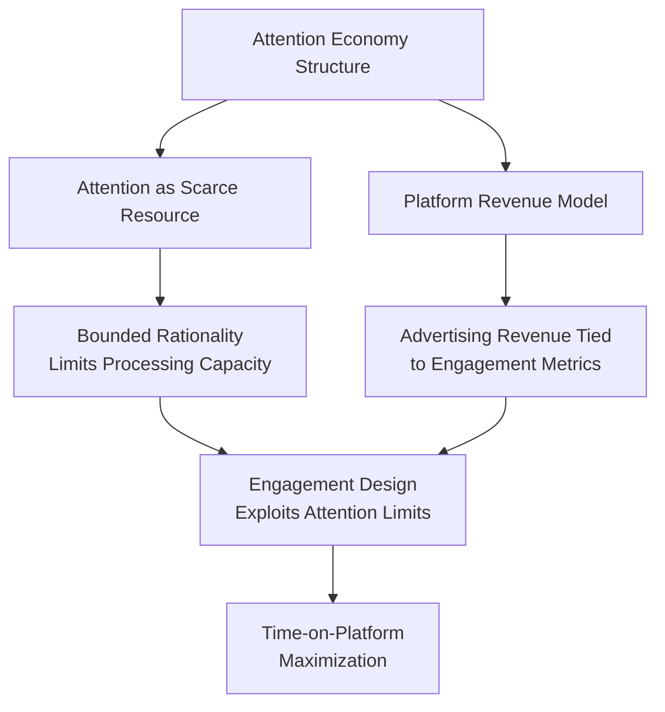
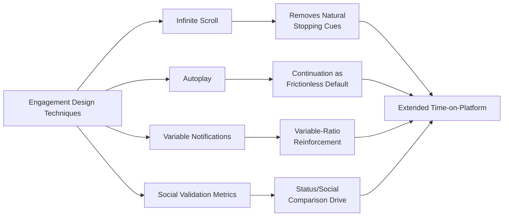
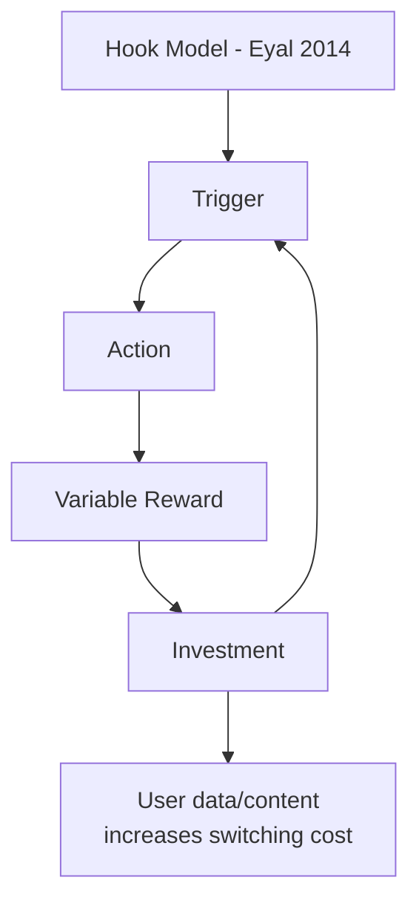

## The Attention Economy and Engagement Design

### Overview

The attention economy is a framework treating human attention as a scarce, monetizable resource, competed for by digital platforms whose business models depend on maximizing time-on-platform, engagement, and advertising exposure. Engagement design refers to the specific product and interface techniques deployed to capture and retain that attention. Within behavioral economics, this domain applies bias-exploitation mechanisms — many overlapping with digital nudging and gamification — but is analyzed distinctly because the underlying incentive structure (platform revenue tied directly to attention capture) creates a systematic misalignment between platform objectives and user welfare that is less characteristic of nudging domains such as public health or retirement savings.

### Theoretical and Historical Foundations

**Key Points**

- The term "attention economy" traces to Herbert Simon's 1971 observation that "a wealth of information creates a poverty of attention," directly connecting the concept to his broader work on bounded rationality
- Formalized as an economic framework by Michael Goldhaber (1997) and Thomas Davenport & John Beck (*The Attention Economy*, 2001), describing attention as the scarce input constraining information consumption in a low-marginal-cost content environment
- Distinguished from earlier media economics by the shift from **advertising-supported broadcast attention** (fixed time slots, one-to-many) to **algorithmically optimized, individually targeted, continuously measured attention capture** (real-time engagement metrics, infinite content supply)

### Core Engagement Design Mechanisms

**Key Points**

- **Infinite scroll**: removes the natural stopping cue provided by pagination, eliminating a decision point at which users would otherwise consciously evaluate whether to continue — directly targets the friction-reduction channel described in the digital nudging literature, but applied to *continuation* rather than a beneficial action
- **Autoplay**: converts the next content item into the frictionless default, requiring active user effort to stop consumption rather than to continue it — a direct application of the default-effect mechanism to attention retention
- **Variable-ratio notification and reward schedules**: intermittent, unpredictable rewards (likes, comments, messages) exploit the same operant-conditioning mechanism (Skinner, 1953) implicated in gambling behavior, producing check-in patterns resistant to habituation
- **Social validation metrics**: visible like counts, follower counts, and read receipts leverage social comparison and status-seeking motivations, converting social interaction into quantified, competitively comparable feedback

### Behavioral Mechanisms Underlying Attention Capture

**Present Bias and the Intention-Action Gap**

Users frequently report intending to spend limited time on a platform ("just checking quickly") but exceed that intention substantially — a direct manifestation of present bias and the naive-agent problem from the quasi-hyperbolic discounting literature, where the immediate small reward of continued scrolling is weighted disproportionately relative to the delayed, diffuse cost of lost time.

**Formal Representation**

Engagement-maximizing design can be represented as systematically minimizing the friction of continuation ($\phi_{continue}$) while maximizing the friction of exit ($\phi_{exit}$):

$$P(\text{continued engagement}) = P^*(\text{continue}) + \psi(\phi_{exit} - \phi_{continue})$$

where $\psi$ captures the sensitivity of behavior to the asymmetry in friction between continuing versus stopping — structurally the mirror image of the ethical opt-out design criterion (symmetric friction) discussed in the digital nudging literature.

[Inference] This formalization is an expository model illustrating the structural logic of engagement design as a friction-asymmetry problem; it is not a single empirically validated equation drawn directly from a specific published study, though the underlying friction-asymmetry concept is well established across the digital nudging and dark-patterns literature.

**Variable Reward and Dopaminergic Framing**

[Inference] Popular accounts of engagement design frequently invoke dopamine and neuroscientific framing (e.g., "dopamine loops") to describe variable-reward mechanics; while behavioral (operant conditioning) evidence for variable-ratio schedules producing persistent, habituation-resistant behavior is well established, the specific neurochemical claims popularized in mainstream commentary are often simplified or overstated relative to the underlying neuroscience literature, and should be treated as a behavioral-level rather than a precisely validated neurological explanation in this context.

### Landmark Critiques and Contributions

**Key Points**

- Tristan Harris and the **Center for Humane Technology** popularized the "attention economy" critique within technology policy discourse, arguing that engagement-optimized design constitutes a systematic, asymmetric exploitation of predictable cognitive biases by platforms with vastly superior optimization resources relative to individual users
- Natasha Dow Schüll's *Addiction by Design* (2012), studying slot machine engineering, is frequently cited as a direct behavioral-design precursor and analogy for digital engagement mechanics, given the shared reliance on variable-ratio reinforcement
- Nir Eyal's *Hooked* (2014) provides an industry-facing "Hook Model" (trigger → action → variable reward → investment) explicitly describing habit-formation engagement design from a product-design rather than critical perspective, illustrating that the same behavioral mechanisms are documented from both advocacy and critique standpoints

### Distinguishing Attention Economy Design from General Digital Nudging

| Dimension | General Digital Nudging | Attention Economy Engagement Design |
| --- | --- | --- |
| Primary objective | Varies (health, savings, safety) | Platform engagement/advertising revenue |
| Alignment with user welfare | Often aligned or neutral | Frequently misaligned by default incentive structure |
| Typical mechanism | Defaults, framing, norms | Autoplay, infinite scroll, variable notifications |
| Primary bias exploited | Status quo bias, loss aversion | Present bias, variable-ratio conditioning |
| Reversibility of harm | Often low-stakes, reversible | Cumulative time/attention loss, harder to "reverse" |

### Welfare, Policy, and Design Responses

**Key Points**

- **Attention-preserving design features** have emerged as a partial industry and regulatory response, including screen-time tracking dashboards, "take a break" prompts, and default notification batching — these apply nudge mechanics in the opposite direction, toward reduced engagement
- **Regulatory attention** parallels the dark-patterns discussion in digital nudging, with proposals and enacted measures (e.g., restrictions on autoplay and infinite scroll for minors in some jurisdictions, algorithmic transparency requirements under the EU Digital Services Act) specifically targeting engagement-maximizing design as a distinct regulatory category
- **Self-regulation tensions**: platforms offering attention-preserving tools face a direct conflict between the tool's stated purpose (user wellbeing) and the platform's underlying revenue incentive (continued engagement), a structural tension noted repeatedly in critiques of "digital wellbeing" feature design
- [Inference] The empirical effectiveness of platform-provided digital wellbeing tools (screen-time dashboards, break reminders) in producing sustained reductions in usage is mixed and contested in the available research; self-reported usage reduction and actual behavioral change do not consistently align in published studies, and this remains an active area of measurement and research rather than a settled finding

### Attention Economy and Psychological Wellbeing

**Key Points**

- A substantial body of research examines correlations between heavy engagement-optimized platform use and outcomes including sleep disruption, attentional fragmentation, and social comparison-driven wellbeing effects, particularly in adolescent populations
- [Inference] The causal relationship between social media engagement design specifically (as opposed to social media use generally, or other confounding factors) and mental health outcomes remains a genuinely contested empirical question in the psychological and public health literature, with meta-analyses and longitudinal studies reaching varying conclusions on effect size and causality; this document does not assert a settled causal claim and readers should consult current peer-reviewed meta-analyses for the state of evidence
- This distinguishes attention-economy critique as an area where behavioral-mechanism evidence (variable reinforcement, friction asymmetry) is comparatively well established, while downstream wellbeing causal claims are comparatively less settled

### Conclusion

The attention economy applies core behavioral economics mechanisms — present bias, variable-ratio reinforcement, default-effect friction asymmetry, and social comparison — within a distinctive incentive structure where the choice architect's revenue model is directly tied to maximizing the very behavior (sustained attention capture) that nudging ethics literature generally treats as requiring careful welfare justification. This structural misalignment, more than any single design technique, is what differentiates attention-economy engagement design from other digital nudging applications, and is the primary basis for the sustained regulatory and design-ethics scrutiny the domain has attracted.

**Related Topics**

- Variable Ratio Reinforcement Schedules: From Skinner to Slot Machines to Notifications
- The Hook Model (Eyal) vs. Time Well Spent (Harris): Competing Design Philosophies
- Dark Patterns and Regulatory Response: EU Digital Services Act Provisions
- Present Bias and the Intention-Action Gap in Screen Time
- Digital Nudging and Interface Design (cross-reference)
- Digital Wellbeing Tools: Design Tensions and Effectiveness Evidence
- Social Comparison Theory in Social Media Feedback Systems