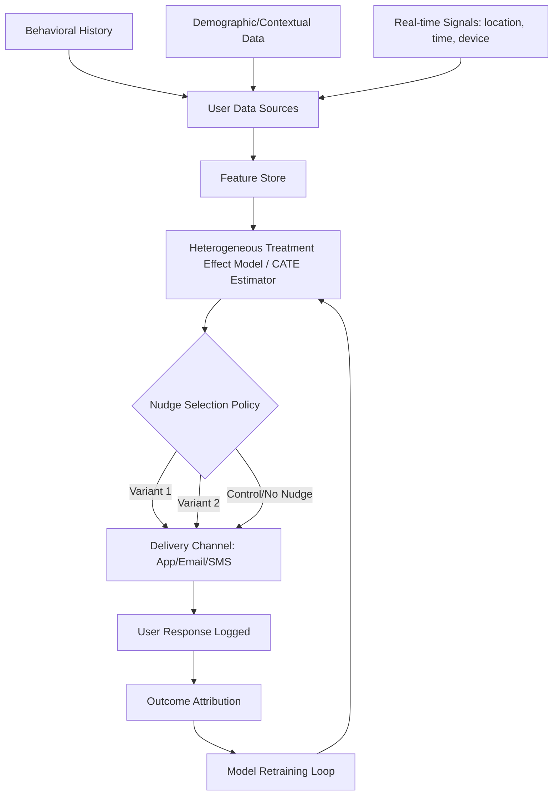

## Personalized and Algorithmic Nudging

### Definition and Conceptual Foundations

Personalized and algorithmic nudging refers to the use of computational systems—typically machine learning models—to dynamically tailor choice architecture interventions to individual users based on their data, behavioral history, and predicted responsiveness. This extends classical nudge theory (Thaler & Sunstein) from static, one-size-fits-all defaults and framings toward adaptive interventions that vary across individuals, contexts, and time.

The core distinction from traditional nudging:

- **Static nudge**: A single default or framing applied uniformly (e.g., opt-out organ donation for an entire population)
- **Personalized nudge**: The content, timing, channel, or intensity of the intervention is selected per-individual, often via a predictive model estimating which nudge variant will maximize a target outcome for that specific person

This shift is enabled by three converging factors: (1) large-scale behavioral data collection (clickstreams, purchase histories, biometric signals), (2) low-cost A/B and multi-armed bandit experimentation infrastructure, and (3) machine learning models capable of estimating heterogeneous treatment effects (HTE) — i.e., predicting that a nudge which works for user A may not work for user B.

### Theoretical Mechanisms

Personalized nudges typically operate through the same psychological channels as traditional nudges but exploit individual-level variation in their strength:

**Table: Mechanism mapping**

| Mechanism | Classical Example | Algorithmic Personalization |
| --- | --- | --- |
| Default effects | Opt-out retirement enrollment | Default contribution rate set per-user based on predicted income trajectory |
| Social proof | "9 out of 10 people..." | Comparison cohort selected to be maximally persuasive to that user (e.g., neighbors, similar spenders) |
| Loss aversion framing | "Don't lose your discount" | Framing (gain vs. loss) A/B-tested and assigned per-user via uplift model |
| Present bias exploitation | Generic reminder emails | Reminder timing optimized to each user's historically observed decision window |
| Salience | Fixed red warning banners | Visual salience (color, size, position) tuned via reinforcement learning to individual attention patterns |

The key theoretical addition is **treatment effect heterogeneity**: rather than assuming a constant average treatment effect (ATE) across a population, the algorithmic approach models a conditional average treatment effect (CATE):

$$\text{CATE}(x) = E[Y(1) - Y(0) \mid X = x]$$

where $Y(1)$ and $Y(0)$ are potential outcomes under treatment (nudge) and control, and $X$ represents user covariates. Personalization assigns the nudge variant that maximizes predicted $\text{CATE}(x)$ for each user $x$.

### System Architecture

A typical production algorithmic nudging pipeline consists of the following components:

**Component breakdown:**

1. **Feature store**: Aggregates behavioral, transactional, and contextual features per user (recency/frequency/monetary metrics, session patterns, prior nudge responses)
2. **CATE/uplift model**: Common implementations include causal forests, meta-learners (S-learner, T-learner, X-learner), or double/debiased machine learning (Chernozhukov et al.)
3. **Policy layer**: Converts CATE estimates into an actual decision — often via a multi-armed bandit (Thompson sampling, UCB) or contextual bandit that balances exploration (learning) and exploitation (applying the best-known nudge)
4. **Delivery layer**: Renders the nudge in-product (UI microcopy, push notification, default pre-selection)
5. **Feedback loop**: Logs outcomes to retrain the CATE model, closing the loop

### Meta-Learner Approaches for CATE Estimation

**S-Learner (Single model)**: Treatment indicator $T$ included as a feature in one model $\hat{\mu}(x, t)$; CATE estimated as $\hat{\mu}(x,1) - \hat{\mu}(x,0)$.

**T-Learner (Two models)**: Separate models fit on treated and control groups, $\hat{\mu}_1(x)$ and $\hat{\mu}_0(x)$; CATE is the difference.

**X-Learner**: Extends T-learner by imputing individual treatment effects and re-weighting by propensity score $\hat{e}(x)$ — generally more robust when treatment groups are imbalanced, which is common in nudging deployments (control group often much smaller).

**Causal Forests** (Wager & Athey, 2018): Adapt random forests to directly optimize for treatment effect heterogeneity rather than outcome prediction, using an honesty-splitting criterion so the same data isn't used to both determine splits and estimate effects.

### Practical Examples

**Example 1 — Personalized default retirement contributions**

A fintech app estimates each user's optimal default contribution rate using a model trained on prior cohorts' opt-out and adjustment behavior. Instead of a fixed 3% default, the system might set:

- Higher earners with volatile income history → lower default (reduces opt-out risk)
- Stable-income, young users → higher default (matches literature on time-inconsistent preferences being strongest early in career)

**Example 2 — E-commerce urgency messaging**

A CATE model identifies that scarcity framing ("Only 2 left") increases conversion for users with high historical price-sensitivity but *decreases* trust-related conversion for users flagged as having previously abandoned carts after seeing urgency messaging (interpreted as reactance). The policy layer suppresses urgency framing for the latter segment.

**Example 3 — Health app reminder timing**

Rather than a fixed 8 AM medication reminder, a contextual bandit learns each user's individual adherence-maximizing send time by treating send-time as an arm and adherence (binary) as reward, updating posterior estimates via Thompson sampling.

### Distinction from Related Concepts

| Concept | Key Difference |
| --- | --- |
| A/B testing | Tests one intervention vs. control at population level; does not tailor per-individual |
| Hyper-nudging (Yeung, 2017) | Term specifically describing continuous, real-time algorithmic adjustment of choice environments (a superset/related framing of personalized nudging) |
| Sludge | Friction-based dark patterns; personalized nudging can *become* sludge when personalization is used to exploit rather than assist |
| Recommender systems | Optimize for engagement/relevance broadly; nudging specifically targets a pre-defined behavioral outcome (e.g., savings, health adherence) using known biases |

### Ethical and Regulatory Considerations

Algorithmic nudging raises concerns distinct from static nudging due to its scale, opacity, and adaptiveness:

- **Asymmetric information exploitation**: The nudger has statistical knowledge of an individual's specific behavioral vulnerabilities (e.g., precise loss-aversion coefficient), creating power asymmetries beyond what static nudges present
- **Autonomy and manipulation**: Personalization can shift a nudge from "libertarian paternalism" (preserving choice, aiding decision-making) toward manipulation, since the intervention is calibrated to *individual* psychological weak points rather than general biases
- **Transparency**: Because nudge variants differ by user, disclosure is harder to standardize; regulatory frameworks like the EU's Digital Services Act and Digital Markets Act have begun addressing "dark patterns" and personalized manipulation explicitly, though algorithmic nudging as a category remains only partially codified [Inference — regulatory treatment is still evolving and varies significantly by jurisdiction as of current frameworks]
- **Feedback loop risk**: Continuous retraining on engagement/compliance metrics can drift the system toward exploiting cognitive biases more aggressively over time if guardrails aren't imposed on the objective function (a manifestation of Goodhart's Law in this context)
- **Fairness across CATE**: Optimizing for aggregate outcome improvement can systematically disadvantage subgroups whose predicted treatment effect is negative or near-zero, effectively excluding them from beneficial interventions

### Evaluation Metrics

Personalized nudging systems are typically evaluated using:

- **Uplift** (incremental conversion vs. control): $\text{Uplift} = P(\text{outcome} \mid \text{treated}) - P(\text{outcome} \mid \text{control})$
- **Qini coefficient**: Analogous to the Gini coefficient but for uplift models, measuring how well a model ranks users by treatment responsiveness
- **AUUC (Area Under the Uplift Curve)**: Aggregate measure of targeting quality across the population
- Behavior-specific downstream outcomes (e.g., savings rate, medication adherence, checkout completion) — [Note: reported effect sizes vary considerably across deployment contexts and are not guaranteed to replicate outside the original study population]

### Related Topics

- Multi-armed and contextual bandits for behavioral intervention optimization
- Heterogeneous treatment effect estimation (causal forests, meta-learners)
- Dark patterns and manipulative design taxonomy
- Digital nudging in choice architecture (Weinmann, Schneider & vom Brocke framework)
- Regulation of AI-driven persuasive technology (EU DSA/DMA, FTC dark patterns enforcement)
- Reinforcement learning from human feedback (RLHF) as a parallel personalization paradigm
- Privacy-preserving personalization (federated learning, differential privacy in behavioral targeting)