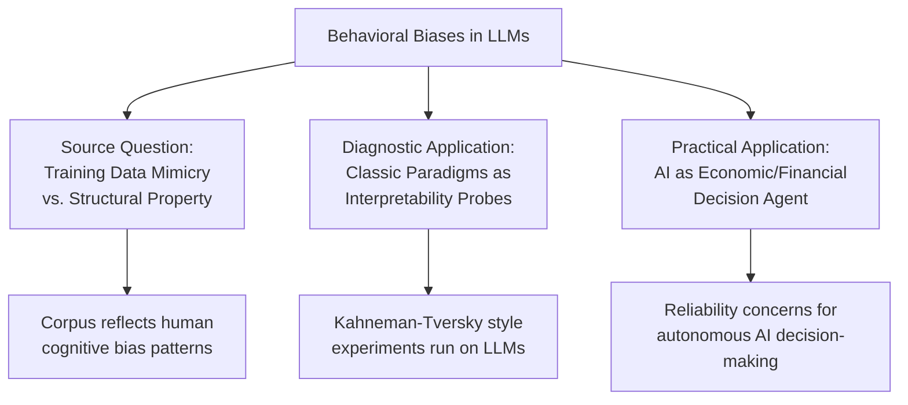
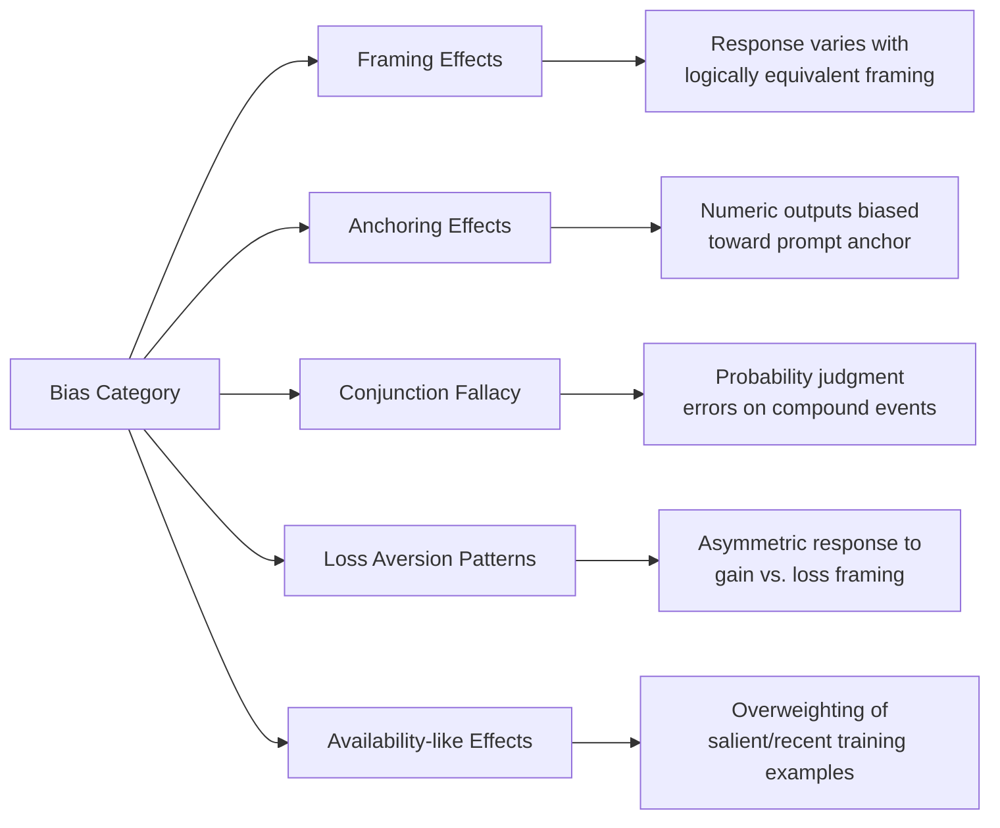
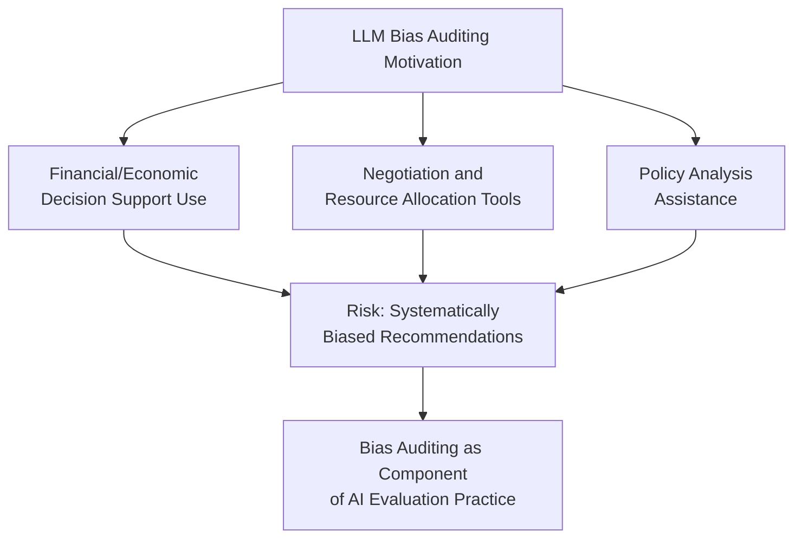

## Behavioral Biases in AI and Large Language Models

### Overview

Behavioral biases in AI and large language models refers to a growing research area examining whether machine learning systems — particularly LLMs trained on human-generated text — exhibit systematic decision-making patterns analogous to the cognitive biases documented in human behavioral economics (anchoring, framing effects, loss aversion, availability bias). This differs from the algorithmic-nudging literature's focus on AI as a *choice architect* acting on human users; this domain instead treats the AI system itself as a *decision-making subject* being probed with the same experimental paradigms originally developed by Kahneman, Tversky, and subsequent behavioral economists.

### Motivation and Research Origins

**Key Points**

- The core research question is whether biases emerge in LLMs because they are statistically learned from a training corpus overwhelmingly generated by cognitively biased humans, producing an inherited or "mimicked" bias pattern, versus whether such patterns reflect something structurally distinct about how these models process information
- A parallel and growing literature applies classic behavioral economics experimental paradigms (originally designed for human subjects) directly to LLMs as a diagnostic and interpretability tool, treating the model as a subject in a replicated psychology/economics experiment
- This research intersects three distinct fields: behavioral economics (source of experimental paradigms), AI interpretability/alignment (motivation for understanding model decision patterns), and computational social science (methodology for large-scale behavioral probing)

### Documented Bias Patterns in LLM Behavior

**Key Points**

- Multiple studies (including work applying Kahneman-Tversky-style prompts to GPT-family and other LLMs) report LLM responses replicating classic bias patterns such as **framing effects** (differential responses to logically equivalent gain- vs. loss-framed prompts), **anchoring effects** (numeric estimates biased toward an arbitrary prompt-embedded anchor), and **conjunction fallacy**-style errors (analogous to the "Linda problem")
- Reported effect sizes and consistency vary considerably across studies, model families, model versions, and prompt-engineering choices, and results are not uniform across all documented human biases — some studies find certain biases strongly replicated while others are weak, inconsistent, or absent depending on model and methodology
- [Unverified] Because this is an active and fast-moving research area with results that vary significantly by model version and are sensitive to specific experimental methodology, this document does not assert specific quantitative effect sizes for any named commercial model; readers requiring current findings should consult recent peer-reviewed or preprint literature directly, as results reported for one model version may not generalize to subsequent versions

### Methodological Framework for Probing LLM Bias

**Key Points**

- Research in this area typically adapts established experimental instruments directly from behavioral economics (e.g., Kahneman-Tversky heuristics-and-biases questionnaires, Allais Paradox gamble pairs, standard framing-effect vignettes) and administers them to LLMs via prompting, analogous to running a human subject through the original experimental protocol
- Key methodological challenges distinct from human-subject research include: **prompt sensitivity** (minor wording changes can produce large output differences, unlike relatively stable human responses to semantically equivalent phrasing), **non-independence across queries** (repeated queries to the same model are not independent samples in the way distinct human subjects are), and **training data contamination** (the specific experimental vignette may already appear in the model's training corpus, conflating genuine bias replication with memorized recall of the "correct" psychology-literature answer)
- Researchers have proposed adapted methodologies such as varying surface wording while preserving logical structure, testing across multiple model versions and providers, and comparing outputs against both the "rational" (EUT-consistent) answer and the documented human-bias answer to characterize which pattern the model output resembles

$$\text{Bias Score} = \frac{|\text{Model Response} - \text{Rational Benchmark}|}{|\text{Documented Human Bias Response} - \text{Rational Benchmark}|}$$

[Inference] This scoring formulation is a simplified illustrative framework for how bias-replication studies conceptually compare model outputs against rational and human-biased benchmarks; specific published studies employ varied and more methodologically detailed scoring approaches, and this formula should not be read as a standardized metric adopted uniformly across the field.

### Competing Explanations for Observed Patterns

**Key Points**

- **Training-data mimicry hypothesis**: LLM outputs replicate human bias patterns because the model is fundamentally a statistical predictor of human-generated text, and human-generated text itself reflects biased human judgment — under this view, bias replication is an expected and mechanistically unsurprising property of next-token prediction over a human corpus
- **Emergent/structural hypothesis**: some researchers argue certain observed patterns may reflect properties of the model's internal representation or optimization process distinct from simple corpus mimicry, though this remains considerably more contested and less empirically settled than the mimicry explanation
- **Prompt-artifact hypothesis**: a methodological counter-view holds that some reported "biases" are artifacts of prompt design, evaluation methodology, or researcher-experimenter framing effects rather than robust properties of the underlying model

[Speculation] The relative explanatory weight of these competing hypotheses is not resolved in the current literature; claims asserting that LLMs possess genuinely emergent, structurally novel cognitive biases (as opposed to statistically inherited or prompt-methodology-driven patterns) should be treated as contested rather than established, and this document does not endorse any single explanation as settled.

### Practical Implications: AI as Economic Decision Agent

**Key Points**

- As LLMs are increasingly deployed in roles involving financial analysis, negotiation assistance, resource allocation recommendations, and other economically consequential decision support, the presence of human-analogous biases raises practical reliability concerns distinct from the pure research question of bias origin
- Applications in algorithmic trading, automated procurement, and AI-assisted policy analysis have prompted specific interest in **bias auditing** for AI decision-support systems, applying behavioral economics diagnostic tools as a component of broader AI evaluation and red-teaming practice
- This connects to, but is analytically distinct from, AI alignment and safety research more broadly — behavioral-bias auditing focuses specifically on decision-quality patterns analogous to documented human cognitive biases, rather than the full scope of AI safety concerns (e.g., goal misalignment, deceptive behavior)

### Distinguishing This Domain from Algorithmic Nudging

| Dimension | Algorithmic Nudging | Behavioral Biases in AI/LLMs |
| --- | --- | --- |
| AI's role | Choice architect acting on humans | Decision-making subject being studied |
| Behavioral economics application | Designing interventions using known biases | Diagnosing whether AI exhibits known biases |
| Primary concern | Manipulation of human users | Reliability/soundness of AI-generated decisions |
| Methodology | Causal inference, treatment effect estimation | Adapted experimental psychology/economics protocols |

### Limitations and Open Research Questions

**Key Points**

- Reproducibility across model versions is a persistent challenge: because commercial LLMs are frequently updated, a documented bias pattern in one model version is not guaranteed to persist, disappear, or change direction in subsequent versions, complicating longitudinal claims
- The relationship between bias patterns observed in single-turn prompted responses versus multi-turn agentic behavior (where an AI system takes sequential actions with real-world consequences) is comparatively underexplored relative to single-prompt experimental paradigms
- [Inference] Whether mitigation techniques used for human cognitive bias (e.g., structured decision protocols, checklists, deliberate perspective-taking) transfer effectively to reducing analogous patterns in LLM outputs is an open empirical question rather than an established finding, and claims of effective mitigation should be evaluated against specific published evidence rather than assumed by analogy to human debiasing research

### Conclusion

Research on behavioral biases in AI and large language models extends the experimental toolkit of behavioral economics from human subjects to machine subjects, motivated both by scientific curiosity about the source of these patterns (training-data mimicry versus structural emergence) and by practical concerns about the reliability of AI systems increasingly deployed in economically consequential decision-support roles. The field remains methodologically young, with significant open questions regarding reproducibility across model versions, the relative contribution of prompt artifacts versus genuine model properties, and the extent to which findings from single-turn experimental probes generalize to more complex, multi-turn agentic AI behavior.

**Related Topics**

- Kahneman-Tversky Experimental Paradigms Adapted for Machine Learning Evaluation
- Training Data Mimicry vs. Emergent Properties in Large Language Models
- AI Red-Teaming and Bias Auditing Methodologies
- Personalized and Algorithmic Nudging (cross-reference)
- Prompt Sensitivity and Reproducibility Challenges in LLM Behavioral Research
- Multi-Turn Agentic AI Behavior vs. Single-Prompt Experimental Design
- AI Alignment and Safety: Relationship to Behavioral Reliability Research