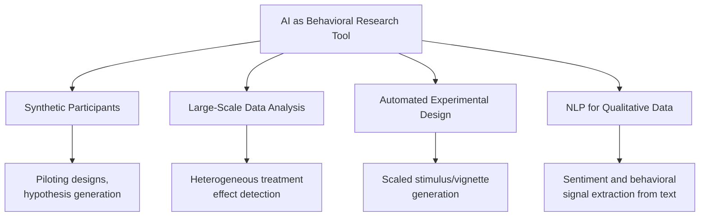
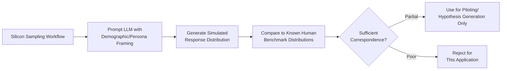
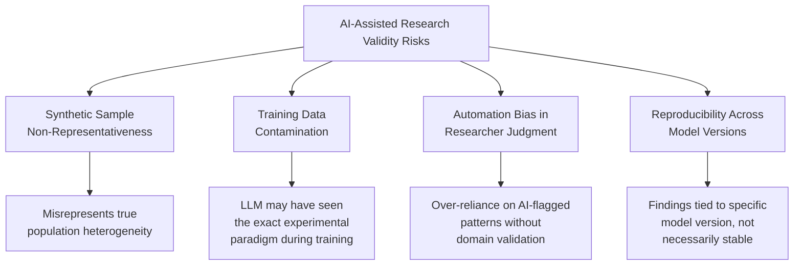

## AI as a Tool for Behavioral and Experimental Research

### Overview

This domain examines the use of artificial intelligence — particularly large language models and machine learning systems — as methodological instruments within behavioral economics research, distinct from prior chapters' focus on AI as a choice architect (algorithmic nudging) or as a subject exhibiting biases. Here, AI functions as a research tool: generating synthetic experimental subjects, analyzing large-scale behavioral datasets, automating experimental design, and augmenting traditional laboratory and field experiment methodologies.

### Core Application Categories

**Key Points**

- **Synthetic/simulated participants**: using LLMs to generate simulated survey or experimental responses, either to pilot experimental designs before costly human-subject recruitment or, more controversially, as a partial substitute for human subjects in specific research contexts
- **Large-scale behavioral data analysis**: applying machine learning to detect patterns, heterogeneous treatment effects, and anomalies in large observational or experimental behavioral datasets that would be impractical to analyze with traditional econometric methods alone
- **Automated experimental design and text generation**: using AI to generate experimental stimuli (vignettes, framing variations, survey items) at scale, enabling systematic variation across many conditions that would be labor-intensive to hand-write
- **Natural language processing of qualitative behavioral data**: applying NLP techniques to open-ended survey responses, interview transcripts, and naturalistic text data (social media, customer service logs) to extract behavioral and sentiment signals at scale

### Synthetic Participants and "Silicon Sampling"

**Key Points**

- The practice of prompting LLMs to simulate human survey or experimental responses is sometimes termed **"silicon sampling"** or the use of **"synthetic samples"** in the emerging methodological literature (e.g., Argyle et al., 2023, examining whether LLM outputs can approximate human political and social survey response distributions)
- Proposed uses include **low-cost piloting** (testing experimental instrument wording and structure before human-subject deployment), **hypothesis generation** (exploring plausible response patterns across many conditions rapidly), and **gap-filling** for underrepresented or hard-to-recruit populations
- This use is analytically distinct from, but methodologically related to, the LLM-bias-probing research discussed elsewhere in this course: silicon sampling *uses* LLM outputs as a stand-in for human data, whereas bias-probing research treats LLM outputs as the object of study in their own right

**Critical Limitations**

[Inference] The methodological validity of silicon sampling is actively and substantively contested in the research methods literature. Documented concerns include: LLM outputs reflecting the demographic composition and biases of training data and RLHF fine-tuning processes rather than genuine population heterogeneity; inconsistent correspondence to human response distributions across different topics, demographic groups, and question types; and the risk that researchers may inadvertently treat model outputs as substitutes for genuine human data collection in contexts where the correspondence has not been independently validated for that specific research question. Current methodological consensus, to the extent one exists, treats synthetic sampling as a supplementary tool for piloting and hypothesis generation rather than a validated replacement for human-subject data collection in confirmatory research.

### Large-Scale Behavioral Data Analysis

**Key Points**

- Machine learning methods — including the causal forests and meta-learner approaches referenced in the algorithmic nudging literature — are increasingly applied within academic behavioral economics research itself (not only in commercial nudging applications) to detect **heterogeneous treatment effects** in large field experiments, identifying which subpopulations respond differently to a given behavioral intervention
- **Text-as-data** methods apply NLP to extract behaviorally relevant variables from unstructured sources: sentiment analysis of financial disclosures (linked to market reaction research), topic modeling of consumer complaints, and linguistic analysis of negotiation transcripts
- Predictive modeling of behavioral outcomes (e.g., predicting loan default, savings behavior, or health-behavior adherence from administrative or app-usage data) allows researchers to identify candidate behavioral mechanisms for subsequent targeted experimental investigation, functioning as a hypothesis-generation step preceding traditional causal experimental design

### Automated Experimental Design

**Key Points**

- LLMs can generate large sets of framing variations, vignette wording, or survey item phrasings while holding logical/structural content constant, enabling researchers to test robustness of a behavioral effect across many surface-level presentations rather than a single hand-crafted wording — directly addressing the prompt-sensitivity and wording-robustness concerns raised in the LLM-bias-probing literature
- Some experimental economics researchers have begun using AI-assisted tools to generate and pre-screen candidate experimental manipulations before human pretesting, potentially reducing the cost and time of iterative experimental design refinement
- [Inference] The extent to which AI-generated experimental stimuli match the quality, validity, and absence of unintended confounds achieved by expert-hand-crafted stimuli is not yet a settled methodological question; current best practice, per available discussion in the methods literature, treats AI-generated stimuli as requiring human expert review and validation before deployment in confirmatory research rather than as a fully automated substitute for expert experimental design

### Methodological Risks and Validity Concerns

**Key Points**

- **Training data contamination** is a particularly acute concern for behavioral economics specifically, since many classic experimental paradigms (Allais Paradox, Linda problem, ultimatum game vignettes) are extensively documented in text likely included in LLM training corpora — meaning silicon-sampled "replications" of classic findings may partly reflect memorized textual association with the "known" result rather than genuine simulated reasoning
- **Reproducibility across model versions** poses a distinct challenge for AI-assisted research relative to traditional methods: a finding generated using one LLM version may not replicate on a subsequent version, complicating the standard scientific reproducibility expectations behavioral economics research otherwise adheres to
- Professional and journal-level methodological guidance on appropriate disclosure, validation, and use-case boundaries for AI-assisted behavioral research is still developing; researchers are generally advised to treat AI-generated data and analysis as requiring the same or greater scrutiny as any novel, unvalidated methodology, with explicit disclosure of AI tool use in methods sections

### Appropriate and Inappropriate Use Cases (Synthesized Guidance)

| Use Case | Appropriateness (per current methodological discussion) |
| --- | --- |
| Piloting survey wording before human deployment | Generally considered appropriate as a supplementary step |
| Generating hypothesis candidates for further testing | Generally considered appropriate |
| Replacing human subjects in confirmatory hypothesis testing | Not currently considered methodologically validated |
| Large-scale text analysis of existing behavioral data | Well-established, widely accepted application |
| Detecting heterogeneous treatment effects in field experiment data | Increasingly standard, methodologically grounded in causal ML literature |
| Sole basis for publishing novel behavioral findings without human validation | Not currently considered acceptable practice per prevailing methodological norms |

[Inference] This table reflects a synthesis of prevailing methodological caution as commonly expressed in current discussions of AI-assisted social science research; it does not represent a single official, universally adopted standard, and specific journal or disciplinary guidelines may vary and should be consulted directly for any specific research application.

### Relationship to Traditional Experimental Economics Methodology

**Key Points**

- Traditional experimental economics, following the methodological standards established by Vernon Smith and the broader experimental economics tradition, emphasizes financial incentive compatibility, controlled laboratory conditions, and human-subject data as foundational — AI-assisted methods are best understood as a growing complement to, rather than a replacement for, this established methodological core
- The integration of AI tools into behavioral research parallels earlier methodological expansions in the field (the shift from lab-only to field experiments, then to large-scale online experiments via platforms such as Amazon Mechanical Turk and Prolific), each of which required its own period of methodological validation before becoming broadly accepted
- [Inference] Where AI-assisted methods will ultimately settle within this methodological hierarchy — as a validated data-collection substitute, a piloting-only tool, or primarily an analysis-layer technology — remains an open and actively debated question within the experimental economics and behavioral science methodology community

### Conclusion

AI tools offer behavioral economics researchers meaningful efficiency gains in experimental design, large-scale data analysis, and hypothesis generation, with text-as-data and heterogeneous treatment effect estimation methods now reasonably well established within the field's standard methodological toolkit. The more novel and contested application — using AI-generated synthetic participants as a partial substitute for human-subject data — remains methodologically unsettled, constrained by training-data contamination risks, uncertain correspondence to true human response heterogeneity, and reproducibility concerns tied to rapid model versioning. Current best practice treats AI as a tool for augmenting and accelerating the human-subject experimental process rather than as a validated replacement for it in confirmatory research.

**Related Topics**

- Silicon Sampling and Synthetic Survey Respondents: Validity Debates
- Heterogeneous Treatment Effect Estimation in Field Experiments
- Text-as-Data Methods in Economics and Finance Research
- Training Data Contamination in LLM-Based Replication Studies
- Behavioral Biases in AI and Large Language Models (cross-reference)
- The Evolution of Experimental Economics Methodology: Lab to Field to Online to AI-Assisted
- Research Ethics and Disclosure Standards for AI-Assisted Social Science