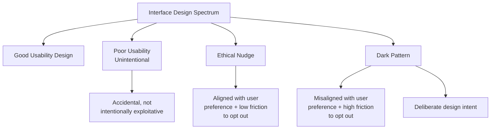
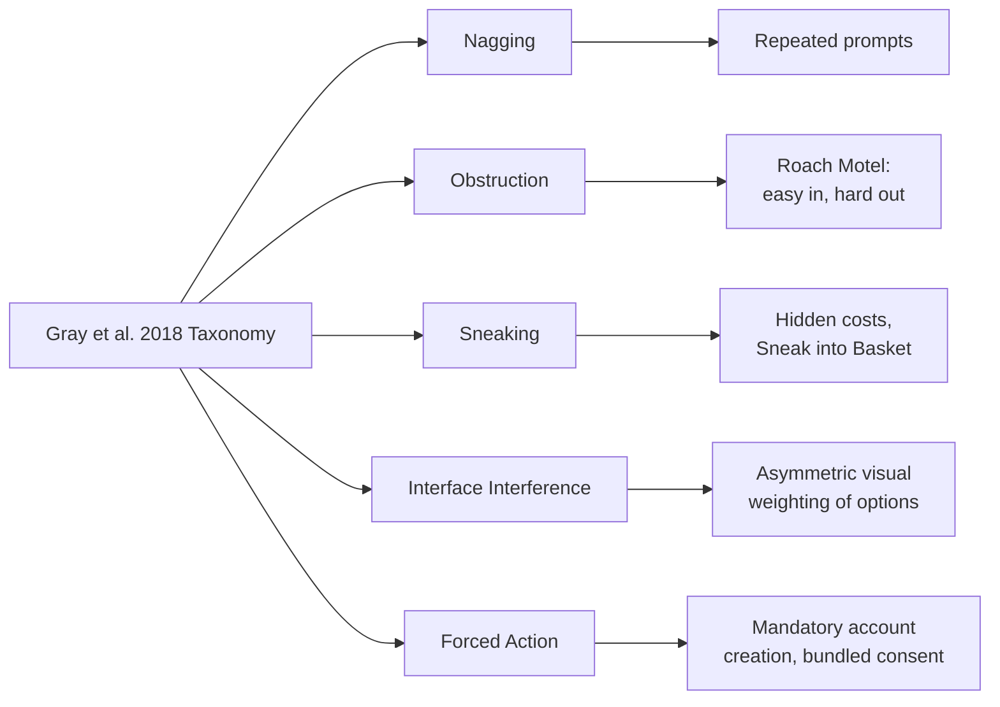
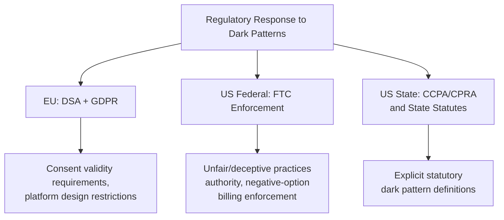

## Dark Patterns in Digital Platforms and Apps

### Overview

Dark patterns are user interface and experience designs that deliberately exploit cognitive biases to manipulate users into decisions they would not otherwise make, typically benefiting the platform or business at the user's expense. While the concept overlaps substantially with material introduced under digital nudging, this domain treats dark patterns as its own systematic subject — covering the formal taxonomy, empirical prevalence research, and regulatory response in depth. The term was coined by UX researcher Harry Brignull in 2010, who established the first widely referenced dark-pattern taxonomy and the associated tracking website darkpatterns.org (later rebranded deceptive.design).

### Definitional Core and Relationship to Nudging

**Key Points**

- A dark pattern is distinguished from an ethical nudge along the same two criteria introduced in the digital nudging literature: (1) **misalignment** with the user's likely informed preference, and (2) **friction asymmetry** — disproportionate ease of the exploitative path relative to the user-protective path
- Brignull's original framing emphasized that dark patterns are not accidental poor design (usability failures) but **deliberately engineered** to produce a specific manipulative outcome, distinguishing the category from ordinary UX mistakes
- Academic formalization followed Brignull's practitioner-originated concept: Gray, Kou, Battles, Hoggatt & Toombs (2018) provided an HCI-grounded taxonomy, and Mathur et al. (2019) conducted the first large-scale automated empirical audit of dark pattern prevalence across e-commerce websites

### Formal Taxonomies

**Mathur et al. (2019) Taxonomy** — derived from automated crawling of approximately 11,000 e-commerce websites, this taxonomy organizes dark patterns along dimensions including the cognitive bias or heuristic exploited, and remains one of the most cited empirical classification systems.

**Gray et al. (2018) Taxonomy** — an HCI-theoretical taxonomy organizing dark patterns into five high-level categories:

| Category | Description | Example |
| --- | --- | --- |
| Nagging | Repeated interruption redirecting toward a non-requested action | Repeated app permission or upgrade prompts |
| Obstruction | Making a desired task unnecessarily difficult | Multi-step, deliberately confusing cancellation flow |
| Sneaking | Concealing or delaying disclosure of relevant information | Hidden fees revealed only at final checkout step |
| Interface Interference | Manipulating the visual hierarchy to favor one option | Highlighted "accept" vs. greyed-out "reject" cookie buttons |
| Forced Action | Requiring an unwanted action to access desired functionality | Mandatory account creation to complete a simple task |

### Named Dark Pattern Types (Brignull Taxonomy, Selected)

**Key Points**

- **Confirmshaming**: opt-out link phrased to induce guilt or embarrassment (e.g., "No thanks, I don't want to save money")
- **Roach Motel**: a process designed to be easy to enter and deliberately difficult to exit — most commonly documented in subscription cancellation flows requiring phone calls, multi-step forms, or retention-agent interactions not required for signup
- **Sneak into Basket**: additional items or services added to a cart or order without explicit user action
- **Forced Continuity**: automatically converting a free trial into a paid subscription without clear advance notice or easy cancellation prior to the charge
- **Privacy Zuckering**: named after Facebook's founder, referring to interface design that tricks users into sharing more personal data than intended through confusing privacy settings
- **Trick Questions**: form or survey wording using double negatives or ambiguous phrasing that induces users to select the option opposite to their intent
- **Bait and Switch**: initiating one expected outcome from a user action while actually producing a different one (e.g., an "X" close button that instead triggers a subscription action)

### Empirical Prevalence Research

**Key Points**

- Mathur et al.'s 2019 large-scale automated audit found dark patterns present across a substantial share of the e-commerce sites studied, spanning multiple distinct pattern types simultaneously on many sites — establishing that dark pattern use was not a marginal or rare practice but a widespread feature of e-commerce interface design at the time of the study
- Follow-up research has extended prevalence auditing to specific verticals including mobile apps (particularly those targeting children, raising heightened regulatory concern), cookie-consent interfaces (Utz et al., 2019, documenting widespread use of pre-checked consent boxes and visually asymmetric accept/reject buttons), and subscription-based services
- [Inference] Specific prevalence percentages from any individual study reflect that study's particular sampling methodology, time period, and geographic/regulatory context; given the fast-evolving regulatory landscape (discussed below), prevalence figures from older studies should not be assumed to reflect current conditions without consulting more recent research.

### Regulatory Responses

**Key Points**

- **European Union**: the Digital Services Act includes provisions restricting manipulative interface design ("dark patterns") on online platforms, and the GDPR's consent requirements (requiring consent to be freely given, specific, informed, and unambiguous) directly constrain practices such as pre-checked consent boxes and asymmetric cookie-banner button design
- **United States**: the Federal Trade Commission has pursued enforcement actions under existing unfair-or-deceptive-practices authority against specific dark pattern implementations, particularly regarding negative-option billing (automatic subscription renewal) and difficult-to-cancel subscription flows; some individual states have enacted or proposed dark-pattern-specific consumer protection statutes (e.g., California's amendments to its privacy law explicitly referencing dark patterns in the context of consent mechanisms)
- **California Consumer Privacy Act (CCPA/CPRA)**: explicitly defines and prohibits the use of dark patterns to obtain consumer consent for data practices, representing one of the more direct statutory dark-pattern definitions in U.S. law
- [Inference] Regulatory enforcement activity and statutory definitions in this area are evolving rapidly across multiple jurisdictions; the specific provisions summarized here reflect the general regulatory direction as commonly documented, but current, jurisdiction-specific legal text should be consulted directly for any compliance-relevant application, as this is an active area of ongoing legislative and enforcement development.

### Detection and Measurement Methodology

**Key Points**

- Academic dark-pattern research has developed both **manual audit methodologies** (structured coder review against a defined taxonomy, as in Gray et al.'s approach) and **automated detection methodologies** (large-scale web crawling combined with computer vision and NLP techniques to flag likely dark-pattern instances at scale, as pioneered by Mathur et al.)
- Automated detection faces persistent challenges distinguishing genuinely manipulative design from legitimate persuasive design or ordinary marketing, requiring the same alignment-and-friction-asymmetry judgment criteria that make the ethical-nudge/dark-pattern boundary contested in practice
- Browser extensions and consumer-facing detection tools have emerged as an applied outgrowth of this research, attempting to flag dark patterns for end users in real time, though comprehensive, continuously updated detection remains technically challenging given the rate of interface design change across platforms

### Design and Product Ethics Response

**Key Points**

- Industry-side response has included the emergence of "ethical design" and "humane design" movements advocating for interface design principles explicitly avoiding dark-pattern techniques, often citing the same welfare-alignment and friction-symmetry criteria used in academic taxonomies
- UX and product design professional organizations have increasingly incorporated dark-pattern awareness into design ethics training and review processes, treating dark-pattern avoidance as a component of responsible product design practice rather than solely a legal compliance matter
- A persistent organizational tension noted in the literature is that dark-pattern-adjacent design frequently correlates with short-term conversion and revenue metrics, creating internal incentive misalignment between design ethics goals and standard business performance metrics — paralleling the structural tension discussed regarding engagement design in the attention economy

### Conclusion

Dark patterns represent the deliberate, adversarial application of behavioral-bias-exploiting interface design, formally distinguished from ethical nudging by intentional misalignment with user welfare and asymmetric friction favoring the platform. Since Brignull's 2010 naming of the phenomenon, the field has progressed from a practitioner-level taxonomy to empirically validated, large-scale prevalence research (Mathur et al., Gray et al.) and, increasingly, direct statutory and regulatory response across the EU and United States. The core unresolved challenge — both academically and in practice — remains the boundary-drawing problem between legitimate persuasive design and manipulative dark-pattern design, a distinction that current regulation addresses only partially and that continues to require case-by-case interpretation.

**Related Topics**

- Digital Nudging and Interface Design (cross-reference)
- Mathur et al. (2019): Large-Scale Automated Dark Pattern Detection Methodology
- Cookie Consent Design and the Utz et al. (2019) Prevalence Study
- FTC Enforcement Actions on Negative-Option Billing
- CCPA/CPRA Dark Pattern Provisions and California Consumer Protection Law
- The Attention Economy and Engagement Design (cross-reference)
- Automated Dark Pattern Detection: Computer Vision and NLP Approaches