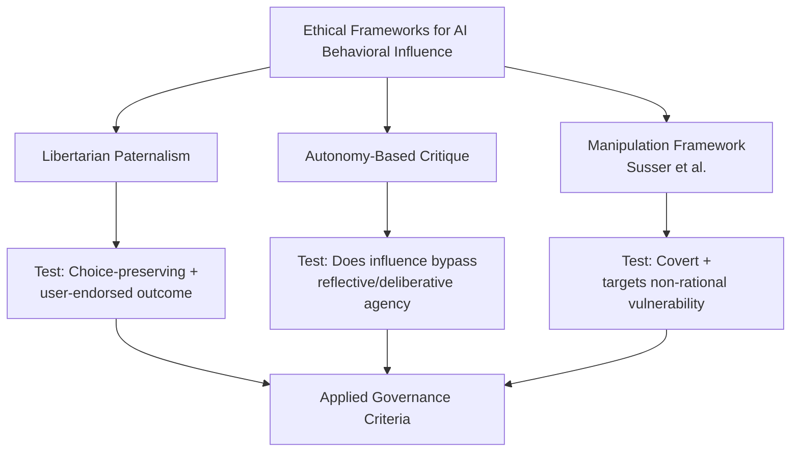
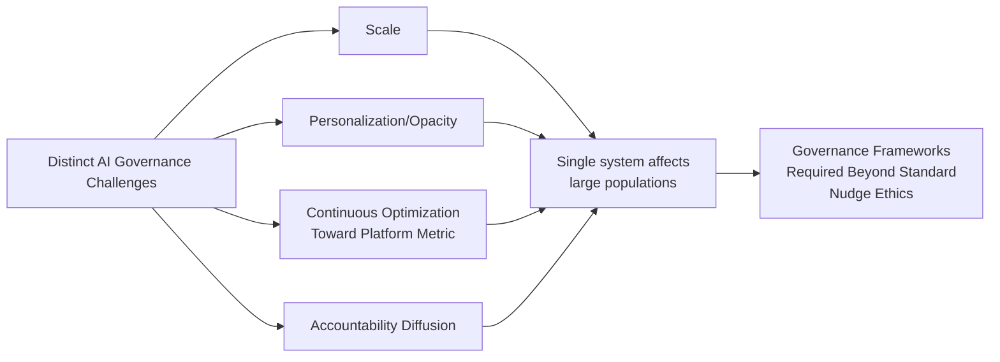
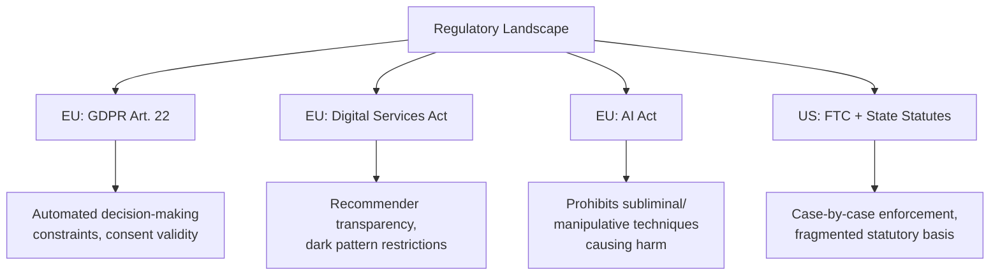
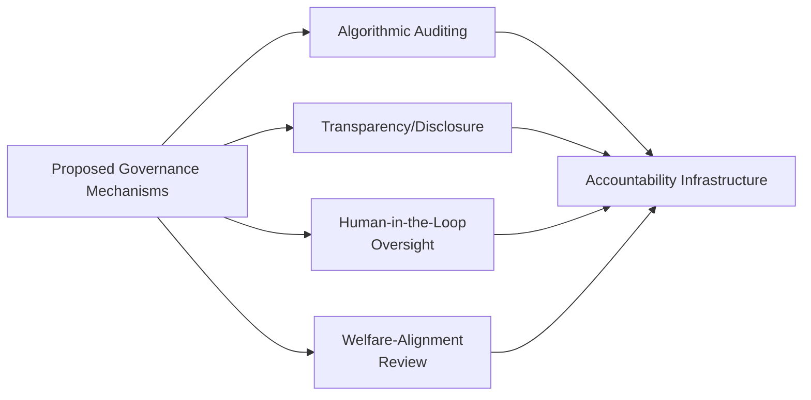
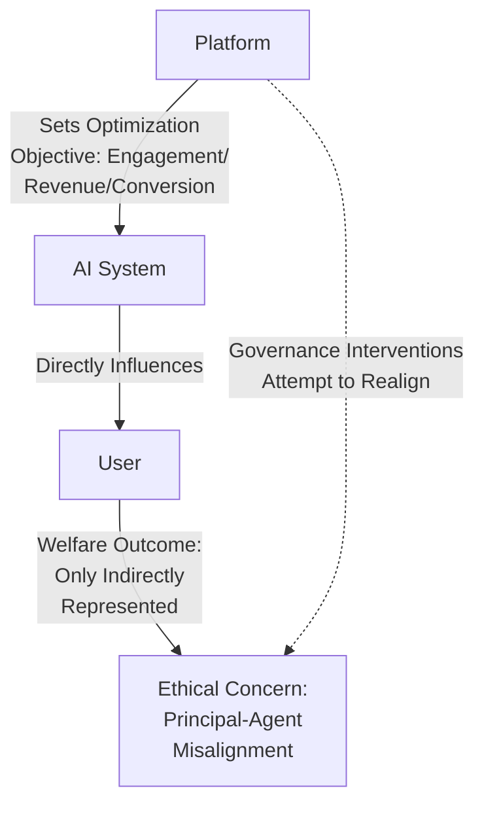

## Ethics and Governance of AI-Driven Behavioral Influence

### Overview

This domain addresses the normative and institutional frameworks proposed and enacted to govern AI systems that influence human decision-making, synthesizing across the preceding digital behavioral economics topics — digital nudging, gamification, attention economy design, personalized/algorithmic nudging, and dark patterns — into a unified ethics and governance treatment. It examines the philosophical criteria for legitimate versus illegitimate behavioral influence, the regulatory instruments developed to operationalize those criteria, and the institutional accountability mechanisms proposed for AI systems capable of large-scale behavioral shaping.

### Foundational Ethical Frameworks

**Key Points**

- **Libertarian paternalism** (Thaler & Sunstein, 2003, 2008) remains the dominant normative starting point, holding that choice architecture influence is ethically permissible when it (1) preserves freedom of choice (no option is eliminated or its cost materially increased) and (2) is directed at outcomes the individual would endorse under full information and self-control — the "as judged by themselves" welfare standard
- **Autonomy-based critiques** (e.g., Bovens, 2009; Hausman & Welch, 2010) argue that even choice-preserving nudges can undermine autonomy by operating through non-conscious or non-deliberative psychological pathways, bypassing rather than engaging a person's reflective agency — this critique becomes substantially sharper when applied to algorithmically personalized influence, since the individually calibrated nature of the intervention further reduces the person's capacity to recognize and consciously evaluate it
- **Manipulation-based frameworks** (e.g., Susser, Roessler & Nissenbaum, 2019, "Online Manipulation") propose that the ethically decisive criterion is not merely choice-preservation but whether an influence attempt is **covert** and **targets non-rational decision vulnerabilities** — this framework is specifically designed to extend behavioral ethics analysis into digital and algorithmic contexts where influence can be simultaneously covert (invisible to the user) and precisely targeted (personalized to individual vulnerabilities)

### Why AI-Driven Influence Poses Distinct Governance Challenges

**Key Points**

- **Scale**: a single algorithmic system can simultaneously influence a population far exceeding what any individual human choice architect could reach, magnifying the aggregate welfare consequences of any given design flaw or misalignment
- **Personalization/opacity**: as established in the algorithmic nudging and hypernudging literature (Yeung, 2017), individually tailored influence is harder for both the affected individual and external auditors to observe, evaluate, or contest than a uniform, publicly visible default or framing choice
- **Continuous optimization**: machine-learning-driven systems that update based on observed user response can, absent deliberate constraint, progressively converge toward whatever influence strategy is most behaviorally effective — which is not guaranteed to correlate with what is most welfare-enhancing for the user, since the optimization target (e.g., engagement, conversion, revenue) is typically set by the platform rather than derived from user welfare directly
- **Attribution and accountability diffusion**: responsibility for a given AI-driven behavioral outcome may be distributed across model developers, platform deployers, and the specific business unit configuring the system's optimization objective, complicating traditional liability and accountability frameworks

### Regulatory and Institutional Frameworks (Cross-Domain Synthesis)

**Key Points**

- **EU General Data Protection Regulation (GDPR)**: Article 22 constrains certain automated individual decision-making processes with legal or similarly significant effects, and consent-validity requirements (freely given, specific, informed, unambiguous) directly constrain dark-pattern-style consent mechanisms discussed in the prior chapter section
- **EU Digital Services Act (DSA)**: includes transparency obligations for recommender systems and restrictions on manipulative interface design ("dark patterns") specifically for online platforms, requiring large platforms to provide algorithmic transparency reporting
- **EU AI Act**: introduces a risk-tiered regulatory structure, with provisions specifically prohibiting AI systems that deploy subliminal, manipulative, or deceptive techniques materially distorting a person's behavior in a manner likely to cause harm — representing one of the more direct statutory attempts to codify the manipulation-based ethical framework described above into binding law
- **US regulatory landscape**: comparatively more fragmented, relying primarily on existing FTC unfair-or-deceptive-practices authority applied case-by-case to specific dark-pattern and manipulative-design instances, supplemented by state-level statutes (e.g., California's CCPA/CPRA dark-pattern provisions) rather than a single comprehensive federal AI-behavioral-influence statute

[Inference] This regulatory landscape is evolving rapidly and varies substantially across and within jurisdictions; the summary above reflects the general regulatory direction and structure as commonly documented in policy literature, but specific compliance obligations should be verified against current, jurisdiction-specific legal text, particularly given the pace of AI-specific legislative activity.

### Proposed Governance and Accountability Mechanisms

**Key Points**

- **Algorithmic auditing**: independent, periodic review of AI-driven influence systems for disparate impact across demographic groups, manipulation risk, and alignment with stated welfare objectives — proposed as a governance analog to financial auditing, though standardized audit methodologies for behavioral-influence systems specifically remain less mature than for other AI risk categories (e.g., fairness/bias auditing in hiring algorithms)
- **Transparency and disclosure requirements**: mandating disclosure when personalization or algorithmic optimization is in use, and providing users mechanisms to view, contest, or opt out of algorithmically personalized influence specifically (as distinct from opting out of the underlying service entirely)
- **Human-in-the-loop and oversight requirements**: particularly emphasized in the EU AI Act's risk-tiered framework, requiring meaningful human oversight for higher-risk categories of automated decision-making and behavioral-influence systems
- **Welfare-alignment auditing**: proposed frameworks for evaluating whether an AI system's optimization objective (e.g., engagement, conversion) is likely to align with or diverge from user welfare, drawing on the same "as judged by themselves" standard from libertarian paternalism but applied at the level of system design review rather than individual intervention evaluation

### The Core Unresolved Tension: Optimization Target Misalignment

**Key Points**

- Across nearly all domains covered in this chapter — digital nudging, gamification, attention economy design, algorithmic nudging, dark patterns — the recurring structural driver of ethical concern is the same: AI and digital systems are typically optimized against **platform-defined metrics** (engagement, conversion, revenue, retention) rather than directly against **user welfare**, and these two objectives are not guaranteed to coincide
- This is formally analogous to a **principal-agent problem**, where the AI system (agent) is trained to optimize a metric set by the platform (principal), and the user, whose welfare is the ethically relevant outcome, is a third party whose interests are only indirectly and imperfectly represented in the optimization objective
- [Speculation] Proposed solutions — including welfare-alignment auditing, mandated transparency, and regulatory prohibition of specifically manipulative techniques — each address this misalignment partially but none has yet achieved broad consensus as a comprehensive solution; whether governance can fully resolve this principal-agent structure without fundamentally altering platform business-model incentives (e.g., advertising-based revenue tied to engagement) remains a genuinely open and contested question in current policy and ethics discourse, not a settled matter

### Comparative Framework Summary

| Framework/Instrument | Type | Core Test | Primary Domain Addressed |
| --- | --- | --- | --- |
| Libertarian Paternalism | Ethical theory | Choice-preserving + user-endorsed | General nudging baseline |
| Susser et al. Manipulation Framework | Ethical theory | Covert + targets non-rational vulnerability | Digital/algorithmic contexts |
| GDPR Article 22 | Regulation | Automated decision with significant effect | Automated decision-making |
| EU AI Act | Regulation | Subliminal/manipulative technique causing harm | AI systems broadly |
| EU DSA | Regulation | Recommender transparency, dark pattern restriction | Platform interface design |
| Algorithmic Auditing | Governance mechanism | Disparate impact, welfare alignment | Cross-cutting oversight |

### Conclusion

The ethics and governance of AI-driven behavioral influence synthesizes the ethical tensions identified throughout digital behavioral economics — choice-preservation versus autonomy erosion, transparent nudging versus covert manipulation, and individual welfare versus platform-optimized metrics — into a governance challenge distinguished from earlier nudge ethics primarily by scale, personalization-driven opacity, and continuous algorithmic optimization. Regulatory responses, most developed in the EU (GDPR, DSA, AI Act) and more fragmented in the US, represent partial operationalizations of manipulation-based and autonomy-based ethical frameworks, but the underlying principal-agent misalignment between platform optimization objectives and user welfare remains a substantively unresolved structural tension that current governance instruments address only incompletely.

**Related Topics**

- Susser, Roessler & Nissenbaum: Online Manipulation Framework (2019)
- EU AI Act: Risk-Tiered Classification and Prohibited Practices
- Principal-Agent Theory Applied to Algorithmic System Design
- Algorithmic Auditing Methodologies and Standardization Efforts
- Autonomy-Based Critiques of Nudging (Bovens; Hausman & Welch)
- Personalized and Algorithmic Nudging (cross-reference)
- Dark Patterns in Digital Platforms and Apps (cross-reference)