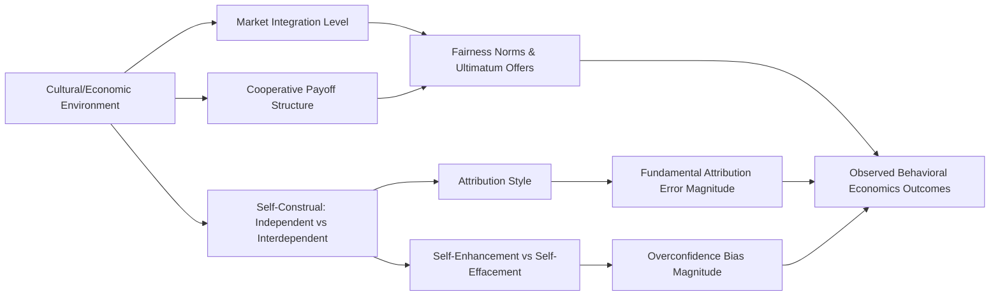

## Cultural Variation in Cognitive Biases

### Definition and Scope

Cultural variation in cognitive biases refers to the empirical finding that many heuristics and biases documented in behavioral economics — originally established primarily on Western, Educated, Industrialized, Rich, and Democratic (WEIRD) populations — differ systematically in strength, direction, or presence across cultural groups. This challenges the assumption that cognitive biases are universal features of human decision-making architecture, suggesting instead that some are moderated by cultural learning, social structure, and self-construal.

This field sits at the intersection of behavioral economics, cross-cultural psychology, and anthropology, and has significant implications for the external validity of behavioral experiments and the design of policy interventions across different populations.

### The WEIRD Problem

Henrich, Heine, and Norenzayan's (2010) influential critique established that:

- The overwhelming majority of behavioral and psychological experiments are conducted on WEIRD samples (predominantly US undergraduate students)
- WEIRD populations are statistical outliers on numerous psychological dimensions (visual perception, fairness judgments, spatial cognition, self-concept) rather than representative humans
- Findings treated as universal "human" biases often reflect culturally specific cognitive patterns

This reframes the task of behavioral economics: rather than assuming a fixed set of universal biases, researchers must empirically test whether a given bias generalizes cross-culturally or is itself a product of a particular cultural environment.

### Key Dimension: Independent vs. Interdependent Self-Construal

Markus and Kitayama's self-construal framework is the dominant theoretical lens explaining many cross-cultural differences in bias expression:

| Self-Construal Type | Characteristic Cultures | Cognitive Orientation |
| --- | --- | --- |
| Independent | US, Western Europe, Australia | Self as autonomous; internal traits define identity; individual choice emphasized |
| Interdependent | East Asia, many African and Latin American cultures | Self as relational; identity defined through group membership and context; harmony emphasized |

This distinction predicts and explains variation across multiple biases documented below.

### Documented Cross-Cultural Bias Variations

**Table: Bias-by-culture summary**

| Bias | WEIRD/Independent Pattern | Interdependent Pattern | Proposed Mechanism |
| --- | --- | --- | --- |
| Overconfidence / better-than-average effect | Strong self-enhancement bias | Attenuated or reversed (self-effacement common in East Asian samples) | Self-enhancement motive is culturally specific to independent self-construal; interdependent cultures reward modesty |
| Fundamental attribution error | Strong tendency to attribute behavior to disposition over situation | Weaker; greater weight given to situational/contextual factors | Holistic vs. analytic cognitive style (Nisbett) |
| Loss aversion | Robust and well-replicated | Some studies find attenuated loss aversion in collectivist samples, though replication is mixed | [Inference — evidence is less consistent here than for other biases; may interact with framing of losses as individual vs. group-relevant] |
| Endowment effect | Strong and consistent | Reduced in some East Asian and hunter-gatherer/small-scale societies (Apicella et al. studies on Hadza) | Market integration and exposure to trade may moderate the effect more than culture per se |
| Framing effects (gain/loss) | Well-replicated Asian disease problem results | Direction sometimes reverses in Chinese samples depending on collective vs. individual framing | Group-referenced framing interacts with interdependent self-construal |
| Hindsight bias | Present, moderate | Some evidence of stronger hindsight bias in Asian samples, linked to more holistic causal reasoning | Holistic thinkers integrate more contextual causal factors into "I knew it all along" judgments |
| Present bias / temporal discounting | Well-documented across cultures but with varying discount rates | Substantial cross-national variation correlated with GDP, trust, and institutional stability, not culture per se | [Inference — much of the cross-national variation in discounting appears confounded with economic/institutional factors rather than being a pure "cultural" effect] |
| Anchoring effect | Robust | Generally replicates cross-culturally with similar magnitude | One of the more universal biases in the literature |
| Conjunction fallacy | Well-replicated | Generally replicates, though some variation in magnitude by numeracy/education, a confound with culture | Largely a feature of representativeness heuristic use, less culturally moderated |

### Illustrative Case: The Ultimatum Game Across Societies

The cross-cultural ultimatum game studies (Henrich et al., 2001, 2004 — "In Search of Homo Economicus") tested fairness-related decision-making across 15 small-scale societies and found:

- Offers ranged from ~26% (Machiguenga of Peru) to over 50% (Lamalera whale hunters of Indonesia), compared to the ~44-48% modal offer in industrialized samples
- Variation correlated strongly with two societal features: (1) degree of market integration and (2) payoffs to cooperation in daily economic life
- Societies with high cooperative payoff structures (e.g., collective whale hunting) showed higher and more frequent "hyper-fair" offers (>50%)

This demonstrates that even biases assumed to reflect innate fairness intuitions are substantially shaped by the economic and social structure of daily life, not fixed psychological universals.

### Analytic vs. Holistic Cognition (Nisbett's Framework)

Richard Nisbett's research on East Asian vs. Western cognitive styles provides a mechanistic account for several bias differences:

- **Analytic cognition** (associated with Western/independent cultures): Focus on objects in isolation from context, categorization via rules, formal logic preferred, attention to focal object
- **Holistic cognition** (associated with East Asian/interdependent cultures): Focus on relationships and context, categorization via family resemblance, dialectical reasoning (tolerance of contradiction) preferred, attention distributed across field

This is empirically supported by eye-tracking studies (Chua, Boland & Nisbett, 2005) showing East Asian participants spend more time fixating on background/contextual elements of scenes, while American participants fixate more on focal objects — a low-level perceptual difference with downstream implications for attribution and framing effects.

### Methodological Considerations

Researchers studying cultural variation in biases must account for several confounds:

- **Translation and equivalence**: Behavioral economics tasks (e.g., Cognitive Reflection Test items) may not translate with equivalent difficulty or connotation across languages
- **Market integration confound**: Many "cultural" differences (e.g., endowment effect strength) correlate more strongly with exposure to market economies than with culture per se, per Henrich's cross-societal work
- **Numeracy and education**: Differences attributed to culture sometimes reduce substantially after controlling for formal education and numeracy
- **Sampling**: Much "cross-cultural" research still compares WEIRD subgroups (e.g., Chinese vs. American university students) rather than genuinely diverse populations, limiting generalizability claims
- **Response style bias**: Some cultures show systematic tendencies toward midpoint or extreme responding on Likert-type scales, which can be mistaken for substantive belief differences

### Practical Example: Designing a Cross-Cultural Nudge

**Scenario**: A retirement-savings nudge campaign using loss-framed messaging ("You could lose $X in benefits by not enrolling") performs well in the US but underperforms in a rollout in an interdependent-culture market.

**Diagnosis using this framework**: Loss aversion and framing effects may interact differently with self-construal — a loss framed at the *individual* level may be less motivating in an interdependent context than a loss framed at the *family/group* level ("Your family could lose...").

**Adjustment**: A/B test group-referenced vs. individual-referenced loss framing rather than assuming the original individual-framed nudge will transfer unmodified.

### Conclusion

Cultural variation in cognitive biases demonstrates that behavioral economics' foundational heuristics-and-biases catalog is not a fixed, universal specification of human cognition but is partially contingent on self-construal, market integration, cognitive style, and social structure. Some biases (anchoring, conjunction fallacy) appear highly robust cross-culturally, while others (overconfidence, endowment effect, attribution error) show substantial cultural moderation. Practically, this means behavioral interventions validated in one cultural context cannot be assumed to transfer with equivalent effect size elsewhere without local validation.

### Related Topics

- WEIRD samples and the generalizability crisis in psychology/behavioral science
- Market integration and its effect on economic decision-making (Henrich et al. cross-societal studies)
- Self-construal theory (Markus & Kitayama) and its applications to consumer behavior
- Analytic vs. holistic cognitive style (Nisbett, "The Geography of Thought")
- Cross-cultural replication crises in behavioral economics experiments
- Culturally adaptive choice architecture and nudge localization
- Collectivism/individualism (Hofstede's cultural dimensions) as a moderator of economic behavior