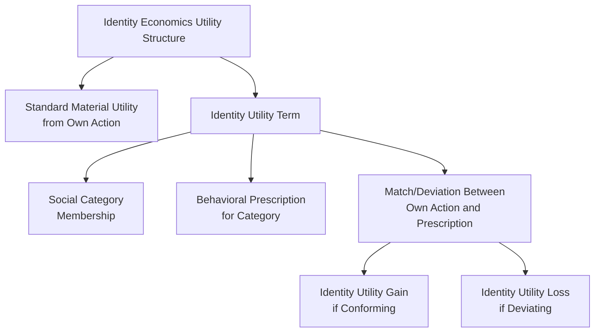
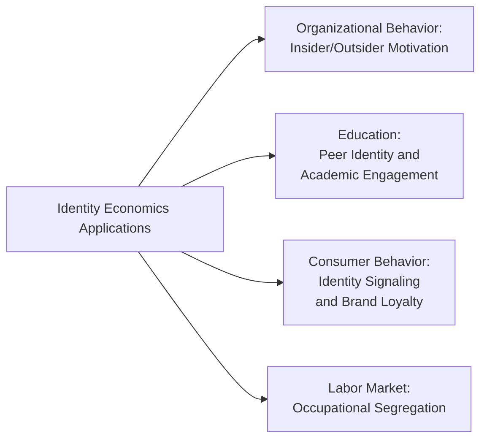

## Identity Economics and Self-Image

### Overview

Identity economics incorporates social identity and self-image directly into formal economic decision models, treating identity — one's sense of self and group affiliation — as a variable that enters the utility function alongside standard material payoffs. This framework was formalized by George Akerlof and Rachel Kranton, whose foundational 2000 paper "Economics and Identity" (*Quarterly Journal of Economics*) extended the standard economic actor model to incorporate identity-based utility and behavioral norms, and was substantially developed further in their 2010 book *Identity Economics*.

### The Akerlof-Kranton Formal Framework

**Key Points**

- Standard utility theory models an individual's utility as a function of their own actions and material consequences alone; identity economics adds a term representing the utility or disutility derived from **conforming to or deviating from the behavioral prescriptions associated with one's social category or identity**
- Individuals are modeled as belonging to one or more **social categories**, each associated with an **ideal behavior prescription** — a set of behaviors considered appropriate for members of that category within a given social context
- Deviation from the prescribed behavior associated with one's identity category generates a **utility loss** (identity dissonance), independent of any material consequence the deviation might also produce

The generalized Akerlof-Kranton utility function takes the form:

$$U_j = U_j(a_j, a_{-j}, I_j)$$

where $a_j$ is individual $j$'s own action, $a_{-j}$ represents others' actions, and $I_j$ is identity utility, itself a function of:

$$I_j = I_j(a_j, a_{-j}; c_j, \varepsilon_j, P)$$

where $c_j$ denotes $j$'s assigned or chosen social category, $\varepsilon_j$ represents $j$'s own characteristics (which may partially or fully match the category's prescribed characteristics), and $P$ represents the behavioral prescriptions associated with category $c_j$ in the given social context.

### Core Mechanisms

**Key Points**

- **Category and prescription**: identity economics separates the *category* a person belongs to (gender, profession, nationality, organizational role) from the *prescription* — the socially constructed norm of appropriate behavior associated with that category in a given context — allowing the same category to carry different prescriptions across different social settings
- **Identity-based utility loss from deviation**: acting against one's identity prescription produces disutility even when the deviating action would otherwise be materially advantageous, providing a formal mechanism for behaviors that appear irrational under a purely material-payoff model but are coherent once identity utility is incorporated
- **Externalities from others' category violations**: in some formulations, one person's deviation from a category prescription can impose a utility cost on others who share that category, formalizing phenomena such as in-group policing of behavioral norms

**Example**

Akerlof and Kranton's original framing applies the model to gender and occupational choice: if a social prescription associates a particular occupation with a specific gender identity, an individual whose gender does not match that prescription may experience an identity-utility cost from entering the occupation, independent of wages or working conditions — providing a formal economic mechanism for occupational segregation patterns not fully explained by standard human-capital or discrimination-based models alone.

### Distinction from Standard Discrimination and Signaling Models

| Model Type | Mechanism | Source of Behavioral Effect |
| --- | --- | --- |
| Becker-style taste-based discrimination | Employer/consumer preference against interacting with certain groups | External party's preferences |
| Statistical discrimination | Group membership used as a signal proxy under imperfect information | Information asymmetry |
| Identity economics | Individual's own utility tied to conforming with self/group identity prescriptions | Internal, self-referential utility |

**Key Points**

- Identity economics is distinguished from discrimination-based economic models by locating the behavioral driver *within* the individual's own utility function rather than in external parties' preferences or information constraints, making it a complementary rather than competing framework — a labor market outcome could reflect both external discrimination and internal identity-utility effects simultaneously

### Applications

**Organizational Economics**

Akerlof and Kranton's later work (*Identity Economics*, 2010) extends the framework to workplace motivation, arguing that organizations achieve higher effort and lower monitoring costs when employees identify with organizational goals as part of their own identity ("insiders") rather than viewing work purely as an external material transaction ("outsiders"), providing a formal identity-based complement to efficiency wage and principal-agent theories of workplace motivation.

**Education**

The framework has been applied to explain patterns of educational disengagement or underperformance among students whose social or peer-group identity carries a prescription associating academic effort with an "out-group" identity, providing a formal mechanism for peer-effect-driven academic outcomes beyond standard peer-effect or social-capital models.

**Consumer Behavior and Branding**

Identity-based utility provides a formal economic foundation for brand loyalty and identity-signaling consumption (i.e., purchases made in part to affirm or signal group identity/category membership), connecting identity economics to the broader literature on conspicuous consumption and social signaling.

### Relationship to Social Identity Theory

**Key Points**

- Akerlof and Kranton's formal economic framework draws directly on **Social Identity Theory** from social psychology (Tajfel & Turner, 1979), which established that individuals derive part of their self-concept from group membership and are motivated to maintain positive in-group distinctiveness
- Identity economics can be understood as the economic formalization of this psychological insight, translating group-membership-derived self-concept effects into a utility-theoretic framework compatible with standard economic modeling techniques
- This connects identity economics methodologically to the broader project, shared across behavioral economics generally, of incorporating validated psychological mechanisms into formal economic models rather than treating psychology and economics as separate, non-interacting disciplines

### Identity and Stereotype Threat

**Key Points**

- A related but methodologically distinct literature examines **stereotype threat** (Steele & Aronson, 1995) — the phenomenon whereby awareness of a negative stereotype associated with one's identity group can itself impair performance on tasks where that stereotype is relevant, through anxiety and cognitive load mechanisms rather than the direct utility-based prescription-deviation mechanism formalized in Akerlof-Kranton
- [Inference] While both stereotype threat and identity-economics prescription-deviation models address how identity affects economically relevant behavior, they operate through distinct proposed mechanisms (performance impairment via cognitive/anxiety load versus utility loss from prescription deviation) and are generally treated as complementary rather than substitute explanations in the literature, though the precise boundary and potential interaction between these mechanisms in specific applied contexts remains an area of ongoing research

### Critiques and Limitations

**Key Points**

- **Falsifiability and measurement**: identity utility, as an unobserved theoretical construct, presents empirical measurement challenges similar to other latent-variable economic models — testing identity economics predictions typically requires indirect inference (e.g., observing behavior patterns consistent with prescription-deviation costs) rather than direct measurement of the identity utility term itself
- **Circularity risk**: critics have noted a risk that identity-based explanations can be applied post hoc to nearly any observed deviation from standard rational-choice predictions, raising a methodological concern (shared with some other "add a new utility term" theoretical extensions in behavioral economics) about over-fitting explanatory flexibility relative to genuinely predictive, falsifiable theory
- [Inference] The field has responded to these concerns primarily through experimental and quasi-experimental designs that manipulate identity salience directly (e.g., priming a specific identity category before a decision task) to generate testable predictions distinguishable from pure post hoc explanation, though the overall body of rigorously causal identity-economics evidence remains smaller relative to some other, more experimentally mature areas of behavioral economics such as Prospect Theory

### Conclusion

Identity economics, formalized by Akerlof and Kranton, extends standard economic utility theory to incorporate identity-based prescriptions and the disutility of deviating from them, providing a formal mechanism connecting social psychology's Social Identity Theory to economically consequential behavior in labor markets, education, organizational settings, and consumer choice. Its principal theoretical contribution is locating identity-driven behavioral effects within the individual's own utility function, distinguishing it from external discrimination-based models, while its principal methodological challenge remains the empirical measurement and falsifiability of the underlying identity-utility construct relative to more directly observable behavioral economics mechanisms.

**Related Topics**

- Akerlof & Kranton, "Economics and Identity" (2000) and *Identity Economics* (2010): Core Texts
- Social Identity Theory (Tajfel & Turner, 1979): Psychological Foundations
- Stereotype Threat (Steele & Aronson, 1995) and Its Relationship to Identity-Based Economic Models
- Insider/Outsider Models of Organizational Motivation
- Identity Signaling and Conspicuous Consumption Theory
- Occupational Segregation: Identity-Based vs. Discrimination-Based Explanations
- Cultural Variation in Cognitive Biases (cross-reference)