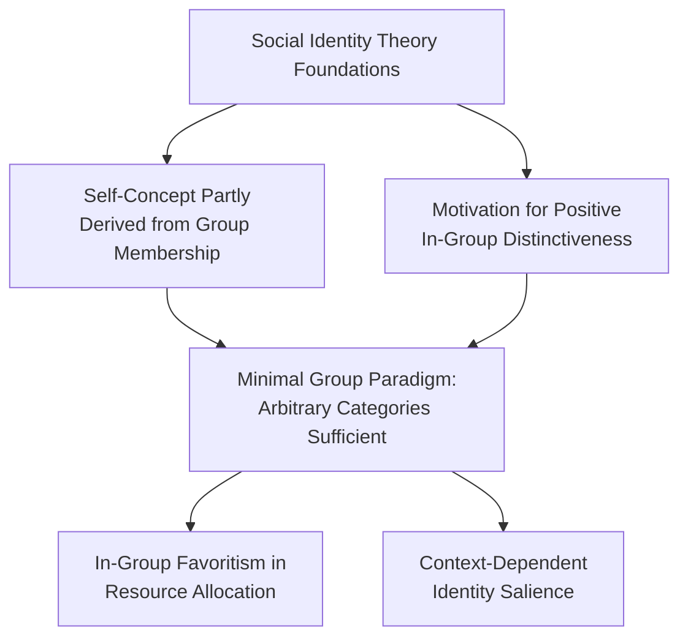
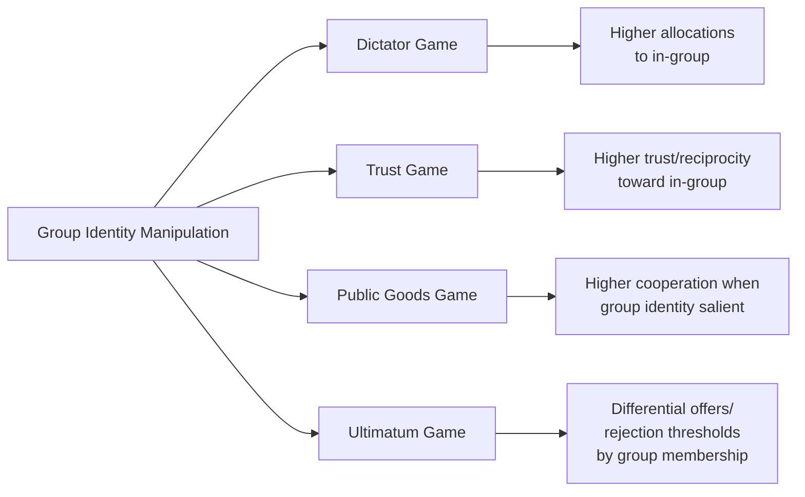
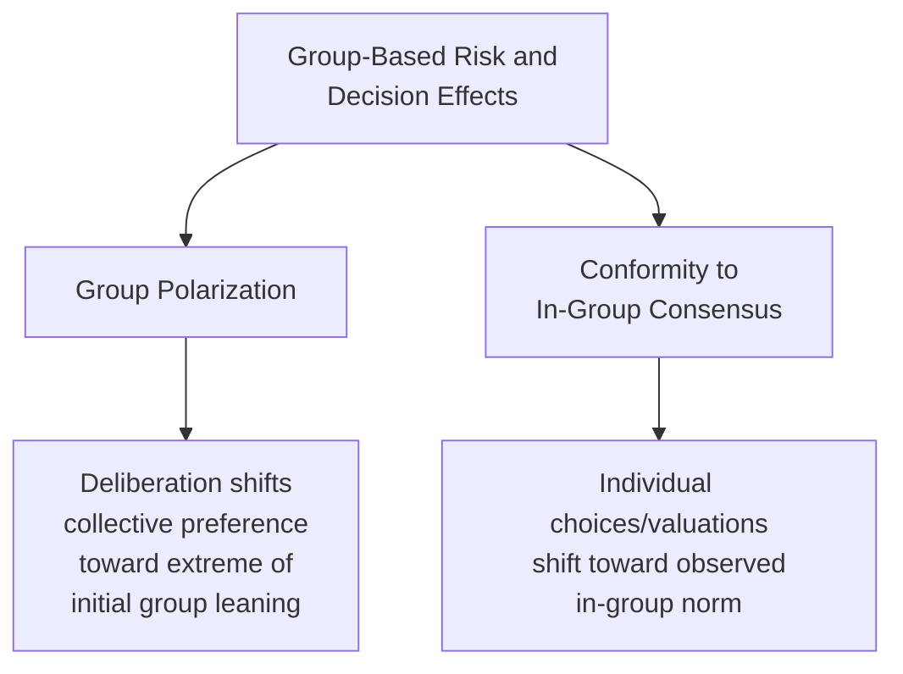

## Social Identity and Group-Based Decision-Making

### Overview

Social identity and group-based decision-making examines how membership in and identification with social groups shapes economic choices, cooperation, competition, and risk preferences — distinct from Identity Economics' focus on formal utility-theoretic modeling of prescription-deviation costs. This domain draws more directly on experimental social psychology and behavioral game theory to document *how* group membership causally alters decision-making, including in-group favoritism, intergroup competition effects, and group-based cooperation and coordination.

### Social Identity Theory: Psychological Foundations

**Key Points**

- **Social Identity Theory** (Tajfel & Turner, 1979) established that individuals derive part of their self-concept from group memberships and are motivated toward positive in-group distinctiveness, even under experimentally minimal or arbitrary group-assignment conditions
- The **minimal group paradigm** (Tajfel et al., 1971) demonstrated that even meaningless, randomly assigned group categorizations (e.g., grouping participants by an arbitrary preference for one abstract painter over another) are sufficient to produce measurable in-group favoritism in subsequent resource-allocation decisions, indicating that group-based bias does not require pre-existing group history, conflict, or meaningful shared characteristics
- **Self-Categorization Theory** (Turner et al., 1987), a direct extension of Social Identity Theory, further specifies the cognitive process by which individuals categorize themselves and others into in-groups and out-groups, and how the salience of a given identity category shifts across social contexts

### In-Group Favoritism in Economic Games

**Key Points**

- Behavioral economics experiments have extensively documented that group identity manipulation alters outcomes in standard economic games including the **dictator game**, **ultimatum game**, **trust game**, and **public goods game**
- **Dictator and trust games**: participants typically allocate more resources to, and exhibit greater trust toward, in-group members relative to out-group members, even under minimal-group conditions, and this effect tends to be further amplified when group membership reflects genuine, socially meaningful categories (ethnicity, nationality, team affiliation) rather than experimentally arbitrary ones
- **Public goods games**: group identity salience has been shown to affect cooperation rates, with several studies finding that making a shared group identity salient among participants increases contribution levels relative to conditions where individual (rather than group) identity is made salient — consistent with a group-identity-based cooperation mechanism operating alongside standard reciprocity and reputation-based explanations for cooperation

### Intergroup Competition and Parochial Altruism

**Key Points**

- **Parochial altruism** — the combination of in-group generosity/cooperation with out-group hostility or reduced cooperation — has been documented experimentally as a distinct pattern from simple in-group favoritism alone, with implications for understanding both cooperative and conflictual intergroup economic behavior (Bernhard, Fischbacher & Fehr, 2006, among others studying this combined pattern)
- Intergroup competition framing (structuring an economic game so that groups compete against each other rather than facing a purely individual decision) has been shown in multiple studies to increase within-group cooperation, consistent with group-based identity mechanisms being amplified under explicit intergroup competitive structure
- [Inference] The relative contribution of purely psychological identity-based mechanisms versus strategic/instrumental reasoning (e.g., anticipating reciprocal treatment within a repeated-interaction group) to observed parochial altruism patterns is not fully disentangled across all studies in this literature, and specific studies vary in their experimental design's ability to isolate the identity mechanism from strategic considerations

### Group-Based Risk and Decision-Making

**Key Points**

- Group membership and group decision-making contexts have been shown to affect risk preferences, with a body of research on **group polarization** (originating in social psychology, applied to economic risk contexts) documenting that group deliberation can shift collective risk preferences to be more extreme (either more risk-seeking or more risk-averse) than the average of individual members' pre-deliberation preferences, depending on the initial leaning of the group
- Group identity salience has also been examined in relation to conformity effects in economic decision-making, connecting to the classic Asch conformity paradigm from social psychology, extended into economic decision contexts examining whether individuals adjust stated valuations, risk assessments, or choices to align with an observed in-group consensus

### Applications

**Organizational and Team Economics**

Group-identity-based cooperation research has direct applications to team production and organizational design, informing predictions about when shared organizational or team identity will increase effort and cooperation beyond what standard incentive-based models alone would predict, connecting to the insider/outsider motivation framework from Identity Economics but grounded more specifically in experimental group-identity manipulation evidence.

**Public Goods Provision and Civic Behavior**

Group-identity salience findings have been applied to understanding civic cooperation, tax compliance, and public goods contribution at national or community scale, with research examining whether shared national or local identity framing in public communications affects civic cooperation rates.

**Marketing and Brand Communities**

In-group favoritism and group-identity cooperation findings have been applied to brand community research, examining how cultivated consumer group identity (brand communities, fan bases) affects consumer loyalty, willingness to defend the brand, and peer-referral behavior, extending beyond the individual identity-signaling consumption mechanism discussed in Identity Economics into explicitly group-based dynamics.

**Conflict and Intergroup Relations**

Parochial altruism and intergroup competition research has been applied, particularly in experimental and field-experimental settings in regions with documented intergroup conflict history, to examine the economic behavioral correlates of intergroup tension, informing policy and intervention design aimed at reducing costly intergroup conflict dynamics.

### Distinguishing This Domain from Identity Economics

| Dimension | Identity Economics (Akerlof-Kranton) | Social Identity and Group Decision-Making |
| --- | --- | --- |
| Core mechanism | Utility loss from deviating from identity-category behavioral prescription | Differential treatment/cooperation based on in-group vs. out-group categorization |
| Primary methodology | Formal utility-theoretic modeling | Experimental behavioral game theory, social psychology paradigms |
| Focus | Self-prescription conformity | Interpersonal/intergroup treatment differences |
| Key evidence base | Applied theoretical modeling with illustrative empirical cases | Extensive experimental economic game literature (dictator, trust, public goods games) |

### Limitations and Open Questions

**Key Points**

- **Minimal vs. meaningful group effects**: while the minimal group paradigm demonstrates that in-group favoritism can arise from arbitrary categorization alone, the magnitude and robustness of this effect under minimal conditions is generally smaller and, in some studies, less consistent than effects observed with genuinely meaningful social categories, and researchers continue to examine which specific features of group categorization (arbitrariness, perceived permanence, chosen versus assigned membership) most strongly moderate the resulting behavioral effects
- **External validity of laboratory group manipulations**: as with much experimental economics, a persistent methodological question concerns the extent to which laboratory-induced, often temporary and low-stakes group identity manipulations generalize to real-world, high-stakes, deeply held group identities (ethnic, national, religious) — [Inference] this generalization question is a genuinely contested and actively researched area rather than a settled matter, and effect sizes observed in minimal-group laboratory studies should not be assumed to directly transfer in magnitude to real-world identity-based economic behavior without further validating field evidence
- **Interaction with cultural variation**: this domain connects directly to the cross-cultural cognitive bias literature discussed elsewhere in this chapter, since the salience, structure, and behavioral consequences of group identity themselves vary across cultural contexts, meaning findings from one cultural setting regarding group-identity effects may not directly generalize to a different cultural context

### Conclusion

Social identity and group-based decision-making documents how group membership, even under experimentally minimal conditions, systematically alters economic behavior through in-group favoritism, differential cooperation, and group-based risk and conformity effects. Grounded in Social Identity Theory and the minimal group paradigm from social psychology, this evidence base is methodologically distinct from, but conceptually complementary to, the formal utility-theoretic Identity Economics framework, and has substantial applied relevance to organizational design, public goods provision, marketing, and the study of intergroup conflict. The field's central open questions concern the boundary between minimal and meaningful group effects and the external validity of laboratory group-identity manipulations relative to real-world, high-stakes social identities.

**Related Topics**

- Minimal Group Paradigm: Tajfel et al. (1971) and Subsequent Replications
- Parochial Altruism: Bernhard, Fischbacher & Fehr (2006) and Related Intergroup Competition Studies
- Group Polarization in Risk-Related Decision-Making
- Identity Economics and Self-Image (cross-reference)
- Cultural Variation in Cognitive Biases (cross-reference)
- Trust Games and Public Goods Games: Experimental Design and Group Manipulation Methodology
- Team Production and Organizational Identity in Behavioral Labor Economics