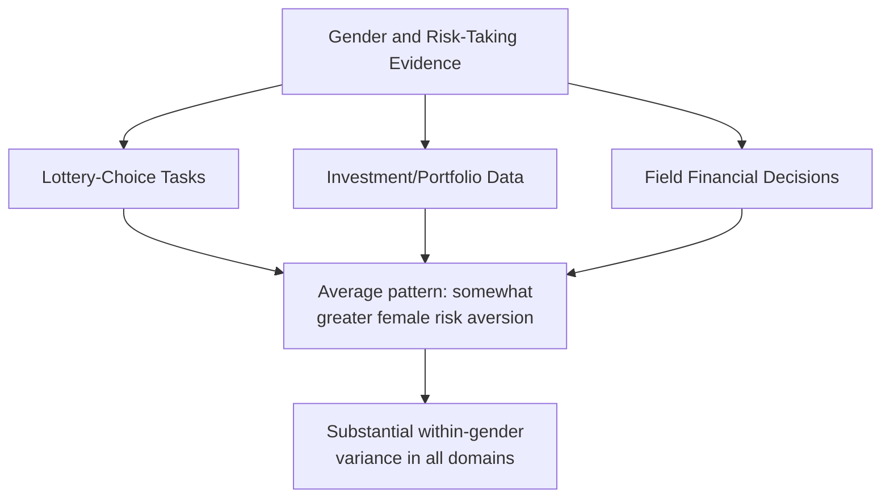
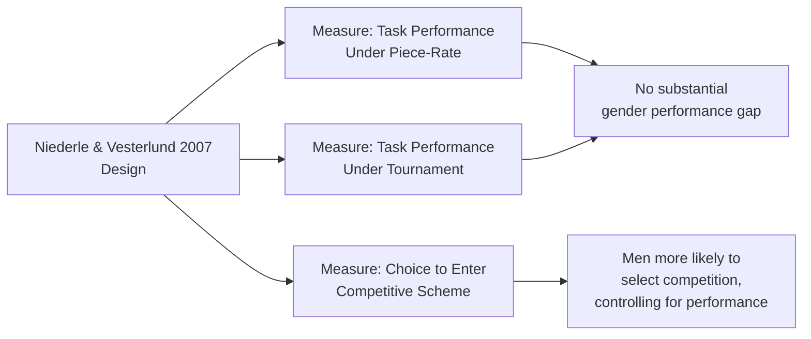
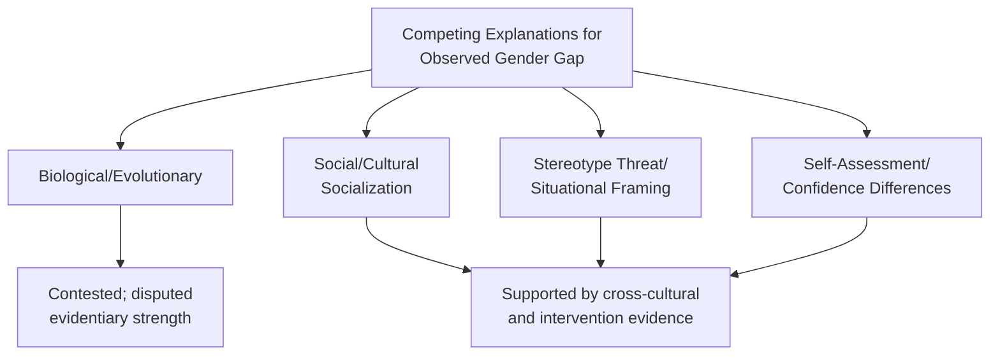

## Gender Differences in Risk-Taking and Competition

### Overview

This domain examines empirically documented differences between men and women in risk preferences and competitive behavior within experimental and field behavioral economics research, along with the competing explanatory frameworks (biological, social/cultural, situational) proposed to account for observed patterns. The literature spans laboratory experimental economics, field studies, and cross-cultural comparative research, and has become one of the more extensively replicated and simultaneously most methodologically contested areas within behavioral economics.

### Empirical Findings on Risk-Taking

**Key Points**

- A substantial body of experimental economics literature, synthesized in influential review work including Croson & Gneezy (2009, "Gender Differences in Preferences," *Journal of Economic Literature*), reports that women exhibit greater risk aversion than men on average across a range of experimental risk-elicitation tasks and financial decision contexts
- This pattern has been documented across multiple elicitation methodologies including incentivized lottery-choice tasks, investment game paradigms, and field data on financial portfolio composition (with several studies finding women's investment portfolios exhibit lower average volatility/risk exposure than men's, controlling for wealth and other observables)
- [Inference] While the *direction* of this average difference (women exhibiting somewhat greater measured risk aversion on average) is documented across a substantial portion of the literature reviewed in sources such as Croson & Gneezy, the *magnitude* of the difference, its consistency across different risk domains (financial, health, recreational, social), and the degree of within-gender variance relative to between-gender variance vary considerably across studies; the within-gender variation in many studies is substantial, meaning population-level average differences do not imply strong individual-level predictive power

### Empirical Findings on Competitive Behavior

**Landmark Contribution: Niederle & Vesterlund (2007)**

Niederle and Vesterlund's widely cited experimental study, "Do Women Shy Away from Competition?" (*Quarterly Journal of Economics*, 2007), remains the foundational reference in this specific subdomain.

**Key Points**

- The study's experimental design distinguished **performance** under competitive versus non-competitive (piece-rate) compensation from the **choice** to enter a competitive compensation scheme, finding that men and women did not differ substantially in raw task performance, but men were significantly more likely to select into competitive (tournament) compensation than equally-performing women
- This distinction is methodologically important: the finding is specifically about **willingness to compete** given a choice, not about underlying task ability or performance under competition, addressing a common misreading of this literature
- Subsequent studies have examined whether this "competition gap" persists across different task types (some studies find it more pronounced for stereotypically "male-typed" tasks and reduced or absent for tasks not carrying such gendered associations), different age groups (including studies examining the effect in children, to explore whether the pattern is present before extensive labor-market socialization), and different cultural/national contexts

### Competing Explanatory Frameworks

**Key Points**

- **Biological/evolutionary explanations**: some researchers propose evolutionary or hormonal mechanisms (including studies examining correlations between risk-taking/competitiveness measures and hormonal markers) as partial explanations for observed average differences; [Inference] this remains one of the more contested explanatory strands in the literature, with substantial disagreement regarding both the strength of the biological evidence and the appropriate weight to assign biological versus social explanations, and should be treated as one contested hypothesis among several rather than an established mechanism
- **Social and cultural socialization explanations**: an extensive literature examines whether observed gender differences in risk-taking and competitiveness reflect socialized behavioral norms and stereotype internalization rather than, or in addition to, any biological predisposition, drawing on the cross-cultural variation evidence discussed elsewhere in this chapter
- **Stereotype threat and situational framing**: research applying stereotype threat mechanisms (Steele & Aronson, 1995, discussed under Identity Economics) to this domain has found that framing effects and task labeling can moderate observed gender gaps in competitive task selection, suggesting situational and contextual factors interact with, and may partially account for, average gender differences rather than the differences reflecting a fixed, context-independent trait difference
- **Confidence and self-assessment differences**: some studies attribute part of the observed competition gap to gender differences in self-assessed relative performance (overconfidence/underconfidence patterns) rather than differences in risk or competition preferences per se, since willingness to enter a competitive scheme depends partly on one's belief about relative ranking

### Cross-Cultural Evidence

**Key Points**

- A frequently cited line of research examines whether the gender competition gap varies across societies with differing gender-role norms, including comparative studies contrasting patriarchal and matrilineal societies; [Inference] specific comparative studies (such as research comparing the Maasai, a patriarchal society, with the Khasi, a matrilineal society) have reported reduced or reversed gender gaps in competitiveness measures in the matrilineal context relative to the patriarchal context in the specific studies conducted, which researchers have interpreted as evidence for a substantial social/cultural contribution to the gap — however, this remains based on a limited number of specific comparative field studies rather than a large, systematically replicated cross-cultural dataset, and should be treated as suggestive rather than fully generalized evidence
- This cross-cultural variation evidence connects directly to the broader cultural-variation-in-cognitive-biases literature discussed elsewhere in this chapter, reinforcing that even well-replicated average behavioral differences documented in predominantly WEIRD samples may not reflect universal or biologically fixed patterns

### Applied and Policy Implications

**Key Points**

- **Compensation scheme design**: findings on differential willingness to enter competitive compensation structures have been applied to organizational and human resources research examining whether tournament-style versus fixed/collaborative compensation structures differentially affect gender representation in high-performance or leadership tracks
- **Educational and career interventions**: research on stereotype threat and situational framing effects has informed intervention studies examining whether reframing competitive academic or career-entry tasks (e.g., STEM competition framing) affects gender gaps in participation, informing applied policy interest in reducing unintended gender-differential effects of competitive selection mechanisms
- **Financial advising and product design**: documented average risk-preference differences have been referenced in discussions of financial product design and advising practices, though [Inference] the substantial within-gender variance documented in the underlying research argues against applying population-average differences as a basis for individual-level financial advice or product targeting, a caution frequently noted within the academic literature itself

### Methodological Caveats and Critiques

**Key Points**

- **Population-average versus individual-level inference**: a recurring caution throughout this literature, and one this document emphasizes, is that documented average gender differences — even when statistically robust and well-replicated — typically involve substantial within-gender variance, meaning the population-level average difference should not be used to make confident individual-level predictions or to justify categorical treatment of individuals based on gender
- **Publication and framing considerations**: as with many behavioral economics subfields involving socially significant and contested topics, researchers have noted the importance of distinguishing rigorously replicated findings (such as the core Niederle-Vesterlund competition-entry result, which has been substantially replicated) from more preliminary, less consistently replicated, or more interpretively contested claims (such as specific biological mechanism claims)
- [Inference] This is an area where findings are sometimes summarized in popular or applied discourse in ways that overstate certainty, generalizability, or biological determinism relative to the more nuanced and contested state of the underlying academic literature; this document has aimed to flag areas of genuine ongoing academic contestation rather than present a single settled narrative

### Conclusion

The behavioral economics literature on gender differences in risk-taking and competition documents reasonably well-replicated average differences — particularly the Niederle-Vesterlund finding that women are less likely to select into competitive compensation schemes despite comparable performance — alongside substantial and unresolved debate regarding the relative contribution of biological, social, situational, and confidence-based explanatory mechanisms. Cross-cultural comparative evidence, though based on a limited number of specific studies, suggests a meaningful social and cultural contribution to the observed patterns, reinforcing this chapter's broader theme that documented behavioral regularities require caution regarding universality and causal interpretation. Applied use of these findings requires particular caution against inappropriately extending population-average differences to individual-level prediction or policy design.

**Related Topics**

- Niederle & Vesterlund (2007): Full Experimental Design and Subsequent Replications
- Croson & Gneezy (2009): Comprehensive Review of Gender Preference Differences
- Cross-Cultural Comparative Studies: Matrilineal vs. Patriarchal Societal Contexts
- Stereotype Threat and Situational Framing in Competitive Task Selection
- Tournament vs. Fixed Compensation: Organizational Design Implications
- Cultural Variation in Cognitive Biases (cross-reference)
- Identity Economics and Self-Image (cross-reference)