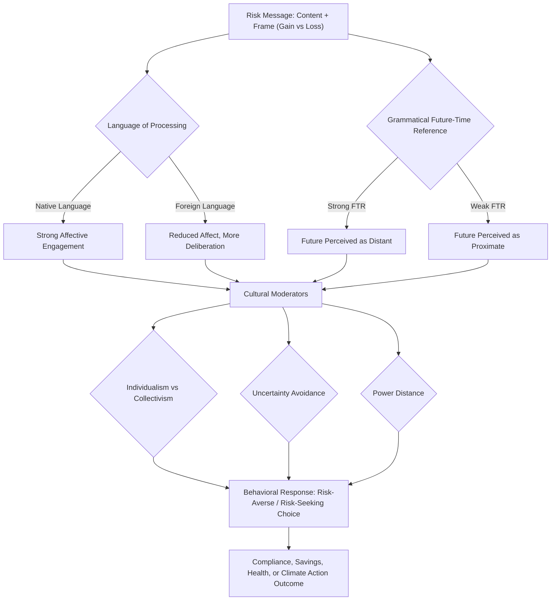

## Language, Framing, and Cross-Cultural Risk Communication

### Overview

Language, Framing, and Cross-Cultural Risk Communication examines how the linguistic structure of a message, the way choices are framed, and the cultural context of the audience jointly determine how risk information is perceived, interpreted, and acted upon. This field sits at the intersection of behavioral economics, psycholinguistics, and cross-cultural psychology. It extends classical framing effects research (Tversky and Kahneman) by asking whether these effects are cognitive universals or are moderated — sometimes substantially — by the grammatical structure of a speaker's language, collectivist versus individualist cultural orientation, and domain-specific risk norms.

### Theoretical Foundations

#### Prospect Theory and Framing as the Baseline Model

Prospect theory establishes that people evaluate outcomes as gains or losses relative to a reference point, and that losses loom larger than equivalent gains (loss aversion). The value function is concave for gains and convex for losses, and steeper for losses than gains:

$$v(x) = \begin{cases} x^{\alpha} & x \geq 0 \\ -\lambda(-x)^{\beta} & x < 0 \end{cases}$$

where $\lambda > 1$ represents the loss-aversion coefficient (typically estimated around 2.25 in Western samples), and $\alpha, \beta$ are curvature parameters typically less than 1.

The classic "Asian Disease Problem" demonstrates that logically equivalent descriptions of an outcome — framed as lives saved (gain frame) versus lives lost (loss frame) — produce systematically different risk preferences: risk-averse choices under gain framing, risk-seeking choices under loss framing. Cross-cultural and linguistic research asks whether the magnitude, direction, and even existence of this shift is stable across languages and cultures, or whether it is a WEIRD-sample (Western, Educated, Industrialized, Rich, Democratic) artifact.

#### Linguistic Relativity and the Grammatical Future-Time Reference Hypothesis

Keith Chen's Linguistic Savings Hypothesis proposes that languages differ in how strongly they grammatically mark the future. **Strong Future-Time Reference (FTR)** languages (e.g., English, Spanish, Greek) obligatorily distinguish present and future ("It will rain tomorrow"). **Weak FTR** languages (e.g., German, Mandarin, Finnish) permit using present-tense grammar to describe future events ("It rains tomorrow" is grammatical). The hypothesis holds that obligatory grammatical marking of the future perceptually distances future events from the present, which:

- Reduces the psychological weight of future consequences relative to present ones
- Correlates (in cross-country regressions) with lower savings rates, higher smoking rates, higher obesity rates, and lower retirement wealth accumulation among strong-FTR language speakers, even controlling for country fixed effects
- By extension, predicts that risk communication about long-horizon hazards (climate change, pension shortfalls, chronic disease) will be discounted more heavily when delivered in, or cognitively processed through, a strong-FTR language

**[Inference]** The causal direction of this correlation remains contested; culture, institutions, and language may be jointly determined by deeper historical factors rather than language exerting an independent causal effect. Chen's original within-country, within-family sibling comparisons were intended to address this but the identification strategy has been criticized on econometric grounds (analysis clusters at the language-family level, raising concerns about a small effective sample size of independent language "treatments").

#### The Foreign Language Effect (FLE)

Keysar, Hayakawa, and An (2012) demonstrated that decision-makers exhibit reduced framing effects and reduced loss aversion when reasoning in a foreign (non-native) language compared to their native language. Two complementary mechanisms are proposed:

1. **Reduced emotional resonance**: Foreign language processing engages weaker affective/somatic responses than native language processing, because emotional vocabulary is acquired and reinforced in childhood, native-language contexts. This dampens the affect heuristic that normally drives loss aversion.
2. **Increased deliberation (System 2 engagement)**: Processing a foreign language requires more cognitive effort, which slows automatic System 1 responses and permits more analytic evaluation of the actual probabilities and payoffs, independent of surface framing.

This has direct implications for risk communication in multilingual and immigrant populations, global health campaigns, and multinational corporate risk disclosures: identical risk information may be processed more "rationally" (less framing-susceptible) but also less viscerally (potentially under-motivating protective action) when delivered in a population's second language.

### Cross-Cultural Moderators of Framing Effects

#### Individualism-Collectivism (Hofstede Dimension)

- **Individualist cultures** (e.g., United States, Australia, Northern/Western Europe) tend to process risk framing with reference to personal/independent outcomes and show framing effects consistent with the classical prospect-theory pattern.
- **Collectivist cultures** (e.g., many East Asian, Latin American, and African cultural contexts) process risk information with reference to in-group and relational consequences. Framing manipulations that invoke family, community, or social harmony outcomes ("this will affect your family's wellbeing") tend to produce stronger behavioral shifts than framing manipulations that invoke only individual outcomes.
- **[Inference]** Some replication studies of the Asian Disease Problem across collectivist samples find attenuated or reversed framing effects relative to individualist samples, but findings are heterogeneous across studies and should not be treated as a settled cross-cultural universal.

#### Uncertainty Avoidance

Hofstede's uncertainty avoidance dimension predicts how tolerant a culture is of ambiguity. High uncertainty-avoidance cultures (e.g., Japan, Greece, Portugal) show:

- Stronger preference for explicit numeric risk statements over verbal probability terms ("70% chance" over "likely")
- Greater discomfort with, and higher information-seeking in response to, ambiguous or qualified risk statements
- Higher sensitivity to authority-source framing (risk information from a government or medical authority carries more behavioral weight than in low uncertainty-avoidance cultures)

Low uncertainty-avoidance cultures (e.g., Singapore, Jamaica, Denmark) tolerate ambiguous framing with less anxiety and are more receptive to probabilistic hedging in risk messages.

#### Power Distance

High power-distance cultures respond more strongly to risk communication framed as directives from authority figures (physicians, government agencies, elders) than to peer-framed or autonomy-emphasizing messages ("you have a choice"). Health communication campaigns in high power-distance contexts that use autonomy-supportive framing (common in US/Western public health messaging, e.g., "informed choice") can underperform relative to directive framing, and vice versa.

### Verbal Versus Numeric Probability Expressions

A core sub-literature examines translation and cross-cultural equivalence of verbal probability terms:

| Verbal Term (English) | Typical Numeric Range (Western samples) | Cross-Cultural Note |
| --- | --- | --- |
| "Highly likely" | 85-95% | Numeric anchor shifts downward in some East Asian samples |
| "Probable" | 60-75% | Wide variance; culturally and linguistically unstable |
| "Possible" | 20-50% | One of the least stable terms across languages |
| "Unlikely" | 5-20% | Relatively more stable cross-culturally |
| "Rare" | <5% | Regulatory/pharmacovigilance standard term (e.g., EMA/FDA labeling) |

**[Unverified]** Exact percentage ranges vary substantially across studies (e.g., Budescu & Wallsten's foundational work versus later replications), and translated verbal probability terms frequently fail to preserve the numeric range intended in the source language, a finding with direct consequences for translated pharmaceutical package inserts and multinational clinical-trial informed-consent documents.

### Applied Domains

#### Public Health Risk Communication

- Framing of vaccine risk/benefit information (e.g., "1 in 10,000 will experience a side effect" vs. "99.99% will experience no side effect") interacts with both loss aversion and cultural trust-in-authority norms
- Pandemic risk communication (COVID-19 messaging) research found substantial cross-national variance in the effectiveness of loss-framed ("failing to comply costs lives") versus gain-framed ("compliance saves lives") messaging, moderated by collectivism and baseline institutional trust
- **[Inference]** Loss-framed messaging appears more effective in high uncertainty-avoidance, high-trust-in-authority contexts; gain-framed and autonomy-supportive messaging appears more effective in individualist, low power-distance contexts — but effect sizes in this literature are generally small and heterogeneous across studies

#### Financial Risk Disclosure

- Retirement savings default language (opt-in vs. opt-out framing) shows the well-established status-quo bias/default effect, but the magnitude of the default effect varies with cultural attitudes toward long-term planning and, per the FTR hypothesis, grammatical future marking
- Multinational financial disclosure documents (e.g., loan terms, investment risk warnings) translated across strong-FTR and weak-FTR languages may not preserve the intended psychological salience of future risk, a compliance-relevant concern for financial regulators operating across jurisdictions

#### Climate Change Communication

Climate risk is a paradigmatic long-horizon, probabilistic, abstract risk — exactly the category where framing and linguistic-temporal effects are theorized to matter most:

- Distant/statistical framing ("global temperatures will rise 2°C by 2100") activates weaker present-oriented urgency than proximate/vivid framing ("your city will flood within your lifetime")
- Strong-FTR language communities are hypothesized (per Chen's framework) to discount distant climate consequences more heavily than weak-FTR communities, independent of underlying environmental attitudes
- Collectivist framing ("protect our shared home/future generations") tends to outperform individualist framing ("reduce your carbon footprint") in collectivist cultural contexts, and the reverse pattern is commonly reported in individualist contexts

### Methodological Considerations and Critiques

- **Translation equivalence problem**: Direct translation of framing stimuli rarely preserves connotative and affective equivalence; back-translation protocols are a minimum methodological standard, but even back-translated stimuli can differ in register, formality, and affective loading
- **WEIRD sample bias**: The foundational framing-effects literature (Tversky & Kahneman and most direct replications) draws overwhelmingly from Western, educated, industrialized, rich, democratic samples; generalization claims to other cultural contexts require direct replication, not extrapolation
- **Confound between language and culture**: Most cross-linguistic studies cannot fully separate linguistic-structural effects (grammar, FTR marking) from cultural effects (values, norms) because language and culture are jointly inherited; bilingual within-subject designs (testing the same individual in two languages) partially address this but introduce their own confounds (language-of-testing effects, differential fluency)
- **Publication and effect-size concerns**: Many cross-cultural framing findings, including some FTR-savings correlations, have faced replication difficulties or reduced effect sizes in preregistered follow-up studies; **[Speculation]** the true effect sizes for language-structure-driven risk discounting may be substantially smaller than originally reported once publication bias is accounted for

### Practical Design Guidelines for Cross-Cultural Risk Messaging

1. Pretest verbal probability terms in the target language/culture rather than assuming numeric equivalence with the source language
2. Match framing valence (gain/loss) to the cultural profile of the audience where evidence supports a directional prediction (e.g., loss-framing in high uncertainty-avoidance/high-trust contexts)
3. Prefer numeric over verbal probability expressions when precision matters and cross-cultural audiences are heterogeneous
4. Use collectivist (relational/in-group) framing in collectivist cultural contexts and individualist (autonomy/self) framing in individualist contexts, when audience segmentation is feasible
5. For long-horizon risks, supplement abstract future-tense statements with proximate, vivid, or personally relevant anchors, particularly when communicating to strong-FTR language populations
6. Avoid literal translation of framing stimuli; commission culturally adapted (not merely linguistically translated) versions and validate with native-speaker pretesting

### Diagram: Interacting Pathways from Language/Culture to Risk Behavior (svg_diagram)

### Key Points

- Framing effects from prospect theory are not culturally invariant; their magnitude and even direction can shift with individualism-collectivism, uncertainty avoidance, and power distance
- The Foreign Language Effect shows that processing risk information in a non-native language reduces loss aversion and framing susceptibility by dampening emotional engagement and increasing deliberation
- The grammatical Future-Time Reference hypothesis links obligatory future-tense marking to weaker future-oriented behavior (savings, health), though causal identification remains contested
- Verbal probability expressions are not cross-culturally or cross-linguistically stable; numeric expressions are preferable for precision-critical communication
- Effective cross-cultural risk communication requires cultural adaptation of framing valence and relational orientation, not literal translation

**Next Steps**

- Prospect Theory: Value Function and Reference Dependence
- Hofstede's Cultural Dimensions and Economic Decision-Making
- Nudge Theory Across Regulatory and Cultural Contexts
- Numeracy, Health Literacy, and Risk Perception
- Default Effects and Opt-In/Opt-Out Design in Retirement Savings
- Affect Heuristic and Dual-Process (System 1/System 2) Models of Judgment
- Cross-National Replication Crises in Behavioral Economics