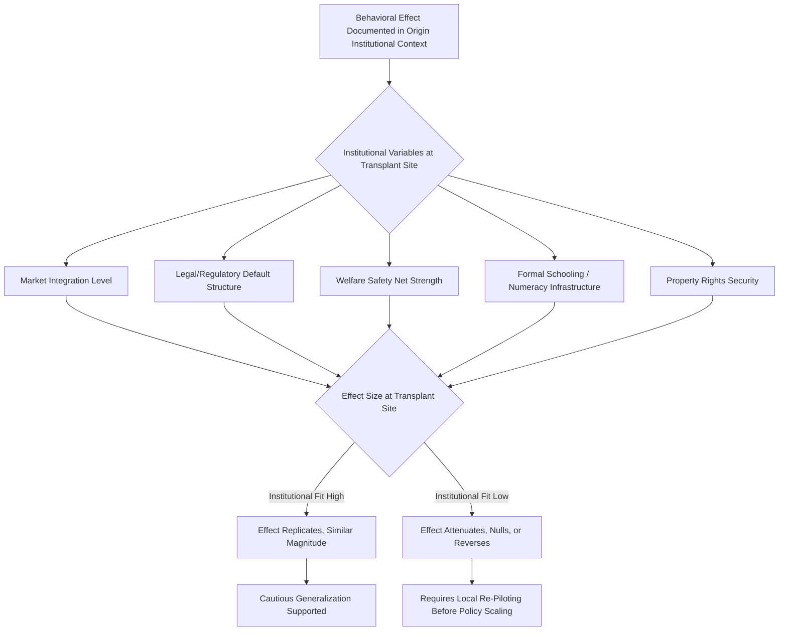

## Institutional Context and the Generalizability of Behavioral Findings

### Overview

Institutional Context and the Generalizability of Behavioral Findings examines the extent to which behavioral economics results — heuristics, biases, and nudge effects established primarily in laboratory and Western institutional settings — replicate, attenuate, or reverse when tested across different institutional environments (market structures, legal systems, welfare regimes, regulatory frameworks) and cultural populations. This topic operationalizes the broader external-validity critique of behavioral economics: a finding is not merely a property of human cognition but potentially a joint product of cognition and the institutional scaffolding within which the decision is embedded.

### Theoretical Framing

#### The Ecological Rationality Thesis

Gigerenzer and colleagues argue that heuristics are not context-independent cognitive defects but are "ecologically rational" — adapted to specific environmental/institutional structures. A heuristic that produces a "bias" relative to normative expected-utility theory in one institutional context may be adaptive and accuracy-maximizing in another. This reframes generalizability failures not as replication failures but as evidence that the heuristic-environment fit determines the behavioral outcome. Under this view, institutional context is not a nuisance variable to control away but a core explanatory variable.

#### Institutions as Choice Architecture at Scale

Thaler and Sunstein's choice architecture framework applies at the level of individual interventions (defaults, framing), but institutional economists extend it to the meso/macro level: market structures, legal defaults, and regulatory regimes constitute a society-wide choice architecture that can amplify, dampen, or invert individual-level behavioral effects. For example:

- A default-enrollment nudge (automatic 401(k) enrollment) is only exploitable in institutional contexts where employer-sponsored retirement infrastructure exists; the same nudge is structurally inapplicable in informal-economy-dominated labor markets
- Loss aversion in labor supply (reference-dependent effort, as in the classic cab-driver studies) may be attenuated or absent under piece-rate versus salaried institutional pay structures, independent of the underlying psychological trait

#### WEIRD Samples and the Generalizability Crisis

Henrich, Heine, and Norenzayan's foundational critique demonstrated that the overwhelming majority of published behavioral science relies on Western, Educated, Industrialized, Rich, Democratic samples, and that WEIRD populations are frequent behavioral outliers relative to the full distribution of human societies across measures including:

- Fairness norms in ultimatum/dictator games (WEIRD samples show unusually high rejection rates for unfair offers relative to small-scale societies)
- Spatial cognition and numerical cognition
- Susceptibility to visual illusions (e.g., Müller-Lyer illusion strength correlates with exposure to "carpentered," rectilinear built environments)
- Self-concept (independent vs. interdependent self-construal)

**[Inference]** Because institutional context (market integration, religious tradition, subsistence pattern, exposure to formal schooling) covaries strongly with WEIRD status in Henrich et al.'s cross-cultural game-theory studies, institutional variation is plausibly a primary causal channel — not merely a correlate — through which the WEIRD generalizability gap operates, though the original studies were not designed to fully decompose institutional from cultural-cognitive causation.

### Institutional Dimensions That Moderate Behavioral Effects

#### Market Integration

Henrich's cross-cultural ultimatum game studies (15 small-scale societies) found that the degree of market integration — how much a community's economic life depends on exchange with strangers via market transactions, versus kin-based subsistence — predicts fairness-related offer and rejection behavior better than any measure of "culture" per se. Higher market integration correlates with offers closer to the 50/50 split typical of WEIRD lab studies, consistent with the hypothesis that market institutions train norms of impartial fairness with strangers.

#### Legal and Regulatory Default Structures

Nudge effectiveness is institutionally contingent on legal defaults already in place:

- Organ donation opt-out (presumed consent) systems produce dramatically higher donation rates than opt-in systems, but the size of this effect interacts with the broader healthcare institutional trust environment (Johnson & Goldstein's cross-country organ donation data)
- Behaviorally-informed regulatory nudges (e.g., "Nudge Units" / Behavioural Insights Team models originating in the UK) show attenuated effect sizes when transplanted into institutional contexts with different baseline levels of bureaucratic trust, financial literacy infrastructure, or enforcement credibility
- **[Unverified]** Direct government-to-government transplant studies of nudge interventions (e.g., UK-designed tax-reminder nudges applied in different national tax administration contexts) report heterogeneous, and in some cases null, replication effects, though the literature on this specific transplant question remains comparatively thin relative to lab-based cross-cultural replications

#### Welfare State and Safety Net Structure

Risk-preference elicitation (e.g., loss aversion coefficients, discount rates) measured in populations with strong social safety nets (Nordic welfare states) versus weak/absent safety nets (many low- and middle-income country contexts) shows systematically different risk-taking baselines. **[Inference]** This is plausibly better explained by rational adaptation to differing consequence-severity of downside risk (institutional insurance substitutes for individual risk aversion) than by any cross-cultural difference in the underlying psychological loss-aversion parameter, though disentangling "institutionally rational adjustment" from "culturally conditioned preference" empirically is difficult with observational data alone.

#### Property Rights and Endowment Effect Strength

The endowment effect (willingness-to-accept exceeding willingness-to-pay for an owned good) has been shown in cross-cultural replications to vary with:

- Strength and legal security of property rights institutions (weaker/less secure property rights correlate with attenuated endowment effects in some studies, consistent with an ecological-rationality account where the effect is adaptive under institutions that reliably protect ownership)
- Market experience (experimental subjects with extensive trading experience in market institutions — e.g., professional traders — show reduced endowment effects relative to novice subjects, a finding replicated within single institutional contexts and used to argue the effect is partly a "learned" market-institutional artifact rather than a hardwired universal)

#### Formal Schooling and Numeracy Infrastructure

Access to formal schooling — itself an institutional variable — predicts performance on canonical heuristics-and-biases tasks (base-rate neglect, conjunction fallacy, probability-weighting curvature) independent of raw cognitive ability measures. Populations with less exposure to formal probabilistic/statistical schooling show different — not simply "worse" — patterns of probability weighting, consistent with formal numeracy education functioning as an acquired institutional technology rather than probability reasoning being a fixed cognitive universal.

### Replication and Generalizability Evidence

#### Large-Scale Cross-Cultural Replication Projects

- **Many Labs** projects have directly tested replicability of classic behavioral/social-psychological effects (including some framing and heuristic effects) across dozens of labs and countries, finding substantial heterogeneity in effect size by site — with some sites showing null or reversed effects
- Cross-country field experiments on default nudges, sludge, and choice architecture (compiled in meta-analyses following the original Thaler/Sunstein-era enthusiasm) generally find that average effect sizes are smaller and more heterogeneous than the original single-site studies suggested, a pattern consistent with a broader "behavioral economics replication and effect-size deflation" concern in the field
- **[Speculation]** Some researchers have proposed that institutional heterogeneity itself — rather than sampling noise or researcher degrees of freedom — is a meaningful share of the "unexplained" variance in these multi-site replication effect sizes, implying that treating institutional context as a moderator variable (rather than noise) in future study designs could meaningfully improve predictive validity, though this reframing is a research proposal rather than an established finding

#### Distinguishing Institutional Moderation from Measurement Non-Equivalence

A key methodological challenge is separating genuine institutional moderation of a psychological effect from measurement non-equivalence — i.e., whether the experimental instrument (survey item, game payoff structure, framing stimulus) means the same thing and is understood the same way across institutional contexts. Failure to establish measurement invariance before comparing effect sizes across institutional settings risks attributing artifacts of translation or task (mis)comprehension to genuine psychological or institutional variation.

### Applied Domains

#### Development Economics and Nudge Transplantation

Behaviorally-informed development interventions (e.g., SMS savings reminders, commitment devices, fertilizer micro-loans with behavioral framing) designed and validated in one institutional context (frequently a specific country RCT) are frequently scaled or transplanted to other low- and middle-income country contexts under an implicit assumption of institutional-context invariance. The generalizability literature cautions against this "external validity by assumption" approach, recommending institutional-context replication (not just population replication) before scaling.

#### Financial Regulation

Behavioral finance findings on retail investor biases (disposition effect, overconfidence, home bias) have been shown to vary in strength across financial market institutional structures — the depth and liquidity of the market, the presence/absence of investor protection regulation, and the maturity of financial intermediary institutions all moderate the size of documented retail-investor biases.

#### Public Health and Nudge Units

The proliferation of government "nudge units" internationally (UK Behavioural Insights Team and its many international analogues) has generated a natural experiment in cross-institutional nudge transplantation, with growing recognition in the policy-evaluation literature that direct transplant of nudge designs across differing administrative-state institutional capacities requires local re-piloting rather than assuming portability.

### Methodological Recommendations for Assessing Generalizability

1. Report institutional-context variables (market integration, welfare regime type, legal default structure, formal schooling access) alongside cultural/demographic variables in cross-national behavioral studies, to allow institutional moderation to be statistically distinguished from cultural moderation
2. Establish measurement invariance (via multi-group confirmatory factor analysis or equivalent) before comparing effect sizes across institutional contexts
3. Treat single-site nudge or bias findings as institutionally contingent hypotheses requiring local replication before policy transplantation, rather than as portable universal facts
4. Where possible, use within-subject or natural-experiment designs that hold institutional context constant while varying the manipulation of interest, to isolate the psychological effect from institutional confounds
5. Explicitly report and justify sample WEIRD-ness (or lack thereof) and avoid unqualified generalization language ("people are loss averse") in favor of scope-qualified claims ("loss aversion of this magnitude was observed in this institutional/cultural context")

### Diagram: Institutional Moderation Pathway (svg_diagram)

### Key Points

- Behavioral findings are jointly produced by cognition and institutional context; generalizability requires treating institutions as explanatory variables, not noise
- The ecological rationality thesis reframes cross-context "bias reversals" as adaptive fit between heuristic and institutional environment rather than replication failure
- Market integration, legal defaults, welfare regime structure, property rights security, and formal schooling access are documented institutional moderators of canonical behavioral effects
- WEIRD-sample overreliance in the foundational literature substantially limits unqualified generalization claims
- Nudge and bias findings should be treated as institutionally contingent hypotheses requiring local replication before cross-context policy transplantation

**Next Steps**

- Ecological Rationality and the Adaptive Toolbox (Gigerenzer)
- Market Integration and Fairness Norms in Small-Scale Societies (Henrich et al.)
- WEIRD Psychology and the Generalizability Crisis
- Nudge Unit Case Studies and Cross-National Policy Transplantation
- Measurement Invariance in Cross-Cultural Behavioral Research
- Endowment Effect and Property Rights Institutions
- Replication Crisis in Behavioral Economics: Effect Size Deflation