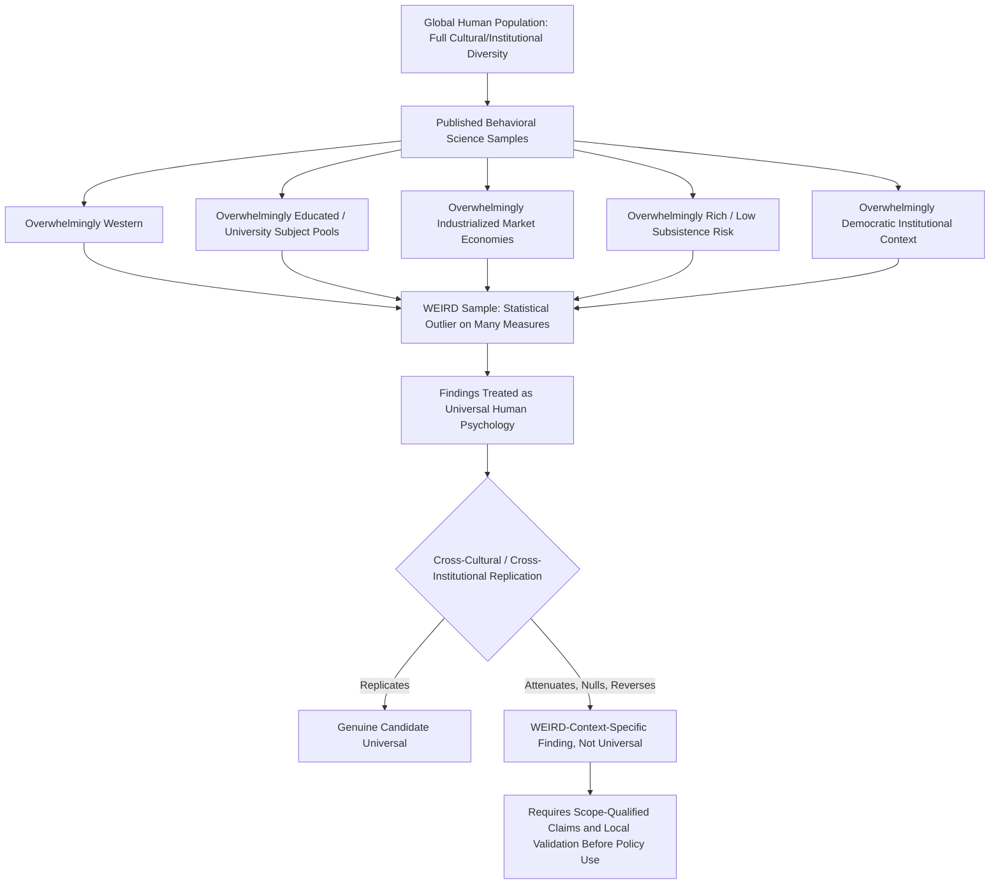

## The WEIRD Samples Problem in Behavioral Research

### Overview

The WEIRD Samples Problem refers to the systematic overreliance of behavioral, psychological, and economic research on participants who are Western, Educated, Industrialized, Rich, and Democratic (WEIRD) — a narrow and, on many measured dimensions, statistically outlying slice of the global human population. The term was coined by Joseph Henrich, Steven Heine, and Ara Norenzayan in their influential 2010 paper, which argued that findings from this narrow sample base have been widely and often implicitly generalized as universal features of "human" psychology and economic behavior, despite substantial evidence that WEIRD populations are frequently outliers rather than representative cases.

### Origin and Definition

#### The Henrich, Heine, and Norenzayan (2010) Critique

The foundational paper, published in *Behavioral and Brain Sciences*, made two core empirical claims:

1. **Sampling skew**: The overwhelming majority of subjects in top-tier psychology and behavioral science journals were drawn from Western, and specifically American undergraduate, populations — a group representing a small fraction of the world's population and an even smaller fraction of its cultural, economic, and cognitive diversity
2. **Outlier status**: Across a wide range of domains — visual perception, fairness and cooperation, self-concept, moral reasoning, spatial cognition, and decision-making under risk — WEIRD populations frequently score at or near the extreme end of the global distribution, rather than near the center, meaning WEIRD samples are poor proxies for "typical" human cognition

**[Fact]** The acronym itself is now standard terminology across behavioral economics, psychology, and cognitive science literature and is used both descriptively (characterizing a sample) and critically (flagging a generalizability limitation).

#### Decomposing the Acronym

| Dimension | What It Captures | Institutional/Structural Correlate |
| --- | --- | --- |
| Western | Cultural and historical lineage rooted in Western Europe/North America | Protestant Reformation legacy, individualist kinship norms |
| Educated | Formal schooling exposure, particularly higher education | Numeracy, abstract/hypothetical reasoning training |
| Industrialized | Market-based, wage-labor economic structure | Market integration, division of labor |
| Rich | High per-capita income and material security | Reduced subsistence risk, safety-net availability |
| Democratic | Political systems with broad enfranchisement and rule-of-law norms | Institutional trust, impartial rule-following norms |

These five dimensions are correlated but analytically distinct; a population can be WEIRD on some dimensions and not others (e.g., wealthy authoritarian states, educated but non-Western societies), and disentangling which specific dimension drives a given behavioral outlier finding remains an open empirical question in most cases.

### Documented Domains of WEIRD Outlier Status

#### Fairness and Cooperation (Ultimatum and Dictator Games)

Henrich's companion cross-cultural fieldwork across 15 small-scale societies found dramatically more variable ultimatum-game offer and rejection behavior than the narrow range typically observed in university-subject-pool studies. WEIRD samples show unusually high modal offers near 50/50 splits and unusually high rejection rates for low offers (interpreted as costly punishment of perceived unfairness) relative to the full cross-cultural range, where some societies show much lower typical offers with correspondingly low rejection rates, and others show hyper-fair (above 50%) offers tied to local gift-giving norms.

#### Visual Perception

Susceptibility to certain geometric visual illusions — most famously the Müller-Lyer illusion — varies substantially across populations and correlates with exposure to "carpentered," rectilinear built environments (a proxy for industrialization/urbanization). Populations with less exposure to right-angled architecture show markedly reduced illusion susceptibility, indicating that even basic visual perception is partly calibrated by built-environment experience rather than being a fixed low-level universal.

#### Self-Concept: Independent Versus Interdependent Construal

WEIRD populations, and American samples in particular, show a pronounced bias toward independent self-construal (defining the self via internal traits, preferences, and achievements relatively separate from social context), whereas many non-WEIRD populations show stronger interdependent self-construal (defining the self relationally, via roles and group membership). This dimension has downstream consequences for framing effects, motivation research, and consumer choice modeling that assume an independent, preference-stable individual actor.

#### Moral Reasoning

Cross-cultural moral-dilemma research (e.g., extensions of trolley-problem paradigms) finds that WEIRD samples show a distinctive emphasis on individual-rights-based and intention-based moral reasoning, while other cultural traditions show relatively greater emphasis on outcome-based, role-based, or community-harm-based moral reasoning, complicating claims of a universal moral-cognition architecture derived from WEIRD-sample dilemma studies.

#### Numerical and Spatial Cognition

Populations without extensive formal schooling exposure show qualitatively different (not simply less accurate) numerical cognition strategies, including different use of exact versus approximate number systems, and different default spatial reference frames (egocentric versus geocentric/absolute), directly relevant to how probabilistic and risk information is mentally represented and communicated.

### Consequences for Behavioral Economics Specifically

#### Canonical Heuristics-and-Biases Findings

Core behavioral economics phenomena — loss aversion magnitude, present bias/hyperbolic discounting curvature, framing effect size, the endowment effect, probability-weighting curvature in prospect theory — were predominantly established using WEIRD (frequently North American university) samples. Where cross-cultural or cross-institutional replication has been attempted:

- Loss aversion coefficients show meaningful cross-population variance, plausibly linked to both cultural and institutional (safety-net) factors
- Present-bias/discount-rate estimates vary substantially with market integration, income security, and formal schooling exposure
- Framing effect magnitude and even directionality show documented cross-cultural heterogeneity (see companion topic: Language, Framing, and Cross-Cultural Risk Communication)

**[Inference]** Because so much of the foundational behavioral economics parameter literature (loss-aversion coefficients, discount rates, risk-aversion curvature) derives from WEIRD samples, "standard" calibrated parameter values widely used in applied behavioral economics and policy modeling (e.g., $\lambda \approx 2.25$ for loss aversion) should be treated as WEIRD-context-specific estimates rather than universal human constants, though the degree of non-generalizability for any specific parameter has not been comprehensively mapped across the full range of global institutional contexts.

#### The Nudge Transplantation Problem

Behaviorally-informed policy interventions ("nudges") designed and validated in WEIRD institutional contexts (predominantly UK, US, and Western European government behavioral insights units) are frequently exported to non-WEIRD policy contexts under an implicit portability assumption. This is a direct practical consequence of the WEIRD samples problem: a nudge calibrated to WEIRD default-effect magnitudes, WEIRD institutional-trust levels, and WEIRD numeracy/schooling baselines may underperform, overperform, or backfire when transplanted without local re-validation (see companion topic: Institutional Context and the Generalizability of Behavioral Findings).

### Scope and Magnitude of the Sampling Skew

**[Unverified]** Henrich, Heine, and Norenzayan's original analysis of publications in leading psychology journals found that a large majority of study samples were drawn from Western countries, and the majority of those specifically from the United States, with American samples themselves disproportionately composed of undergraduate psychology students — a "thin slice" sampling pattern (convenience sampling from university subject pools) that compounds the national/cultural skew with an age, education-level, and socioeconomic skew even within Western countries. Precise updated percentages should be verified against current bibliometric analyses, as the original audit is now over a decade old and the field has made some documented efforts (e.g., online cross-cultural platforms, the Psychological Science Accelerator) to broaden sampling since publication.

### Methodological Responses and Mitigations

#### Large-Scale Cross-Cultural Replication Infrastructure

- **Psychological Science Accelerator**: A distributed, crowdsourced global research network explicitly designed to enable large-scale, multi-site, cross-cultural replication and original data collection, directly addressing the single-site/single-country sampling limitation
- **Many Labs projects**: Multi-site replication initiatives testing classic effects (including several behavioral-economics-relevant framing and heuristic effects) across many countries and institutional contexts simultaneously, revealing substantial site-to-site heterogeneity in effect size

#### Methodological Best Practices

1. Report sample composition (country, education level, urbanicity, market integration where feasible) explicitly rather than treating "convenience sample" as a neutral default
2. Use scope-qualified claim language ("this effect was observed in [population/context]") rather than unqualified universal claims ("people exhibit loss aversion")
3. Prioritize direct replication in non-WEIRD, non-university-subject-pool samples before treating a finding as a candidate universal, particularly before using it to inform policy design intended for non-WEIRD populations
4. Where cross-cultural replication is infeasible, explicitly flag external validity as an open question in study limitations rather than omitting the caveat
5. Distinguish, where possible, which specific WEIRD sub-dimension (education, market integration, wealth, political system) is the plausible driver of an observed effect, to support more precise generalizability claims than the blunt WEIRD/non-WEIRD binary allows

### Diagram: WEIRD Sampling Skew and Its Downstream Effects (svg_diagram)

### Key Points

- The WEIRD acronym (Western, Educated, Industrialized, Rich, Democratic) identifies a narrow, non-representative sampling pattern dominant in published behavioral and psychological research
- WEIRD populations are frequently statistical outliers, not typical cases, across fairness norms, visual perception, self-concept, moral reasoning, and numerical cognition
- Core behavioral economics parameters (loss aversion coefficients, discount rates, framing effect sizes) derive predominantly from WEIRD samples and should be treated as context-specific estimates rather than universal constants
- The problem has direct practical consequences for nudge policy transplantation across institutional and cultural contexts
- Mitigation requires expanded cross-cultural replication infrastructure, transparent sample reporting, and scope-qualified generalization claims

**Related Topics**

- Henrich, Heine, and Norenzayan (2010): Original Framework and Evidence Base
- Institutional Context and the Generalizability of Behavioral Findings
- Language, Framing, and Cross-Cultural Risk Communication
- Market Integration and Fairness Norms in Small-Scale Societies
- Psychological Science Accelerator and Distributed Replication Networks
- Calibrating Prospect Theory Parameters Across Cultural Contexts
- Replication Crisis in Behavioral Economics