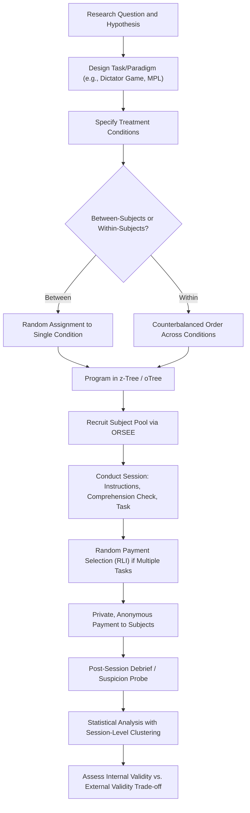

## Laboratory Experiment Design

### Overview

Laboratory Experiment Design encompasses the methodological principles, procedures, and technical infrastructure used to conduct controlled behavioral economics experiments in dedicated laboratory settings. Laboratory experiments are distinguished from field experiments by their high degree of environmental control, use of induced-value theory to create incentive-compatible economic environments, and reliance on standardized software platforms for implementation. This methodology forms the empirical backbone of experimental economics as a discipline, tracing to foundational work by Vernon Smith, Charles Plott, and later Daniel Kahneman and Amos Tversky's decision-theoretic paradigms.

### Theoretical Foundations

#### Induced Value Theory

Vernon Smith's induced value theory provides the methodological justification for laboratory economic experiments: by attaching real monetary payoffs to abstract decisions (tokens, points, choices), the experimenter can induce specific, known reward structures onto subjects regardless of their intrinsic preferences, provided three conditions hold:

1. **Monotonicity**: Subjects prefer more reward-medium (money) to less
2. **Salience**: Payoffs are clearly and demonstrably tied to decisions/outcomes
3. **Dominance**: Induced monetary rewards dominate subjects' other motivations (fatigue costs, intrinsic task interest) within the experiment

When these conditions hold, the experimenter can treat observed behavior as revealing something about decision-making under the induced incentive structure, rather than needing to know subjects' true underlying utility functions.

#### Incentive Compatibility

A mechanism or payment scheme is incentive-compatible if truthful revelation of preferences (or the theoretically predicted optimal strategy) is a dominant or equilibrium strategy for the subject. Common incentive-compatible elicitation mechanisms in laboratory behavioral economics include:

- **Becker-DeGroot-Marschak (BDM) mechanism**: Elicits a subject's true willingness-to-pay or willingness-to-accept for a good by having them state a price, then comparing it against a randomly drawn market price; truthful revelation is a weakly dominant strategy
- **Multiple Price List (MPL)**: Presents a sequence of binary choices (e.g., between a safe and risky lottery, or between smaller-sooner and larger-later payoffs) with systematically varying parameters, used to elicit risk preferences (Holt-Laury task) and time preferences
- **Random Lottery Incentive (RLI) / Random Problem Selection**: When subjects complete multiple decision tasks in one session, only one task (or a random subset) is selected for actual payment, preserving incentive compatibility across all tasks while controlling total experimental cost

#### Payment Protocols

- **Show-up fee**: A fixed payment guaranteed for attendance, independent of performance, separating the participation decision from the incentive structure of the task itself
- **Performance-contingent payment**: Payment tied to actual decisions/outcomes within the experiment, essential for induced value theory to apply
- **Show-up fee dominance concern**: If the show-up fee is large relative to potential task earnings, subjects may not treat the task incentives as salient (violating the salience/dominance conditions), a design parameter requiring careful calibration relative to local wage rates and subject pool opportunity cost

### Core Design Principles

#### Control

Laboratory experiments prioritize maximal control over the decision environment: information sets, available actions, payoff structures, timing, and interaction partners are all fully specified and held constant except for the deliberately manipulated treatment variable. This control enables clean causal identification at the cost of reduced ecological/external validity relative to field settings.

#### Random Assignment to Treatment

Subjects (or sessions) are randomly assigned to treatment and control conditions to ensure that observed behavioral differences are attributable to the manipulated variable rather than pre-existing subject characteristics. Randomization can occur at the individual level (within-session, between-subject) or session level (between-session), each with different implications for statistical independence assumptions.

#### Between-Subjects Versus Within-Subjects Design

| Design Type | Structure | Advantages | Disadvantages |
| --- | --- | --- | --- |
| Between-subjects | Each subject experiences only one treatment condition | No carryover/order effects; no demand-effect contamination across conditions | Requires larger sample sizes; individual heterogeneity adds noise to treatment comparison |
| Within-subjects | Each subject experiences multiple/all treatment conditions | Higher statistical power per subject; controls for individual fixed effects | Order effects, learning effects, and experimenter-demand effects (subjects inferring the hypothesis) are significant threats to validity |

Within-subjects designs typically require counterbalancing (randomizing the order in which conditions are presented across subjects) to separate order effects from treatment effects.

#### Deception Policy

A near-universal norm in experimental economics (distinct from experimental psychology, where deception is more common) prohibits deceiving subjects about the payoff structure, procedures, or existence of other participants. This norm exists because:

- Subject pools are typically shared across a university's experimental economics laboratory; reputational effects of discovered deception can contaminate the subject pool for all future experiments (a negative externality across researchers)
- Deception undermines the incentive-compatibility assumptions underlying induced value theory — if subjects distrust the stated payoff structure, they may not respond to induced incentives as intended

This no-deception norm is one of the most consequential methodological differences between experimental economics and much of experimental psychology, and reviewers/journals in economics venues frequently reject submissions using deceptive procedures.

#### Anonymity and Double-Blind Procedures

Many laboratory paradigms (dictator games, ultimatum games, public goods games) require anonymity between subjects and, in more rigorous designs, "double-blind" procedures where even the experimenter cannot link individual decisions to individual subjects, to rule out experimenter-observation or reputation-based motives as confounds on prosocial behavior.

### Standard Experimental Paradigms

#### Risk Preference Elicitation

- **Holt-Laury Task**: A multiple price list presenting ten paired lottery choices with systematically shifting probabilities, where the switching point from the safe to risky lottery reveals an interval estimate of the subject's constant relative risk aversion coefficient
- **Binswanger/Eckel-Grossman gamble-choice tasks**: Simplified single-choice-from-a-menu risk elicitation tasks trading off implementation complexity against measurement precision

#### Time Preference Elicitation

- **Convex Time Budget (CTB) method** (Andreoni-Sprenger): Subjects allocate a budget across sooner and later payment dates, permitting joint estimation of discount rates and utility curvature, an improvement over binary smaller-sooner/larger-later choice tasks that confound the two parameters
- **Front-end delay designs**: Comparing "now vs. later" choices against "later vs. even-later" choices of identical time gaps, used to test for hyperbolic/present-bias discounting patterns versus constant (exponential) discounting

#### Social Preference Games

- **Dictator Game**: One subject unilaterally allocates an endowment between themselves and a passive recipient, isolating pure other-regarding preference absent strategic considerations
- **Ultimatum Game**: One subject proposes a division of an endowment; the second subject can accept (both receive proposed amounts) or reject (both receive zero), used to measure fairness norms and costly punishment of perceived unfairness
- **Trust Game**: A sender transfers a portion of an endowment, which is multiplied, to a receiver, who may return any portion; measures trust (sender transfer) and trustworthiness/reciprocity (receiver return)
- **Public Goods Game**: Multiple subjects choose contributions to a shared pool that is multiplied and redistributed equally, creating a social dilemma between individual free-riding incentive and group welfare-maximizing full contribution

#### Market and Auction Experiments

- **Double auction markets**: Laboratory replications of continuous double-auction market institutions, foundational to Vernon Smith's early experimental economics work demonstrating rapid convergence to competitive equilibrium prices even with a small number of traders and incomplete information
- **Vickrey (second-price sealed-bid) auctions**: Used to test whether subjects bid their true valuation as theoretically predicted (dominant strategy), frequently finding systematic overbidding relative to theory

### Technical Implementation Infrastructure

#### Laboratory Software Platforms

- **z-Tree (Zurich Toolbox for Readymade Economic Experiments)**: The historically dominant software platform for programming and running computerized laboratory economic experiments, using a proprietary scripting language; widely used across academic experimental economics laboratories globally
- **oTree**: A Python-based, web-browser-accessible open-source platform enabling both traditional in-lab computer-terminal experiments and online/remote data collection, increasingly favored for its modern web architecture, version control compatibility, and lower licensing barrier relative to z-Tree
- **LIONESS Lab, Qualtrics with custom scripting, and PsychoPy/jsPsych** (borrowed from psychology): Alternative or complementary platforms, particularly for hybrid survey-experiment designs or when psychophysical timing precision is required

#### Physical Laboratory Infrastructure

Standard behavioral/experimental economics laboratories typically feature:

- Individual computer terminals with visual partitions preventing subjects from observing neighboring screens (preserving anonymity and preventing behavioral contagion/copying)
- A server-client networked architecture (particularly for z-Tree and oTree) allowing the experimenter to control session timing, randomization, and matching centrally while subjects interact only through their terminal
- Standardized subject recruitment and scheduling systems (e.g., ORSEE — Online Recruitment System for Economic Experiments) to manage subject pool databases, prevent repeat participation across related studies, and randomize session assignment

### Statistical and Methodological Considerations

#### Sample Size and Power Analysis

Laboratory experimental economics sessions are typically costly (subject payments, room/software costs, lengthy protocols), creating strong incentives toward small sample sizes; a priori power analysis based on expected effect sizes (frequently informed by pilot data or prior literature) is a standard, increasingly required, methodological step for publication in top field journals.

#### Unit of Observation and Clustering

When subjects interact within a session (e.g., market or public-goods game experiments where outcomes depend on other subjects in the same session), the session — not the individual subject — may constitute the true independent unit of observation for certain statistical purposes, requiring session-level clustering of standard errors or session-level randomization of treatment to avoid pseudo-replication.

#### Experimenter Demand Effects

Subjects may adjust behavior based on inferred hypotheses about what the experimenter wants to observe, rather than responding purely to the induced incentive structure. Mitigations include: neutral, non-suggestive instructional framing; between-subjects rather than within-subjects designs where feasible; and post-experiment suspicion probes/debriefing questionnaires to detect and statistically control for demand-effect awareness.

#### External Validity Critique

The core methodological trade-off of laboratory experiments is high internal validity (clean causal identification via control and randomization) against limited external/ecological validity: student subject pools, artificial stakes (even when real, typically far smaller than naturally occurring economic decisions), abstracted decision framing (tokens/points rather than naturalistic goods), and the WEIRD-sample composition of most university laboratory subject pools (see companion topic: The WEIRD Samples Problem in Behavioral Research) all raise questions about generalization beyond the laboratory context. Field experiments (a distinct methodological category) are frequently motivated explicitly as a response to this critique.

### Diagram: Standard Laboratory Experiment Workflow (svg_diagram)

### Key Points

- Laboratory experiments rely on induced value theory and incentive-compatible mechanisms (BDM, MPL, RLI) to create controlled, known economic environments
- The no-deception norm is a defining methodological feature distinguishing experimental economics from experimental psychology
- Standard paradigms (Holt-Laury risk elicitation, dictator/ultimatum/trust/public goods games, double auctions) each isolate specific behavioral parameters or preference types
- z-Tree and oTree are the dominant technical platforms for implementation, with oTree increasingly favored for web-based and remote data collection
- The central methodological trade-off is high internal validity from control and randomization against limited external validity from artificial stakes and non-representative subject pools

**Next Steps**

- Field Experiments and Natural Field Experiments in Behavioral Economics
- Holt-Laury Risk Elicitation: Procedure and Parameter Estimation
- Induced Value Theory and Incentive Compatibility Mechanisms
- oTree Architecture and Implementation Walkthrough
- Public Goods Games and Free-Rider Behavior
- Experimenter Demand Effects: Detection and Mitigation
- The WEIRD Samples Problem in Behavioral Research