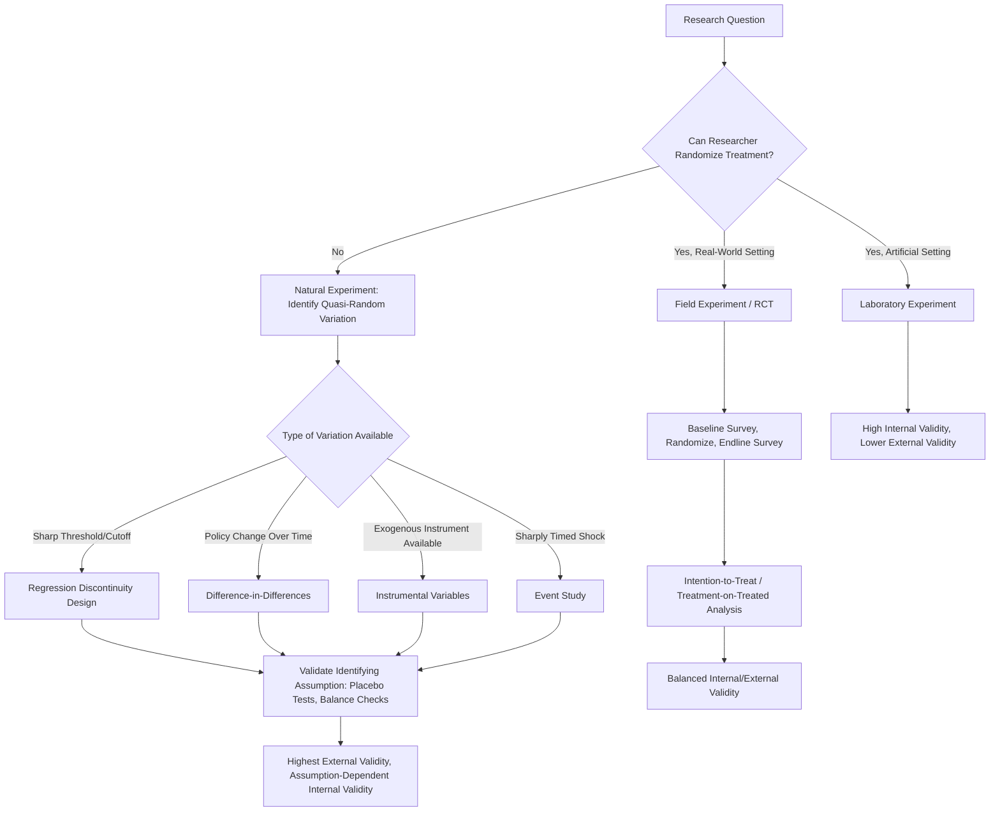

## Field Experiments and Natural Experiments

### Overview

Field Experiments and Natural Experiments comprise the primary methodological alternatives to laboratory experimentation in behavioral economics, designed to test behavioral theories in real-world decision environments where subjects act with naturalistic stakes, information, and social context. Field experiments involve deliberate researcher-introduced randomization within a real-world setting, while natural experiments exploit naturally occurring, quasi-random variation in exposure to a treatment condition without direct researcher manipulation. Both approaches trade some degree of experimental control for improved external validity relative to laboratory settings.

### Theoretical Rationale

#### The External Validity Motivation

Laboratory experiments achieve high internal validity through control but face persistent critique regarding generalizability: artificial stakes, abstracted decision framing, and WEIRD, university-subject-pool composition (see companion topics: Laboratory Experiment Design; The WEIRD Samples Problem in Behavioral Research). Field and natural experiments respond to this critique directly by studying behavior of real economic agents (consumers, workers, farmers, voters, investors) making decisions with real, often high, stakes in their naturally occurring choice environment, with researcher intervention minimized or entirely absent.

#### The Internal-External Validity Trade-off Continuum

Harrison and List's influential taxonomy positions experimental methods along a continuum from conventional lab experiments to natural field experiments, based on the degree to which the experimental environment resembles a subject's naturally occurring decision context:

1. **Conventional lab experiment**: Standard subject pool, imposed abstract task, known researcher observation
2. **Artefactual field experiment**: Same abstract task as a lab experiment, but with a non-standard subject pool (e.g., market traders instead of students)
3. **Framed field experiment**: Same non-standard subject pool, but with a naturalistically framed task, commodity, or information set rather than an abstract token-based task
4. **Natural field experiment**: The environment in which subjects operate is their naturally occurring one, subjects are engaged in the tasks they would naturally undertake, and — critically — subjects are unaware they are participating in an experiment at all

Each step along this continuum generally trades increased external validity for reduced experimental control, though the relationship is not strictly monotonic across all design dimensions.

### Field Experiments

#### Definition and Core Features

A field experiment applies deliberate, researcher-controlled random assignment to treatment and control conditions within a real-world (non-laboratory) setting. Unlike lab experiments, subjects are typically engaged in an activity that is naturalistic to their normal lives (shopping, working, farming, voting) rather than an artificial task constructed solely for research purposes.

#### Design Principles

- **Randomization unit**: Field experiments may randomize at the individual level, household level, village/community level, firm level, or geographic-cluster level, depending on the intervention and the risk of spillover/contamination between treatment and control units
- **Blinding limitations**: Full subject blinding to treatment status is often impossible in field settings (e.g., a subject receiving a cash transfer knows they received it), though blinding of the researcher's hypothesis, and in some designs blinding of implementing staff, remains feasible and desirable to reduce experimenter-demand and implementation-bias confounds
- **Compliance and attrition**: Field experiments face substantially greater risk of non-compliance (treatment-assigned subjects not receiving/adopting the treatment) and differential attrition (treatment and control groups dropping out of the study at different rates) than laboratory settings, requiring explicit statistical handling (intention-to-treat analysis, instrumental variables using assignment as an instrument for actual treatment receipt)

#### Randomized Controlled Trials (RCTs) in Behavioral Economics

The RCT, borrowed methodologically from clinical medicine, is the dominant field experimental design in applied behavioral economics and development economics, popularized substantially by researchers including Esther Duflo, Abhijit Banerjee, and Michael Kremer (2019 Nobel laureates for this methodological contribution). Standard RCT design elements:

- **Baseline survey**: Pre-treatment measurement of outcome variables and covariates, enabling difference-in-differences estimation and covariate balance checks
- **Randomization**: Computer-generated random assignment, often stratified by key baseline covariates to improve statistical power and ensure balance across treatment arms
- **Endline survey**: Post-treatment measurement of outcome variables, typically at one or more follow-up time points to assess both immediate and persistence effects
- **Pre-registration**: Increasingly standard practice of publicly registering the hypothesis, outcome variables, and analysis plan before data collection, to reduce researcher degrees of freedom and publication bias (e.g., via the AEA RCT Registry)

#### Notable Applications in Behavioral Economics

- **Nudge and default effects**: Field RCTs testing default-enrollment changes in retirement savings plans (Madrian and Shea's foundational 401(k) automatic enrollment study), reminder SMS messages for savings and health behaviors, and simplified information disclosure for financial products
- **Commitment devices**: Field tests of voluntary commitment contracts (e.g., Ashraf, Karlan, and Yin's commitment savings account study in the Philippines) testing whether behavioral present-bias predictions translate into real demand for self-binding financial products
- **Behavioral labor economics**: Field experiments on reference-dependent labor supply (e.g., studies of taxi driver daily-income targeting behavior, though these specific findings have faced replication scrutiny) and effort/incentive-framing experiments in workplace settings

### Natural Experiments

#### Definition and Core Features

A natural experiment exploits variation in treatment exposure that arises from policy changes, institutional rules, geographic boundaries, historical accidents, or other naturally occurring events that approximate random assignment, without any direct researcher manipulation of who receives treatment. The researcher's role is confined to identifying a valid natural source of quasi-random variation and applying appropriate statistical identification strategies.

#### Common Identification Strategies

- **Difference-in-Differences (DiD)**: Compares the change in outcomes over time between a group affected by a policy/event and an unaffected comparison group, under the identifying assumption of "parallel trends" (absent the treatment, both groups would have followed similar outcome trajectories)
- **Regression Discontinuity Design (RDD)**: Exploits a sharp threshold or cutoff rule (e.g., an eligibility cutoff based on age, income, or test score) under the assumption that units just above and just below the threshold are otherwise comparable, so any discontinuous jump in outcomes at the threshold is attributable to treatment
- **Instrumental Variables (IV)**: Uses a variable that affects treatment assignment but has no direct effect on the outcome except through treatment (the exclusion restriction) to isolate exogenous variation in an otherwise endogenous treatment variable
- **Event studies / Natural policy shocks**: Analyzes behavioral responses around a specific, sharply timed, exogenous event (a lottery result, a natural disaster, a sudden policy announcement) to estimate causal effects on subsequent behavior

#### Notable Applications in Behavioral Economics

- **Lottery winner studies**: Exploiting the random assignment inherent in lottery outcomes to study the causal effect of exogenous wealth shocks on happiness, labor supply, consumption behavior, and risk preferences, circumventing the endogeneity problem in observational wealth-behavior correlations
- **Angrist's Vietnam draft lottery studies**: A canonical natural-experiment design using randomized draft lottery numbers as an instrument to estimate the causal effect of military service on later earnings, methodologically influential well beyond its original application
- **Weather and natural disaster shocks**: Used as quasi-random variation to study risk-preference formation, present-bias, and intertemporal choice responses to salient, uncontrollable risk exposure
- **Policy discontinuities**: State- or country-level policy changes (minimum wage changes at borders, retirement-age eligibility cutoffs, tax-bracket thresholds) provide RDD or DiD opportunities to study behavioral responses to policy-induced incentive changes

### Comparative Methodological Trade-offs

| Dimension | Laboratory Experiment | Field Experiment (RCT) | Natural Experiment |
| --- | --- | --- | --- |
| Researcher control over treatment assignment | Full | Full (randomized) | None (exploits existing variation) |
| Subject awareness of study participation | Full | Variable, often full | Typically none |
| Stakes | Typically small, induced | Naturalistic, often substantial | Naturalistic |
| Internal validity | Highest | High | Depends on identification strategy validity |
| External validity | Lowest (WEIRD, artificial task) | Higher (naturalistic context) | Highest (fully naturalistic, no researcher intervention) |
| Cost and logistical complexity | Lowest | High | Variable, often lower (uses existing data) |
| Risk of confounding | Minimal, via randomization | Moderate, via compliance/attrition issues | Highest, dependent on strength of identifying assumptions |

### Methodological Threats and Mitigations

#### Spillover and Contamination Effects (Field Experiments)

Treatment effects may "spill over" to control units through social networks, general equilibrium price effects, or information diffusion, violating the Stable Unit Treatment Value Assumption (SUTVA). Mitigations include randomizing at a higher cluster level (village rather than individual) to internalize spillovers within treatment/control clusters, and explicit design of "pure control" clusters geographically or socially separated from treatment clusters.

#### Hawthorne and John Henry Effects (Field Experiments)

Subjects aware of being observed/studied (Hawthorne effect) or aware they are in a control/comparison group (John Henry effect, where control subjects exert extra effort to compensate) can bias treatment effect estimates in field settings where full subject blinding is infeasible; natural field experiments (Harrison and List's fourth category) are specifically designed to avoid this by keeping subjects unaware of the research context entirely.

#### Identifying Assumption Validity (Natural Experiments)

The credibility of any natural experiment estimate rests entirely on the plausibility of its identifying assumption (parallel trends for DiD, no manipulation around the threshold for RDD, exclusion restriction for IV), none of which are directly testable and all of which require supporting evidence (placebo tests, pre-trend visualization, covariate balance checks, density tests for RDD manipulation) rather than proof.

#### Generalizability Across Sites (All Field-Based Methods)

Even naturalistic field and natural experiments face a generalizability limitation distinct from the lab's WEIRD-sample problem: results from a single geographic, institutional, or policy context may not transport to different institutional environments (see companion topic: Institutional Context and the Generalizability of Behavioral Findings), motivating multi-site replication efforts in applied field and development economics.

### Diagram: Methodological Continuum and Identification Strategy Selection (svg_diagram)

### Key Points

- Field experiments apply researcher-controlled randomization within naturalistic real-world settings; natural experiments exploit pre-existing quasi-random variation without researcher intervention
- Harrison and List's continuum (conventional lab, artefactual field, framed field, natural field) formalizes the trade-off between experimental control and ecological validity
- RCTs are the dominant field experimental design in applied behavioral and development economics, with baseline/randomization/endline as the standard structure
- Natural experiments rely on DiD, RDD, IV, and event-study identification strategies, each resting on an untestable identifying assumption requiring supporting evidence
- All field-based methods face generalizability limits across institutional contexts distinct from, but analogous to, the laboratory's WEIRD-sample problem

**Next Steps**

- Regression Discontinuity Design: Implementation and Validity Checks
- Difference-in-Differences and the Parallel Trends Assumption
- Instrumental Variables and the Exclusion Restriction
- Pre-Registration and the AEA RCT Registry
- Spillover Effects and SUTVA Violations in Cluster-Randomized Trials
- Laboratory Experiment Design
- Institutional Context and the Generalizability of Behavioral Findings