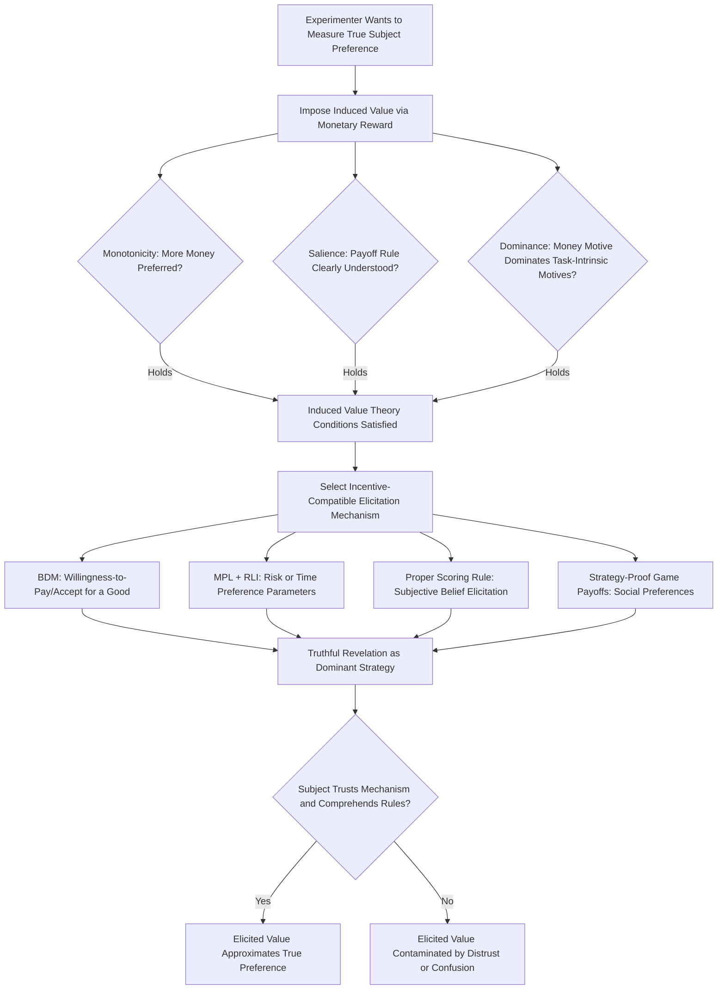

## Incentive Compatibility and Induced Value Theory

### Overview

Incentive Compatibility and Induced Value Theory constitute the foundational methodological framework that justifies treating observed choices in economic experiments as valid measurements of underlying preferences and decision processes. Induced value theory, formalized by Vernon Smith, specifies the conditions under which experimenters can reliably impose a known reward structure onto subjects, while incentive compatibility concerns the mechanism-design property that a subject's dominant or equilibrium strategy is to act truthfully or optimally given the induced incentives. Together, these concepts underpin nearly all quantitative elicitation of risk preferences, time preferences, and social preferences in experimental and behavioral economics.

### Induced Value Theory

#### Core Logic and Purpose

Experimenters generally cannot directly observe a subject's true utility function over real-world goods. Induced value theory solves this problem by using a reward medium (typically money) with a known, controllable relationship to subject payoffs, allowing the experimenter to impose an artificial, fully specified value structure onto otherwise abstract choices (tokens, points, hypothetical goods). If the imposed structure successfully dominates subjects' intrinsic motivations, observed behavior can be interpreted as revealing something general about decision-making under the induced incentive structure — for example, how subjects respond to risk, ambiguity, or strategic uncertainty — independent of what the underlying "good" actually is.

#### The Three Necessary Conditions

Smith (1976, 1982) specifies three conditions that must jointly hold for induced value theory to license valid inference from laboratory behavior:

1. **Monotonicity (Non-Satiation)**: The subject must prefer more of the reward medium to less, with no satiation point reached within the range of possible experimental payoffs. Monetary rewards typically satisfy this condition within standard experimental payoff ranges, though very large existing wealth relative to experimental stakes could theoretically weaken it.
2. **Salience**: The reward received by the subject must be clearly, demonstrably, and unambiguously connected to the subject's own decisions and outcomes within the experiment. Subjects must understand the mapping from their choices (and, in strategic settings, others' choices) to their own payoff. Comprehension checks, worked examples, and payoff calculators are standard implementation tools to ensure salience.
3. **Dominance**: The utility subjects derive from the induced monetary reward must dominate any subjective costs or benefits associated with the experimental task itself (fatigue, boredom, intrinsic curiosity, experimenter-pleasing motives, moral considerations regarding other subjects). If task-intrinsic motivations are large relative to the induced monetary incentive, observed behavior may reflect those intrinsic motivations rather than the incentive structure the experimenter intended to impose.

#### Practical Implications for Experimental Design

- **Payment magnitude calibration**: Payoffs must be large enough, relative to the local subject pool's opportunity cost of time and typical earnings, to satisfy dominance; a payoff that is trivial relative to a subject's outside wage may fail to elicit genuine incentive-driven behavior
- **Comprehension verification**: Salience requires that subjects actually understand the payoff rule, not merely that the rule is technically stated; quiz-style comprehension checks before the incentivized task begins are standard practice to verify this
- **Hypothetical versus real payoffs**: A substantial experimental literature (particularly in risk-preference elicitation) directly tests whether hypothetical-payoff choices differ systematically from real-payoff choices; findings generally show that hypothetical stakes can produce different (often more risk-seeking or noisier) behavior than real stakes, providing direct empirical support for the dominance condition's practical importance

### Incentive Compatibility

#### Formal Definition

A mechanism (an elicitation procedure mapping subject reports/choices to outcomes) is incentive-compatible if truthful revelation of the subject's true underlying preference, or adoption of the theoretically predicted optimal strategy, constitutes a dominant strategy (optimal regardless of others' actions) or, in weaker formulations, a Bayesian Nash equilibrium strategy (optimal given correct beliefs about others' strategies). Incentive compatibility is the theoretical property that justifies interpreting elicited choices as accurate measures of true underlying preferences rather than strategic misrepresentations.

#### The Becker-DeGroot-Marschak (BDM) Mechanism

The BDM mechanism elicits a subject's true monetary valuation (willingness-to-pay or willingness-to-accept) for a good through the following procedure:

1. The subject states a price $p$ at which they value the good
2. A random price $r$ is drawn from a pre-specified distribution (typically uniform over a relevant range)
3. If the subject is buying: if $r \leq p$, the subject purchases the good at price $r$; if $r > p$, no transaction occurs
4. If the subject is selling: if $r \geq p$, the subject sells the good at price $r$; if $r < p$, the subject keeps the good

**Proof sketch of incentive compatibility (buying case)**: Let $v$ denote the subject's true value for the good. If the subject states $p = v$ (truthful), they purchase whenever $r \leq v$, which is exactly the set of draws where purchasing at price $r$ is beneficial (since $r \leq v$ means the good is worth more than its price). Stating any $p \neq v$ either causes the subject to occasionally purchase at a price above their true value (if $p > v$) or to miss beneficial purchase opportunities (if $p < v$), both of which are weakly worse in expectation than truthful revelation. Therefore truthful revelation is a weakly dominant strategy.

**Known limitations**: Despite its formal dominant-strategy property, the BDM mechanism has been criticized on grounds that many subjects do not intuitively understand or trust the procedure, potentially leading to observed valuations that diverge from theoretical predictions for reasons of subject confusion rather than genuine preference; some studies find valuations elicited via BDM differ systematically from those elicited via simpler posted-price or auction mechanisms, a finding attributed by some researchers to procedural complexity undermining the salience condition of induced value theory.

#### The Random Lottery Incentive (RLI) Mechanism

When an experimental session includes multiple distinct decision tasks (e.g., a sequence of risky lottery choices), paying subjects for every task would be costly and could create cross-task income effects (earnings from an early task affecting risk-taking in a later task). The RLI mechanism resolves this by randomly selecting only one task (or one decision within a multi-decision task) for actual payment at the end of the session, with the selection made known to subjects in advance as part of the payment protocol.

**Incentive compatibility argument**: Under the isolation/reduction of compound lotteries axiom of expected utility theory, a rational subject facing a known probability $1/n$ of any given task being selected for payment should treat each task's decision as if it were the only decision being incentivized, because the compound lottery formed by "choose in task $i$, then a random draw determines if task $i$ is paid" reduces to the simple lottery over task $i$'s own outcomes. This makes truthful, task-by-task optimal choice a dominant strategy under expected utility theory, provided the reduction-of-compound-lotteries axiom holds for the subject.

**[Inference]** The RLI mechanism's incentive-compatibility argument depends on subjects actually behaving according to the reduction-of-compound-lotteries axiom; experimental tests of this specific axiom have produced mixed results, and some researchers have argued that RLI payment may not be behaviorally incentive-compatible for subjects who violate reduction (e.g., under certain non-expected-utility models such as rank-dependent utility or prospect theory with probability weighting applied to the compound lottery). This remains an active methodological debate rather than a fully settled question, and some experimentalists prefer paying for a single, non-selected task per subject specifically to avoid this concern, at higher total experimental cost.

#### Multiple Price List (MPL) Elicitation and Incentive Compatibility

The MPL format (e.g., the Holt-Laury risk elicitation task) presents subjects with a sequence of binary choices with systematically varying parameters (e.g., changing probabilities across a fixed pair of lotteries), and a single row is randomly selected for payment (typically combined with RLI logic). While individual binary choices within an MPL are each straightforwardly incentive-compatible under expected utility theory (choosing the preferred option in each row is a dominant strategy for that row, conditional on payment), the MPL format has known measurement limitations:

- **Multiple switching points**: Some subjects switch back and forth between the safe and risky option across rows rather than switching exactly once, which is inconsistent with monotonic expected utility preferences and complicates parameter estimation, typically requiring exclusion or special handling of non-monotonic response patterns
- **Framing and anchoring within the list**: The specific range and increment structure of the MPL can influence elicited risk-aversion estimates, a design-sensitivity finding that has prompted methodological refinements such as randomizing row order or using adaptive/staircase elicitation procedures instead of a fixed list

### Threats to Incentive Compatibility in Practice

#### Wealth Effects and Portfolio Considerations

A subject who treats experimental earnings as fungible with their broader wealth portfolio may exhibit different risk-taking behavior than predicted by narrow bracketing of the experimental task in isolation, a violation of the implicit assumption that subjects evaluate each incentivized task's outcomes independently of outside wealth (related to, but distinct from, narrow framing effects documented in prospect theory).

#### Trust in the Mechanism

Incentive compatibility is a property of the mechanism under the assumption that subjects believe the mechanism will be implemented as described. If subjects distrust the experimenter's commitment to follow the stated procedure (e.g., suspecting the "random" price draw in a BDM mechanism is not truly random, or doubting that only one task will genuinely be paid under RLI), the theoretical incentive-compatibility property may fail to translate into truthful behavioral revelation, which is part of the methodological justification for the near-universal no-deception norm in experimental economics (see companion topic: Laboratory Experiment Design).

#### Cognitive Complexity and Bounded Rationality

Formal incentive compatibility proofs typically assume subjects can correctly compute the optimal strategy given the mechanism's rules. When mechanisms are cognitively complex (as critics argue of BDM), subjects may fail to identify or execute the theoretically dominant strategy even when they are motivated to do so, producing elicited values that reflect a mixture of true preference and mechanism-comprehension error — an empirical concern distinct from, but often conflated with, the formal incentive-compatibility property itself.

### Applications Across Elicitation Domains

| Domain | Standard Incentive-Compatible Mechanism | Key Parameter Estimated |
| --- | --- | --- |
| Risk preferences | Holt-Laury MPL, BDM for lottery valuation | Coefficient of relative/absolute risk aversion |
| Time preferences | Convex Time Budget, front-end-delay MPL | Discount rate, present-bias parameter |
| Willingness-to-pay for goods | BDM mechanism, Vickrey second-price auction | Valuation of a specific good or attribute |
| Social/other-regarding preferences | Dictator/ultimatum/trust game with real stakes | Altruism, fairness, reciprocity parameters |
| Belief elicitation | Quadratic scoring rule, Binarized Scoring Rule (BSR) | Subjective probability beliefs |

#### Belief Elicitation and Scoring Rules

Eliciting subjective probabilistic beliefs incentive-compatibly requires proper scoring rules — payment functions where truthful reporting of one's true belief maximizes expected score. The quadratic scoring rule is the classical example, though it is only strictly incentive-compatible under risk-neutrality; the Binarized Scoring Rule (Hossain and Okui) and other refinements were developed specifically to preserve incentive compatibility for risk-averse subjects, addressing a known limitation of the original quadratic scoring rule in the presence of non-neutral risk attitudes.

### Diagram: Induced Value Theory Conditions and Incentive-Compatible Mechanism Selection (svg_diagram)

### Key Points

- Induced value theory requires monotonicity, salience, and dominance to hold before laboratory behavior can be validly interpreted as revealing preferences under a controlled incentive structure
- The BDM mechanism achieves formal dominant-strategy truthfulness for valuation elicitation but faces practical criticism regarding subject comprehension
- The Random Lottery Incentive mechanism enables efficient multi-task incentivization but its incentive compatibility depends on the contested reduction-of-compound-lotteries axiom
- Multiple Price List formats are incentive-compatible row-by-row but introduce design-sensitivity and non-monotonic-response measurement challenges
- Trust in mechanism implementation and subject cognitive comprehension are practical prerequisites for theoretical incentive compatibility to translate into valid behavioral measurement

**Related Topics**

- Laboratory Experiment Design
- Holt-Laury Risk Elicitation: Procedure and Parameter Estimation
- Convex Time Budget Method for Discount Rate Estimation
- Proper Scoring Rules and Subjective Belief Elicitation
- Reduction of Compound Lotteries and Non-Expected-Utility Models
- Field Experiments and Natural Experiments