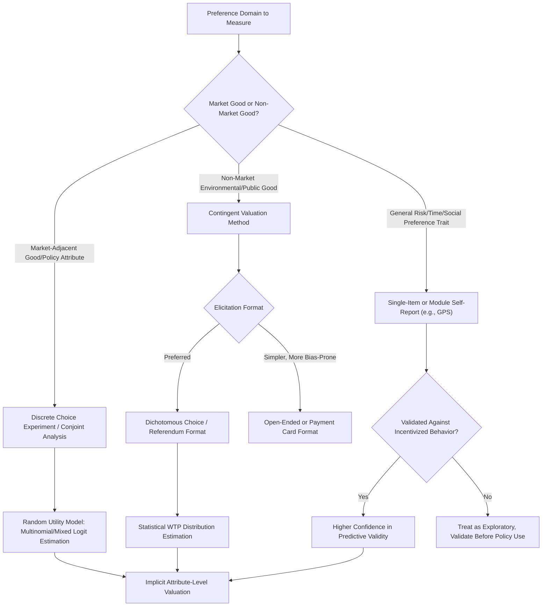

## Survey-Based Preference Elicitation

### Overview

Survey-Based Preference Elicitation encompasses the family of methods for measuring economic preferences — risk attitudes, time preferences, social preferences, and subjective wellbeing — through structured verbal or written self-report instruments, as an alternative or complement to incentivized behavioral tasks. Unlike laboratory and field experimental methods, survey-based elicitation typically relies on hypothetical or non-incentivized questions, trading the formal incentive-compatibility guarantees of induced value theory for scalability, lower cost, and applicability to large, representative population samples that behavioral experiments cannot feasibly reach.

### Rationale and Position in the Methodological Toolkit

#### The Scale-Validity Trade-off

Survey elicitation instruments can be deployed to thousands or millions of respondents at low marginal cost via panel surveys, national household surveys, and online platforms, enabling population-representative estimates and large-sample subgroup analysis (by demographic, region, or socioeconomic status) that incentivized laboratory or field experiments rarely achieve given their per-subject cost. This scalability comes at the cost of weaker behavioral validation: most survey preference items are hypothetical (no real monetary consequence tied to the response), raising the concern — central to the induced value theory critique of non-incentivized measurement — that stated preferences may diverge from preferences revealed through costly, consequential choices.

#### Complementarity with Incentivized Methods

Rather than being strictly inferior to incentivized elicitation, survey-based methods are frequently used in a complementary role:

- Large-scale survey modules validated against smaller incentivized behavioral samples, establishing a correlation or calibration mapping between survey responses and incentivized task behavior
- Survey items embedded within panel studies to track preference stability and life-cycle change over time periods far longer than any laboratory panel could feasibly maintain
- Cross-country and cross-cultural comparison, where survey infrastructure (e.g., existing national household panels) already exists and incentivized experimental replication across dozens of countries is logistically infeasible

### Major Survey-Based Elicitation Instruments

#### The Global Preferences Survey (GPS)

Falk, Becker, Dohmen, Enke, Huffman, and Sunde's Global Preferences Survey represents the most extensive cross-national survey-based preference elicitation effort in behavioral/experimental economics, covering representative samples across roughly 76 countries. Its design directly addresses the hypothetical-bias concern through two complementary features:

- **Qualitative self-report items**: Single-item, 11-point Likert-type questions asking respondents to rate their own willingness to take risks, patience, trust, altruism, positive/negative reciprocity, e.g., "How willing are you to take risks, in general?"
- **Quantitative incentivized validation items**: A subset of respondents additionally completed incentivized multiple-price-list-style tasks (adapted for survey/field administration, with real monetary payment for a randomly selected respondent or decision), used to validate that the simple qualitative self-report items correlate meaningfully with incentivized behavioral measures

**[Fact]** The GPS validation work found that simple self-report items predicted incentivized behavioral measures and real-world outcomes (e.g., self-employment, smoking, portfolio choice for risk preference items) with predictive power comparable to, and in some specifications exceeding, more complex incentivized elicitation tasks administered in a survey context, providing an empirical foundation for the broader use of brief self-report preference items in large survey instruments.

#### The Preference Survey Module (Falk et al., experimentally validated short form)

A companion, shorter instrument designed for embedding within general-purpose household panels (e.g., labor force surveys, health surveys) where survey space is limited, using single or few-item measures per preference domain (risk, time, social preferences) calibrated against the fuller GPS and incentivized experimental benchmarks to preserve reasonable predictive validity despite brevity.

#### Life Satisfaction and Subjective Wellbeing Scales

- **Cantril Self-Anchoring Ladder**: Respondents rate their current life on a 0-10 ladder, with 10 representing "the best possible life for you" and 0 "the worst possible life," widely used in the Gallup World Poll and international wellbeing comparison research
- **Satisfaction with Life Scale (SWLS)**: A five-item Likert-based cognitive-evaluative wellbeing measure (Diener et al.), distinguished from hedonic/affective measures (which capture moment-to-moment emotional experience) by its retrospective, evaluative judgment framing
- **Day Reconstruction Method (DRM) and Experience Sampling Method (ESM)**: Methodologically distinct from single-point retrospective surveys, these instruments sample momentary affective experience either through structured recall of the prior day's episodes (DRM) or real-time prompts throughout the day (ESM), addressing recall-bias concerns inherent in retrospective life-satisfaction measures

#### Time Preference and Risk Preference Survey Items

- **Single-item risk tolerance questions**: Widely used in household finance surveys (e.g., the U.S. Survey of Consumer Finances risk-tolerance item), asking respondents to place themselves on a categorical or ordinal risk-tolerance scale, valued for extreme brevity but criticized for coarse measurement resolution relative to incentivized MPL tasks
- **Hypothetical intertemporal choice items**: Survey analogues of laboratory smaller-sooner/larger-later choice tasks, asking respondents to choose between hypothetical sooner and later payment amounts, used extensively in large panel studies (e.g., the Health and Retirement Study, various national longitudinal surveys) where incentivized real-money administration is infeasible at panel scale

### Contingent Valuation Method (CVM)

#### Purpose and Domain

Contingent valuation is a survey-based stated-preference method developed primarily in environmental and resource economics to estimate monetary values for non-market goods — environmental quality, biodiversity, existence value of natural resources — that lack observable market transaction prices. Respondents are presented with a hypothetical market scenario and asked to state their willingness-to-pay (WTP) or willingness-to-accept (WTA) for a specified change in provision of the non-market good.

#### Elicitation Formats

- **Open-ended**: Respondents state a maximum WTP directly, technically simple but prone to strategic and cognitive difficulties in generating an unprompted number
- **Dichotomous choice (referendum format)**: Respondents are presented with a single stated price and asked only whether they would pay that amount (yes/no), with the underlying WTP distribution estimated statistically across a sample facing randomly varied prices; this format is generally considered more incentive-compatible in spirit (mimicking a real yes/no referendum vote) and is the format recommended by the NOAA Blue Ribbon Panel guidelines following the Exxon Valdez natural resource damage assessment controversy
- **Payment card and bidding game formats**: Intermediate approaches presenting respondents with a range or sequence of values, now largely disfavored due to documented anchoring and starting-point bias

#### Known Biases and Critiques

- **Hypothetical bias**: Stated WTP in CVM surveys has been repeatedly found to exceed WTP revealed in comparable incentivized or real-payment settings, a well-documented and extensively studied divergence motivating calibration/correction factor research
- **Embedding effect / scope insensitivity**: Stated WTP for a specific environmental good often fails to scale appropriately with the scope of the good being valued (e.g., WTP to protect one lake versus many lakes showing implausibly similar magnitudes), a finding central to the Kahneman and Knetsch critique of CVM validity
- **Warm glow / moral satisfaction confound**: Respondents may state WTP reflecting general satisfaction from the act of contributing to a cause ("warm glow") rather than the specific instrumental value of the good being valued, complicating interpretation of CVM estimates as pure use/non-use value measures
- **Protest responses**: A subset of respondents state zero WTP not because their true valuation is zero but as a protest against the survey scenario's legitimacy (e.g., objecting to the premise that they should have to pay for an environmental good at all), requiring careful survey design and statistical treatment (e.g., excluding or separately modeling protest zeros) to avoid downward-biased aggregate estimates

### Stated Preference Discrete Choice Experiments (DCE) / Conjoint Analysis

#### Methodology

Distinct from single-item CVM, discrete choice experiments present respondents with repeated hypothetical choice sets, each containing multiple alternatives described by varying attribute levels (e.g., a product or policy option described by price, quality, and other feature levels), asking respondents to choose their preferred alternative in each set. Statistical analysis (typically via random utility models — multinomial or mixed logit) recovers implicit attribute-level valuations, including monetary attribute valuations, from the pattern of choices across the experimentally varied attribute combinations.

#### Applications

- Health economics: eliciting patient preferences over treatment attributes (efficacy, side-effect profile, cost, administration mode) for health technology assessment and health policy design
- Environmental and transport economics: valuing policy or infrastructure attributes (e.g., transit time, cost, environmental impact) via attribute-level trade-offs
- Marketing and product design: widely used commercially under the "conjoint analysis" label to estimate consumer willingness-to-pay for product features

#### Methodological Advantages Relative to Single-Item CVM

DCE designs generally show reduced scope-insensitivity relative to single-item CVM because the repeated, attribute-varying choice structure forces respondents to make explicit trade-offs across multiple dimensions, though DCE remains a stated (non-incentivized in most implementations) preference method and is therefore still subject to hypothetical bias concerns, particularly for attribute levels far outside respondents' real-world experience range.

### Comparison of Survey-Based Methods to Incentivized Elicitation

| Dimension | Survey-Based Self-Report | Contingent Valuation / DCE | Incentivized Lab/Field Elicitation |
| --- | --- | --- | --- |
| Typical sample size | Very large (thousands+) | Moderate to large | Small to moderate |
| Cost per respondent | Low | Moderate | High |
| Incentive compatibility | None (hypothetical) | Generally none (hypothetical) | Formal (BDM, MPL, RLI) |
| Primary bias concern | Social desirability, self-report noise | Hypothetical bias, scope insensitivity | Comprehension, mechanism trust |
| Scalability to representative populations | High | Moderate | Low |
| Validated against behavior | Partially (e.g., GPS validation studies) | Mixed evidence across domains | Direct, by construction |

### Statistical and Design Considerations

#### Anchoring, Order, and Framing Effects in Survey Items

Survey-based elicitation is particularly susceptible to question-order effects, response-scale anchoring, and framing sensitivity (see companion topic: Language, Framing, and Cross-Cultural Risk Communication), since there is no incentivized behavioral consequence to discipline responses toward a stable, framing-invariant true preference; randomized question order and split-sample framing experiments embedded within survey instruments are standard mitigations.

#### Social Desirability Bias

Self-report items for socially valenced preferences (altruism, trust, reciprocity, risk tolerance in contexts with normative connotations) are subject to social desirability bias, where respondents systematically over-report socially favored traits; validation against incentivized behavioral proxies (as in the GPS methodology) is a primary tool for assessing and, where feasible, correcting for this bias.

#### Test-Retest Reliability and Preference Stability

Survey panel designs uniquely enable longitudinal test-retest reliability assessment of elicited preferences over multi-year horizons, informing the broader theoretical question (relevant across behavioral economics) of whether preferences function as stable traits or context-dependent, state-contingent constructs; large panel studies using the GPS and related instruments have become a primary evidence base for this preference-stability question at a population scale unavailable to laboratory panel designs.

### Diagram: Survey-Based Elicitation Method Selection (svg_diagram)

### Key Points

- Survey-based elicitation trades the formal incentive-compatibility of induced value theory for scalability, low cost, and representative population coverage
- The Global Preferences Survey demonstrates that brief self-report items can achieve meaningful predictive validity against incentivized behavior and real-world outcomes when properly validated
- Contingent valuation is the standard survey method for non-market environmental good valuation but faces well-documented hypothetical bias, scope insensitivity, and protest-response challenges
- Discrete choice experiments improve on single-item CVM by forcing explicit multi-attribute trade-offs, reducing but not eliminating hypothetical-bias concerns
- Survey and incentivized methods are increasingly used complementarily, with survey instruments validated against smaller incentivized behavioral benchmarks rather than treated as a strictly inferior substitute

**Next Steps**

- The Global Preferences Survey: Design and Cross-National Findings
- Contingent Valuation and the NOAA Panel Guidelines
- Discrete Choice Experiments in Health Technology Assessment
- Hypothetical Bias: Evidence and Calibration Approaches
- Preference Stability Across the Life Course
- Incentive Compatibility and Induced Value Theory
- Laboratory Experiment Design