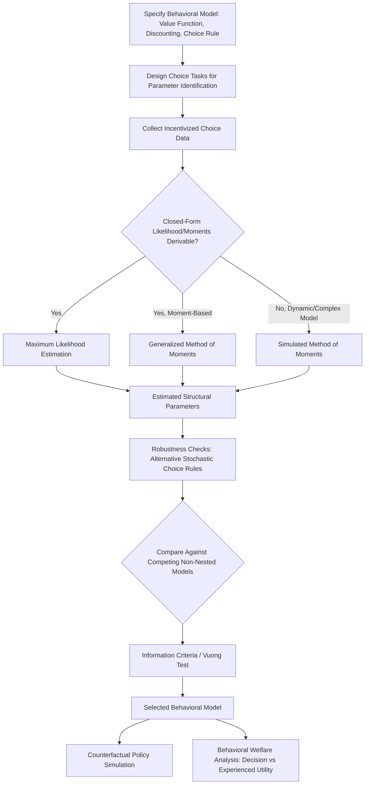

## Structural Estimation of Behavioral Models

### Overview

Structural Estimation of Behavioral Models refers to the econometric methodology of specifying a fully parameterized behavioral decision-theoretic model — grounded in prospect theory, hyperbolic discounting, or other non-standard preference frameworks — and estimating its deep structural parameters directly from observed choice data, rather than relying on reduced-form regression coefficients that describe correlational relationships without an explicit decision-theoretic microfoundation. Structural estimation enables researchers to recover interpretable behavioral parameters (loss aversion coefficients, probability weighting curvature, present-bias parameters), conduct counterfactual policy simulation, and formally test one behavioral model against competing alternatives using the same dataset.

### Structural Versus Reduced-Form Estimation

#### Core Distinction

| Dimension | Reduced-Form Estimation | Structural Estimation |
| --- | --- | --- |
| What is estimated | Statistical association between variables (e.g., regression coefficients) | Deep parameters of an explicit behavioral/economic model |
| Underlying model | Implicit or unspecified | Fully specified utility function, choice rule, and error structure |
| Interpretability of parameters | Descriptive, model-agnostic | Directly interpretable as behavioral primitives (e.g., $\lambda$, $\beta$, $\delta$) |
| Counterfactual policy simulation | Limited to observed variation range (Lucas critique concerns) | Feasible for novel policy environments, conditional on model correctness |
| Robustness to model misspecification | More robust (fewer assumptions) | Less robust; estimates are conditional on correct functional-form assumptions |
| Typical estimation method | OLS, IV, difference-in-differences | Maximum likelihood, GMM, simulated method of moments |

#### The Lucas Critique and Its Behavioral Extension

The classical Lucas critique argues that reduced-form relationships estimated under one policy regime may not remain stable under a different regime, because economic agents' decision rules depend on the policy environment itself. Structural estimation addresses this by estimating "deep" preference parameters (assumed policy-invariant) rather than policy-contingent reduced-form relationships, enabling more credible counterfactual simulation — provided the assumed behavioral model is correctly specified. **[Inference]** This conditional validity is a significant caveat in the behavioral context specifically, since many behavioral parameters (reference points, loss aversion salience, present-bias expression) may themselves be state- or context-dependent rather than truly structural/invariant, a tension that is actively debated in the structural behavioral economics literature rather than resolved.

### Estimation Methodologies

#### Maximum Likelihood Estimation (MLE)

Given a fully specified behavioral choice model that generates predicted choice probabilities as a function of parameters $\theta$ (e.g., a prospect-theory value function plus a logit or probit stochastic choice rule), MLE selects the parameter vector $\hat{\theta}$ that maximizes the likelihood of observing the actual choice data:

$$\hat{\theta} = \arg\max_{\theta} \sum_{i=1}^{N} \ln L(\theta; \text{choice}_i, X_i)$$

where $L(\theta; \text{choice}_i, X_i)$ is the model-implied probability of subject $i$'s observed choice given covariates $X_i$ and parameters $\theta$. A stochastic choice rule (commonly a logit-type "trembling hand" or Fechner error specification) is required because deterministic utility-maximization models predict a single certain choice for each parameter value, which would assign zero likelihood to any observed choice inconsistent with that prediction; the stochastic component allows the model to accommodate choice inconsistency and noise while still estimating the underlying deterministic parameters.

#### Generalized Method of Moments (GMM)

GMM estimates structural parameters by matching model-implied moments (e.g., predicted mean or variance of a choice variable, or predicted comparative-static responses to observed covariate variation) to their empirical counterparts in the data, choosing $\hat{\theta}$ to minimize a weighted distance between model-implied and empirical moments:

$$\hat{\theta} = \arg\min_{\theta} \, g(\theta)' W \, g(\theta)$$

where $g(\theta)$ is the vector of moment conditions (differences between model-implied and sample moments) and $W$ is a weighting matrix. GMM is often preferred over MLE when the full likelihood function is difficult to derive analytically or when the researcher wishes to remain agnostic about the full distributional/error structure while still matching specific theoretically motivated moments.

#### Simulated Method of Moments (SMM) and Indirect Inference

When the structural model is sufficiently complex that closed-form choice probabilities or moments cannot be derived analytically (common in dynamic behavioral models with hyperbolic discounting and multi-period decision-making), researchers simulate model-implied data for candidate parameter values, compute simulated moments, and select parameters that make simulated moments match empirical moments as closely as possible. This approach is standard in structural estimation of dynamic present-bias/self-control models, where the agent's optimal policy function must itself be numerically solved (e.g., via dynamic programming/value function iteration) for each candidate parameter vector before moments can even be computed.

### Structural Estimation of Specific Behavioral Models

#### Prospect Theory Parameter Estimation

Structural estimation of prospect theory typically jointly estimates the value function curvature parameters ($\alpha$ for gains, $\beta$ for losses), the loss aversion coefficient ($\lambda$), and probability weighting function parameters (commonly the Tversky-Kahneman or Prelec weighting function parameter $\gamma$) from a battery of incentivized lottery choices, using MLE with a stochastic choice rule layered on top of the deterministic prospect-theory value comparison:

$$w(p) = \frac{p^{\gamma}}{(p^{\gamma} + (1-p)^{\gamma})^{1/\gamma}}$$

as the Tversky-Kahneman probability weighting function, jointly estimated alongside the value function parameters from the same choice data, typically using data generated by Holt-Laury-style multiple price lists or more elaborate lottery-choice batteries specifically designed to separately identify curvature, loss aversion, and probability weighting (since these three components are jointly implicated in any single risky choice and require careful experimental design to statistically disentangle).

#### Quasi-Hyperbolic (Present-Bias) Discounting Estimation

The Laibson quasi-hyperbolic ($\beta$-$\delta$) discounting model specifies discounted utility as:

$$U_t = u_t + \beta \sum_{k=1}^{\infty} \delta^k u_{t+k}$$

where $\delta$ is the standard long-run exponential discount factor and $\beta < 1$ captures present bias (a discrete discontinuity in relative valuation of "now" versus any future period). Structural estimation of $\beta$ and $\delta$ jointly requires choice data spanning both near-term and longer-term intertemporal trade-offs (e.g., convex time budget data, or "front-end delay" MPL designs comparing "now vs. soon" choices against "later vs. even-later" choices of equal length), since a single class of intertemporal choice (e.g., only immediate-versus-delayed) cannot separately identify $\beta$ from $\delta$ without this designed variation. Dynamic structural models further distinguish "naive" ($\hat{\beta} = 1$, unaware of one's own future present bias) from "sophisticated" ($\hat{\beta} = \beta$, correctly anticipating future present bias) agents, a distinction with substantial policy relevance (e.g., for commitment device demand) that requires structural estimation of both actual behavior and, where elicitable, beliefs about future behavior to identify.

#### Reference-Dependent Preferences and Labor Supply

Structural estimation of reference-dependent labor supply models (following Köszegi-Rabin-style reference-dependent utility) has been applied to naturally occurring datasets — most prominently taxi driver daily labor supply — estimating whether observed stopping/continuation decisions are better explained by a reference-dependent target-income model (implying backward-bending labor supply with respect to the wage) or a standard neoclassical labor-leisure model (implying conventional forward-sloping labor supply). **[Unverified]** This specific empirical literature (originating with Camerer, Babcock, Loewenstein, and Thaler's original taxi driver study) has been subject to substantial subsequent methodological re-examination and disputed replication, with later work (e.g., Farber's re-analysis) questioning whether the originally reported reference-dependence pattern is robust to alternative data, specifications, and measurement of the reference point, making this a frequently cited case study in the broader discussion of structural behavioral model robustness and specification sensitivity rather than a settled empirical result.

### Model Identification Challenges

#### Joint Parameter Identification

A recurring challenge in structural behavioral estimation is that multiple distinct behavioral parameters (e.g., utility curvature and probability weighting; or present-bias and long-run discounting) jointly determine any single observed choice, making it statistically difficult to separately identify each parameter from a single class of choice task. Experimental and survey designs for structural estimation must therefore be purpose-built with sufficient parametric variation (across probabilities, time delays, stake sizes, and gain/loss domains) to achieve separate identification, a design requirement distinct from, and more demanding than, simply eliciting a single reduced-form behavioral measure.

#### Stochastic Choice Rule Specification

The choice of stochastic error structure layered onto the deterministic behavioral model (logit/Luce choice rule, probit, Fechner "trembling hand" error, or "contextual utility" normalization) is itself a modeling choice that can materially affect estimated structural parameters; the structural estimation literature has documented that estimated risk-aversion and loss-aversion parameters can be sensitive to this typically under-scrutinized specification choice, motivating robustness checks across alternative stochastic choice rule specifications as increasingly standard practice.

#### Model Comparison and Non-Nested Testing

Because competing behavioral models (e.g., prospect theory versus expected utility theory versus rank-dependent utility) are frequently non-nested (neither model is a parametric special case of the other), standard nested-model likelihood ratio tests are inapplicable; researchers instead rely on information-criterion comparison (AIC, BIC), out-of-sample predictive accuracy comparison, or specialized non-nested hypothesis testing procedures (e.g., the Vuong test) to adjudicate between competing structural behavioral specifications fit to the same choice data.

### Applications in Applied Policy Analysis

#### Counterfactual Welfare Analysis Under Non-Standard Preferences

Structural behavioral models enable welfare analysis that departs from revealed-preference-based standard consumer theory, since a present-biased or loss-averse agent's realized choices may not maximize their own long-run wellbeing by their own future-self's evaluation — a foundational methodological concern in behavioral welfare economics (see companion domain: Behavioral Welfare Economics), requiring the structural model to separately specify a "decision utility" (what drives observed choice) and an "experienced utility" (what the researcher treats as the normative welfare criterion) rather than assuming the two coincide as in standard revealed-preference welfare analysis.

#### Policy Counterfactual Simulation

Once structural parameters are estimated, researchers can simulate how policy changes (e.g., a change in default enrollment rules, a change in commitment-device availability, or a change in loss-framed versus gain-framed information disclosure) would affect behavior under the estimated behavioral model, including for policy regimes not directly observed in the estimation sample — the primary practical advantage of structural over reduced-form estimation for ex ante policy evaluation, subject to the caveat that simulation validity depends entirely on correct structural model specification.

### Diagram: Structural Estimation Workflow (svg_diagram)

### Key Points

- Structural estimation recovers interpretable deep behavioral parameters from an explicit decision-theoretic model, enabling counterfactual simulation unavailable to reduced-form regression
- MLE, GMM, and simulated method of moments are the primary estimation techniques, selected based on whether closed-form likelihoods or moments are analytically derivable
- Prospect theory and quasi-hyperbolic discounting are the two most extensively structurally estimated behavioral frameworks, each requiring purpose-built choice-task variation for joint parameter identification
- The taxi driver reference-dependent labor supply literature illustrates both the promise and the replication fragility of structural behavioral estimation applied to naturally occurring data
- Structural behavioral welfare analysis requires separating decision utility from experienced utility, since present-biased or loss-averse choices may not reflect an agent's own long-run welfare criterion

**Related Topics**

- Incentive Compatibility and Induced Value Theory
- Prospect Theory and the Shape of the Value Function
- Quasi-Hyperbolic Discounting: Naive Versus Sophisticated Agents
- Behavioral Welfare Economics and the Decision/Experienced Utility Distinction
- Non-Nested Model Comparison in Behavioral Econometrics
- Survey-Based Preference Elicitation