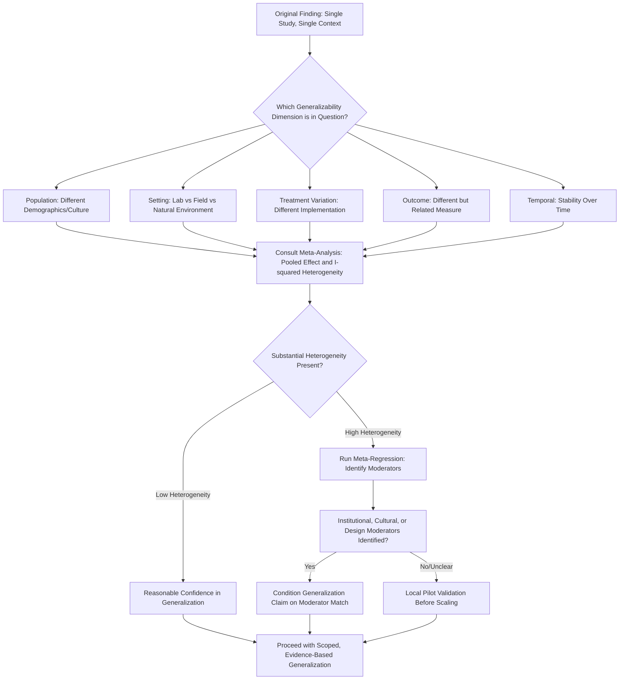

## External Validity and Generalizability

### Overview

External Validity and Generalizability, as a methodological topic in its own right, concerns the systematic frameworks, threats, and evidence base for determining whether a behavioral economics finding established in one study — a particular sample, setting, task, and time period — holds in other populations, contexts, and implementations. While related concerns appear throughout the experimental and cross-cultural methods literature (laboratory-to-field transportability, WEIRD-sample bias, institutional moderation), this topic synthesizes the formal typology of external validity threats, the empirical evidence on replication and generalizability failure rates specific to behavioral economics, and the design and statistical tools developed to diagnose and improve generalizability.

### Defining External Validity

#### Campbell's Original Framework

Donald Campbell's foundational validity typology, developed for experimental design broadly and subsequently adapted extensively within economics, distinguishes:

- **Internal validity**: Confidence that the observed treatment effect within the specific study sample is causally attributable to the manipulated variable, free of confounding
- **External validity**: Confidence that the observed treatment effect generalizes beyond the specific study's sample, setting, treatment implementation, and outcome measurement to other populations, settings, treatments, and outcomes (Campbell and Stanley's later "population," "ecological," "treatment variation," and "outcome" validity sub-dimensions)
- **Construct validity**: Whether the operationalized manipulation and measured outcome actually correspond to the theoretical constructs the researcher intends to study
- **Statistical conclusion validity**: Whether the statistical inference itself (significance, effect size estimation) is properly conducted given the data structure

External validity is frequently, though not universally, in tension with internal validity: methods that maximize control (and thus internal validity) — laboratory settings, homogeneous subject pools, artificial tasks — often do so at the cost of the naturalistic variation needed for external validity, and vice versa (see companion topics: Laboratory Experiment Design; Field Experiments and Natural Experiments).

#### Sub-Dimensions of Generalizability Specific to Behavioral Economics

- **Population generalizability**: Does the finding hold across demographic groups, cultures, and institutional contexts beyond the original (frequently WEIRD, university-subject-pool) sample? (see companion topic: The WEIRD Samples Problem in Behavioral Research)
- **Ecological/setting generalizability**: Does the finding hold when observed in a naturalistic real-world decision environment rather than an artificial laboratory task? (Harrison and List's lab-to-field continuum directly addresses this dimension)
- **Treatment variation generalizability**: Does the finding hold across variations in how the treatment/intervention is operationally implemented (e.g., different specific wording of a loss-framed message, different specific default-enrollment mechanism)?
- **Outcome generalizability**: Does the finding hold across different but theoretically related outcome measures (e.g., does a risk-preference parameter estimated from a lottery task predict real-world risk-taking behavior such as smoking, insurance purchase, or portfolio allocation)?
- **Temporal generalizability**: Does the finding remain stable over time, or is it contingent on a specific historical, economic, or technological period (e.g., behavioral findings about media consumption or digital nudges may be particularly time-sensitive given rapidly evolving technology contexts)?

### Empirical Evidence on Generalizability in Behavioral Economics

#### Large-Scale Replication Projects

- **Many Labs projects**: Coordinated multi-site replications of classic psychological and behavioral-economic effects across dozens of laboratories internationally, providing direct empirical estimates of effect-size heterogeneity across sites, with findings generally showing that a subset of classic effects replicate robustly across sites while others show substantial site-to-site variability or fail to replicate in some contexts
- **Camerer et al. (2016, *Science*) replication of laboratory experimental economics studies**: A systematic replication project targeting studies published in top economics journals, finding that a majority of studied effects replicated in direction and statistical significance, with replicated effect sizes on average smaller than originally reported — a pattern consistent with the broader "effect size deflation" finding common across replication science, though the specific replication rate figures should be verified against the original publication for precise citation
- **Field experiment replication and multi-site RCT evidence**: Multi-site randomized evaluations of the same intervention type (e.g., multi-country microcredit RCTs, multi-site conditional cash transfer evaluations) have become an important generalizability evidence source in development and behavioral economics specifically, given that single-site field RCTs face the same site-specific generalizability question as laboratory studies, simply relocated to a real-world institutional setting

#### The Generalizability of Nudge Effects Specifically

A distinct and heavily scrutinized generalizability literature has emerged around nudge and default-effect interventions, given their direct policy relevance:

- Meta-analyses of published nudge intervention effect sizes have generally found average effects smaller than the effect sizes reported in widely cited foundational single-site studies, alongside evidence consistent with publication bias favoring larger, more striking single-site findings
- **[Inference]** The gap between original "flagship" nudge study effect sizes and subsequent meta-analytic or large-scale pre-registered replication effect sizes is a genuine and actively studied methodological concern in applied behavioral economics, though the relative contribution of publication bias, institutional-context moderation, and genuine effect heterogeneity to this gap has not been definitively decomposed in the literature and remains a matter of ongoing research and debate

### Formal Statistical Approaches to Assessing Generalizability

#### Meta-Analysis and Effect Size Heterogeneity

Random-effects meta-analysis, which explicitly models between-study effect-size heterogeneity ($\tau^2$) rather than assuming a single fixed true effect across all studies, has become the standard tool for aggregating evidence across multiple studies of the same behavioral phenomenon and for quantifying the degree of cross-context generalizability directly, via heterogeneity statistics such as $I^2$ (the proportion of total variance attributable to between-study heterogeneity rather than sampling error).

#### Meta-Analytic Moderator Analysis

Beyond estimating an average effect size, meta-analytic moderator (meta-regression) analysis explicitly tests whether study-level characteristics — sample WEIRD status, institutional context variables, task implementation details, publication year — statistically predict effect-size variation across studies, directly operationalizing the institutional-context and population-generalizability questions discussed in companion topics as testable hypotheses within a formal statistical framework.

#### Bayesian Hierarchical and Multi-Site Trial Design

Purpose-built multi-site trials (increasingly used in applied field-experimental behavioral economics, following models pioneered in medical multi-site trials) explicitly design for generalizability assessment ex ante, using hierarchical/multilevel statistical models that separately estimate a population-average treatment effect and site-specific deviations from that average, directly quantifying cross-site generalizability rather than inferring it indirectly from post hoc meta-analysis of independently conducted single-site studies.

#### Preregistration and Registered Replication Reports

Preregistration of hypotheses, sample size, and analysis plans (increasingly standard via platforms such as the AEA RCT Registry and the Open Science Framework) directly addresses one specific threat to generalizability assessment: the concern that an original finding's apparent robustness partly reflects researcher degrees of freedom (selective reporting, flexible analysis choices) rather than genuine generalizable effect strength. Registered Replication Reports — pre-registered, multi-site replication studies committed to publication regardless of outcome — further remove publication-bias distortion from the generalizability evidence base specifically.

### Conceptual and Design-Level Threats to External Validity

#### The Streetlight Effect in Task and Population Selection

Behavioral economics research disproportionately studies phenomena that are convenient to measure with available laboratory or survey tools and convenient populations to recruit (university subject pools, online panel platforms such as Amazon Mechanical Turk or Prolific), which can bias the overall evidence base toward phenomena and populations well-suited to existing methodological infrastructure rather than a representative sample of behaviorally and economically important questions and contexts.

#### Hawthorne, Novelty, and Demand Effects as Generalizability Threats

Effects observed under conditions where subjects are aware of being studied, or where an intervention is novel and salient specifically because it is unfamiliar, may not generalize to steady-state, "in the wild" implementation once an intervention becomes routine and subjects habituate to it — a specific temporal generalizability threat particularly relevant to digital nudge and choice-architecture interventions, where novelty effects have been documented to fade with repeated exposure in some tracked implementations.

#### Publication Bias and the File-Drawer Problem

Because statistically significant, novel, and large-effect findings are systematically more likely to be published than null or small-effect findings, the published behavioral economics literature as a whole may present a generalizability-distorted picture even before considering any single study's specific external validity threats; this is a distinct, literature-level generalizability concern from the within-study threats discussed above, and is the primary motivation for preregistration and Registered Replication Report infrastructure.

### Practical Framework for Assessing a Given Finding's Generalizability

1. **Identify the specific generalizability dimension(s) of concern**: population, setting, treatment implementation, outcome measure, or temporal — since evidence and mitigation strategies differ by dimension
2. **Consult available meta-analytic evidence**: check whether a random-effects meta-analysis exists for the phenomenon, and examine both the pooled effect size and the heterogeneity statistic ($I^2$, $\tau^2$) rather than relying on any single flagship study
3. **Examine moderator analyses**: where available, assess whether known institutional, cultural, or task-design moderators explain cross-study heterogeneity, informing whether the finding is likely to transport to a specific new context of interest
4. **Weight original, single-site "flagship" findings appropriately**: treat original discovery-stage findings as hypothesis-generating rather than generalizability-confirmed, particularly absent independent multi-site replication
5. **Prioritize local pilot validation before large-scale policy implementation**: given the documented gap between flagship study effect sizes and subsequent replication/meta-analytic effect sizes, especially for nudge-type interventions, local pre-implementation piloting is an increasingly recommended risk-mitigation step in applied behavioral policy work

### Diagram: External Validity Assessment Framework (svg_diagram)

### Key Points

- External validity encompasses population, ecological/setting, treatment-variation, outcome, and temporal generalizability, each requiring distinct evidence and assessment approaches
- Large-scale replication projects (Many Labs, Camerer et al. 2016) provide direct empirical evidence that behavioral economics effect sizes are frequently smaller and more heterogeneous upon replication than originally reported
- Nudge and default-effect interventions face particular generalizability scrutiny given their direct policy application and the documented gap between flagship and meta-analytic effect sizes
- Random-effects meta-analysis with heterogeneity statistics ($I^2$, $\tau^2$) and meta-regression moderator analysis are the primary formal statistical tools for assessing and explaining cross-context generalizability
- Preregistration and Registered Replication Reports address literature-level publication-bias threats to generalizability distinct from within-study design threats

**Next Steps**

- Laboratory Experiment Design
- Field Experiments and Natural Experiments
- The WEIRD Samples Problem in Behavioral Research
- Institutional Context and the Generalizability of Behavioral Findings
- Meta-Analysis and Heterogeneity Statistics in Behavioral Economics
- Publication Bias and the Replication Crisis
- Registered Replication Reports and Preregistration Infrastructure