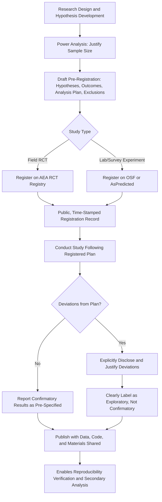

## Pre-Registration and Open Science Practices

### Overview

Pre-Registration and Open Science Practices encompass the methodological reform movement, procedures, and technical infrastructure developed to reduce researcher degrees of freedom, publication bias, and irreproducibility in empirical behavioral economics research. Pre-registration involves publicly time-stamping a study's hypotheses, sample size, and analysis plan before data collection or analysis begins, while the broader open science movement encompasses complementary practices including data and code sharing, registered reports, and systematic replication infrastructure. These practices emerged substantially in direct response to the replication crisis documented across psychology and, subsequently, experimental and behavioral economics.

### Motivating Problems

#### Researcher Degrees of Freedom

Simmons, Nelson, and Simonsohn's influential "p-hacking" framework demonstrated that researchers face numerous consequential but often undisclosed analytical choices during a study — which outcome variables to report, which covariates to control for, which subgroups to analyze, when to stop data collection, how to handle outliers — and that exploiting flexibility across these choices (even without conscious intent to mislead) can produce a dramatically inflated rate of statistically significant findings relative to the nominal significance threshold, undermining the interpretability of reported p-values as genuine evidence against a null hypothesis.

#### Publication Bias and the File-Drawer Problem

Academic journals have historically favored statistically significant, novel, and large-effect findings for publication, creating a systematic distortion where the published literature overrepresents significant results relative to the true underlying distribution of effects (including null and small effects that remain unpublished in the "file drawer"). This distortion compounds with researcher degrees of freedom: because significant results are more publishable, there is an embedded incentive structure rewarding analytical flexibility that produces significance, whether or not the underlying effect is genuine or of the reported magnitude.

#### HARKing (Hypothesizing After Results are Known)

A related concern is the post hoc presentation of data-driven findings as if they were the study's a priori hypothesis, which misrepresents an exploratory finding as confirmatory evidence and inflates the apparent statistical credibility of the reported result, since exploratory analyses conducted across many possible hypotheses face substantially higher false-positive risk than a single pre-specified confirmatory test.

### Pre-Registration: Core Mechanics

#### What Pre-Registration Specifies

A complete pre-registration document typically specifies, before data collection or analysis:

- **Research hypotheses**: The specific, directional (where applicable) hypotheses to be tested
- **Sample size and stopping rule**: The planned sample size (ideally justified via a priori power analysis) and the rule governing when data collection ends, precluding "optional stopping" (continuing to collect data until significance is reached)
- **Primary outcome variable(s)**: The specific measure(s) that will be treated as the confirmatory test of the hypothesis, distinguished from secondary/exploratory outcomes
- **Analysis plan**: The specific statistical model, covariates, and inferential approach to be used, including planned handling of missing data, outliers, and multiple comparison correction
- **Exclusion criteria**: Pre-specified rules for excluding subjects or observations (e.g., comprehension-check failures), precluding post hoc exclusion decisions that could be influenced by knowledge of how exclusion affects the result

#### Distinguishing Confirmatory from Exploratory Analysis

Pre-registration does not prohibit exploratory analysis; rather, it requires transparent labeling that distinguishes pre-specified confirmatory tests (subject to standard inferential interpretation) from exploratory analyses conducted after seeing the data (which remain scientifically valuable for hypothesis generation but should not be presented with the same inferential confidence as a pre-registered confirmatory test). This confirmatory/exploratory distinction, rather than a blanket prohibition on flexible data analysis, is the central methodological contribution of pre-registration.

#### Registered Reports

A stronger variant of pre-registration, registered reports involve journal peer review of the study design, hypotheses, and analysis plan before data collection, with the journal committing to publish the resulting paper regardless of whether the results are statistically significant, provided the pre-registered protocol was followed. This format directly targets publication bias at its source, since editorial acceptance is decoupled entirely from the direction or significance of the eventual findings. A growing number of economics and psychology journals now offer a registered reports track, though adoption within mainstream economics journals has been slower and more limited than within psychology specifically.

### Infrastructure and Platforms

#### AEA RCT Registry

The American Economic Association's RCT Registry is the field-standard pre-registration platform specifically for randomized controlled trials in economics, widely used for field experiments in development, behavioral, and applied microeconomics; a growing number of economics journals require or strongly encourage registration on this platform (or an equivalent) as a condition of publication for RCT-based studies.

#### Open Science Framework (OSF)

A general-purpose, discipline-agnostic platform supporting pre-registration, data archiving, materials sharing, and project version control, widely used across psychology and increasingly in experimental and behavioral economics for both laboratory and non-RCT field study pre-registration.

#### AsPredicted

A simplified, streamlined pre-registration template and platform (a lighter-weight alternative to full OSF pre-registration) designed to lower the friction cost of pre-registering straightforward experimental designs, particularly popular for laboratory behavioral economics experiments with relatively simple hypothesis structures.

#### Social Science Registry / Other Field-Specific Registries

Complementary discipline-specific registries exist for particular sub-fields (e.g., the Social Science Registry hosted alongside the AEA RCT Registry infrastructure), reflecting the broader trend toward registry infrastructure tailored to specific empirical method types (lab experiments, field RCTs, survey experiments) rather than a single universal registry.

### Complementary Open Science Practices

#### Data and Code Sharing / Replication Packages

Increasingly required by leading economics journals (e.g., as a condition of publication at many top field journals), replication packages consist of the full dataset (where sharing is permissible given privacy/proprietary constraints) and complete analysis code needed to reproduce all reported results, enabling both exact computational reproducibility checks and secondary re-analysis by other researchers.

#### Open Materials

Sharing complete experimental instructions, stimuli, survey instruments, and experimental software (e.g., z-Tree or oTree program files) enables both exact replication attempts and more efficient re-use of validated instruments across studies, reducing redundant instrument-development effort and improving cross-study comparability.

#### Multi-Site and Adversarial Collaboration

- **Registered Replication Reports**: Large-scale, multi-laboratory, pre-registered replication studies (discussed in the companion topic on external validity) that commit to publication regardless of outcome, directly generating file-drawer-free generalizability evidence
- **Adversarial collaboration**: A structured format in which researchers holding competing theoretical positions jointly pre-register a study design both sides agree would constitute a fair test of their competing predictions, reducing the risk that either side's post hoc analytical flexibility favors their preferred conclusion

#### Specification Curve Analysis and Multiverse Analysis

Rather than pre-registering (and thereby committing to) a single analysis specification, specification curve/multiverse analysis techniques run and transparently report results across the full, or a large systematic subset, of theoretically defensible analytical specifications (alternative covariate sets, outlier-handling rules, model functional forms), directly visualizing how sensitive a finding is to otherwise arbitrary analytical choices — a complementary rather than substitute practice to pre-registration, particularly useful for re-analyzing existing datasets where true prospective pre-registration is not possible.

### Evidence on the Effects of Pre-Registration

**[Inference]** Comparative studies of pre-registered versus non-pre-registered studies within the same research domains have generally found that pre-registered studies report smaller effect sizes and lower rates of statistically significant confirmatory findings than comparable non-pre-registered studies, a pattern consistent with pre-registration successfully constraining the researcher-degrees-of-freedom and publication-bias distortions it was designed to address, though the magnitude of this "pre-registration effect" and its generalizability across sub-fields of behavioral economics specifically (versus psychology more broadly, where most of this comparative evidence originates) merits caution before extrapolating precise effect-size figures.

### Practical Pre-Registration Workflow

1. **Develop and finalize the research design** before any data collection, including power analysis to justify planned sample size
2. **Draft the pre-registration document** specifying hypotheses, primary/secondary outcomes, full analysis plan, and exclusion criteria in sufficient detail that an independent researcher could execute the identical analysis
3. **Submit to a registry** (AEA RCT Registry for field RCTs, OSF or AsPredicted for laboratory/survey experiments) before data collection begins, generating a public, time-stamped record
4. **Conduct the study and analysis** following the pre-registered plan; any deviations should be explicitly disclosed and justified in the resulting paper, clearly distinguished from the pre-registered analysis
5. **Report both confirmatory and exploratory results transparently**, with exploratory findings clearly labeled as hypothesis-generating rather than confirmatory
6. **Share data, code, and materials** alongside publication to the fullest extent permitted by data privacy and proprietary constraints, enabling reproducibility verification and secondary analysis

### Diagram: Pre-Registration and Open Science Workflow (svg_diagram)

### Key Points

- Pre-registration addresses researcher degrees of freedom, publication bias, and HARKing by publicly time-stamping hypotheses and analysis plans before data collection
- The confirmatory/exploratory distinction, not a prohibition on flexible analysis, is the central methodological contribution of pre-registration
- The AEA RCT Registry, OSF, and AsPredicted constitute the primary pre-registration infrastructure for field RCTs and laboratory/survey experiments respectively
- Registered reports decouple journal publication decisions from result significance by reviewing study design before data collection
- Complementary open science practices — data/code sharing, open materials, multi-site replication, and specification curve analysis — address related but distinct reproducibility threats

**Related Topics**

- External Validity and Generalizability
- Field Experiments and Natural Experiments
- Laboratory Experiment Design
- Meta-Analysis and Heterogeneity Statistics in Behavioral Economics
- Structural Estimation of Behavioral Models
- Publication Bias and the Replication Crisis