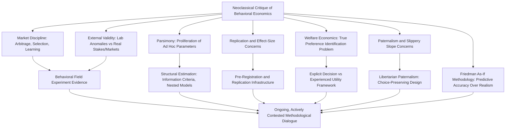

## Critiques from Neoclassical Economics

### Overview

Critiques from Neoclassical Economics comprise the body of methodological, theoretical, and empirical objections raised by economists working within the standard rational-choice, expected-utility framework against behavioral economics' core claims, evidentiary base, and policy applications. These critiques span concerns about the rigor and generalizability of anomaly findings, the ad hoc and non-parsimonious character of behavioral models, the role of market discipline and learning in eliminating individual-level biases in aggregate outcomes, and skepticism regarding the welfare-economic and paternalistic policy implications drawn from behavioral findings. Understanding these critiques is essential both for assessing behavioral economics' scientific standing and for situating ongoing methodological debates within the discipline.

### The Rationality and Market Discipline Critique

#### Aggregate Market Outcomes and Individual-Level Bias

A foundational neoclassical response to behavioral anomaly findings holds that even if individual decision-makers exhibit systematic biases in laboratory or survey settings, competitive markets can produce outcomes consistent with rational-choice predictions through several channels operating independently of individual rationality:

- **Arbitrage and the "marginal trader" argument**: In financial markets specifically, prices need only reflect the beliefs and actions of sophisticated, well-capitalized marginal traders, not the average or median market participant; irrational retail investor behavior may be arbitraged away by rational traders, leaving aggregate market prices approximately efficient despite widespread individual-level biases
- **Market selection and survivorship**: Repeated market interaction may select against persistently biased or loss-making strategies over time, as agents making costly systematic errors lose capital or market share to less-biased competitors, potentially causing biases documented in single-shot laboratory settings to have limited relevance to long-run market equilibrium outcomes
- **Learning through repeated experience**: Standard economic theory has long incorporated learning models in which agents converge toward optimal behavior through repeated experience and feedback; some critics argue behavioral laboratory findings, often elicited from subjects facing a task for the first time, may overstate the prevalence of biases relative to experienced real-world decision-makers who have had opportunity to learn

**[Inference]** The empirical strength of the market-discipline counter-argument varies considerably by domain; it is generally considered more plausible in liquid, professionally intermediated financial markets than in domains such as retirement savings, health insurance choice, or mortgage selection, where the individual consumer typically faces the relevant decision only rarely (sometimes only once in a lifetime) and professional/arbitrage intermediation is limited or absent — a distinction increasingly acknowledged even by economists otherwise sympathetic to the market-discipline critique.

#### Milton Friedman's "As-If" Methodology Defense

Friedman's influential 1953 methodological essay argued that the realism of a model's behavioral assumptions is largely irrelevant to its scientific value; what matters is predictive accuracy, and rational-choice models should be judged by whether agents behave "as if" they were rational optimizers, regardless of whether the underlying cognitive process literally involves expected-utility maximization. Applied as a critique of behavioral economics, this position holds that documenting psychologically unrealistic assumptions in the standard model is not, by itself, a valid critique unless the behavioral alternative demonstrates superior out-of-sample predictive performance — a higher evidentiary bar than simply documenting a laboratory anomaly relative to the standard model's predictions.

### Methodological and Evidentiary Critiques

#### External Validity and the Laboratory-to-Field Gap

Neoclassical critics have long raised concerns closely related to, and partly predating, the behavioral economics field's own internal external-validity literature (see companion topic: External Validity and Generalizability): that laboratory anomalies observed with small stakes, artificial tasks, and inexperienced (frequently student) subjects may not generalize to consequential, real-world, repeated-interaction economic decisions. Vernon Smith and other experimental economists working within a broadly neoclassical tradition have specifically argued that many documented "anomalies" diminish substantially or disappear under higher stakes, market institutions (rather than isolated individual choice tasks), and subject experience — a claim with mixed empirical support depending on the specific anomaly and domain in question.

#### Proliferation of Ad Hoc, Non-Parsimonious Models

A recurring methodological critique holds that behavioral economics has developed a large and expanding collection of separate models and parameters (loss aversion, hyperbolic discounting, probability weighting, mental accounting, present bias, reference dependence, social preference models, and numerous further extensions) each fitted to explain a specific anomaly, without a unifying theoretical structure comparable to the parsimony of expected utility theory. Critics argue this proliferation risks reducing behavioral economics to a collection of post hoc curve-fitting exercises rather than a coherent, falsifiable theoretical alternative, and raises concern about the discipline's ability to generate genuinely novel, ex ante testable predictions rather than retrospectively rationalizing already-observed anomalies.

#### The "Degrees of Freedom" and Overfitting Concern

Related to the parsimony critique, some economists have argued that behavioral models' additional free parameters (relative to the single risk-aversion parameter of expected utility theory) mechanically improve within-sample fit to any given anomaly dataset, without necessarily reflecting a genuinely superior underlying theory — a concern formally addressed in the structural estimation literature via information-criterion model comparison and out-of-sample predictive validity testing (see companion topic: Structural Estimation of Behavioral Models), but still raised as a broader disciplinary concern regarding the ease with which additional behavioral parameters can be invoked to explain new anomalies after the fact.

#### Replication and Effect-Size Concerns

Neoclassical critics have pointed to the broader replication crisis evidence (see companion topic: External Validity and Generalizability) — smaller-than-originally-reported effect sizes upon replication, publication bias, and site-to-site heterogeneity in multi-lab replication projects — as grounds for skepticism regarding the robustness of specific behavioral findings, particularly those with high-profile policy applications developed from single, non-replicated flagship studies.

### Critiques of Behavioral Welfare Economics and Policy Applications

#### The Identification of the "True" Preference Problem

Behavioral welfare economics, in evaluating whether an observed choice is welfare-improving for the chooser, requires the analyst to identify which of an agent's potentially inconsistent choice patterns (e.g., a present-biased agent's "now" self versus "future" self preferences) represents the agent's true, normatively relevant preference — a determination standard revealed-preference welfare analysis does not require, since it simply takes observed choice as the welfare criterion by construction. Critics, both from within and outside behavioral economics, have argued this creates an inherent risk of paternalistic overreach: a policymaker or researcher's own judgment about which preference is "true" substitutes for the agent's own revealed choice, a substitution standard neoclassical welfare economics is specifically designed to avoid.

#### Slippery Slope and Paternalism Concerns

Critics of libertarian paternalism and nudge-based policy — including some who are sympathetic to behavioral economics' positive (descriptive) findings while skeptical of its normative and policy extensions — have argued that once policymakers are licensed to override revealed preference on grounds of documented bias, the same logic could justify increasingly intrusive interventions well beyond the "libertarian" (choice-preserving) nudges originally proposed by Thaler and Sunstein, since the same "people don't always choose in their own best interest" logic that justifies a default-enrollment nudge could equally justify far more restrictive mandates.

#### Nudges as a Substitute for Structural or Redistributive Policy

A distinct critique, sometimes associated with political-economy-oriented rather than strictly neoclassical objections but frequently voiced alongside neoclassical methodological critiques, holds that behavioral policy interventions (nudges) may function as a low-cost substitute for more structurally effective but politically costlier interventions (e.g., substantive regulation, taxation, or redistribution), potentially diverting policy attention and political capital away from interventions with larger, better-established welfare effects.

### Behavioral Economics' Responses to Neoclassical Critiques

#### Field Experiment and Structural Estimation Responses

The behavioral economics field's own substantial methodological investment in field experiments (see companion topic: Field Experiments and Natural Experiments), structural estimation with real, consequential stakes (see companion topic: Structural Estimation of Behavioral Models), and large-scale replication infrastructure (see companion topic: Pre-Registration and Open Science Practices) can be understood partly as a direct response to the market-discipline and external-validity critiques, demonstrating that many core anomalies persist under higher stakes, market institutions, and rigorous replication scrutiny — though the degree to which this response fully addresses the critique varies by specific finding and remains actively contested rather than uniformly resolved.

#### Integration Rather than Replacement

Many contemporary researchers, including prominent figures associated with both traditions, characterize behavioral economics not as a wholesale rejection of neoclassical theory but as an extension incorporating psychologically realistic assumptions into the standard constrained-optimization framework (e.g., prospect theory retains an optimization structure, simply over a modified value function and probability weighting scheme rather than expected utility), a framing that partially reconciles the parsimony critique by presenting behavioral models as generalizations that nest the standard model as a special case (e.g., expected utility theory as the special case of prospect theory when $\lambda = 1$ and probability weighting is linear).

### Diagram: Neoclassical Critique Structure and Behavioral Economics Responses (svg_diagram)

### Key Points

- The market-discipline critique argues individual biases may not survive arbitrage, market selection, and learning, though its strength varies substantially by domain, being weaker for infrequent, high-stakes consumer decisions
- Friedman's as-if methodology holds that behavioral realism alone is not a valid critique of standard models absent demonstrated superior predictive performance
- Parsimony and overfitting concerns question whether the proliferation of behavioral parameters constitutes genuine theoretical progress or post hoc curve-fitting
- Behavioral welfare economics faces a distinctive "true preference identification" critique absent from standard revealed-preference welfare analysis, feeding directly into paternalism concerns about nudge policy
- Behavioral economics' methodological responses — field experiments, structural estimation, and replication infrastructure — directly target several neoclassical critiques, though the debate remains active and unresolved on multiple fronts rather than settled in either direction

**Next Steps**

- The Replication Crisis in Behavioral Economics
- Behavioral Welfare Economics and the Decision/Experienced Utility Distinction
- Libertarian Paternalism: Theoretical Foundations and Critiques
- Structural Estimation of Behavioral Models
- External Validity and Generalizability
- Market Efficiency and the Limits of Arbitrage