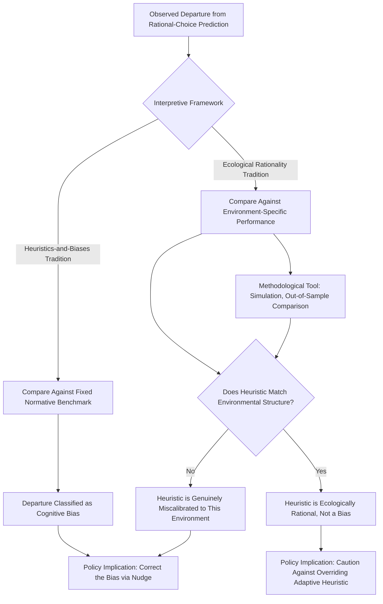

## Ecological Rationality and the Gigerenzer Critique

### Overview

Ecological Rationality and the Gigerenzer Critique refers to the theoretical framework and associated methodological objections developed primarily by Gerd Gigerenzer and colleagues (the "ABC Research Group," referring to Adaptive Behavior and Cognition) against the heuristics-and-biases research program most closely associated with Daniel Kahneman and Amos Tversky. Rather than rejecting the empirical existence of heuristic-driven decision-making, Gigerenzer's critique reframes heuristics as adaptive, ecologically rational tools rather than as inherent cognitive flaws to be measured against a normative benchmark of logical or probabilistic coherence, challenging the interpretive framework — rather than the raw behavioral data — underlying much of mainstream behavioral economics.

### Theoretical Foundations

#### The Adaptive Toolbox

Gigerenzer's central theoretical construct is the "adaptive toolbox" — a repertoire of simple, fast, and frugal heuristics that the mind deploys selectively depending on the structure of the decision environment, rather than a single, generic algorithm applied uniformly across all contexts. Unlike the heuristics-and-biases tradition, which frequently characterizes heuristics as generally useful but occasionally error-prone shortcuts relative to a single normatively correct computation (Bayesian updating, expected utility maximization), the adaptive toolbox framework holds that different heuristics are matched to different environmental structures, and that assessing a heuristic's "rationality" requires specifying the environment in which it operates rather than applying a single universal normative standard.

#### Ecological Rationality Defined

A heuristic is ecologically rational to the degree that its structure matches the statistical structure of the environment in which it is deployed — a heuristic that appears to violate a general normative principle (e.g., ignoring available information) can nonetheless outperform more information-intensive, "rational" computational strategies when the specific environmental structure rewards simplicity, robustness to overfitting, or fast decision-making under time and information constraints. This reframes the question "is this heuristic biased?" as the question "is this heuristic well-matched to this environment?" — a fundamentally different evaluative criterion than comparison against a fixed rational-choice benchmark.

#### Fast and Frugal Heuristics: Representative Examples

- **Recognition heuristic**: When choosing between two options where one is recognized and the other is not, infer that the recognized option has the higher value on the criterion of interest. Demonstrated in specific domains (e.g., predicting which of two cities has a larger population) to sometimes outperform more information-intensive strategies, particularly when recognition itself is correlated with the underlying criterion (the "less-is-more effect")
- **Take-the-best heuristic**: For multi-attribute comparison decisions, sequentially examine cues in order of their individual validity, stopping and deciding based on the first cue that discriminates between options, rather than integrating all available cues into a weighted composite score as classical linear models (e.g., multiple regression) would prescribe
- **1/N heuristic (naive diversification)**: In portfolio allocation, divide resources equally across N available options rather than computing an optimized mean-variance efficient allocation; Gigerenzer and DeMiguel, Garlappi, and Uppal's related work demonstrated that this simple heuristic can outperform sophisticated mean-variance optimization in out-of-sample portfolio performance under realistic estimation-error conditions, providing a widely cited applied economics example of ecological rationality

### The Direct Critique of Heuristics-and-Biases Research

#### Single-Cue Versus Multi-Cue Normative Benchmarks

Gigerenzer has argued that many classical heuristics-and-biases demonstrations (e.g., certain conjunction fallacy and base-rate neglect studies) compare human judgment against an inappropriately narrow normative benchmark — often a single specified probabilistic computation — without considering whether alternative, ecologically valid interpretations of the task (e.g., interpreting "probability" as a frequency format rather than a single-event probability, or interpreting an ambiguous linguistic cue in a pragmatically reasonable rather than strictly logical way) would resolve the apparent "error" without requiring any departure from normative reasoning.

#### The Frequency Format Critique of Base-Rate Neglect and Conjunction Fallacy

A specific and influential strand of Gigerenzer's critique holds that many classical judgment biases — including base-rate neglect and the conjunction fallacy (as in the "Linda problem") — are substantially reduced or eliminated when the same statistical information and questions are presented in natural frequency format (e.g., "100 out of 1,000 people") rather than single-event probability format (e.g., "there is a 10% probability"). Gigerenzer interprets this pattern as evidence that the human mind is evolutionarily adapted to reason well about frequencies encountered through natural sampling experience, and that apparent probabilistic reasoning "errors" documented in single-event probability format studies partly reflect a format-induced comprehension mismatch rather than a genuine failure of the underlying cognitive reasoning process. **[Inference]** This finding is well-replicated for several classical tasks, though the degree to which frequency-format framing fully eliminates versus merely attenuates the relevant biases varies across specific studies and tasks, and should not be treated as a uniform, complete resolution of every documented heuristics-and-biases finding.

#### Objection to a Single Universal Normative Standard

Gigerenzer has more broadly objected to treating a single formal system (standard probability theory, expected utility theory, or formal logic) as the uniquely correct normative standard against which all human judgment should be evaluated, arguing this approach imports contestable philosophical assumptions about rationality without adequately justifying why that particular formal system, rather than an ecologically-tuned heuristic, should constitute the relevant normative benchmark for a given real-world decision environment.

### Points of Convergence and Divergence with Mainstream Behavioral Economics

#### Shared Empirical Ground

Gigerenzer's program and the Kahneman-Tversky heuristics-and-biases tradition share substantial empirical common ground: both document that human judgment frequently departs from idealized rational-actor computation and relies on simplified, effort-reducing cognitive processes. The disagreement is primarily interpretive and normative — whether such departures should be characterized as "biases" relative to a fixed rational standard, or as well-adapted strategies whose apparent "error" reflects a mismatched or overly narrow normative benchmark — rather than a dispute over the underlying raw behavioral phenomena themselves.

#### Divergence on Policy Implications

Because the ecological rationality framework does not characterize heuristic-driven decisions as inherently suboptimal, it implies a different, generally more cautious, stance toward nudge and choice-architecture policy interventions premised on "correcting" documented biases: if a given heuristic is well-matched to its natural decision environment, an intervention designed to push behavior toward standard rational-choice benchmarks could, under this framework, reduce rather than improve decision quality in some contexts, a concern with direct relevance to the broader debate on libertarian paternalism and nudge policy design (see companion topic: Critiques from Neoclassical Economics).

#### Reconciliation Attempts

Some researchers have proposed a reconciled position in which both frameworks are seen as complementary rather than mutually exclusive: heuristics-and-biases research documents systematic patterns of judgment and choice, while ecological rationality research investigates the conditions (environmental structures) under which those patterns are adaptive versus costly, treating "is this heuristic good or bad" as an empirical question to be answered environment-by-environment rather than resolved by a single universal theoretical commitment on either side.

### Methodological Contributions Beyond the Critique

#### Emphasis on Environmental Structure as an Explicit Research Variable

Independent of its critical stance toward heuristics-and-biases interpretation, the ecological rationality research program has contributed a methodological emphasis on explicitly characterizing and manipulating the statistical structure of decision environments (cue validity distributions, redundancy among cues, sample size, noise-to-signal ratios) as a first-class experimental variable, complementing — and directly informing — the broader institutional-context and generalizability literature in behavioral economics (see companion topics: Institutional Context and the Generalizability of Behavioral Findings; External Validity and Generalizability), which similarly emphasizes that behavioral effects are often context-and-environment-contingent rather than context-independent universals.

#### Simulation and Out-of-Sample Testing of Heuristic Performance

A distinctive methodological signature of ecological rationality research is the use of computational simulation to directly compare the objective, out-of-sample predictive or decision-theoretic performance of simple heuristics against more complex "rational" benchmark models across a range of real and synthetic environments (as in the 1/N portfolio allocation and take-the-best comparisons), providing a quantitative, environment-specific answer to whether a given heuristic is in fact "biased" in the sense of producing systematically worse decisions, rather than relying solely on divergence-from-normative-benchmark as the evaluative criterion.

### Diagram: Ecological Rationality Versus Heuristics-and-Biases Interpretive Frameworks (svg_diagram)

### Key Points

- Gigerenzer's ecological rationality framework reframes heuristics as adaptive tools matched to environmental structure rather than inherent cognitive flaws measured against a fixed normative benchmark
- The adaptive toolbox comprises fast-and-frugal heuristics (recognition heuristic, take-the-best, 1/N naive diversification) that can outperform more information-intensive "rational" strategies under realistic environmental conditions
- The frequency-format critique argues several classical heuristics-and-biases findings (base-rate neglect, conjunction fallacy) are substantially attenuated when statistical information is presented in natural frequency rather than single-event probability format
- The critique is primarily interpretive/normative rather than a dispute over underlying empirical behavioral data, with direct implications for the appropriate scope and caution of nudge-based policy
- Ecological rationality's methodological emphasis on environmental structure as an explicit variable complements the broader institutional-context and generalizability literature in behavioral economics

**Related Topics**

- Critiques from Neoclassical Economics
- Institutional Context and the Generalizability of Behavioral Findings
- Heuristics and Biases in Judgment
- External Validity and Generalizability
- Libertarian Paternalism: Theoretical Foundations and Critiques
- Base-Rate Neglect and the Conjunction Fallacy