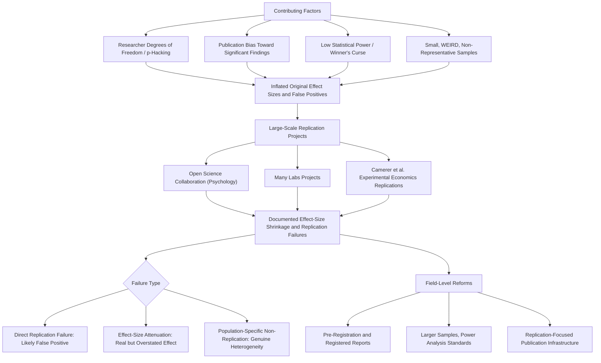

## The Replication Crisis in Behavioral Science

### Overview

The Replication Crisis in Behavioral Science refers to the systematic and empirically documented pattern, emerging most visibly from roughly 2010 onward, in which a substantial proportion of published findings in psychology and, subsequently, behavioral economics failed to replicate, or replicated with substantially attenuated effect sizes, when independently re-tested under large-scale, pre-registered, and often multi-site replication efforts. This topic synthesizes the specific evidence base, causal contributors, and behavioral-economics-specific manifestations of the crisis, extending the methodological threads introduced in the pre-registration, external validity, and neoclassical critique topics into a unified account of the field's reproducibility reckoning.

### Origins and Key Evidentiary Milestones

#### Early Warning Signals

Concerns about reproducibility in psychology and behavioral science predate the crisis's widespread recognition, but several developments in the early 2010s catalyzed broad disciplinary attention: Daryl Bem's 2011 publication of statistically significant evidence for precognition in a leading psychology journal, using conventional statistical methods, was widely interpreted as a signal that standard methodological and statistical practices in the field could produce publishable "significant" findings for effects most researchers considered implausible, directly motivating scrutiny of the underlying methodological practices (researcher degrees of freedom, p-hacking) rather than the specific substantive claim itself.

#### The Open Science Collaboration Reproducibility Project

The Open Science Collaboration's large-scale project (published 2015 in *Science*) attempted direct replications of 100 studies published in three leading psychology journals, finding that a minority of the original findings replicated according to strict statistical significance criteria, and that replicated effect sizes were, on average, substantially smaller than the originally published effect sizes. **[Unverified]** Precise headline replication-rate figures from this project are widely cited but vary slightly depending on which specific replication-success criterion is applied (statistical significance alone versus subjective assessment versus effect-size-based criteria); the exact percentage should be verified against the original publication rather than assumed from secondary summaries, though the qualitative finding — a substantial minority-to-majority replication failure rate alongside systematic effect-size shrinkage — is robust across the different criteria used in the original analysis.

#### Many Labs Projects

The Many Labs series of coordinated multi-laboratory replication projects (Many Labs 1, 2, and 3, among related efforts) extended the direct-replication approach across dozens of independent laboratories internationally, simultaneously testing the same set of classic findings, providing direct empirical estimates of both average replicability and cross-site effect-size heterogeneity for a battery of well-known psychological and behavioral-economic effects, with findings generally indicating that some effects (e.g., certain robust cognitive and perceptual phenomena) replicate consistently across sites while others show substantial site-to-site variation or fail to replicate in a meaningful subset of sites.

#### Camerer et al. Replications in Experimental Economics

Distinct from the psychology-focused replication projects, Camerer, Dreber, and colleagues conducted systematic replication efforts specifically targeting laboratory experimental economics findings published in leading economics journals (2016) and subsequently social science findings in *Nature* and *Science* (2018), generally finding replication rates and effect-size retention notably higher than the psychology-focused Open Science Collaboration project, though still showing a meaningful minority of non-replicated findings and average effect-size attenuation relative to original publications — a pattern interpreted by some researchers as evidence that experimental economics' stronger norms around incentive compatibility, no-deception, and larger typical stakes (see companion topic: Incentive Compatibility and Induced Value Theory) may have contributed to somewhat greater methodological robustness relative to certain areas of experimental psychology, though this comparative interpretation remains a matter of ongoing discussion rather than definitively established causal attribution.

### Causal Contributors to the Crisis

#### Researcher Degrees of Freedom and p-Hacking

As formalized by Simmons, Nelson, and Simonsohn, the accumulation of small, individually defensible analytical choices (outcome selection, covariate choice, sample-size stopping rules, outlier handling) exploited flexibly across a dataset can inflate the rate of nominally significant findings well above the nominal false-positive rate, a primary methodological driver directly targeted by the pre-registration reforms discussed in the companion topic on open science practices.

#### Publication Bias

Systematic preference among journals for statistically significant, novel, and large-effect findings over null or modest results creates a distorted published evidence base in which the population of published studies overrepresents inflated or spurious effects relative to the true underlying distribution, compounding with researcher degrees of freedom since the publication incentive structure directly rewards the analytical flexibility that produces significance.

#### Low Statistical Power and the "Winner's Curse"

Many original studies, particularly in earlier-era psychology and behavioral economics research, were conducted with sample sizes substantially underpowered relative to the true effect size, meaning that any given significant finding surviving publication is disproportionately likely to represent a chance upward fluctuation (a "winner's curse" or "significance filter" effect) rather than an accurate estimate of the true effect, a statistical mechanism that directly predicts the empirically observed pattern of effect-size shrinkage upon well-powered replication.

#### Small, Non-Representative, and WEIRD Samples

Original studies' reliance on small, convenience, frequently WEIRD and university-subject-pool samples (see companion topic: The WEIRD Samples Problem in Behavioral Research) compounds the low-power problem and introduces an additional generalizability-specific contributor to replication failure distinct from purely statistical power concerns, since a failure to replicate in a different population may reflect genuine population-specific effect heterogeneity rather than a false-positive original finding.

#### Weak Theoretical Constraints and Ad Hoc Post Hoc Explanation

Related to the neoclassical parsimony critique (see companion topic: Critiques from Neoclassical Economics), some methodologists have argued that weakly constrained theoretical frameworks — allowing a wide range of possible directional predictions to be post hoc rationalized as consistent with theory regardless of which direction a result comes out — reduce the a priori falsifiability of a given hypothesis test and thereby increase the field's vulnerability to publishing non-replicable, direction-flexible findings.

### Specific Behavioral Economics Findings Implicated in Replication Concerns

#### Ego Depletion and Self-Control

A large multi-lab pre-registered replication effort targeting the "ego depletion" effect (the hypothesis that self-control operates as a depletable resource, with implications for behavioral economics models of self-control and commitment) found little to no evidence for the effect, in sharp contrast to a large prior literature reporting the effect, and is now widely cited as one of the most consequential single replication failures affecting a behavioral-economics-adjacent construct specifically.

#### Priming Effects

Certain social and behavioral priming effects with direct relevance to choice-architecture and nudge design (e.g., some money-priming and goal-priming paradigms) have shown notably poor replication performance in systematic multi-lab efforts, prompting substantial reassessment of the evidentiary basis for priming-based behavioral interventions specifically.

#### Reference-Dependent Labor Supply (Taxi Driver Studies)

As discussed in the companion topic on structural estimation, the widely cited taxi-driver reference-dependent labor supply findings have faced substantial subsequent re-analysis and disputed replication (notably Farber's re-examination), illustrating that replication concerns in behavioral economics specifically extend beyond laboratory psychology findings into naturally occurring field-data structural estimation applications.

#### Nudge Effect-Size Meta-Analyses

As discussed in the companion topic on external validity, meta-analyses of published nudge intervention effects have generally found smaller average effects than flagship original studies, a pattern consistent with, though methodologically distinct from, the direct-replication-failure evidence discussed above (meta-analytic effect-size shrinkage reflects aggregation across many studies rather than a single pre-registered direct replication attempt, but points toward a related underlying reproducibility concern).

### Distinguishing Replication Failure Types

| Failure Type | Description | Implication |
| --- | --- | --- |
| Direct replication failure | Same procedure, new sample, no statistically significant effect in the predicted direction | Original finding may be a false positive, or population/context-specific |
| Effect-size attenuation | Effect replicates in direction and significance but with a substantially smaller magnitude | Original estimate likely inflated by winner's curse/publication bias; underlying phenomenon may still be real |
| Conceptual replication failure | A different operationalization of the same underlying construct fails to reproduce the effect | May indicate the effect is specific to the original measurement/manipulation rather than the broader construct |
| Population/context-specific non-replication | Effect fails to replicate in a new population or institutional setting but replicates in settings resembling the original | Consistent with genuine effect heterogeneity (see companion topic: Institutional Context and the Generalizability of Behavioral Findings) rather than a false original finding |

Distinguishing among these failure types matters substantially for the appropriate interpretive and policy response; a population-specific non-replication does not carry the same implication for the original finding's scientific validity as a direct replication failure in a matched sample and setting.

### Field-Level Responses and Reforms

#### Statistical and Methodological Reforms

- Widespread adoption of pre-registration and registered reports (see companion topic: Pre-Registration and Open Science Practices)
- Increased emphasis on a priori power analysis and larger minimum sample sizes for publication
- Movement toward more stringent statistical significance thresholds in some sub-fields, alongside broader debate over whether p-value thresholds versus estimation-focused (effect size and confidence interval) reporting better serve reproducibility goals
- Mandatory data and code sharing as a condition of publication at an increasing number of leading journals

#### Institutional and Incentive Reforms

- Growth of dedicated replication-focused journal sections, registered replication reports, and specialized outlets willing to publish null and replication-failure findings, directly countering publication bias
- Increased weight given to replication and reproducibility considerations in some hiring, tenure, and grant-evaluation processes, though adoption of this specific reform remains uneven across institutions and sub-fields
- Growth of large-scale, distributed replication infrastructure (e.g., the Psychological Science Accelerator, discussed in the companion topic on the WEIRD samples problem) explicitly designed to conduct well-powered, multi-site replication and original research at a scale individual laboratories cannot achieve alone

### Implications for the Status of Behavioral Economics as a Field

**[Inference]** The replication crisis has prompted substantial internal methodological reform within behavioral economics rather than wholesale abandonment of its core findings; well-replicated core phenomena (e.g., loss aversion in many though not all specific paradigms, present bias in intertemporal choice, several social preference findings) are generally distinguished in current methodological discussion from more fragile or contested findings (ego depletion, certain priming effects, some specific nudge interventions), with the field's response — increased field experimentation, structural estimation with real stakes, and replication infrastructure — representing an active, ongoing disciplinary adjustment rather than a fully resolved matter, and reasonable disagreement persists among researchers regarding exactly how much of the pre-2010s behavioral economics evidence base should be considered robust versus in need of further replication scrutiny.

### Diagram: Replication Crisis Causal Chain and Field Response (svg_diagram)

### Key Points

- The Open Science Collaboration, Many Labs, and Camerer et al. projects provide the primary large-scale evidentiary base documenting widespread effect-size shrinkage and a meaningful non-replication rate across psychology and behavioral economics
- Researcher degrees of freedom, publication bias, low statistical power, and small WEIRD samples jointly and compoundingly drive the crisis's underlying causal mechanisms
- Ego depletion, certain priming paradigms, and the taxi-driver reference-dependent labor supply findings are among the most consequential specific behavioral-economics-relevant replication concerns
- Distinguishing direct replication failure from effect-size attenuation from population-specific non-replication is essential for correctly interpreting any given non-replication result
- The field's response — pre-registration, larger samples, replication infrastructure, and increased field/structural estimation with real stakes — represents an active, ongoing methodological adjustment rather than a fully settled resolution

**Next Steps**

- Pre-Registration and Open Science Practices
- External Validity and Generalizability
- The WEIRD Samples Problem in Behavioral Research
- Critiques from Neoclassical Economics
- Structural Estimation of Behavioral Models
- Institutional Context and the Generalizability of Behavioral Findings