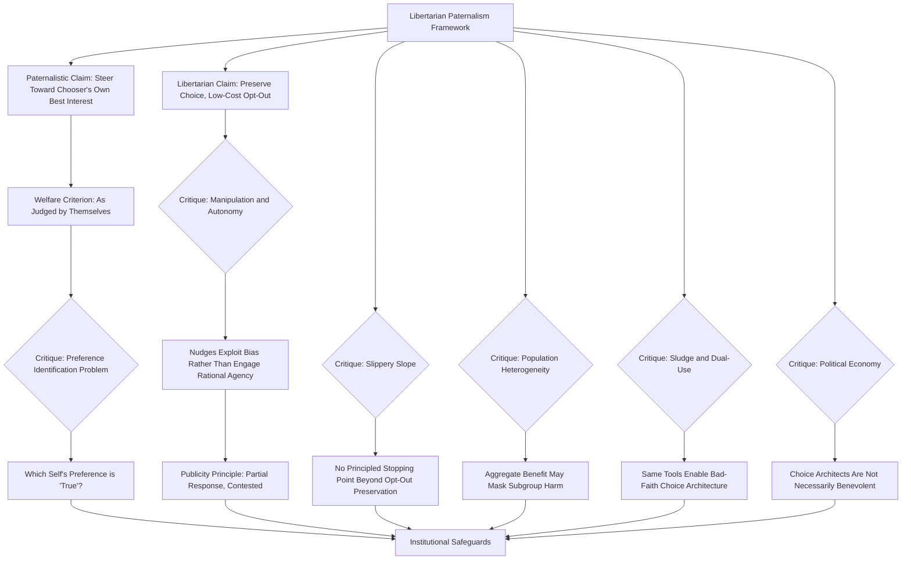

## The Paternalism Debate

### Overview

The Paternalism Debate concerns the normative and philosophical controversy over whether, and under what conditions, behavioral economics findings regarding systematic decision-making biases justify policy interventions that steer individuals' choices toward outcomes a policymaker judges to be in the individual's own best interest. This debate sits at the intersection of behavioral economics, welfare economics, political philosophy, and public policy design, and centers substantially on Richard Thaler and Cass Sunstein's "libertarian paternalism" framework and the extensive critical literature it has generated from multiple distinct philosophical and methodological directions.

### Libertarian Paternalism: The Foundational Framework

#### Core Claims

Thaler and Sunstein's libertarian paternalism, introduced in their influential work culminating in *Nudge* (2008), rests on two central claims presented as jointly compatible:

1. **The libertarian claim**: Interventions should preserve freedom of choice; no option should be foreclosed, and choosers should always retain the ability to opt out of the default or suggested path at low cost
2. **The paternalistic claim**: It is legitimate, and can improve individual welfare, for choice architects (public or private) to deliberately steer people's decisions in directions the architect judges will make choosers better off, as judged by the choosers themselves, given documented systematic departures from rational-choice-theoretic decision-making

The framework's central conceptual move is the claim that choice architecture is unavoidable — any presentation of options necessarily involves defaults, framing, and ordering choices that will influence behavior — and that, since neutral choice architecture is not actually achievable, policymakers and designers should deliberately architect choices to benefit choosers rather than pretend architectural neutrality is possible or desirable.

#### The "As Judged by Themselves" Welfare Criterion

Central to Thaler and Sunstein's framework is the claim that nudge-based paternalism differs from traditional paternalism by using the individual's own, presumably more considered or reflective, preferences as the welfare benchmark — steering behavior toward what individuals would choose "if they had complete information, unlimited cognitive abilities, and no self-control problems" — rather than imposing an external, third-party conception of the good. This distinction is central to the framework's claimed compatibility with liberal, autonomy-respecting political philosophy, and is simultaneously the focus of much of the subsequent philosophical critique (see below).

### Philosophical and Conceptual Critiques

#### The Preference Identification Problem

As discussed in the companion topic on neoclassical critiques, a foundational objection holds that identifying which of an individual's potentially conflicting preferences (e.g., a present-biased "now" self versus a more patient "planning" self, or an impulsive System 1 response versus a deliberative System 2 judgment) constitutes the person's "true" welfare-relevant preference is not a straightforward empirical determination but embeds a substantive, contestable normative judgment on the part of the choice architect. Critics (including Gigerenzer, from the ecological rationality tradition — see companion topic — and various philosophers) argue that this preference-identification step effectively smuggles an external welfare standard into a framework explicitly premised on respecting the individual's own preferences, undermining the "as judged by themselves" claim's philosophical coherence.

#### The Autonomy and Manipulation Critique

A distinct line of critique, associated particularly with philosophers working in the Kantian and republican-liberty traditions, argues that nudges — even fully transparent, choice-preserving ones — can constitute a form of manipulation because they work by exploiting known cognitive limitations (default inertia, framing sensitivity, anchoring) rather than by engaging a chooser's rational deliberative capacities directly. Under this view, the ethical distinction between "legitimate" persuasion (engaging rational agency, e.g., providing information and argument) and "illegitimate" manipulation (bypassing rational agency by exploiting a predictable bias) is a matter of degree that libertarian paternalism's freedom-of-choice-preservation criterion does not fully resolve, since an intervention can preserve formal opt-out freedom while still substantially working through non-rational psychological channels.

#### Transparency as a Necessary but Contested Condition

In response to the manipulation critique, some behavioral economists and philosophers have proposed that nudges satisfying a "publicity principle" or transparency condition — where the nudge and its behavioral mechanism could be publicly disclosed without undermining its effectiveness — are ethically distinguishable from manipulative interventions. Critics respond that this criterion, while a meaningful partial safeguard, does not fully resolve the underlying autonomy concern, since a nudge can remain fully transparent in its existence and mechanism while still functioning by exploiting a predictable psychological tendency rather than by strengthening the chooser's own deliberative capacity.

#### The Slippery Slope and Scope-Creep Concern

As discussed in the companion topic on neoclassical critiques, some critics argue that the same "documented systematic bias" logic used to justify relatively mild, choice-preserving nudges could equally be invoked to justify progressively more restrictive interventions (e.g., moving from a default-enrollment nudge to a mandatory enrollment requirement, or from information-disclosure nudges to outright bans on products associated with self-control problems), and that libertarian paternalism's own internal logic does not provide a clearly principled stopping point distinguishing acceptable from unacceptable degrees of paternalistic intervention, beyond the formal (but potentially weak in practice) requirement of preserved opt-out ability.

### Empirical and Practical Critiques

#### Heterogeneity of "Best Interest" Across the Population

A practical objection holds that any given default or nudge is necessarily calibrated to benefit some modal or average chooser, but individual circumstances, preferences, and constraints vary substantially across a population; a default-enrollment retirement savings nudge presumed to benefit most employees may be genuinely welfare-reducing for a specific subset of employees facing acute liquidity constraints or unusually short planning horizons, and the aggregate-level evidence typically used to justify a nudge policy may obscure this within-population heterogeneity (a concern directly related to, though methodologically distinct from, the institutional-context and generalizability literature discussed in companion topics).

#### Sludge and the Asymmetric Application of Choice Architecture

Thaler's later work explicitly identifies "sludge" — choice architecture deliberately designed to exploit behavioral biases in ways that harm rather than benefit the chooser (e.g., deliberately friction-laden cancellation processes, confusing fee disclosures) — as the inverse and normatively illegitimate counterpart to beneficial nudging. Critics have noted that the same theoretical tools and behavioral mechanisms underlying legitimate nudge design are equally available to bad-faith commercial or political actors for sludge design, and that libertarian paternalism's normative framework, on its own, does not provide a strong institutional or regulatory mechanism preventing this dual-use problem, beyond appeals to the good intentions of the choice architect — a concern that has motivated calls for external regulatory oversight of choice-architecture design specifically, extending beyond the original nudge framework's reliance on architect goodwill.

#### Political Economy and Who Controls the Choice Architecture

A distinct critique, drawing on public choice theory, raises the concern that real-world choice architects (government agencies, regulators, firms) are themselves subject to political and institutional pressures, incentive misalignments, and potential capture, such that the normative assumption of a benevolent, welfare-maximizing choice architect embedded in the libertarian paternalism framework may not hold in practice — an institutional-design concern distinct from, but complementary to, the philosophical manipulation and preference-identification critiques.

### Nudges as a Substitute for Structural Policy

As discussed briefly in the companion topic on neoclassical critiques, some critics — including those otherwise sympathetic to redistributive or structurally interventionist policy goals — have argued that nudge-based interventions, precisely because of their low political cost and choice-preserving character, may function as a politically convenient substitute for more structurally effective but more politically costly interventions (substantive regulation, taxation, direct provision of goods and services), potentially diverting limited policy attention and political capital toward comparatively low-impact interventions.

### Defenses and Refinements of Libertarian Paternalism

#### The "Nudges Are Unavoidable" Response

Proponents respond to the manipulation critique by reiterating the framework's foundational claim that choice-architecture neutrality is not actually achievable — any default, option ordering, or framing choice will influence behavior in some direction — such that the relevant ethical question is not whether to influence choice (which is unavoidable) but how to do so responsibly and transparently, a framing that shifts the debate from "should choice architecture influence behavior" to "what standards should govern legitimate choice-architecture design."

#### Empirical Refinement: Evidence-Based, Heterogeneity-Aware Nudge Design

In response to the heterogeneity-of-best-interest critique, more recent behavioral policy design work has increasingly emphasized testing nudges for heterogeneous treatment effects across population subgroups before broad implementation, and designing "smart defaults" that vary by individual circumstance rather than applying a single uniform default across an entire population, a refinement directly informed by the broader field experimental and structural estimation methodology discussed in companion topics.

#### Procedural and Institutional Safeguards

Some scholars have proposed formal institutional safeguards — mandatory disclosure requirements, regulatory review of choice-architecture design in specific high-stakes domains (financial products, health insurance), and legal distinctions between nudging and sludge — as a practical response to the political-economy and dual-use concerns, shifting part of the normative burden from individual choice-architect goodwill to institutional design and oversight.

### Diagram: The Paternalism Debate — Claims and Critiques (svg_diagram)

### Key Points

- Libertarian paternalism's core claim rests on the compatibility of preserved choice freedom with deliberate, welfare-improving choice architecture, judged by the chooser's own presumed considered preferences
- The preference identification problem asks which of an individual's conflicting selves or judgments constitutes their "true" welfare-relevant preference, a determination the framework requires but does not fully resolve on its own terms
- The manipulation and autonomy critique holds that nudges can bypass rational deliberation even while formally preserving choice, challenging the ethical adequacy of opt-out preservation alone as a legitimacy criterion
- Sludge, population heterogeneity, and political-economy critiques raise practical and institutional concerns about who controls choice architecture and toward what ends
- Responses include heterogeneity-aware smart-default design, transparency/publicity principles, and calls for institutional and regulatory safeguards extending beyond reliance on choice-architect goodwill

**Related Topics**

- Critiques from Neoclassical Economics
- Nudge and Choice Architecture Design Principles
- Behavioral Welfare Economics and the Decision/Experienced Utility Distinction
- Ecological Rationality and the Gigerenzer Critique
- Institutional Context and the Generalizability of Behavioral Findings
- Sludge and the Dark Side of Choice Architecture