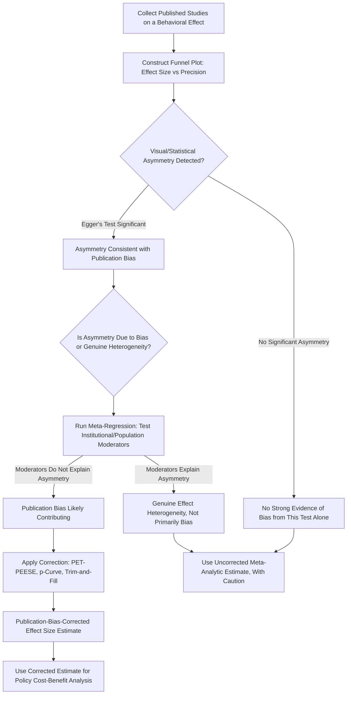

## Publication Bias and Effect Size Inflation

### Overview

Publication Bias and Effect Size Inflation refers to the systematic distortion of the published behavioral economics and psychology literature arising from the differential probability that a study is published, or a specific result within a study is reported, depending on the statistical significance, direction, and magnitude of its findings. This distortion produces a published evidence base in which reported effect sizes are, on average, biased upward relative to true underlying population effects, and constitutes one of the central, statistically formalized mechanisms underlying the broader replication crisis discussed in the companion topic.

### Mechanisms of Publication Bias

#### The File-Drawer Problem

Rosenthal's foundational "file drawer problem" framing describes the tendency for studies yielding null or non-significant results to remain unpublished — left in the researcher's file drawer — while studies yielding statistically significant results proceed to publication, creating systematic asymmetry between the full population of conducted studies (including unpublished null results) and the visible, published literature that subsequent researchers, meta-analysts, and policymakers actually observe and rely upon.

#### Outcome and Analysis Reporting Bias

Beyond whole-study non-publication, a related and more subtle mechanism involves selective reporting within a published study: researchers conducting multiple outcome measures, subgroup analyses, or analytical specifications may selectively report only the significant subset, while non-significant analyses from the same study remain unreported — a phenomenon distinct from, but closely related to, the researcher-degrees-of-freedom/p-hacking mechanism discussed in the companion topic on pre-registration, and one that is particularly difficult to detect from published papers alone since the full universe of conducted-but-unreported analyses is generally not observable to outside readers.

#### Editorial and Reviewer Preferences

Journal editors and peer reviewers, operating under space constraints and seeking to publish novel, field-advancing research, have historically exhibited documented preferences for statistically significant, surprising, or large-effect findings over null, confirmatory, or modest-effect findings, a preference structure that — independent of any researcher-side selective reporting — itself constitutes a distinct contributing mechanism to the aggregate publication-bias pattern.

#### The Winner's Curse and Low Statistical Power

As discussed in the companion topic on the replication crisis, when studies are underpowered relative to the true effect size, any given study that clears the statistical significance threshold and proceeds to publication is disproportionately likely to reflect a favorable (upward) chance fluctuation rather than an unbiased estimate of the true effect — a statistical "winner's curse" mechanism that compounds with, and is amplified by, publication bias's preference for significant results, since low-powered original studies specifically require an inflated observed effect to clear the significance threshold in the first place.

### Statistical Detection Methods

#### Funnel Plot Analysis

A funnel plot graphs individual study effect-size estimates against a measure of study precision (commonly the inverse of the standard error or the sample size), under the statistical expectation that, absent publication bias, studies should scatter symmetrically around the true effect size, with smaller/less precise studies showing greater dispersion (producing a funnel shape) and larger/more precise studies clustering tightly near the true effect. Publication bias characteristically produces visible funnel-plot asymmetry — a systematic absence of small studies reporting null or negative-direction results in the region of the plot where such studies would otherwise be statistically expected to appear, since such results are disproportionately likely to remain unpublished.

#### Egger's Regression Test and Related Formal Tests

Egger's test formalizes visual funnel-plot asymmetry assessment into a statistical hypothesis test, regressing standardized effect sizes against their precision and testing whether the regression intercept differs significantly from zero (an intercept significantly different from zero indicates asymmetry consistent with publication bias, though the test has known limitations regarding statistical power with small numbers of included studies and can also be triggered by genuine effect-size heterogeneity unrelated to publication bias, requiring careful interpretation alongside other diagnostic evidence).

#### p-Curve Analysis

Simonsohn, Nelson, and Simonsohn's p-curve method examines the distribution of statistically significant p-values (those below the conventional 0.05 threshold) reported across a body of published studies testing a given effect, under the statistical logic that a true, non-null effect should produce a right-skewed p-curve (concentrated toward very small p-values, e.g., p < .01) while a null effect artificially inflated to significance through p-hacking or selective reporting should produce a flatter or left-skewed distribution across the significant range; this method is specifically designed to distinguish genuine effects from p-hacked or publication-bias-inflated findings using only the published significant results themselves, without requiring access to unpublished null studies.

#### Precision-Effect Test and Precision-Effect Estimate with Standard Error (PET-PEESE)

A meta-regression-based approach, increasingly used in economics-specific meta-analyses (including behavioral economics applications), that models the relationship between reported effect sizes and their standard errors across a literature, using the extrapolated intercept (the predicted effect size at a standard error of zero, i.e., infinite precision) as a publication-bias-corrected effect-size estimate, under the logic that publication-bias-driven inflation should be most pronounced among the least precise (smallest, noisiest) studies and should diminish as precision increases.

#### Selective Reporting Detection via Pre-Registration Comparison

Where pre-registered study protocols exist, comparing the pre-specified primary outcome and analysis plan against what is ultimately reported in the published paper provides a direct, non-statistical method for detecting selective outcome reporting, a detection approach that has become increasingly feasible as pre-registration has become more widespread (see companion topic: Pre-Registration and Open Science Practices) but remains limited to the subset of the literature with available pre-registration records.

### Effect Size Inflation in Behavioral Economics Specifically

#### Documented Patterns Across Meta-Analyses

Meta-analyses applying funnel-plot, Egger's test, p-curve, or PET-PEESE methodology to specific behavioral economics literatures — including nudge intervention effects, certain heuristics-and-biases findings, and specific behavioral finance anomalies — have generally found statistical evidence consistent with meaningful publication-bias-driven inflation, with publication-bias-corrected effect-size estimates frequently smaller, sometimes substantially, than the simple uncorrected average of published effect sizes. **[Inference]** The magnitude of this correction varies considerably across specific sub-literatures and the particular bias-detection method applied, and any single-topic meta-analytic correction figure should be evaluated on its own methodological merits (number of included studies, precision-range coverage, presence of genuine versus artifactual heterogeneity) rather than treated as representative of a single fixed "average inflation factor" applicable across behavioral economics as a whole.

#### The Specific Case of Nudge Meta-Analyses

As referenced in the companion topics on external validity and the replication crisis, meta-analyses of default-effect and broader nudge intervention literatures have found evidence of effect-size inflation consistent with publication bias, contributing directly to the observed gap between widely cited flagship single-site nudge findings and subsequent meta-analytic or large-scale pre-registered replication effect-size estimates — a pattern with direct practical relevance for applied behavioral policy design, since policy cost-benefit calculations informed by uncorrected, publication-bias-inflated effect sizes risk systematically overestimating a proposed intervention's expected impact.

### Distinguishing Publication Bias from Genuine Heterogeneity

A recurring methodological caution across the bias-detection literature is that funnel-plot asymmetry, Egger's test significance, and related diagnostics can also arise from genuine cross-study heterogeneity unrelated to publication bias — for example, if smaller studies were conducted in systematically different populations, institutional contexts, or with systematically different implementation quality than larger studies (see companion topic: Institutional Context and the Generalizability of Behavioral Findings), the resulting funnel-plot asymmetry would reflect genuine moderator-driven effect variation rather than selective publication per se. Rigorous meta-analytic practice therefore combines publication-bias diagnostics with explicit meta-regression moderator analysis (as discussed in the companion topic on external validity) to help distinguish these two, not mutually exclusive, explanations for observed effect-size heterogeneity and asymmetry.

### Practical and Policy Implications

#### Implications for Evidence Synthesis

Systematic reviews and meta-analyses informing behavioral policy design increasingly incorporate publication-bias correction methods as a standard component of evidence synthesis, rather than relying on simple averages of published effect sizes, reflecting growing disciplinary consensus that uncorrected published-literature averages systematically overstate true population effects for at least some behavioral economics phenomena.

#### Implications for Cost-Benefit Analysis of Policy Interventions

Because publication-bias-corrected effect-size estimates are frequently smaller than uncorrected estimates, policy cost-benefit analyses relying on early, flagship, or uncorrected meta-analytic effect sizes risk overestimating the return on investment for a proposed behavioral policy intervention, a concern that has motivated calls for policymakers to consult publication-bias-corrected meta-analytic evidence, where available, rather than single flagship studies, when making resource-allocation decisions regarding behavioral intervention scale-up.

#### Registered Reports as a Structural Solution

As discussed in the companion topic on pre-registration, registered reports — where journal publication commitment is secured before results are known — directly and structurally address publication bias at its source by decoupling the publication decision from result significance, distinguishing this reform from the purely diagnostic/statistical-correction methods (funnel plots, p-curve, PET-PEESE) discussed above, which detect and correct for bias in already-published literatures rather than preventing the bias from arising in the first place.

### Diagram: Publication Bias Detection and Correction Workflow (svg_diagram)

### Key Points

- Publication bias arises from differential publication probability based on statistical significance, compounding with selective outcome reporting and low statistical power (the winner's curse) to inflate published effect sizes above true population values
- Funnel plots, Egger's regression test, p-curve analysis, and PET-PEESE are the primary statistical tools for detecting and correcting publication-bias-driven inflation in a meta-analytic literature
- Asymmetry-based bias diagnostics can also reflect genuine cross-study heterogeneity rather than bias alone, requiring meta-regression moderator analysis to help distinguish the two explanations
- Nudge and default-effect meta-analyses show documented evidence of effect-size inflation consistent with publication bias, directly relevant to behavioral policy cost-benefit analysis accuracy
- Registered reports structurally prevent publication bias at its source, distinguishing this reform from post hoc statistical detection and correction methods applied to already-published literatures

**Next Steps**

- The Replication Crisis in Behavioral Science
- Pre-Registration and Open Science Practices
- External Validity and Generalizability
- Meta-Analysis and Heterogeneity Statistics in Behavioral Economics
- Structural Estimation of Behavioral Models
- Institutional Context and the Generalizability of Behavioral Findings