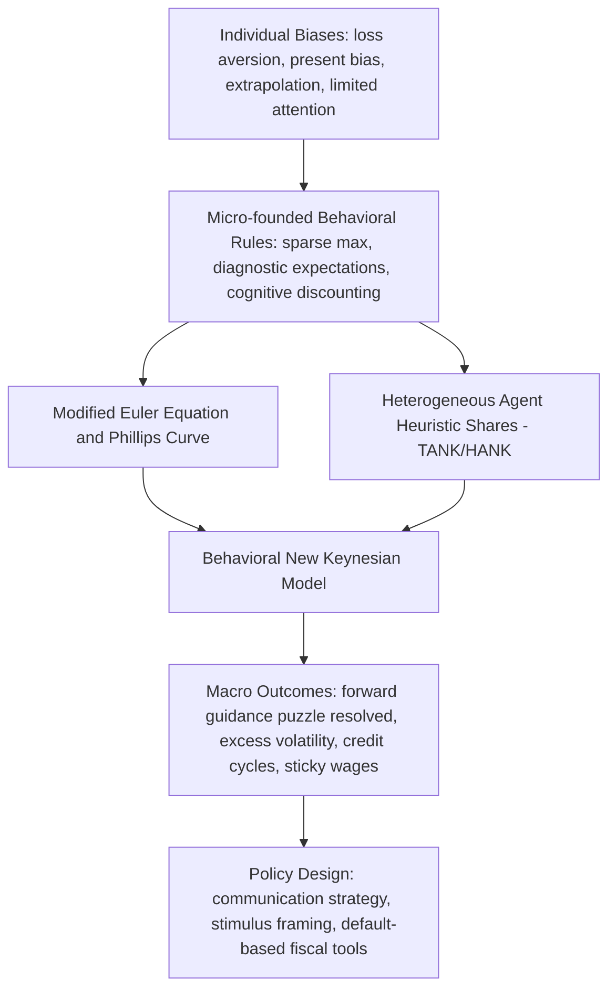

## Integrating Behavioral Insights into Macroeconomics

### Overview

Behavioral macroeconomics attempts to replace the "rational representative agent" assumption embedded in most mainstream macro models with empirically grounded assumptions about bounded rationality, heuristics, heterogeneous beliefs, and psychological frictions. This subfield emerged from dissatisfaction with the ability of Dynamic Stochastic General Equilibrium (DSGE) models to explain phenomena like excess volatility, the equity premium puzzle, sticky inflation expectations, and the depth/persistence of the 2008 financial crisis and its aftermath.

### Why Standard Macro Models Struggle

**Key Points**

- Representative-agent models assume a single infinitely-lived household with rational expectations (RE) and time-consistent discounting.
- This produces tight theoretical predictions but a narrow empirical fit, particularly around asset prices, consumption smoothing, and expectation formation.
- Puzzles motivating behavioral revision include:
  - The equity premium puzzle (Mehra-Prescott): observed equity returns are too high relative to consumption risk under standard CRRA utility and reasonable risk aversion.
  - Excess consumption sensitivity to predictable income changes (violates the permanent income hypothesis under full rationality).
  - The forward guidance puzzle: standard New Keynesian models imply implausibly large effects from distant future policy announcements.
  - Persistent disagreement and heterogeneity in survey-measured inflation expectations, inconsistent with a single rational-expectations forecast.

### Core Behavioral Building Blocks Imported into Macro

**Bounded Rationality and Cognitive Discounting**

Xavier Gabaix's "behavioral New Keynesian" framework introduces a cognitive discounting parameter $\bar{m} \in [0,1]$ that attenuates agents' attention to the future relative to full rational expectations. The consumption Euler equation becomes:

$$c_t = \bar{m} \, E_t[c_{t+1}] - \sigma(i_t - E_t[\pi_{t+1}])$$

When $\bar{m} = 1$, this collapses to the standard rational expectations Euler equation. Values of $\bar{m} < 1$ dampen the transmission of expected future variables into current decisions, which directly resolves the forward guidance puzzle by making distant announcements weaker in effect than near-term ones — matching empirical evidence.

**Level-k Thinking and Reflective Equilibrium**

Adapted from game theory, level-k models assume agents perform a finite number of rounds of strategic reasoning about others' behavior rather than converging to a fixed point of mutual best-responses. In macro, this is used to model how households and firms form expectations about aggregate variables without assuming common knowledge of rationality.

**Sparsity and Rational Inattention**

Building on Sims's rational inattention framework, Gabaix's "sparse max" model assumes agents build simplified mental models of a complex economy, paying attention only to variables with the largest first-order effects on their payoff, and treating the rest as fixed at some default. This is formalized as a constrained optimization over which state variables to include in the agent's simplified decision rule, subject to an attention cost.

**Extrapolative and Diagnostic Expectations**

- Extrapolative expectations models (e.g., Barberis, Greenwood, Jin, Shleifer) posit that agents overweight recent trends when forecasting asset prices or macro variables, generating momentum followed by reversal — matching boom-bust patterns in credit and housing markets.
- Diagnostic expectations (Bordalo, Gennaioli, Shleifer) model belief formation as an overreaction to news relative to Bayesian updating, driven by representativeness heuristics. Formally, the diagnostic expectation of a future state is:

$$E_t^{\theta}[x_{t+1}] = E_t[x_{t+1}] + \theta \left( E_t[x_{t+1}] - E_{t-1}[x_{t+1}] \right)$$

where $\theta > 0$ captures the degree of overreaction to the most recent forecast revision. This has been used to explain credit cycles, corporate default clustering, and excess volatility in stock returns.

**Loss Aversion and Reference Dependence in Macro**

Prospect-theory-style reference dependence has been incorporated into models of consumption, labor supply, and housing decisions, generating asymmetric responses to gains versus losses (e.g., nominal wage rigidity as a manifestation of loss aversion around a reference wage, or "house-lock" effects when home values fall below purchase price).

### Behavioral New Keynesian (BNK) Model Architecture

The canonical New Keynesian model has three core equations: the dynamic IS curve, the New Keynesian Phillips Curve (NKPC), and a monetary policy (Taylor) rule. Behavioral macro modifies each with cognitive discounting or attention frictions.

**Standard NK IS Curve (rational benchmark):**

$$x_t = E_t[x_{t+1}] - \sigma(i_t - E_t[\pi_{t+1}] - r_t^n)$$

**Behavioral IS Curve (Gabaix):**

$$x_t = \bar{m} \, E_t[x_{t+1}] - \sigma(i_t - \bar{m} \, E_t[\pi_{t+1}] - r_t^n)$$

**Behavioral NKPC:**

$$\pi_t = \kappa x_t + \beta \bar{m} \, E_t[\pi_{t+1}]$$

where $x_t$ is the output gap, $\pi_t$ inflation, $i_t$ the nominal interest rate, $r_t^n$ the natural rate, $\sigma$ intertemporal elasticity of substitution, $\kappa$ the Phillips curve slope, and $\beta$ the discount factor. The dampened $\bar{m}$ terms mean shocks to expected future inflation or output propagate less strongly backward into current behavior than in the fully rational model, resolving the "forward guidance puzzle" where standard models imply announcements about distant-future rate changes should have implausibly large present-day effects. [Inference: the exact quantitative fit of $\bar{m}$ to any specific economy is model- and calibration-dependent and varies across empirical implementations.]

### Heterogeneous Agent Behavioral Macro (HANK + Behavioral)

Heterogeneous Agent New Keynesian (HANK) models already relax the representative-agent assumption by allowing for idiosyncratic income risk and incomplete markets, generating a realistic wealth distribution and marginal propensities to consume (MPCs) that vary by liquidity position. Behavioral HANK extensions add:

- Present bias / hyperbolic discounting (quasi-hyperbolic, $\beta$-$\delta$ preferences) to generate excess sensitivity of consumption to current income, matching high estimated MPCs among low-liquidity households.
- Narrow framing and mental accounting, where households treat different income sources (e.g., stimulus checks vs. regular wages) as non-fungible, consistent with observed differential marginal spending propensities.
- Rule-of-thumb/heuristic consumption rules coexisting with a share of fully optimizing agents (the "TANK" — Two-Agent New Keynesian — approach, extendable with behavioral heuristic-agent shares calibrated to survey/experimental data).

### Behavioral Financial Accelerator and Crisis Dynamics

Behavioral macro has been particularly influential in modeling financial crises:

- **Diagnostic expectations and credit cycles**: Overreaction to good news drives excessive credit expansion and asset price booms; when news flow turns, the same overreaction mechanism produces sharp corrections, better matching the "boom then bust" shape of financial cycles than rational-expectations models, which struggle to generate large, predictable reversals.
- **Behavioral bank runs**: Models incorporating ambiguity aversion and disaster neglect help explain why financial institutions and regulators systematically underestimate tail risk during calm periods (the "volatility paradox"), then overreact once a crisis begins.
- **Narrative economics** (Robert Shiller): Emphasizes that economically consequential beliefs spread through contagious stories, similar to epidemic models, rather than through Bayesian updating on objective data alone. [Speculation: quantifying "narrative virality" and its causal macro effects remains methodologically contested and is not yet reduced to a standard, agreed-upon macro model architecture.]

### Behavioral Labor Markets and Wage Rigidity

Nominal wage rigidity — a persistent empirical regularity that is hard to justify under fully rational, frictionless bargaining — has been explained via:

- Loss aversion over nominal wage changes (workers and firms treat nominal wage cuts as losses relative to a reference point, resisting them even when real wages should adjust).
- Fairness/reciprocity norms (Akerlof and Yellen's "fair wage-effort" hypothesis), where firms avoid nominal cuts to preserve worker morale and effort, tying into efficiency-wage theory.
- Money illusion, where agents partially confuse nominal and real changes, particularly asymmetrically resisting nominal wage cuts more than they resist real wage erosion via inflation.

### Behavioral Monetary Policy Transmission

**Key Points**

- Central bank communication effectiveness depends on the public's actual (bounded) information processing, not the idealized rational-expectations agent.
- Behavioral insights inform:
  - Calibrating forward guidance to account for cognitive discounting, since naive rational-expectations calibration overstates its power.
  - Designing simpler, more salient communication (e.g., plain-language inflation targets) to improve pass-through to household expectations, since survey evidence shows most households have limited awareness of or attention to central bank announcements.
  - Understanding "rational inattention" to monetary policy: households update expectations only when the perceived benefit of attention exceeds the cognitive cost, implying infrequent, lumpy expectation revisions rather than continuous Bayesian updating.

### Behavioral Fiscal Policy Design

- **Present bias and public debt**: Political economy models incorporating agents' or policymakers' present bias help explain persistent deficit bias and under-saving for future liabilities (e.g., underfunded pensions), a pattern harder to rationalize under fully time-consistent preferences.
- **Framing effects on stimulus efficacy**: Field evidence (e.g., studies on the 2001 and 2008 U.S. tax rebates) shows that labeling a payment a "bonus" versus a "rebate" affects the marginal propensity to consume out of it, informing design of stimulus payments (lump sum vs. spread out, framed as windfall vs. entitlement).
- **Default effects in public programs**: Auto-enrollment defaults (borrowed from behavioral finance/retirement savings literature) are increasingly proposed for public programs (e.g., auto-enrollment in retirement accounts, tax filing) to correct predictable inertia-driven under-participation.

### Diagram: From Micro-Foundations to Macro Outcomes (svg_diagram)

### Empirical Testing and Estimation Challenges

**Key Points**

- Behavioral macro models are typically calibrated or estimated using a combination of:
  - Survey-based expectations data (e.g., Michigan Survey of Consumers, Survey of Professional Forecasters, New York Fed Survey of Consumer Expectations) to directly measure deviations from rational expectations.
  - Laboratory and field experiments (learning-to-forecast experiments) that place human subjects inside simplified macro environments to observe expectation formation directly.
  - Structural estimation (Bayesian or GMM) fitting behavioral DSGE variants to macro time series, comparing fit (e.g., via marginal likelihood) against rational-expectations benchmarks.
- A persistent methodological challenge is observational equivalence: many behavioral frictions (e.g., cognitive discounting) can generate impulse responses similar to those from purely rational models with alternative frictions (e.g., different Calvo price-stickiness parameters), making it difficult to cleanly identify behavioral mechanisms from reduced-form macro data alone. [Unverified: the degree of observational equivalence varies by specific model pair and identification strategy, and is a subject of ongoing methodological debate.]

### Critiques of Behavioral Macro Integration

**Key Points**

- **Ad hoc-ness and lack of discipline**: Critics (particularly from the rational expectations tradition) argue that behavioral parameters like $\bar{m}$ or $\theta$ are often calibrated to match target moments rather than derived from independently validated micro evidence, risking a "free parameter" problem where the model can fit almost any pattern.
- **Aggregation problem**: Even well-validated individual-level biases may wash out or transform unpredictably at the aggregate level due to market selection, learning, and general equilibrium feedback — a concern rooted in the same critique Gary Becker leveled against behavioral microeconomics.
- **Multiplicity of competing behavioral mechanisms**: Diagnostic expectations, extrapolative expectations, sparsity, and cognitive discounting can each explain overlapping sets of puzzles, and the field lacks a unified nesting framework or decisive horse-race testing standard to adjudicate between them. [Inference: this is a common assessment among macroeconomists surveying the field, not a formally settled matter.]
- **Replication and robustness concerns**: As with behavioral economics generally, some founding empirical results motivating behavioral macro parameters (particularly early survey-based expectation anomalies) have faced replication and robustness scrutiny as sample periods and elicitation methods have expanded.

### Relationship to the Broader Replication Crisis

Behavioral macro models frequently import calibrated parameters from behavioral microeconomics and finance (loss aversion coefficients, present-bias $\beta$ parameters, diagnostic overreaction $\theta$). Where the underlying micro-level effect sizes have proven fragile or context-dependent under replication (a concern raised across behavioral economics broadly), the macro models built on top of them inherit that fragility. This has pushed the subfield toward:

- Preferring parameters estimated directly from large-scale, pre-registered survey panels over small laboratory samples.
- Cross-validating behavioral parameters against multiple independent macro time series and natural experiments (e.g., using regional variation in stimulus policy rollout) rather than a single calibration target.

### Future Directions

**Next Steps**

- Deeper integration of machine-learning-estimated expectation-formation models (fitting flexible functional forms to survey expectation data) as inputs to structural behavioral DSGE models.
- Increased use of large-scale natural experiments and administrative data (tax records, bank transaction data) to identify behavioral parameters with less reliance on lab-based estimates.
- Development of unified frameworks nesting cognitive discounting, diagnostic expectations, and rational inattention as special cases of a single attention-allocation problem, to address the "multiplicity of mechanisms" critique.
- Central bank adoption of behavioral insights in operational forecasting and communication design (several central banks, including the Bank of England and European Central Bank, have research units explicitly studying expectation formation and communication effectiveness).
- Continued dialogue with the replication crisis literature to ensure imported micro-parameters meet robustness standards before being embedded in policy-relevant macro models.

**Related Topics**

- Rational Inattention Theory (Sims)
- Diagnostic Expectations and Credit Cycles (Bordalo, Gennaioli, Shleifer)
- Heterogeneous Agent New Keynesian (HANK) Models
- Narrative Economics (Shiller)
- The Equity Premium Puzzle
- Present Bias and Quasi-Hyperbolic Discounting in Macro Policy
- Behavioral Political Economy and Deficit Bias
- Nudge-Based Fiscal Policy Design