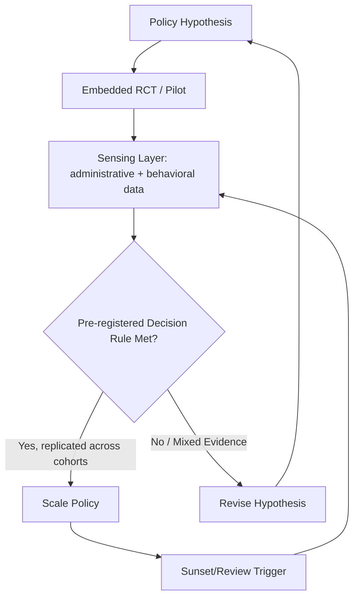

## Emerging Frontiers in Behavioral Governance and Adaptive Policy

### Overview

Behavioral governance refers to the design of institutions, regulations, and policy processes that explicitly incorporate empirical findings about bounded rationality, heuristics, and context-dependent choice — moving beyond one-off "nudge" interventions toward systemic, adaptive, and often technologically mediated policy architectures. This frontier sits at the intersection of behavioral economics, public administration, data science, and regulatory design, and is closely tied to the field's response to critiques (WEIRD samples, effect-size fragility, paternalism concerns) raised elsewhere in this chapter.

### From Nudges to Behavioral Systems

**Key Points**

- First-generation behavioral policy (2008–2015) centered on discrete "nudge" interventions: default enrollment, simplified forms, reminder messages, social norm messaging.
- Second-generation behavioral governance treats behavioral insight as an ongoing organizational capability rather than a one-time intervention, embedding testing infrastructure directly into agencies (e.g., the UK's Behavioural Insights Team, the U.S. Office of Evaluation Sciences, the OECD's Behavioural Insights and Public Policy network).
- This shift responds directly to replication-crisis critiques: rather than relying on a single published effect size, agencies build internal capacity for continuous local replication via embedded randomized controlled trials (RCTs) before scaling any intervention.

### Adaptive Policy Design Architecture

Adaptive policy design borrows a control-systems logic: policy is treated as a starting hypothesis subject to continuous measurement and revision rather than a fixed, one-time legislative output.

**Core Components**

- **Sensing layer**: Administrative data, real-time behavioral telemetry (e.g., digital service usage logs, benefits take-up rates), and periodic survey instruments feed a continuously updated picture of population behavior.
- **Experimentation layer**: Built-in A/B testing or stepped-wedge trial infrastructure allows policy variants (e.g., different letter wording, different default options) to be tested on subpopulations before full rollout.
- **Decision layer**: Pre-specified decision rules (e.g., "scale intervention if effect size exceeds X with confidence interval excluding zero across two independent cohorts") reduce the risk of prematurely scaling underpowered or non-replicated findings.
- **Sunset/revision layer**: Policies are designed with built-in review triggers (time-based or threshold-based) rather than indefinite persistence, allowing correction as new evidence arrives.

### Diagram: Adaptive Policy Feedback Loop (svg_diagram)

### Regulatory Applications: Behaviorally Informed Rulemaking

- **Disclosure regulation redesign**: Moving from long-form legal disclosures (mortgage terms, terms-of-service documents) toward simplified, standardized formats informed by comprehension testing — e.g., the U.S. Consumer Financial Protection Bureau's "Know Before You Owe" mortgage disclosure redesign, tested iteratively with consumer comprehension studies before nationwide implementation.
- **Choice architecture in regulated markets**: Retirement savings (auto-enrollment, auto-escalation defaults under frameworks like the UK's National Employment Savings Trust), organ donation (opt-out vs. opt-in registries), and energy markets (default green-energy tariffs) represent domains where regulatory defaults are treated as a policy lever with measurable population-level effects.
- **Sludge regulation**: An emerging counter-movement targets "sludge" — frictions that firms or agencies impose to discourage beneficial action (complex cancellation procedures, opaque fee disclosures). Some regulators have begun requiring symmetric ease-of-use standards (e.g., "cancellation must be as easy as sign-up") as a formal rulemaking principle.

### Digital and Algorithmic Behavioral Governance

**Key Points**

- **Personalized/precision nudging**: Using administrative or behavioral data to tailor interventions to subpopulations or individuals (e.g., personalized reminder timing based on past response patterns) rather than applying a single uniform nudge. This raises new measurement and ethical questions not present in first-generation nudge research.
- **Algorithmic choice architecture**: As government services move to digital platforms (tax filing portals, benefits applications, health portals), the platform's interface design itself becomes a de facto policy instrument, requiring behavioral review analogous to regulatory review of paper forms.
- **AI-assisted policy simulation**: Agent-based models incorporating heuristic (rather than purely optimizing) agents are increasingly used to simulate policy counterfactuals (e.g., pandemic response, pension reform) before real-world rollout, since population responses to a novel policy are often initially calibrated to a heuristic-agent model, then updated as real behavioral data accumulates. [Inference: the empirical validity of specific agent-based behavioral simulation platforms varies significantly by implementation and is not uniformly established across the field.]

### International and Multilateral Institutionalization

- The **OECD Behavioural Insights and Public Policy network** maintains a comparative database tracking hundreds of applied behavioral policy interventions across member countries, used to benchmark effect sizes across contexts.
- The **World Bank's Mind, Behavior, and Development (eMBeD) unit** applies behavioral governance frameworks specifically to development contexts, addressing concerns that early behavioral economics evidence was disproportionately drawn from WEIRD (Western, Educated, Industrialized, Rich, Democratic) populations by running local replications in low- and middle-income country contexts before scaling.
- The **UN's use of behavioral science in public health messaging** (e.g., COVID-19 risk communication) has driven renewed international interest in rapid-cycle behavioral testing during crisis response, though also renewed scrutiny over consent and manipulation concerns when nudges are deployed under emergency conditions. [Unverified: cross-country comparability of pandemic-era behavioral intervention effect sizes remains contested in the post-hoc evaluation literature.]

### Governance Structures for Behavioral Science Itself

Responding directly to the replication crisis, behavioral governance increasingly extends to how behavioral evidence is generated and vetted before informing policy:

**Key Points**

- **Pre-registration requirements**: Some government behavioral insight units now require pre-registered trial designs and analysis plans before conducting policy pilots, directly importing open-science reforms from academic psychology.
- **Multi-site replication before scaling**: Rather than scaling from a single pilot, adaptive policy frameworks increasingly require replication across at least two independent sites or cohorts with consistent effect direction before national rollout.
- **Transparency registries**: Some jurisdictions maintain public registries of government-run behavioral trials (including null results) to counteract publication bias in what policy evidence becomes visible, mirroring clinical-trial registry reforms in medicine.
- **External academic review boards**: Embedding independent academic oversight of government behavioral experimentation to reduce conflicts of interest between the unit designing a policy and the unit evaluating its own success.

### Ethical and Political Economy Considerations

**Key Points**

- **Autonomy and manipulation concerns**: Critics (e.g., in the "nudge vs. shove" debate) argue that scaling behavioral governance system-wide increases the risk of manipulative design entrenched in default infrastructure, especially when interventions are optimized using proprietary algorithms not subject to public scrutiny.
- **Distributional effects**: Emerging research examines whether behavioral interventions (e.g., digital-first defaults) disproportionately help or harm populations with lower digital literacy or resource constraints, a concern parallel to critiques that early behavioral economics understated heterogeneity in responsiveness across socioeconomic groups.
- **Accountability for algorithmic defaults**: As governance shifts from static legal text to dynamically tested digital defaults, questions arise about legal accountability when an algorithmically optimized nudge produces an adverse outcome — an evolving area of administrative law with no fully settled framework as of this writing. [Speculation: the legal doctrine governing liability for adaptive/algorithmic government defaults is still developing across jurisdictions and should not be treated as settled.]

### Measurement Challenges Specific to Adaptive Governance

- **Non-stationarity**: Unlike a controlled lab setting, real-world policy environments change continuously (economic conditions, technology platforms, social norms), meaning an effect validated at time $t$ may not hold at time $t+n$ — adaptive frameworks must build in re-testing rather than treating any single validated effect as permanent.
- **Spillover and general equilibrium effects**: Behavioral interventions tested on a subpopulation (e.g., a pilot region) may produce different effects at full population scale due to general equilibrium feedback (e.g., a savings nudge that works at small scale may shift interest rates or crowd out other savings channels at national scale) — a scaling concern directly inherited from the aggregation critique of behavioral macroeconomics.
- **Metric gaming**: When adaptive systems use fixed decision-rule thresholds to trigger scaling, there is risk that intervention design becomes optimized to clear the statistical threshold rather than to produce genuinely robust real-world benefit (a variant of Goodhart's Law: "when a measure becomes a target, it ceases to be a good measure").

### Future Directions

**Next Steps**

- Development of formal statistical standards (analogous to clinical trial phases) for how many independent replications a behavioral policy intervention should clear before national scaling.
- Greater integration of heterogeneous treatment effect estimation (e.g., causal machine learning methods) to move adaptive policy from single average-treatment-effect targeting toward subgroup-aware policy design.
- Expansion of behavioral governance capacity-building in low- and middle-income countries to correct the WEIRD-sample skew in the historical evidence base.
- Clearer legal and regulatory frameworks establishing accountability standards for algorithmically mediated government choice architecture.
- Continued cross-pollination with the open-science reform movement (pre-registration, registered reports, public trial registries) as the primary institutional response to the replication crisis within applied behavioral policy.

**Related Topics**

- The Replication Crisis in Behavioral Economics
- Libertarian Paternalism and the Ethics of Nudging
- Randomized Controlled Trials in Public Policy
- WEIRD Samples and External Validity
- Choice Architecture and Digital Default Design
- Behavioral Insights Teams: Comparative Institutional Models
- Algorithmic Accountability in Public Administration
- Pre-Registration and Open Science Reform