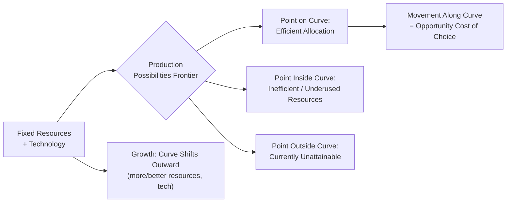

## What Economics Studies: Scarcity, Choice, and Opportunity Cost

### Definition and Scope

Economics is the social science that studies how individuals, firms, and societies allocate scarce resources among competing uses to satisfy unlimited wants. This definition rests on two foundational conditions that must coexist for economic analysis to apply: resources must be limited, and wants for those resources must exceed the available supply.

The discipline is conventionally divided into two branches:

- **Microeconomics**: Studies decision-making by individual units — households, firms, and industries — including how prices, output, and resource allocation are determined in specific markets.
- **Macroeconomics**: Studies the economy as a whole, examining aggregate measures such as national income, unemployment, inflation, and overall growth.

Both branches share the same underlying problem: scarcity forces choice, and choice carries cost.

### Scarcity

**Definition**: Scarcity is the fundamental economic condition in which finite resources are insufficient to satisfy all human wants. It is a relative, not absolute, concept — a resource is scarce because desire for it exceeds what is freely available at a zero price, not because it is rare in an absolute physical sense.

**Key distinction — scarcity vs. shortage**:

| Concept | Nature | Duration | Resolved By |
| --- | --- | --- | --- |
| Scarcity | Permanent, universal condition | Ongoing | Never fully "resolved" — only managed via allocation |
| Shortage | Temporary market condition, usually price-related | Short-term | Price adjustment or supply/demand shifts |

A shortage occurs when quantity demanded exceeds quantity supplied at a given (often artificially fixed) price — for example, price ceilings causing gasoline shortages. Scarcity, by contrast, persists even after prices adjust; it is the reason prices exist as an allocating mechanism at all.

**Sources of scarcity**:

1. **Finite factors of production** — land, labor, capital, and entrepreneurship exist in limited quantities at any point in time.
2. **Unlimited wants** — human desires for goods and services are not bounded, even as some individual wants are satisfied, new ones emerge.
3. **Time scarcity** — time itself is a non-renewable, non-storable resource, making it scarce even for otherwise wealthy economic agents.

**The Economic Problem**: Because of scarcity, every society — regardless of political or economic system — must answer three coordinating questions:

- **What** to produce (which goods and services, and in what quantities)
- **How** to produce it (which resource combinations and production techniques)
- **For whom** to produce (how output is distributed among members of society)

These three questions constitute what is often called the *central economic problem*, and different economic systems (market, command, mixed) represent different institutional answers to them.

### Choice

**Definition**: Choice is the necessary consequence of scarcity — because resources cannot satisfy every want simultaneously, economic agents (consumers, producers, governments) must select among competing alternatives.

Choice operates at every level of economic activity:

- **Consumer choice**: households deciding how to allocate limited income across goods and services to maximize satisfaction (utility)
- **Producer choice**: firms deciding what combination of inputs (land, labor, capital) to use and what quantity of output to produce
- **Government/social choice**: societies deciding how to allocate public resources (e.g., healthcare vs. defense spending)

**Rational choice framework**: Standard economic theory models agents as making decisions by weighing marginal benefits against marginal costs — an agent continues an activity as long as the additional (marginal) benefit exceeds the additional (marginal) cost. This is formalized as:

$$\text{Optimal choice occurs where } MB = MC$$

where $MB$ is marginal benefit and $MC$ is marginal cost. [Inference: real-world decision-making frequently deviates from this idealized marginal calculus due to bounded rationality, incomplete information, and behavioral biases — a critique developed extensively in behavioral economics.]

**Constrained optimization**: Choice in economics is not free-ranging preference but *constrained* choice — agents maximize an objective (utility, profit, welfare) subject to limits (budget, time, technology, resources). This is why introductory economics is sometimes summarized as "the science of constrained choice."

### Opportunity Cost

**Definition**: Opportunity cost is the value of the next-best alternative forgone when a choice is made. It is the true economic cost of any decision — not merely the monetary price paid, but everything given up to obtain the chosen option.

**Formal characterization**:

$$\text{Opportunity Cost of Choice A} = \text{Value of the best forgone alternative (Choice B)}$$

Important precision: opportunity cost refers specifically to the *single best* alternative forgone, not the sum of all alternatives forgone. If a student can spend an evening studying, working a part-time job, or watching a movie, and chooses to study, the opportunity cost is the value of *whichever one* of the remaining two options was more valuable — not both combined.

**Explicit vs. implicit costs**:

- **Explicit cost**: direct monetary outlay (e.g., tuition paid, wages paid to workers)
- **Implicit cost**: the value of forgone alternatives that involve no direct cash payment (e.g., the income a business owner could have earned working elsewhere instead of running their own firm)

**Economic cost vs. accounting cost**: This distinction is central to the difference between accounting profit and economic profit.

$$\text{Accounting Profit} = \text{Total Revenue} - \text{Explicit Costs}$$

$$\text{Economic Profit} = \text{Total Revenue} - (\text{Explicit Costs} + \text{Implicit Costs})$$

A firm can show positive accounting profit while having zero or negative economic profit, because accounting profit ignores the opportunity cost of resources the owner already possesses (e.g., their own capital or labor).

**Sunk costs — the key distinction to avoid**: Opportunity cost analysis must exclude **sunk costs** — costs already incurred and unrecoverable regardless of the current decision. Rational choice, per standard economic theory, considers only forward-looking costs and benefits; sunk costs should not influence present decisions. The tendency to let sunk costs affect ongoing choices is termed the *sunk cost fallacy*, a well-documented behavioral deviation from the rational-agent model.

### The Production Possibilities Frontier (PPF)

The PPF is the primary graphical model used to illustrate scarcity, choice, and opportunity cost simultaneously. It depicts the maximum feasible combinations of two goods an economy can produce given fixed resources and technology.

**Key properties**:

- **Points on the curve**: efficient, full utilization of resources
- **Points inside the curve**: inefficient, underutilized or misallocated resources
- **Points outside the curve**: currently unattainable given existing resources and technology
- **Movement along the curve**: represents a choice — producing more of one good requires producing less of the other, illustrating opportunity cost directly as the slope of the curve
- **Outward shift of the curve**: represents economic growth (e.g., from technological advancement, increased resource stock, or improved productivity)

**Increasing opportunity cost and the curve's shape**: PPFs are typically drawn as concave (bowed outward from the origin) because resources are not perfectly adaptable between uses. As production shifts increasingly toward one good, increasingly less-suited resources must be reallocated, so each additional unit of that good costs progressively more of the other good. This is known as the **law of increasing opportunity cost**.

**Illustrative PPF diagram (svg_diagram)**:

<svg xmlns="http://www.w3.org/2000/svg" viewBox="0 0 480 380" font-family="sans-serif">
<text x="240" y="24" text-anchor="middle" font-size="16" font-weight="bold">Production Possibilities Frontier (svg_diagram)</text>
<line x1="60" y1="320" x2="60" y2="50" stroke="black" stroke-width="2" />
<line x1="60" y1="320" x2="440" y2="320" stroke="black" stroke-width="2" />
<text x="30" y="55" font-size="12">Good Y</text>
<text x="410" y="340" font-size="12">Good X</text>
<path d="M 60 60 Q 100 150 180 220 Q 280 280 420 310" fill="none" stroke="#2563eb" stroke-width="3" />
<circle cx="180" cy="220" r="5" fill="#16a34a" />
<text x="190" y="215" font-size="12" fill="#16a34a">A (efficient)</text>
<circle cx="150" cy="270" r="5" fill="#dc2626" />
<text x="160" y="285" font-size="12" fill="#dc2626">B (inefficient)</text>
<circle cx="320" cy="180" r="5" fill="#9333ea" />
<text x="330" y="175" font-size="12" fill="#9333ea">C (unattainable)</text>
<text x="60" y="345" font-size="11" fill="#555">Concave curve reflects increasing opportunity cost</text>
</svg>

### Practical Examples

**Example — Individual level**: A person has one free hour and can either attend a review session (raising expected exam performance) or work a paid shift earning $15. If they attend the review session, the opportunity cost is the $15 in forgone wages (plus any other value from the next-best alternative use of that hour).

**Example — Firm level**: A bakery owner uses her own building rent-free to run the shop instead of renting it out for $2,000/month. Even though no cash changes hands, the $2,000 forgone rent is an implicit cost and must be included when calculating true economic profit.

**Example — National/policy level**: A government with a fixed budget must choose between funding a new hospital or a new highway. The opportunity cost of building the hospital is the highway (or its equivalent social value) that is forgone — this is a direct real-world application of the PPF's "what to produce" question.

### Common Misconceptions

- **Misconception**: Scarcity only affects poor economies. **Correction**: Scarcity is universal — even the wealthiest individuals and richest nations face constraints on time, natural resources, or productive capacity.
- **Misconception**: Opportunity cost equals total money spent. **Correction**: Opportunity cost concerns forgone *value*, which may or may not correspond directly to a monetary price, and specifically the *best* alternative, not the price tag of the chosen item.
- **Misconception**: A "free" good has zero opportunity cost. **Correction**: Even a good offered at a $0 price can carry an opportunity cost if time or effort is required to obtain it (e.g., standing in line), or if choosing it precludes another action.

### Related Topics

- The three fundamental economic questions (What, How, For Whom) and comparative economic systems
- Production Possibilities Frontier: shifts, efficiency, and economic growth in depth
- Marginal analysis and marginal benefit/marginal cost decision rules
- Explicit vs. implicit costs, and accounting profit vs. economic profit
- The sunk cost fallacy in behavioral economics
- Absolute vs. comparative advantage (extends opportunity cost to trade theory)
- Positive vs. normative economics
- Factors of production: land, labor, capital, entrepreneurship