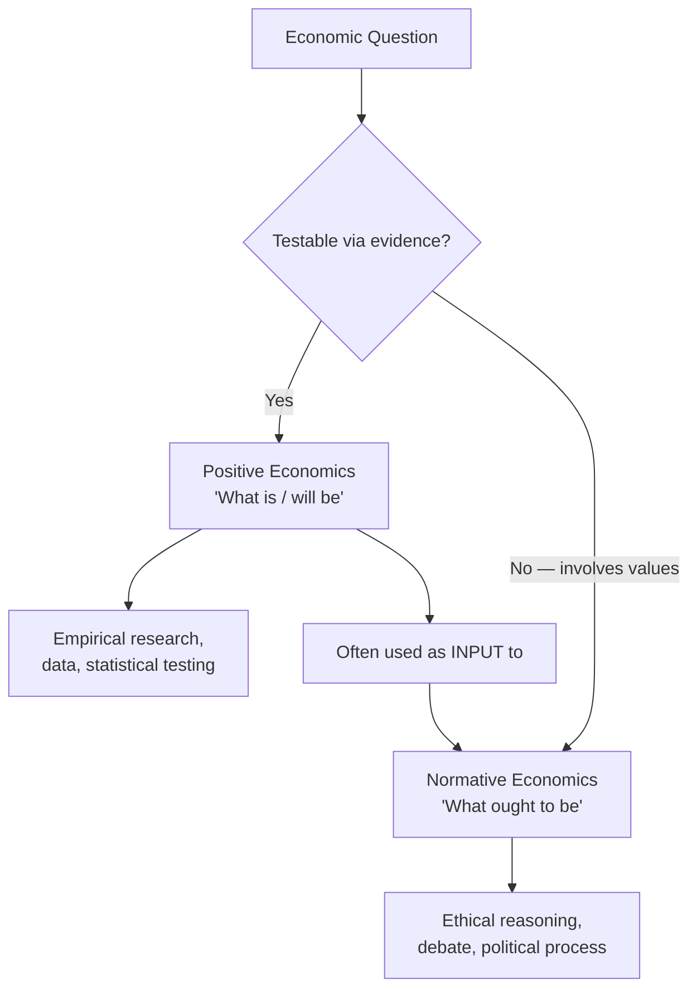

## Positive versus Normative Economics

### Definition and Scope

Positive and normative economics represent two distinct modes of economic analysis, distinguished by the type of statement each produces and the kind of question each attempts to answer. This distinction, though simple to state, underlies nearly every methodological debate in economics — from how theories are tested to how policy is evaluated and communicated.

- **Positive economics**: The study of "what is" — objective, descriptive analysis of economic phenomena that can, in principle, be verified or refuted using evidence.
- **Normative economics**: The study of "what ought to be" — prescriptive analysis involving value judgments about desirable outcomes or policies.

### Positive Economics

**Definition**: Positive economics concerns statements that describe, explain, or predict economic phenomena in a manner that is empirically testable — meaning the statement's truth or falsity can, at least conceptually, be checked against real-world data.

**Defining characteristics**:

- Framed as factual claims about cause and effect, correlation, or observed states of the world
- Does not depend on the values, ethics, or preferences of the person making the statement
- Can be supported, refuted, or refined through data collection, statistical testing, and empirical research
- Answers questions of the form: "What is?", "What was?", "What will be if X happens?"

**Examples of positive statements**:

- "An increase in the minimum wage leads to a reduction in low-skill employment, holding other factors constant."
- "Inflation in Country A was 4.2% in the most recent reporting year."
- "A decrease in the price of a good, all else equal, results in an increase in quantity demanded."

Each of these is a claim that can be investigated — through historical data, econometric analysis, or controlled comparison — regardless of whether the investigator personally favors or opposes the outcome described.

**Important nuance**: A positive statement being testable does not mean it is uncontroversial or settled. Positive economists frequently disagree about the *magnitude, direction, or mechanism* of an empirical relationship (e.g., debates over the employment effects of minimum wage laws). Disagreement in positive economics is, in principle, resolvable through better data, better methodology, or more evidence — even if in practice full resolution is difficult. [Inference: many empirical debates in economics remain unresolved not because the questions are inherently normative, but because of genuine measurement, identification, and data limitations.]

### Normative Economics

**Definition**: Normative economics concerns statements that prescribe what economic policy or outcomes *should* be, based on value judgments, ethical standards, or subjective criteria of what is desirable.

**Defining characteristics**:

- Framed as recommendations, judgments of desirability, or prescriptions
- Inherently depends on the values, priorities, or ethical framework of the person making the statement
- Cannot be resolved purely through empirical evidence, because it involves a judgment about what *ought* to be valued, not merely what *is*
- Answers questions of the form: "What should be done?", "Is this outcome fair/desirable?"

**Examples of normative statements**:

- "The government should raise the minimum wage to reduce income inequality."
- "It is unfair for the wealthiest 1% to hold such a large share of national income."
- "Healthcare should be provided free at the point of use, funded by taxation."

Each of these statements embeds a value judgment (about fairness, priorities, or the proper role of government) that cannot be settled by data alone, even though data may *inform* the judgment.

### Key Distinctions

| Dimension | Positive Economics | Normative Economics |
| --- | --- | --- |
| Core question | What is / What will be? | What should be? |
| Basis | Facts, evidence, logic | Values, ethics, opinion |
| Testability | Empirically verifiable/falsifiable | Not empirically resolvable |
| Objectivity | Aims for value-neutrality | Explicitly value-laden |
| Example phrasing | "X causes Y" | "X should happen" / "X is better" |
| Resolution method | Data, experiments, statistical inference | Debate, ethical reasoning, political process |

**The critical link — the "is-ought" relationship**: In practice, positive and normative economics are deeply intertwined rather than fully separable. Most real-world policy debates combine both:

1. A **positive** claim about the expected effects of a policy (e.g., "raising the carbon tax will reduce emissions by X% and raise consumer prices by Y%")
2. A **normative** judgment about whether that trade-off is acceptable or desirable (e.g., "the emissions reduction is worth the price increase")

Confusing the two is a common source of unproductive debate: disagreement about a normative conclusion is sometimes mistakenly treated as if it were a disagreement about positive facts, and vice versa.

### The Fact-Value Distinction in Practice

**Illustrative policy example — minimum wage**:

- *Positive component*: "Raising the minimum wage to $15/hour will reduce employment in the affected sector by an estimated 2–4%." (An empirical claim, potentially verifiable using labor market data.)
- *Normative component*: "The benefit to workers who keep their jobs and receive higher pay outweighs the cost to those who lose employment, so the policy should be adopted." (A value judgment about whose welfare should be weighted more heavily.)

Economists conducting the positive analysis might reach a shared estimate of the employment effect while still disagreing sharply on the normative conclusion, because the normative step requires a judgment about acceptable trade-offs that empirical data alone cannot supply.

**Illustrative diagram — how the two interact in policy analysis (svg_diagram)**:

<svg xmlns="http://www.w3.org/2000/svg" viewBox="0 0 500 260" font-family="sans-serif">
<text x="250" y="24" text-anchor="middle" font-size="16" font-weight="bold">Positive Analysis Feeding Normative Judgment (svg_diagram)</text>
<rect x="30" y="60" width="180" height="80" rx="8" fill="#dbeafe" stroke="#2563eb" stroke-width="2" />
<text x="120" y="90" text-anchor="middle" font-size="13" font-weight="bold">Positive Economics</text>
<text x="120" y="112" text-anchor="middle" font-size="11">"Effect of policy X</text>
<text x="120" y="127" text-anchor="middle" font-size="11">on outcome Y is Z%"</text>
<rect x="290" y="60" width="180" height="80" rx="8" fill="#fee2e2" stroke="#dc2626" stroke-width="2" />
<text x="380" y="90" text-anchor="middle" font-size="13" font-weight="bold">Normative Economics</text>
<text x="380" y="112" text-anchor="middle" font-size="11">"Is that trade-off</text>
<text x="380" y="127" text-anchor="middle" font-size="11">acceptable/desirable?"</text>
<line x1="210" y1="100" x2="288" y2="100" stroke="black" stroke-width="2" marker-end="url(#arrow)" />
<text x="250" y="180" text-anchor="middle" font-size="11" fill="#555">Evidence informs, but does not determine, the value judgment</text>
</svg>

### Why the Distinction Matters

- **Scientific credibility**: Keeping positive claims distinct from normative claims allows economics to function as an empirical, falsifiable discipline rather than pure advocacy, preserving the discipline's claim to methodological rigor.
- **Policy transparency**: Clearly separating "what the evidence shows" from "what we should do about it" allows policymakers and the public to evaluate the evidence independently of the values used to interpret it.
- **Avoiding false consensus or false conflict**: Two economists may fully agree on the positive facts (e.g., the employment effect of a wage floor) yet disagree entirely on the normative conclusion (whether the policy should be enacted) — and this can be mistaken for a factual dispute if the distinction is not made clear.

### Common Misconceptions

- **Misconception**: Positive economics is "true" and normative economics is merely "opinion," so normative economics is unscientific. **Correction**: Normative economics is a legitimate and necessary field of study — economic value judgments still benefit from rigorous ethical reasoning and consistent frameworks (e.g., welfare economics), even though they are not empirically testable in the same way as positive claims.
- **Misconception**: All economists agree on positive economics and only disagree on normative economics. **Correction**: Economists frequently disagree on positive questions too — over model specification, causal identification, and the interpretation of empirical evidence — independent of any value judgments.
- **Misconception**: A statement using words like "should" is always normative. **Correction**: Conditional statements such as "If the government wants to reduce unemployment, it should lower interest rates" are technically positive, because they describe a means-to-end relationship (a testable causal claim) rather than asserting that the *end itself* (reducing unemployment) is desirable.

### Related Topics

- Welfare economics and social choice theory
- Cost-benefit analysis as a bridge between positive measurement and normative decision-making
- The role of value judgments in policy modeling and forecasting
- Falsifiability and the philosophy of economic methodology
- Behavioral economics and departures from purely descriptive rational-agent models
- Efficiency vs. equity trade-offs in policy design