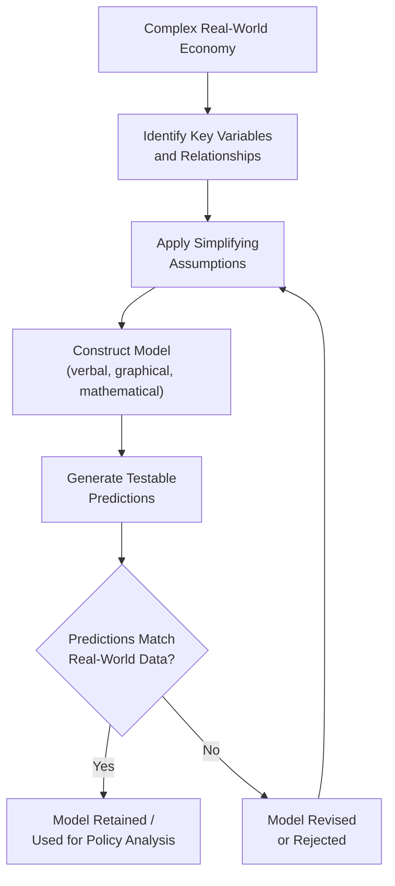
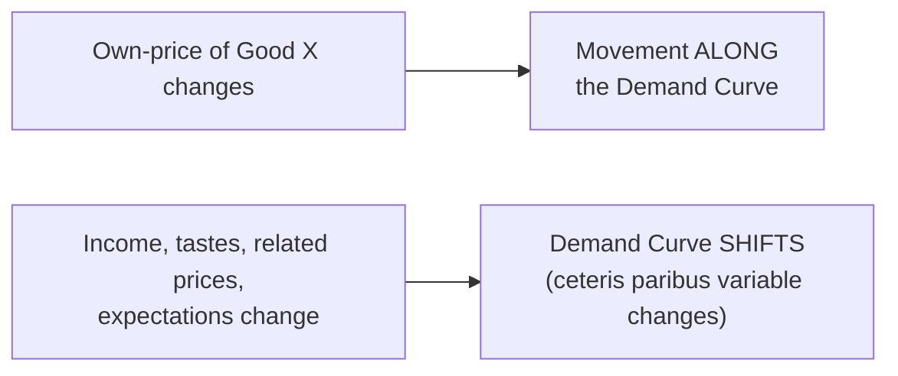

## The Economic Way of Thinking: Models, Assumptions, Ceteris Paribus

### Definition and Scope

The "economic way of thinking" refers to the distinctive methodological approach economists use to analyze human behavior and social phenomena: building simplified representations of reality (models), grounding those representations in explicit assumptions, and isolating specific relationships by holding other factors constant (ceteris paribus). This methodology allows economics to generate testable predictions about complex systems without requiring a complete, exhaustive description of every causal factor at once.

This approach rests on three interlocking pillars covered in this item:

1. **Economic models** — simplified frameworks that represent economic relationships
2. **Assumptions** — the explicit or implicit simplifications that make models tractable
3. **Ceteris paribus** — the analytical device of holding all other variables constant to isolate one relationship

### Economic Models

**Definition**: An economic model is a simplified representation of an economic process, relationship, or system, constructed to explain how key variables interact and to generate predictions about outcomes under specified conditions.

**Purpose of models**:

- **Simplification**: Real economies involve millions of interacting agents and variables; models strip away irrelevant detail to focus on the mechanisms of interest.
- **Prediction**: A well-constructed model generates falsifiable predictions that can be tested against real-world data.
- **Explanation**: Models provide a logical structure for understanding *why* economic variables move the way they do, not merely *that* they move.
- **Policy evaluation**: Models allow analysts to simulate the likely effects of a policy change before it is implemented.

**Common forms of economic models**:

| Form | Description | Example |
| --- | --- | --- |
| Verbal/descriptive | Qualitative reasoning expressed in words | "Higher prices reduce quantity demanded" |
| Graphical | Visual representation of relationships between variables | Supply and demand diagrams, the PPF |
| Mathematical | Formal equations describing relationships | Utility functions, production functions |
| Statistical/econometric | Models estimated from empirical data | Regression models of consumption behavior |

**The abstraction trade-off**: Every model faces an inherent trade-off between *realism* and *tractability*. A model that incorporates every real-world detail becomes too complex to solve or interpret; a model that is too simplified may omit factors essential to the outcome being studied. Model-building is therefore the art of choosing which simplifications preserve the essential mechanism while discarding inessential complexity. [Inference: the "right" level of abstraction is context-dependent and is often a matter of professional judgment and debate among economists, rather than a fixed rule.]

**Evaluating a model**: A model is judged not by whether its assumptions are perfectly realistic, but primarily by whether its predictions are consistent with observed real-world outcomes. This methodological stance — associated with the "positive economics" tradition — holds that even models built on stylized or simplified assumptions (e.g., perfectly rational agents) can be valuable if they successfully predict real-world behavior.

### Assumptions

**Definition**: Assumptions are the explicit simplifying premises on which an economic model is built. They specify the conditions, behaviors, or constraints treated as given, so that the model can isolate and analyze a particular relationship without accounting for every possible real-world complication.

**Why assumptions are necessary**: Without simplifying assumptions, no tractable model of a complex economic system could be built at all — the number of interacting variables in a real economy is too large to model in full. Assumptions allow economists to isolate the effect of one or two variables of interest while setting aside factors judged less central to the question at hand.

**Common categories of economic assumptions**:

- **Behavioral assumptions**: e.g., the assumption of *rational, utility-maximizing consumers* and *profit-maximizing firms*, which underlies much of standard microeconomic theory.
- **Structural assumptions**: e.g., assuming perfect competition (many buyers/sellers, no single agent affects price) or perfect information (all agents know all relevant prices and quality information).
- **Simplifying scope assumptions**: e.g., assuming a "closed economy" with no international trade, or a two-good world for graphical tractability (as in the PPF).

**Assumptions as testable, revisable premises**: A defining feature of the economic way of thinking is that assumptions are not treated as permanent truths but as working premises that can be relaxed or revised as needed. When a model's predictions fail to match observed behavior, economists frequently respond by relaxing an assumption (e.g., moving from "perfect information" to "asymmetric information") to build a more refined model. This iterative process of assumption-relaxation underlies major subfields such as information economics and behavioral economics, both of which relax the classical assumption of a fully rational, fully informed agent.

**Assumptions vs. realism debate**: A long-standing methodological debate in economics concerns whether a model's assumptions must themselves be realistic for the model to be useful, or whether only the accuracy of the model's *predictions* matters ("instrumentalism"). [Speculation: this debate remains unresolved in the philosophy of economics literature and is likely to persist as a matter of methodological perspective rather than empirical resolution.]

### Ceteris Paribus

**Definition**: *Ceteris paribus* is a Latin phrase meaning "other things being equal" or "all else held constant." In economic analysis, it is the analytical convention of examining the relationship between two variables while assuming that all other relevant variables remain unchanged.

**Function in economic analysis**: Ceteris paribus is the primary tool economists use to isolate causal relationships in a world where many variables move simultaneously. Without this device, it would be impossible to attribute an observed change in one variable to a specific cause, since numerous other factors could be changing at the same time.

**Canonical example — the law of demand**: The law of demand states that, *ceteris paribus*, an increase in the price of a good leads to a decrease in the quantity demanded of that good. The "ceteris paribus" qualifier is essential here: it specifies that this relationship holds only when other determinants of demand — such as consumer income, the prices of related goods, consumer tastes, and expectations — are held constant. If income rises at the same time the price rises, quantity demanded could rise, fall, or stay the same, depending on the relative magnitude of the two effects; the "law" describes only the isolated price effect.

$$Q_d = f(P \mid \text{Income, Tastes, Prices of related goods held constant})$$

**Practical implementation**:

- **In theoretical models**: Ceteris paribus is applied by explicitly holding other variables fixed in the model's equations or graphical framework (e.g., a demand curve is drawn for a *given* level of income; a shift in income moves the entire curve rather than representing a movement along it).
- **In empirical/statistical work**: The ceteris paribus condition is approximated using multivariate regression techniques, which statistically control for other explanatory variables so that the estimated coefficient on the variable of interest approximates its isolated effect.

**Movement along a curve vs. shift of a curve**: The ceteris paribus assumption explains the standard distinction in graphical economic models between:

- A **movement along** a curve (caused by a change in the variable on the axis itself, e.g., a change in the good's own price causing movement along the demand curve)
- A **shift of** the entire curve (caused by a change in one of the variables held constant under ceteris paribus, e.g., a change in income shifting the whole demand curve)

**Illustrative diagram — Ceteris paribus and the demand curve (svg_diagram)**:

<svg xmlns="http://www.w3.org/2000/svg" viewBox="0 0 480 320" font-family="sans-serif">
<text x="240" y="22" text-anchor="middle" font-size="15" font-weight="bold">Movement vs. Shift Under Ceteris Paribus (svg_diagram)</text>
<line x1="60" y1="280" x2="60" y2="50" stroke="black" stroke-width="2" />
<line x1="60" y1="280" x2="440" y2="280" stroke="black" stroke-width="2" />
<text x="20" y="55" font-size="12">Price</text>
<text x="410" y="300" font-size="12">Quantity</text>
<line x1="90" y1="80" x2="410" y2="250" stroke="#2563eb" stroke-width="2.5" />
<text x="415" y="255" font-size="11" fill="#2563eb">D1</text>
<line x1="130" y1="80" x2="440" y2="250" stroke="#16a34a" stroke-width="2.5" stroke-dasharray="6,3" />
<text x="445" y="255" font-size="11" fill="#16a34a">D2 (income ↑)</text>
<circle cx="200" cy="180" r="4" fill="#dc2626" />
<circle cx="280" cy="140" r="4" fill="#dc2626" />
<line x1="200" y1="180" x2="280" y2="140" stroke="#dc2626" stroke-width="1.5" stroke-dasharray="3,2" />
<text x="205" y="165" font-size="10" fill="#dc2626">movement along D1</text>
<text x="60" y="300" font-size="10" fill="#555">Own-price change = movement; other-variable change = shift</text>
</svg>

### Integration: How the Three Concepts Work Together

The economic way of thinking applies models, assumptions, and ceteris paribus as an integrated methodology:

1. A **model** is constructed to represent a relationship of interest (e.g., price and quantity demanded).
2. **Assumptions** specify the conditions under which the model is expected to hold (e.g., rational consumers, a competitive market).
3. **Ceteris paribus** is invoked to isolate the specific relationship being studied from the influence of all other variables, enabling a clean, testable prediction (e.g., "if price rises and nothing else changes, quantity demanded falls").

This methodology mirrors the broader scientific method: form a simplified, testable hypothesis (the model, under stated assumptions and held-constant conditions), then test its predictions against observed data, revising the model or its assumptions as evidence warrants.

### Common Misconceptions

- **Misconception**: Because economic models rely on unrealistic assumptions, their conclusions are invalid. **Correction**: A model's value is generally judged on the accuracy of its predictions relative to real-world outcomes, not on whether every assumption is a literal description of reality — this is a widely held methodological position in positive economics, though not universally accepted.
- **Misconception**: Ceteris paribus means other variables *never* change in the real world. **Correction**: Ceteris paribus is an analytical device for isolating one relationship at a time; it does not claim other variables are literally constant in reality, only that they are held constant *for the purposes of a specific piece of analysis*.
- **Misconception**: Economic models are meant to be perfect predictors of individual behavior. **Correction**: Economic models typically aim to predict aggregate or average tendencies across large numbers of agents, not to perfectly forecast any single individual's decisions.

### Related Topics

- Law of demand and law of supply (direct application of ceteris paribus)
- Positive vs. normative economics and model evaluation criteria
- Rational choice theory and its behavioral-economics critiques
- Multivariate regression and statistical control in empirical economics
- Comparative statics analysis in economic modeling
- The role of falsifiability in economic methodology