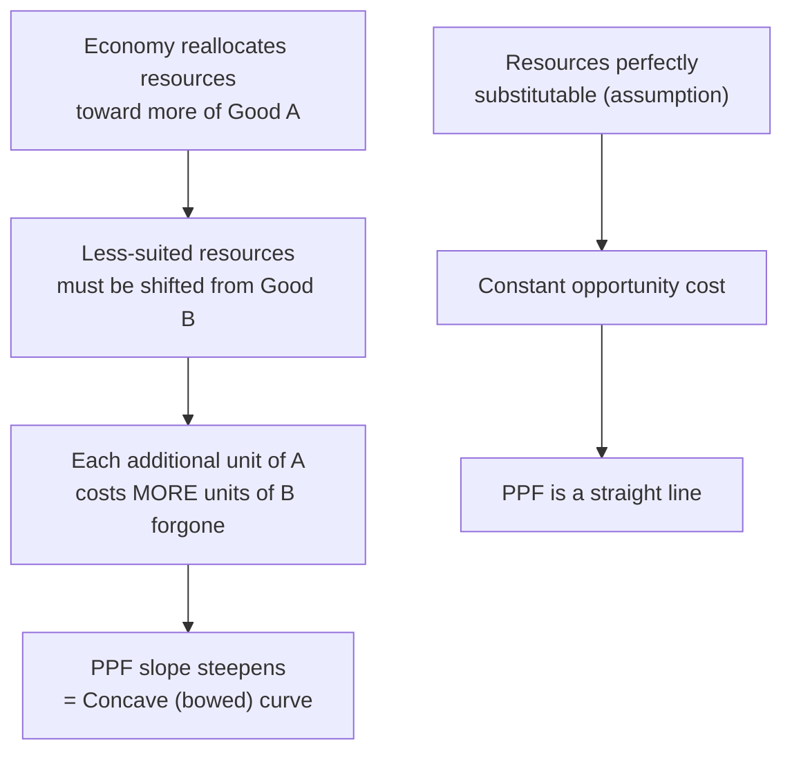

## Production Possibilities Frontier and Trade-offs

### Definition and Scope

The Production Possibilities Frontier (PPF), also called the Production Possibilities Curve (PPC), is a graphical model depicting the maximum combinations of two goods (or categories of goods) that an economy can produce given a fixed quantity of resources, a fixed state of technology, and a fixed time period. The PPF is the central diagrammatic tool for illustrating scarcity, trade-offs, opportunity cost, efficiency, and economic growth within a single unified framework.

**Underlying assumptions of the standard PPF model**:

1. Only two goods (or aggregated categories of goods) are produced, for graphical tractability.
2. The total quantity of resources (land, labor, capital, entrepreneurship) is fixed over the period examined.
3. The state of technology is fixed over the period examined.
4. Resources are not perfectly substitutable — some resources are better suited to producing one good than the other.

### Constructing the PPF

The PPF is typically illustrated with a numerical production schedule showing the maximum output combinations achievable as an economy reallocates resources between two goods.

**Example schedule** (Good A vs. Good B):

| Combination | Units of Good A | Units of Good B |
| --- | --- | --- |
| P | 0 | 50 |
| Q | 10 | 48 |
| R | 20 | 43 |
| S | 30 | 33 |
| T | 40 | 18 |
| U | 50 | 0 |

Plotting these combinations produces the PPF curve, with Good A on the horizontal axis and Good B on the vertical axis. Each point on the curve represents a maximum attainable output combination given the economy's fixed resources and technology.

### Regions of the PPF Diagram

| Region | Interpretation |
| --- | --- |
| **On the curve** | Productively efficient — all resources are fully and appropriately utilized; no more of one good can be produced without producing less of the other |
| **Inside the curve** | Inefficient — resources are underutilized (e.g., unemployment, idle capital) or misallocated; more of *both* goods could be produced |
| **Outside the curve** | Currently unattainable — cannot be reached with existing resources and technology |

**Illustrative diagram — the standard PPF (svg_diagram)**:

<svg xmlns="http://www.w3.org/2000/svg" viewBox="0 0 480 380" font-family="sans-serif">
<text x="240" y="24" text-anchor="middle" font-size="16" font-weight="bold">Production Possibilities Frontier (svg_diagram)</text>
<line x1="60" y1="320" x2="60" y2="50" stroke="black" stroke-width="2" />
<line x1="60" y1="320" x2="440" y2="320" stroke="black" stroke-width="2" />
<text x="20" y="55" font-size="12">Good B</text>
<text x="410" y="340" font-size="12">Good A</text>
<path d="M 60 65 Q 120 160 200 230 Q 300 290 420 310" fill="none" stroke="#2563eb" stroke-width="3" />
<circle cx="200" cy="230" r="5" fill="#16a34a" />
<text x="205" y="225" font-size="12" fill="#16a34a">On curve (efficient)</text>
<circle cx="160" cy="270" r="5" fill="#dc2626" />
<text x="115" y="290" font-size="12" fill="#dc2626">Inside (inefficient)</text>
<circle cx="320" cy="170" r="5" fill="#9333ea" />
<text x="330" y="165" font-size="12" fill="#9333ea">Outside (unattainable)</text>
</svg>

### Trade-offs and Opportunity Cost on the PPF

**Trade-offs**: Because the PPF represents the maximum output attainable with fixed resources, moving from one point on the curve to another necessarily requires giving up some quantity of one good to produce more of the other. This movement *along* the curve is the graphical representation of a trade-off.

**Opportunity cost as the slope of the PPF**: The opportunity cost of producing an additional unit of Good A, expressed in terms of Good B forgone, is measured by the (absolute value of the) slope of the PPF between two points:

$$\text{Opportunity Cost of Good A} = \left| \frac{\Delta \text{Good B}}{\Delta \text{Good A}} \right|$$

Using the schedule above, moving from combination R (20 A, 43 B) to S (30 A, 33 B):

$$\text{OC of 10 more units of A} = \frac{43 - 33}{30 - 20} = \frac{10}{10} = 1 \text{ unit of B per unit of A}$$

### The Law of Increasing Opportunity Cost

**Definition**: The law of increasing opportunity cost states that as an economy produces progressively more of one good, the opportunity cost of each additional unit — measured in forgone units of the other good — increases.

**Cause**: This law arises because factors of production are not perfectly adaptable between uses; resources differ in how well-suited they are to producing each good. As production of Good A expands, the economy must progressively reallocate resources that are less and less suited to producing Good A (and better suited to Good B), so each additional unit of A requires giving up increasingly more units of B.

**Graphical consequence — the bowed (concave) shape**: The law of increasing opportunity cost is the reason the standard PPF is drawn concave to the origin (bowed outward) rather than as a straight line. The slope of the curve becomes steeper as more of Good A is produced, reflecting the rising opportunity cost.

**Contrast — constant opportunity cost**: If resources were perfectly substitutable between the two goods (equally well-suited to producing either), the PPF would instead be a straight line, reflecting a constant opportunity cost regardless of the production mix. This is the standard simplifying assumption used in basic international trade models (e.g., Ricardian comparative advantage), where the PPF is drawn as a straight line for analytical simplicity.

### Efficiency, Growth, and Shifts of the PPF

**Productive efficiency**: Achieved at any point *on* the PPF — no additional output of either good can be obtained without reducing output of the other.

**Allocative efficiency**: A distinct concept referring to whether the economy is producing the specific *combination* of goods on the PPF that best matches society's preferences — a point can be productively efficient (on the curve) without being the allocatively efficient point (the one society values most).

**Causes of an inward movement (point inside the curve)**:

- Cyclical or structural unemployment of labor
- Idle or underutilized capital equipment
- Misallocation of resources across industries

**Causes of an outward shift of the entire PPF (economic growth)**:

1. **Increase in the quantity of resources** — growth in the labor force, discovery of new natural resources, or increased capital stock (investment)
2. **Improvement in technology** — technological advances allow more output to be produced from the same quantity of resources
3. **Improvement in the quality/productivity of resources** — e.g., improved education and training raising labor productivity (human capital)

**Asymmetric (biased) shifts**: A shift of the PPF need not be uniform in both directions. If a technological improvement or resource increase applies specifically to the production of Good A only, the curve will shift outward further along the Good A axis than along the Good B axis, changing the curve's shape as well as its position.

**Illustrative diagram — outward shift from economic growth (svg_diagram)**:

<svg xmlns="http://www.w3.org/2000/svg" viewBox="0 0 480 340" font-family="sans-serif">
<text x="240" y="22" text-anchor="middle" font-size="15" font-weight="bold">Economic Growth: Outward Shift (svg_diagram)</text>
<line x1="60" y1="300" x2="60" y2="50" stroke="black" stroke-width="2" />
<line x1="60" y1="300" x2="440" y2="300" stroke="black" stroke-width="2" />
<text x="20" y="55" font-size="12">Good B</text>
<text x="410" y="320" font-size="12">Good A</text>
<path d="M 60 70 Q 130 160 200 220 Q 280 270 380 290" fill="none" stroke="#2563eb" stroke-width="2.5" />
<text x="360" y="280" font-size="11" fill="#2563eb">PPF1 (original)</text>
<path d="M 60 50 Q 160 140 240 200 Q 340 250 430 270" fill="none" stroke="#16a34a" stroke-width="2.5" stroke-dasharray="6,3" />
<text x="380" y="255" font-size="11" fill="#16a34a">PPF2 (after growth)</text>
</svg>

### Guns vs. Butter — Canonical Illustrative Framing

Economics textbooks frequently illustrate the PPF using the stylized "guns vs. butter" framing, representing the trade-off between military/defense spending ("guns") and civilian/consumer goods ("butter"). This is a well-known pedagogical device rather than a literal policy model, used to make the trade-off between two broad categories of national resource allocation intuitive. A society devoting more resources to defense production must, given full resource utilization, produce fewer consumer goods, and vice versa — a direct application of the PPF's core trade-off logic to macro-level policy choices such as defense spending versus social programs.

### Common Misconceptions

- **Misconception**: A point inside the PPF is simply "producing less" and is not necessarily bad. **Correction**: A point inside the curve specifically represents inefficiency — resources are unemployed or misallocated — meaning society could have more of *both* goods without any additional resources, which is a real economic cost of underutilization.
- **Misconception**: The PPF shows what a society *should* produce. **Correction**: The PPF is a positive economics tool describing what is *possible*; determining which point on the curve is most desirable is a normative/allocative question resolved through market mechanisms, government policy, or social choice, not by the model itself.
- **Misconception**: A straight-line PPF is "wrong" or a mistake. **Correction**: A straight-line PPF is a valid, deliberate simplification used when the modeling context assumes constant opportunity costs (e.g., perfectly substitutable resources), such as in basic comparative advantage/trade models.

### Related Topics

- Law of increasing opportunity cost and resource specialization
- Comparative advantage and gains from trade
- Allocative vs. productive efficiency
- Economic growth: sources and measurement (capital accumulation, technology, human capital)
- Unemployment and underutilized capacity (points inside the PPF)
- Guns vs. butter framing in macroeconomic policy analysis